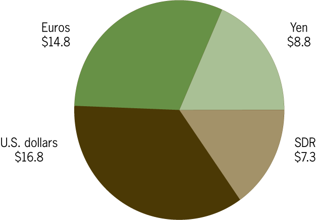

## Table of Contents

## What is the Exchange Stabilization Fund (ESF)?

The Exchange Stabilization Fund (ESF) is a fund that the U.S. government uses to help keep the value of the U.S. dollar stable. It was created in 1934 during the Great Depression to help the government manage the country's currency and prevent big swings in its value. The ESF is managed by the U.S. Department of the Treasury, and it can be used to buy or sell dollars in the foreign exchange market to influence its value.

The ESF can also be used for other purposes, like helping other countries with their currencies or providing emergency loans. For example, during financial crises, the ESF has been used to support other countries' economies. The fund gets its money from the profits of the U.S. Mint and from interest on its investments. While the ESF is an important tool for the U.S. government, it is used carefully because its actions can affect the global economy.

## When was the Exchange Stabilization Fund established?

The Exchange Stabilization Fund (ESF) was established in 1934. This was during the Great Depression, a time when the economy was very unstable. The U.S. government created the ESF to help keep the value of the U.S. dollar steady. 

The ESF is managed by the U.S. Department of the Treasury. It works by buying or selling dollars in the foreign exchange market. This helps to control the dollar's value and prevent big changes that could harm the economy. The ESF is an important tool, but it is used carefully because its actions can affect the global economy.

## What is the primary purpose of the ESF?

The main goal of the Exchange Stabilization Fund (ESF) is to keep the U.S. dollar's value steady. It was created in 1934 during the Great Depression, a time when the economy was very unstable. The U.S. government set up the ESF to help manage the dollar's value and stop it from changing too much. This is important because big changes in the dollar's value can hurt the economy.

The ESF is run by the U.S. Department of the Treasury. It works by buying or selling dollars in the foreign exchange market. This helps control the dollar's value and keeps it stable. While the ESF is a useful tool, it is used carefully because its actions can affect not just the U.S. economy, but the global economy too.

## How does the ESF influence currency markets?

The Exchange Stabilization Fund (ESF) influences currency markets by buying or selling U.S. dollars. When the ESF buys dollars, it increases the demand for the dollar, which can make its value go up. On the other hand, when the ESF sells dollars, it increases the supply of dollars, which can make its value go down. This buying and selling helps keep the dollar's value stable, which is important for the economy.

The ESF can also work with other countries' central banks to manage currency values. For example, if a country's currency is falling too fast, the ESF might buy that currency to help support its value. This kind of action can help prevent big swings in currency values that could harm global trade and economies. By working together, these actions help keep the world's financial system more stable.

## Who manages the Exchange Stabilization Fund?

The Exchange Stabilization Fund (ESF) is managed by the U.S. Department of the Treasury. This means that the people who work in the Treasury Department are in charge of making decisions about how the ESF is used. They look at what's happening in the economy and decide if they need to buy or sell dollars to keep the dollar's value steady.

The Treasury Secretary, who is the head of the Department of the Treasury, has a big role in managing the ESF. They can choose to use the ESF to help other countries with their currencies or to provide emergency loans during financial crises. The goal is always to help keep the U.S. dollar and the global economy stable.

## What types of financial instruments does the ESF use?

The Exchange Stabilization Fund (ESF) uses different kinds of financial instruments to help manage the U.S. dollar's value. One main way is by buying or selling dollars in the foreign exchange market. This means they can trade dollars for other currencies like euros or yen. This helps control how much the dollar is worth compared to other currencies.

The ESF also uses other financial tools like currency swaps and forward contracts. A currency swap is when the ESF agrees to exchange dollars for another currency now and then swap them back later. A forward contract is a promise to buy or sell a currency at a set price in the future. These tools help the ESF plan for future changes in currency values and keep things stable.

## Can the ESF intervene in foreign exchange markets?

Yes, the Exchange Stabilization Fund (ESF) can step into foreign exchange markets. It does this to help keep the U.S. dollar's value steady. When the ESF sees that the dollar's value is changing too much, it can buy or sell dollars. Buying dollars makes the dollar's value go up because more people want it. Selling dollars makes the dollar's value go down because there are more dollars available.

The ESF doesn't just work alone. It can also work with other countries' central banks to manage currency values. For example, if another country's currency is falling too fast, the ESF might buy that currency to help support its value. This teamwork helps keep the world's money system stable and prevents big swings in currency values that could hurt global trade and economies.

## How is the ESF funded and what is its current size?

The Exchange Stabilization Fund (ESF) gets its money from the profits made by the U.S. Mint and from the interest it earns on its investments. The U.S. Mint makes money by selling coins and other items, and some of that money goes into the ESF. The ESF also invests the money it has and earns interest on those investments, which adds to its funds.

The current size of the ESF changes over time because it depends on how much money it makes and how it is used. As of the most recent data available, the ESF had around $20 billion. This amount can go up or down based on the ESF's activities in the foreign exchange market and other financial actions it takes to keep the U.S. dollar stable.

## What are some historical interventions by the ESF?

The Exchange Stabilization Fund (ESF) has been used many times in history to help with big money problems. One famous time was in 1994-1995 during the Mexican peso crisis. The peso, which is Mexico's money, was losing value very fast. The ESF, along with the International Monetary Fund (IMF), gave Mexico a big loan to help stop the peso from falling too much. This helped calm things down and kept the Mexican economy from getting even worse.

Another time the ESF stepped in was during the 2008 financial crisis. This was a huge problem that affected the whole world. The ESF worked with other countries to help keep money stable. For example, it made deals with other countries' banks to swap dollars for their money. This helped make sure there were enough dollars around the world and stopped the crisis from getting worse. These actions show how the ESF can be used to help fix big money problems and keep the world's economy stable.

## How does the ESF coordinate with other central banks?

The Exchange Stabilization Fund (ESF) works together with other central banks to help keep money stable around the world. When there's a big problem with a country's currency, the ESF might team up with that country's central bank. They can make deals to swap dollars for the other country's money. This helps support the other country's currency and stops it from losing too much value. By working together, the ESF and other central banks can keep things calm and prevent big money problems from spreading.

For example, during the 2008 financial crisis, the ESF worked with central banks from other countries to help keep the world's money system stable. They made deals to swap dollars for other currencies, making sure there were enough dollars around the world. This teamwork was important because it helped stop the crisis from getting worse and spreading to more countries. By coordinating with other central banks, the ESF can take quick action to help fix big money problems and keep the global economy steady.

## What are the legal and regulatory frameworks governing the ESF?

The Exchange Stabilization Fund (ESF) is governed by the Gold Reserve Act of 1934. This law created the ESF and gave it the power to buy and sell foreign currencies. The U.S. Department of the Treasury manages the ESF and decides how to use it. The Treasury Secretary has a lot of control over the ESF and can use it to help keep the U.S. dollar stable or to support other countries' economies during crises.

The ESF operates under some rules set by Congress. These rules say that the ESF's money can only be used for certain things, like stabilizing the dollar or helping other countries with their money problems. The ESF has to report to Congress about what it's doing, but it doesn't need Congress's permission for every action it takes. This gives the ESF a lot of freedom to act quickly when there's a big money problem, but it also means that the ESF has to be careful and follow the rules set by the law.

## What are the potential risks and criticisms associated with the ESF's operations?

Some people worry that the Exchange Stabilization Fund (ESF) might not be used the right way. They think it could be used to help certain countries more than others or to do things that aren't really about keeping the dollar stable. This could make people lose trust in the ESF and the U.S. government. Also, if the ESF makes a big mistake, like buying or selling too many dollars, it could make the dollar's value change a lot, which could hurt the U.S. and the world's economy.

Another worry is that the ESF has a lot of power without much oversight. It doesn't need to ask Congress every time it wants to do something, which some people think is not fair. They believe there should be more rules and checks to make sure the ESF is doing the right thing. Critics also say that using the ESF to help other countries might not be the best use of U.S. money, and it could take away resources that could be used for other important things at home.

## References & Further Reading

[1]: Krugman, P. R., & Obstfeld, M. (2003). ["International Economics: Theory and Policy"](https://archive.org/details/internationaleco0008krug). Addison-Wesley.

[2]: ["Exchange Stabilization Fund: Funding, Spending, and its Role in the U.S. Financial System." Congressional Research Service.](https://en.wikipedia.org/wiki/Exchange_Stabilization_Fund)

[3]: Bernanke, B. S. (2015). ["The Federal Reserve and the Financial Crisis"](https://archive.org/details/federalreservefi0000bern). Princeton University Press.

[4]: Lopez de Prado, M. (2018). ["Advances in Financial Machine Learning"](https://www.amazon.com/Advances-Financial-Machine-Learning-Marcos/dp/1119482089). Wiley.

[5]: Hull, J. C. (2015). ["Risk Management and Financial Institutions"](https://books.google.com/books/about/Risk_Management_and_Financial_Institutio.html?id=1J1QDwAAQBAJ). Wiley.

[6]: Hendershott, T., Jones, C. M., & Menkveld, A. J. (2011). ["Does Algorithmic Trading Improve Liquidity?"](https://onlinelibrary.wiley.com/doi/full/10.1111/j.1540-6261.2010.01624.x) The Review of Financial Studies, 24(3), 782-813.

[7]: Chan, E. P. (2009). ["Quantitative Trading: How to Build Your Own Algorithmic Trading Business"](https://github.com/ftvision/quant_trading_echan_book). Wiley.

[8]: Lewis, M. (2014). ["Flash Boys: A Wall Street Revolt"](https://en.wikipedia.org/wiki/Flash_Boys). W. W. Norton & Company.