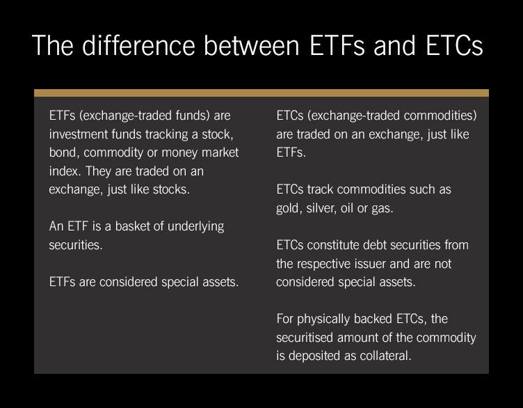

Financial assets represent claims to future cash flows and are a crucial component of any investment strategy. They encompass a wide range of categories, such as stocks, bonds, and commodities, each offering unique characteristics and benefits. In this context, financial assets are primarily used to generate returns, manage risks, and maintain liquidity in investment portfolios.

Exchange-Traded Commodities (ETCs) stand out as a specialized type of financial asset providing direct exposure to the price movements of raw materials without the complexities of owning the physical commodities. These financial instruments are similar to Exchange-Traded Funds (ETFs) but focus exclusively on commodities such as metals, oil, and agricultural products. ETCs allow investors to diversify their portfolios and potentially benefit from commodity market dynamics.

In the modern investment landscape, algorithmic trading has emerged as a transformative force, heavily influencing the management and optimization of financial assets, including ETCs. Algorithmic trading involves using computer algorithms to automate trading strategies, offering enhanced precision, efficiency, and the ability to process vast amounts of data quickly. Its growing importance lies in its ability to eliminate emotional biases and improve decision-making, making it an indispensable tool for contemporary investors.

This article aims to explore the intersection of ETCs and algorithmic trading, shedding light on how their integration can lead to innovative investment strategies. By understanding these concepts, investors can better navigate the complexities of the modern financial environment and harness potential opportunities. This exploration will also offer insights into the benefits, challenges, and future trends associated with these tools.

The structure of this article begins with a comprehensive overview of financial assets and a detailed explanation of Exchange-Traded Commodities. It then introduces the rise of algorithmic trading and examines its application to ETCs. The article further discusses the advantages and challenges of integrating these two areas, and speculates on future trends that may influence both ETCs and algorithmic trading. Finally, the conclusion synthesizes the discussion and suggests avenues for further exploration, providing modern investors with a valuable resource for informed decision-making in a rapidly evolving market.

## Table of Contents

## Understanding Financial Assets

Financial assets are instruments that hold monetary value and can be traded, transferred, or utilized in generating wealth. They are essential components of the financial markets, representing claims to future cash flows or ownership. The primary types of financial assets include stocks, bonds, and commodities.

Stocks, or equities, represent ownership in a company and provide investors with a claim to a portion of the firm's assets and earnings. They are typically characterized by their ability to appreciate over time, along with dividend payouts, which can provide a steady income stream. Stocks play a crucial role in portfolio diversification by offering potential for high returns, albeit with considerable risk due to market [volatility](/wiki/volatility-trading-strategies) and company-specific factors.

Bonds are debt instruments issued by corporations, municipalities, or governments that promise to pay back the principal amount along with interest. They function as a loan from the investor to the issuer. Bonds are generally considered less risky than stocks and are often included in portfolios to provide stability and steady interest income. However, they are still subject to [interest rate](/wiki/interest-rate-trading-strategies) risk and credit risk, which can affect their returns.

Commodities are physical goods that include raw materials such as metals, energy products, and agricultural items. Commodities are unique within financial assets due to their tangible nature and broader role in the global economy. They tend to have a low correlation with traditional financial instruments like stocks and bonds, making them effective hedges against inflation and useful for diversification. Commodities can be highly volatile, with prices influenced by numerous factors such as geopolitical events, supply and demand dynamics, and environmental conditions. This volatility presents both opportunities and risks for investors. Spot markets, futures contracts, and Exchange-Traded Commodities (ETCs) are common ways to invest in commodities.

These financial assets contribute significantly to portfolio diversification and risk management. Diversification aims to reduce risk by allocating investments across various financial assets that react differently to market conditions. For example, poor performance in one asset class might be offset by gains in another, leading to a more stable portfolio overall. A diversified portfolio might include a mix of equities for growth potential, bonds for stability and income, and commodities for inflation protection and non-correlation benefits.

The role of each financial asset in risk management is underscored by their distinct characteristics and risk-return profiles. By understanding the unique features of stocks, bonds, and commodities, investors can construct portfolios that align with their financial goals and risk tolerance. Embracing the complexity and opportunities presented by these diverse types of financial assets is essential for successful investment strategies.

## What Are Exchange-Traded Commodities (ETCs)?

Exchange-Traded Commodities (ETCs) are a type of financial instrument that enable investors to gain exposure to commodity markets without owning the physical goods. Unlike Exchange-Traded Funds (ETFs) which typically hold a diversified portfolio of assets such as stocks or bonds, ETCs are specifically designed to track the price of a single commodity or a basket of commodities. This direct exposure makes ETCs an attractive choice for investors seeking to hedge against inflation or speculate on commodity price movements.

ETCs differ from ETFs and other exchange-traded products in several ways. While ETFs usually follow indices and comprise an assortment of securities, ETCs focus primarily on raw materials, presenting a more straightforward investment in a particular commodity. Additionally, where ETFs often distribute dividends earned from underlying assets, ETCs typically reinvest any income back into the commodity exposure, thereby amplifying the effect of price movements.

The appeal of ETCs lies in their ability to offer an accessible, liquid, and cost-effective method for investors to invest in raw materials like gold, silver, oil, and agricultural products. By investing in ETCs, traders can avoid the complexities and costs associated with the physical storage and transportation of commodities. Moreover, ETCs can be bought and sold easily on stock exchanges, providing an efficient way for investors to enter and [exit](/wiki/exit-strategy) positions without significant transaction costs.

ETCs are structured through mechanisms such as futures contracts and physical holdings. Those based on futures contracts operate by rolling over short-term futures to maintain exposure to a specific commodity. This approach is primarily used for commodities where physical ownership is impractical. Conversely, ETCs that use physical holdings store the commodity securely and update their value based on the prevailing market price, making them similar to holding a tangible asset. For example, a gold ETC might involve the actual storage of gold bars in a vault, with each share representing a certain amount of the precious metal.

Popular commodities traded as ETCs include gold, oil, and silver. These commodities are often seen as hedges against currency fluctuations and inflation, with gold and silver serving as traditional stores of value. Oil, on the other hand, is a critical component of the global energy market, providing investors with an avenue to speculate on geopolitical developments and shifts in energy prices.

In summary, Exchange-Traded Commodities provide a streamlined method for investors to access commodity markets, offering both simplicity and flexibility. Their distinct nature compared to ETFs and other financial products makes them an essential tool for those looking to diversify investment portfolios with direct commodity exposure.

## The Rise of Algorithmic Trading

Algorithmic trading represents a significant advancement in financial markets, utilizing complex algorithms to automate the trading process and make decisions with minimal human intervention. These algorithms are essentially sets of rules based on various market parameters, historical data, and statistical models. They can execute trades at ultra-fast speeds that humans cannot match, providing a substantial edge in today's fast-paced trading environment.

The automation in [algorithmic trading](/wiki/algorithmic-trading) brings several benefits, the foremost being speed and efficiency. Algorithms can analyze vast amounts of data and execute orders within milliseconds, a task impossible for human traders. This speed advantage allows traders to exploit even minute market inefficiencies, potentially leading to enhanced profitability. The efficiency of algorithmic trading is also reflected in reduced transaction costs, as algorithms can optimize trade execution to minimize expenses such as market impact and opportunity costs.

Another notable benefit of algorithmic trading is the reduction of emotional bias, a common pitfall in manual trading. Human traders are often susceptible to emotions like fear and greed, which can lead to irrational decision-making. Algorithms, on the other hand, operate strictly based on predefined rules and logic, ensuring consistency and objectivity in trade execution.

Algorithmic trading is relevant not only to equity markets but also to commodity markets, including Exchange-Traded Commodities (ETCs). In equity markets, algorithms are widely used for activities like [arbitrage](/wiki/arbitrage), [market making](/wiki/market-making), and [trend following](/wiki/trend-following). Meanwhile, in commodity markets, algorithms can manage the intrinsic volatility of commodities, optimizing trade execution and enhancing [liquidity](/wiki/liquidity-risk-premium). The ability to process real-time data and react swiftly to market changes make algorithmic trading a powerful tool in both sectors.

As technology continues to advance, the role of algorithmic trading is expected to expand further, with continuous improvements in the algorithms' complexity and predictive power. Traders who leverage these advancements are likely to maintain a competitive edge in the dynamically evolving financial landscape.

## Integrating Algo Trading with Exchange-Traded Commodities

Algorithmic trading has significantly transformed various financial markets, including those involving Exchange-Traded Commodities (ETCs). Essentially, algorithmic trading involves using computer programs to execute trades based on predetermined criteria. This approach offers numerous strategies that can be effectively applied to ETCs, optimizing the trade process and potentially enhancing returns.

### Algorithmic Strategies for ETCs

**Momentum Trading**

Momentum trading relies on the concept that assets that have shown a particular trend in the past continue to do so in the near future. Algorithms in [momentum](/wiki/momentum) trading for ETCs identify commodities exhibiting substantial upward or downward trends. For instance, if gold prices have been trending upward, an algorithm might execute buy orders to capitalize on this trend until the pattern reverses.

**Arbitrage**

Arbitrage strategies are designed to exploit price differences of identical or related financial instruments across different markets or forms. In the context of ETCs, arbitrage might involve buying a commodity in one market where the price is low and simultaneously selling it in another market where the price is higher. Algorithmic systems rapidly execute these trades to capture the price differentials before the markets adjust.

**Hedging**

Hedging with algorithms involves creating strategies that offset potential losses in commodity positions. For instance, if a trader holds an ETC position in oil and anticipates a potential drop in prices, they might use algorithms to automatically execute options contracts or futures positions that gain value when oil prices fall. This minimizes risk while maintaining exposure to the commodity.

### Advantages of Combining ETCs with Algorithmic Trading

The integration of algorithmic trading with ETCs offers several key benefits:

- **Enhanced Liquidity**: Algorithms can execute large volumes of trades quickly and efficiently, contributing to market liquidity. This is particularly advantageous in commodity markets, which can be less liquid than equities.

- **Optimization**: Algorithmic approaches allow for real-time data analysis and trading decision-making, optimizing trade entries and exits. This real-time processing is crucial in volatile commodity markets where prices can change rapidly.

- **Reduced Emotional Bias**: Algorithms trade based on pre-defined criteria and data analysis, free from human emotional influences that might lead to irrational decisions.

### Case Studies of Successful Integration

There are numerous examples of successful algorithmic trading implementations in ETC markets. One notable case involves a [hedge fund](/wiki/hedge-fund-trading-strategies) using momentum-based algorithms to trade a portfolio of commodities, including oil, gold, and copper. By leveraging [machine learning](/wiki/machine-learning) algorithms, the fund identified patterns in historical price data and executed trades that yielded returns above the market average for a particular period.

Another example features a trading firm using arbitrage strategies in the silver market. Algorithms monitored price disparities between ETCs listed on different exchanges, executing rapid trades to exploit minor price differences, resulting in substantial cumulative profits over time.

The successful integration of algorithmic trading with ETCs provides a sophisticated approach for traders and investors aiming to improve their commodity trading outcomes. Embracing these strategies allows for informed investment decisions, leveraging technology for optimal market participation.

## Advantages and Challenges of Algo Trading in ETCs

Algorithmic trading, often praised for its precision, scalability, and data-driven insights, offers several advantages when integrated with Exchange-Traded Commodities (ETCs). One of the primary benefits is precision, achieved through the ability to execute trades at optimal price points determined by complex mathematical models and real-time data analysis. Algorithms can dissect vast datasets to identify patterns and make informed decisions without the emotional biases that often affect human traders.

Scalability is another significant advantage. With algorithmic trading, executing thousands of trades across multiple markets is possible without increasing operational costs proportionately. This scalability ensures that even minor price discrepancies can be exploited on a large scale, translating to substantial cumulative gains.

Data-driven insights are at the heart of algorithmic trading. By employing advanced analytics, machine learning, and [artificial intelligence](/wiki/ai-artificial-intelligence), traders can uncover sophisticated strategies and adapt to changing market conditions more rapidly than purely manual trading methods allow. These insights provide a competitive edge, enabling traders to optimize their strategies continuously and align them with current market dynamics.

However, algorithmic trading in ETCs is not without challenges. Market volatility poses a significant risk; algorithms relying on historical data might falter during unanticipated market upheavals. Additionally, technological dependencies are inherent in this trading approach. Reliable infrastructure and uninterrupted access to high-quality data streams are crucial, as any lag or disruption can lead to significant financial losses.

Regulatory considerations are of utmost importance in algorithmic trading. Compliance with ever-evolving financial regulations is mandatory to prevent legal repercussions and ensure fair market practices. Regulatory bodies impose strict guidelines to mitigate risks associated with high-frequency trading, including measures to manage liquidity and prevent market manipulation.

Managing the risks associated with algorithmic trading in commodities involves several strategies. Developing robust risk management protocols is essential, including setting stop-loss limits and diversifying trading algorithms to handle various market scenarios. Ensuring that algorithmic strategies are thoroughly back-tested and stress-tested across different market conditions can help anticipate potential pitfalls.

Additionally, maintaining a double-check mechanism where automated trades undergo periodic review by human analysts can reduce the reliance on technology. Incorporating machine learning models that continuously adapt to new data ensures that the trading strategies remain relevant and resilient in volatile markets. By understanding the advantages and challenges of algo trading within ETCs, traders can navigate these complex financial landscapes effectively.

## Future Trends in ETCs and Algorithmic Trading

Exchange-Traded Commodities (ETCs) and algorithmic trading are increasingly becoming pivotal elements in modern investment strategies. Emerging trends in these fields suggest transformative changes that could redefine how they operate and interact.

Advancements in artificial intelligence (AI) and machine learning (ML) are at the forefront of innovations in trading strategies. AI and ML enable the processing of vast datasets to identify patterns and develop predictive models, improving the precision of trading decisions. For instance, [reinforcement learning](/wiki/reinforcement-learning) approaches can optimize trading algorithms by learning to make decisions based on simulated market environments. This can be achieved through Q-learning or deep Q-networks, which iteratively update policy strategies based on reward signals received from market changes. Python libraries such as TensorFlow or PyTorch are increasingly used for such tasks, providing robust tools for implementing complex neural networks that aid in these strategies. 

The regulatory landscape is also expected to evolve, impacting both ETCs and algorithmic traders. Regulators are moving towards more comprehensive frameworks to ensure market integrity and protect investors. These developments may require enhanced transparency in algorithmic strategies and greater compliance obligations for ETC providers. Upcoming regulations could mandate more detailed reporting of algorithmic trading activities, alongside stress-testing of algorithms to ensure stability under varied market conditions.

Technological advancements continue to improve the integration of ETCs and algorithmic trading. Developments in high-frequency trading ([HFT](/wiki/high-frequency-trading-strategies)) hardware, like Field-Programmable Gate Arrays (FPGAs), allow transactions to be conducted in microseconds, enhancing the efficiency of executing algorithmic strategies on ETCs. Additionally, distributed ledger technology, such as blockchain, could enhance the transparency and security of ETC transactions, ensuring real-time tracking and verification of trades. This might become particularly relevant in the verification of underlying asset holdings, crucial for maintaining investor confidence in ETC products.

Overall, the intersection of ETCs and algorithmic trading is set for significant transformation, with AI and ML driving more sophisticated trading models, evolving regulations prompting greater transparency, and technological innovations facilitating closer integration of these domains. For investors, staying informed about these trends is vital in navigating the future landscape of financial assets.

## Conclusion

This article has explored the intricate intersection of Exchange-Traded Commodities (ETCs) and algorithmic trading, providing a comprehensive understanding of how these financial tools contribute to modern finance. ETCs offer investors direct exposure to commodities, enabling diverse portfolio construction and potential risk management benefits. Simultaneously, algorithmic trading stands as a revolutionary advancement, offering automated, precise, and efficient trading solutions that enhance market operations.

The integration of algorithmic trading with ETCs underscores their importance in contemporary investment strategies. This fusion optimizes trading processes, improves liquidity, and provides data-driven insights, resulting in more informed and less emotionally-driven investment decisions. As financial markets grow increasingly complex, the role of these tools becomes more imperative for investors seeking competitive edges.

Investors are encouraged to harness the power of ETCs and algorithmic trading while acknowledging the potential challenges and regulatory landscapes. Embracing these innovations can enhance returns and provide diversification benefits, crucial in navigating the volatile global markets.

For those seeking to deepen their understanding of these topics, several resources are recommended. Key texts include "Algorithmic Trading and DMA" by Barry Johnson and "Commodities Demystified: A Guide to Trading and the Global Supply Chain" by Blythe Masters. Additionally, online courses on platforms like Coursera or financial market reports from institutions such as the World Bank and IMF can offer valuable insights into the evolving landscape of ETCs and algorithmic trading.

## References & Further Reading

[1]: Johnson, B. (2010). ["Algorithmic Trading and Direct Market Access: Routing and Execution"](https://www.semanticscholar.org/paper/Algorithmic-trading-%26-DMA-%3A-an-introduction-to-Johnson/aa5de1ab883d5e23b6651faa7c1807586d688e4b). 4Myeloma Press.

[2]: Masters, B. (2008). ["Commodities Demystified: A Guide to Trading and the Global Supply Chain"](https://www.commoditiesdemystified.info/en/). Bloomberg Press.

[3]: Lopez de Prado, M. (2018). ["Advances in Financial Machine Learning"](https://www.amazon.com/Advances-Financial-Machine-Learning-Marcos/dp/1119482089). Wiley.

[4]: Jansen, S. (2020). ["Machine Learning for Algorithmic Trading"](https://github.com/stefan-jansen/machine-learning-for-trading). Packt Publishing.

[5]: Chan, E. P. (2008). ["Quantitative Trading: How to Build Your Own Algorithmic Trading Business"](https://github.com/ftvision/quant_trading_echan_book). Wiley.

[6]: Pardo, R. (2011). ["The Evaluation and Optimization of Trading Strategies"](https://onlinelibrary.wiley.com/doi/book/10.1002/9781119196969). Wiley.

[7]: Aronson, D. R. (2006). ["Evidence-Based Technical Analysis: Applying the Scientific Method and Statistical Inference to Trading Signals"](https://onlinelibrary.wiley.com/doi/book/10.1002/9781118268315). Wiley.

[8]: Ulrich, M. R. (2013). ["Algorithmic and High-Frequency Trading"](https://assets.cambridge.org/97811070/91146/frontmatter/9781107091146_frontmatter.pdf). Cambridge University Press.

[9]: Kissell, R. (2013). ["The Science of Algorithmic Trading and Portfolio Management"](https://www.sciencedirect.com/book/9780124016897/the-science-of-algorithmic-trading-and-portfolio-management). Academic Press.