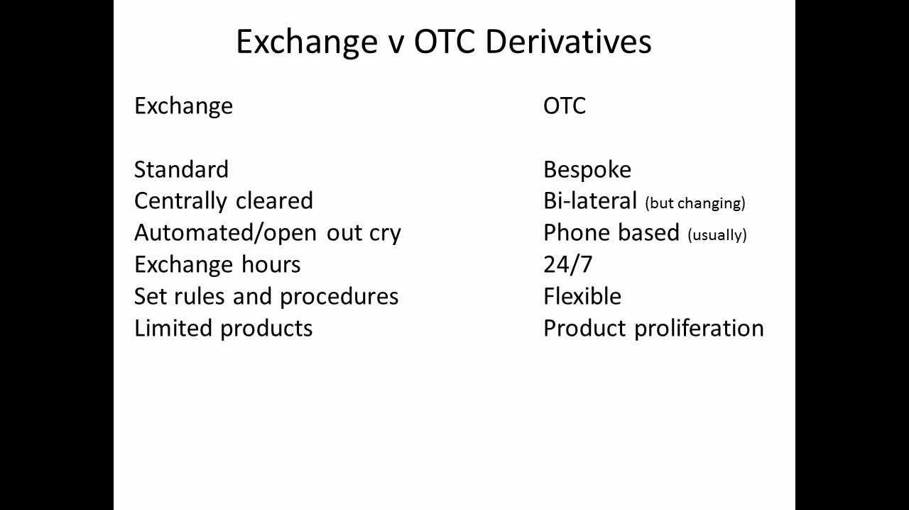

## Table of Contents

## What are exchange-traded derivatives (ETDs)?

Exchange-traded derivatives (ETDs) are financial instruments that are traded on organized exchanges, like the stock market. They are contracts between two parties where the value is based on an underlying asset, such as stocks, commodities, or interest rates. The main types of ETDs are futures and options. These instruments allow investors to speculate on price movements or hedge against risks without needing to own the actual asset.

ETDs are standardized, meaning they have set terms and conditions that are the same for all contracts of the same type. This standardization makes them easier to trade and more transparent than over-the-counter derivatives. Trading ETDs happens through a clearinghouse, which acts as the middleman and guarantees the transaction. This reduces the risk that one party won't fulfill their part of the deal, making ETDs a safer choice for many investors.

## What are over-the-counter (OTC) derivatives?

Over-the-counter (OTC) derivatives are financial agreements made directly between two parties, without going through a formal exchange like a stock market. These contracts can be customized to fit the specific needs of the people involved. This means they can be tailored for things like the amount of money involved, how long the contract lasts, and what the contract is based on, like a commodity or interest rate. Because they are not traded on an exchange, OTC derivatives give more flexibility but also come with more risk.

The main types of OTC derivatives include swaps, forward contracts, and certain types of options. Swaps let two parties exchange cash flows or other financial instruments, often to manage different kinds of risk, like [interest rate](/wiki/interest-rate-trading-strategies) risk. Forward contracts are agreements to buy or sell an asset at a future date for a price agreed upon today. OTC derivatives are not as transparent as exchange-traded derivatives because they are private deals, and there's no central place keeping track of them. This can make it harder to know the true value of these contracts and increases the chance that one party might not be able to fulfill their part of the deal.

## How do ETDs and OTC derivatives differ in terms of standardization?

Exchange-traded derivatives (ETDs) are very standardized. This means that all contracts of the same type have the same rules and details. For example, if you buy a futures contract on corn, it will have the same amount of corn, the same delivery date, and the same other terms as any other corn futures contract. This makes ETDs easy to buy and sell because everyone knows exactly what they are getting. It's like buying a product off a shelf in a store where all items of the same type are the same.

On the other hand, over-the-counter (OTC) derivatives are not standardized. They are made just for the two people or companies involved in the deal. This means they can change the terms to fit what they need. For example, if two companies want to swap interest rates, they can decide on the exact amount of money, how long the swap will last, and any other details they want. This flexibility can be good, but it also makes OTC derivatives more complicated and harder to understand because each one is different, like a custom-made item that's not found on any shelf.

## What are the key differences in the trading platforms for ETDs and OTC derivatives?

ETDs are traded on organized exchanges, which are like big marketplaces where lots of buyers and sellers come together. These exchanges have rules and systems to make sure trading is fair and safe. When you trade an ETD, there's a clearinghouse that acts like a middleman. It makes sure that if you buy or sell a contract, the other person will do their part of the deal. This makes ETDs safer because the clearinghouse takes on the risk that someone might not pay up.

OTC derivatives, on the other hand, are traded directly between two parties without using a big exchange. It's more like a private deal you make with someone you know. There's no clearinghouse involved, so if you make a deal, you have to trust the other person to stick to it. This can be riskier because if the other person can't or won't fulfill their part of the deal, you might lose money. But it also lets you make deals that are just right for what you need, without having to fit into the rules of a big exchange.

## How does the level of transparency compare between ETDs and OTC derivatives?

ETDs are very transparent because they are traded on big exchanges. This means that everyone can see the prices, how many contracts are being bought and sold, and other important details. It's like a big open market where you can see everything that's happening. This transparency helps everyone know the true value of the contracts and makes it easier to trust the market.

OTC derivatives, on the other hand, are much less transparent. They are private deals made directly between two parties, so not everyone can see the details. It's like making a deal in a private room where only the people involved know what's going on. This lack of transparency can make it hard to know the true value of these contracts and increases the risk because you can't easily check if the other person is trustworthy.

## What are the typical counterparty risks associated with ETDs versus OTC derivatives?

When you trade ETDs, the counterparty risk is lower because there's a clearinghouse that acts like a middleman. This means if you buy or sell a contract, the clearinghouse makes sure the other person will do what they promised. It's like having a referee in a game who makes sure everyone plays fair. So, even if the person you made the deal with can't pay, the clearinghouse steps in and takes care of it. This makes ETDs safer because the risk of the other person not fulfilling their part of the deal is managed by the clearinghouse.

On the other hand, OTC derivatives have higher counterparty risk because there's no clearinghouse involved. When you make a deal directly with someone, you have to trust them to stick to it. If they can't or won't pay up, you might lose money. It's like playing a game without a referee; if the other player cheats, there's no one to stop them. This makes OTC derivatives riskier, but it also allows for more flexibility in making deals that fit your specific needs.

## How do the regulatory environments for ETDs and OTC derivatives differ?

ETDs are tightly regulated because they are traded on big exchanges. Governments and financial watchdogs make rules to make sure trading is fair and safe. They check that the exchanges follow these rules, and they also watch over the clearinghouses that make sure everyone sticks to their deals. This means there are lots of checks and balances to protect people who trade ETDs. The rules can include things like how much money you need to start trading, how much you can trade, and how the contracts are made.

OTC derivatives have less strict rules because they are private deals between two people or companies. But after a big financial crisis, governments started paying more attention to OTC derivatives to make them safer. They made rules to make sure people know more about these deals and to lower the risk of big problems. For example, some OTC derivatives now have to be reported to special places so everyone can see them better. But still, the rules for OTC derivatives are not as tight as those for ETDs because they are not traded on big exchanges.

## What are the liquidity differences between ETDs and OTC derivatives?

ETDs usually have high [liquidity](/wiki/liquidity-risk-premium) because they are traded on big exchanges where lots of people buy and sell them. It's like a busy marketplace where you can easily find someone to trade with. This means if you want to buy or sell an ETD, you can usually do it quickly and at a fair price. The high number of traders and the rules of the exchange make it easier to get in and out of trades without waiting too long.

OTC derivatives, on the other hand, can have lower liquidity because they are private deals between two parties. It's like trying to find someone to buy or sell something that's not on a big store shelf. If you want to trade an OTC derivative, you might have to wait longer to find someone who wants to make the same deal. This can make it harder to get in and out of trades quickly, and the price might not be as good because there are fewer people to trade with.

## How do the pricing mechanisms for ETDs and OTC derivatives vary?

ETDs have clear pricing because they are traded on big exchanges. Everyone can see the prices and how many contracts are being bought and sold. The price of an ETD is based on what people are willing to pay for it right now. This is called the market price, and it changes all the time as people buy and sell. Because lots of people trade ETDs, the prices are usually fair and easy to understand.

OTC derivatives have different pricing because they are private deals between two people. The price is set by the two people making the deal, and it can be based on many things like how risky the deal is or how much one person wants to make the deal happen. Since these deals are not on a big exchange, the prices can be harder to understand and might not be as fair as ETD prices. Also, because fewer people trade OTC derivatives, the price can be more affected by what the two people agree on.

## What are the settlement processes for ETDs compared to OTC derivatives?

ETDs have a clear and organized way of settling. When you trade an ETD, there's a special place called a clearinghouse that helps make sure everything goes smoothly. If you buy or sell a contract, the clearinghouse steps in to make sure both sides do what they promised. For example, if you have a futures contract, you might have to pay some money upfront, and then at the end of the contract, you either get the thing you bought or you get paid the difference in price. It's like having a referee who makes sure the game is played fairly and everyone gets what they are supposed to.

OTC derivatives have a more flexible but less organized way of settling. Because these are private deals between two people, they can decide how they want to settle the deal. Sometimes they might have to pay money at different times during the deal, or they might have to give something to the other person at the end. But because there's no clearinghouse, they have to trust each other to do what they promised. It's like playing a game without a referee; you have to make sure the other player plays fair on your own.

## How do ETDs and OTC derivatives impact systemic risk differently?

ETDs help lower systemic risk because they are traded on big exchanges with lots of rules. These exchanges have a special place called a clearinghouse that makes sure if someone can't pay, it steps in to help. This means that even if one person can't do what they promised, the whole system doesn't fall apart. It's like having a safety net that catches you if you fall, keeping the whole group safe.

OTC derivatives can increase systemic risk because they are private deals without a clearinghouse to help if something goes wrong. If one person can't pay what they promised, it can cause big problems for the other person and maybe even more people they are connected to. It's like playing a game of dominoes; if one piece falls, it can knock down a lot of others. After a big financial crisis, rules were made to make OTC derivatives safer, but they still [carry](/wiki/carry-trading) more risk than ETDs.

## What are advanced strategies that can be employed with ETDs and OTC derivatives, and how do they compare in effectiveness and risk?

Advanced strategies with ETDs often include things like hedging, where you use futures or options to protect against price changes in something you own. For example, if you own a lot of corn, you might buy a futures contract to sell corn at a set price later, so you know you'll get that price even if the market goes down. Another strategy is speculation, where you try to make money by guessing how prices will move. With ETDs, you can use options to bet on whether a stock will go up or down without having to buy the stock itself. These strategies are effective because ETDs are very liquid and have clear prices, but they also come with risks, like the chance that the market moves against you or that you have to pay more money if the price goes the wrong way.

OTC derivatives allow for more advanced and customized strategies because you can make deals that fit exactly what you need. For example, you might use a swap to change your interest rate risk, where you agree to trade payments with someone else based on different interest rates. Or you might use a forward contract to lock in a price for something you need in the future, like oil. These strategies can be very effective because they are tailored to your specific situation, but they also come with higher risks. Since OTC derivatives are less transparent and don't have a clearinghouse, there's a bigger chance that the other person won't do what they promised, and it can be harder to get out of the deal if you need to.

In summary, ETDs offer clear, liquid markets for strategies like hedging and speculation, which can be very effective but come with market and margin risks. OTC derivatives, on the other hand, allow for highly customized strategies that can be tailored to specific needs, offering potentially higher effectiveness in managing unique risks, but they carry greater counterparty risk and less liquidity, making them riskier overall.

## References & Further Reading

[1]: Hull, J. C. (2018). ["Options, Futures, and Other Derivatives"](https://www.semanticscholar.org/paper/Options%2C-Futures%2C-and-Other-Derivatives-Hull/89bdee500c8623864fc9eb7a471546aa713acc44). Pearson.

[2]: Lauricella, T. (2010). ["The Vicious Cycle of the Flash Crash."](https://www.forbes.com/2010/06/30/what-caused-flash-crash-personal-finance-panic.html) The Wall Street Journal.

[3]: Durbin, M. (2010). ["All About High-Frequency Trading."](https://www.mhebooklibrary.com/doi/book/10.1036/9780071743457) McGraw-Hill.

[4]: BIS (2010). ["Triennial Central Bank Survey: OTC Derivatives Market Activity."](https://www.bis.org/statistics/rpfx22.htm) Bank for International Settlements.

[5]: Glasserman, P., & Wu, Q. (2018). ["Persistence and Procyclicality in Margin Requirements."](https://www.jstor.org/stable/48748375) Finance and Economics Discussion Series, Federal Reserve.