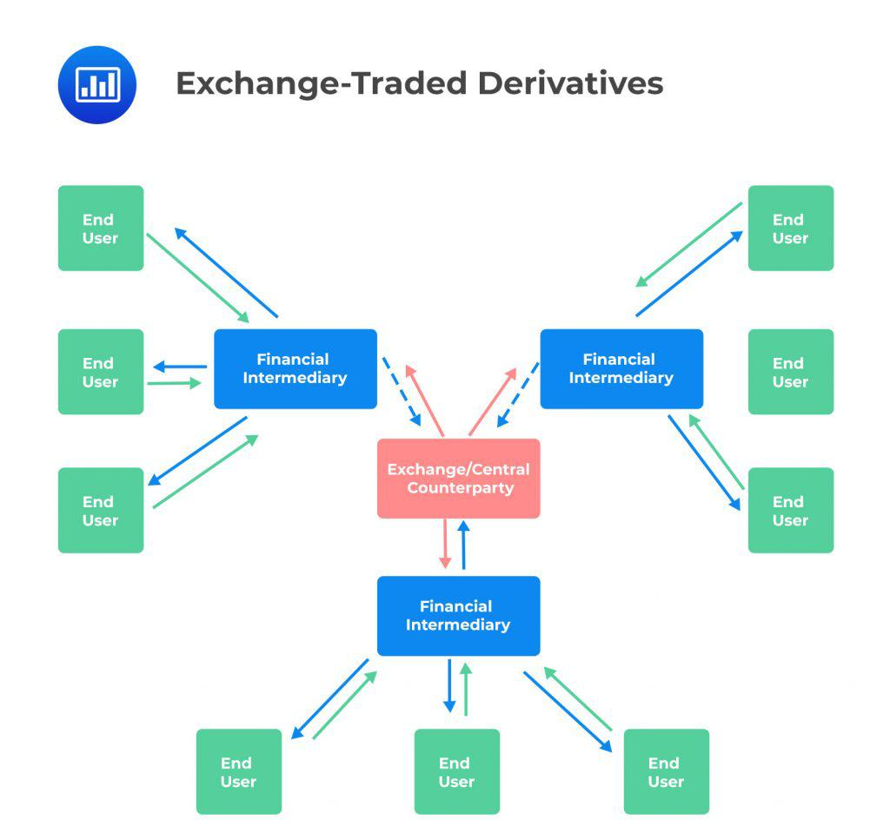

The world of finance offers an extensive array of investment opportunities, and exchange-traded derivatives play a vital role in this landscape. Exchange-traded derivatives, which typically include futures and options, are traded on regulated exchanges, ensuring a level of transparency and security that is often absent in over-the-counter (OTC) derivatives. These financial instruments provide numerous advantages, such as standardized contracts and reduced counterparty risk through the involvement of clearinghouses that guarantee transactions.

These derivatives are not only tools for hedging financial risks but also offer significant speculative opportunities. By locking in prices or securing rights without obligation, they help investors manage potential risks and benefit from price movements in underlying assets. Technology, particularly algorithmic trading, has further enhanced the appeal of these derivatives by allowing for precise and efficient execution of trades. This intersection of complex financial instruments and advanced technology facilitates a more dynamic trading environment, offering investors an edge in managing their portfolios.



The reliability and accessibility of exchange-traded derivatives make them an attractive option for investors around the globe. Whether for hedging against currency fluctuations or speculating on future interest rates, these instruments, coupled with the technological advancements in trading, provide a sophisticated mechanism for financial market participation.

## Table of Contents

## Understanding Exchange-Traded Derivatives

Exchange-traded derivatives are pivotal components in financial markets, distinguished by their trading on regulated exchanges such as the Chicago Mercantile Exchange (CME) or Eurex. These financial instruments derive their value from underlying assets, which can range from commodities and equities to indices and interest rates. The two prominent types of exchange-traded derivatives are futures and options. Both are characterized by standardized contract specifications determined by the respective exchange, ensuring uniformity and facilitating market liquidity.

Futures contracts obligate the buyer to purchase, and the seller to sell, a specific asset at a predetermined price upon maturity. The standardization of futures includes elements such as contract size, expiration dates, and pricing units, all of which are predefined by the exchange. Options, on the other hand, grant the holder the right, but not the obligation, to buy or sell an asset at an agreed-upon price within a specified timeframe. Options contracts are also standardized, with consistent strike prices and expiration dates.

A key feature of exchange-traded derivatives is the role of the clearinghouse. The clearinghouse acts as an intermediary between the buyers and sellers, guaranteeing the execution of the transactions. This function eliminates counterparty risk, which is the risk that the counterparty in a financial transaction might default before the final settlement of their obligations. By serving as the counterparty to both sides of a trade, the clearinghouse absorbs this risk. This system offers a stark contrast to over-the-counter (OTC) derivatives, which lack such centralized counterparty clearing and thus carry a higher counterparty default risk.

The benefits of exchange-traded derivatives over their OTC counterparts include increased transparency and [liquidity](/wiki/liquidity-risk-premium). On regulated exchanges, trade prices are widely disseminated, providing transparency and ensuring that all participants have access to the same information. This transparency contributes to fairer pricing and lower transaction costs. Additionally, the liquidity found on these exchanges means that investors can readily enter or [exit](/wiki/exit-strategy) positions without causing significant price movements, which can be crucial in volatile markets.

Operationally, exchange-traded derivatives function within a highly regulated framework. The exchange sets margin requirements, which are deposits that traders must maintain to cover potential losses. These margin requirements are crucial in ensuring that investors have the financial capacity to uphold their end of the derivatives contract. Moreover, the regulations governing these exchanges contribute to market integrity and investor protection.

In conclusion, exchange-traded derivatives are integral to modern finance, offering robust mechanisms for hedging and speculation. They provide a regulated environment with clear standards, risk mitigations through clearinghouses, and advantages of transparency and liquidity, making them attractive instruments for a wide array of investors.

## Types and Examples of Exchange-Traded Derivatives

Various types of exchange-traded derivatives cater to diverse investment and speculative needs, offering strategic advantages in trading. These derivatives are structured and standardized to facilitate seamless trading on exchanges, ensuring transparency and reducing counterparty risk.

**Futures Contracts:** One of the most prevalent types of exchange-traded derivatives, futures contracts are agreements to buy or sell an asset at a predetermined price on a specified future date. These contracts cover a broad array of underlying assets, including commodities, currencies, indices, and interest rates. The Chicago Mercantile Exchange (CME), for example, offers a robust market for futures contracts [CME Group](https://www.cmegroup.com/). Futures are particularly advantageous for hedging against price fluctuations, allowing producers and consumers to lock in prices and investors to speculate on market movements.

**Options:** Options provide the holder the right, but not the obligation, to buy or sell an underlying asset at a specified strike price before a certain expiration date. Unlike futures, the buyer is not obligated to execute the contract. There are two primary types of options: call options, which offer the right to purchase, and put options, which provide the right to sell. Equity options, traded on exchanges such as the Chicago Board Options Exchange (CBOE), are popular among investors for their ability to leverage price movements while managing risk through premium payments [CBOE](https://www.cboe.com/).

**Currency Futures:** These derivatives are contracts to exchange a specific amount of currency at a predetermined rate on a future date. They are instrumental for businesses and investors to hedge against currency risk, securing exchange rates in international trade. The International Monetary Market, a division of the CME Group, facilitates extensive trading in currency futures, providing liquidity and transparency for speculators and hedgers alike.

**Interest Rate Swaps:** Although typically over-the-counter, certain standardized interest rate swaps are also available on exchanges. These derivatives entail exchanging fixed interest payments for floating rates, enabling institutions to manage exposure to interest rate fluctuations. Exchange-traded interest rate swaps offer the benefit of a clearinghouse, reducing counterparty risk compared to their OTC counterparts.

Exchange-traded derivatives are meticulously structured to support standardized contract terms, ensuring each contract specifies the quantity, quality, and delivery terms of the underlying asset. This standardization simplifies trading and enhances liquidity by making it easier for buyers and sellers to match their interests. Moreover, the exchanges and their associated clearinghouses facilitate the secure settlement of these contracts, providing a higher degree of safety and reliability.

Investors understanding the variety of exchange-traded derivatives available can strategically hedge risks, speculate on market movements, and achieve their financial objectives. These instruments' standardized nature not only enhances the efficiency of trading but also broadens participation by ensuring adherence to regulatory requirements and protecting market integrity.

## The Role of Algorithmic Trading

Algorithmic trading has significantly transformed the trading of derivatives and other securities on exchanges. These sophisticated trading strategies utilize computer algorithms to automate and enhance trade execution, thereby increasing the speed and efficiency of market transactions. Algorithms, or 'algos', are employed to execute orders with precision, minimizing the market impact of sizeable trades and optimizing execution prices. Additionally, they diminish the probability of errors that can occur with manual trading, allowing for more accurate and timely trading decisions.

The integration of [algorithmic trading](/wiki/algorithmic-trading) with exchange-traded derivatives, such as futures and options, leads to improved liquidity and market efficiency. Liquidity refers to the ease with which an asset can be bought or sold in the market without affecting its price. By automating trades, algorithms can inject continuous buy and sell orders into the market, fulfilling the demand and supply requirements rapidly. This continuous trading activity reduces the bid-ask spread, therefore enhancing market efficiency and making it easier for traders to enter and exit positions.

Algorithmic trading systems operate based on pre-defined criteria. These criteria can include various market indicators, such as price fluctuations, trading [volume](/wiki/volume-trading-strategy), and other relevant financial metrics. For instance, a simple algorithm could be constructed to place a buy order if a security's price falls below a certain threshold, known as a limit order. More advanced algorithms, however, leverage [machine learning](/wiki/machine-learning) techniques to predict price movements and adjust trading strategies dynamically.

A typical example in Python for a basic algorithmic trading strategy might involve utilizing historical data to predict future prices and execute trades based on those predictions:

```python
import numpy as np
import pandas as pd
from sklearn.linear_model import LinearRegression

# Sample historical price data
data = {'Price': [100, 102, 105, 103, 107]}
df = pd.DataFrame(data)

# Calculate moving average
df['Moving_Average'] = df['Price'].rolling(window=3).mean()

# Simple linear regression model
X = np.arange(len(df)).reshape(-1, 1)
y = df['Price'].values

model = LinearRegression().fit(X, y)
predicted_price = model.predict([[len(df)]])

# Decision rule
if predicted_price > df['Price'].iloc[-1]:
    print("Signal to buy")
else:
    print("Signal to sell")
```

The implementation of these automated systems also bears implications for traders and markets as a whole. The widespread use of algorithmic trading has contributed to increased market complexity and has necessitated robust technological infrastructure and risk management frameworks. Moreover, while algorithmic trading can improve market quality, it can also lead to potential market disruptions if flawed or overly aggressive algorithms are employed. These incidents underscore the importance of designing algorithms with safety mechanisms and continuous monitoring.

Overall, algorithmic trading not only enhances liquidity and efficiency in exchange-traded derivatives markets but also exemplifies the intersection of finance and technology. As the industry evolves, mastering these automated systems is essential for traders seeking to optimize their strategies and capitalize on the benefits of modern financial markets.

## Advantages of Exchange-Traded Derivatives and Algo Trading

The transparency and standardization of exchange-traded derivatives offer numerous advantages. One key benefit is real-time pricing, which ensures that market participants have immediate access to current market values. This feature is crucial for investors seeking accurate and timely information to make informed decisions. Additionally, the standardization of these derivatives minimizes the complexity and ambiguity often associated with over-the-counter (OTC) products. This uniformity enhances market liquidity and significantly reduces counterparty risk, as all transactions are guaranteed by a centralized clearinghouse.

Algorithmic trading further complements these advantages by reducing risks linked to human error and emotional decision-making. Algorithms can process vast amounts of market data swiftly and consistently, executing trades based on predefined criteria without the influence of biases or emotional responses. This data-driven approach allows traders to make efficient decisions, optimizing execution prices and minimizing the market impact of trades.

Automated trades can respond to market movements much faster than traditional methods, allowing for quicker portfolio adjustments. This speed is particularly important in volatile markets where price fluctuations can occur in fractions of a second. Algorithms can identify and act on [arbitrage](/wiki/arbitrage) opportunities, exploit market inefficiencies, and implement complex strategies that humans might overlook due to time constraints or information overload.

The combination of exchange-traded derivatives and algorithmic trading forms a sophisticated toolkit for both retail and institutional investors. For individual investors, these tools can enhance trading strategies by offering access to a broad array of financial instruments and the ability to implement complex strategies effortlessly. Institutional investors benefit from the scalability and efficiency that algorithms provide when managing large portfolios or executing sizable trades.

In practical scenarios, the synergy between exchange-traded derivatives and algorithmic trading has improved market dynamics by increasing liquidity and reducing transaction costs. For instance, high-frequency trading firms employ algorithms extensively to trade futures contracts on exchanges such as the Chicago Mercantile Exchange (CME) or Eurex, boosting market liquidity. These firms often engage in market-making activities, quoting both buy and sell prices, ensuring tighter bid-ask spreads.

Case studies, such as those examining the use of [volatility](/wiki/volatility-trading-strategies) trading strategies, showcase the unique opportunities provided by these instruments and technologies. Volatility indexes like the VIX can be traded using futures and options, while algorithms are deployed to take advantage of volatility arbitrage scenarios.

In conclusion, exchange-traded derivatives and algorithmic trading contribute significantly to creating more efficient, transparent, and liquid financial markets. These advantages ultimately enable investors to implement more agile and informed investment strategies, driving innovation and growth in the financial industry.

## Challenges and Considerations

Exchange-traded derivatives and algorithmic trading, though powerful tools for enhancing investment strategies, present challenges that require careful consideration. One primary challenge lies in the complexity of derivatives themselves. They demand a comprehensive understanding, as improper management can precipitate substantial financial losses. Derivatives can be influenced by multiple variables, including changes in interest rates, market volatility, and time decay in options. Investors must navigate these intricacies, requiring familiarity with pricing models such as the Black-Scholes model, often used for options valuation. This model incorporates variables like stock price, strike price, volatility, time to expiration, and risk-free [interest rate](/wiki/interest-rate-trading-strategies) to determine the option's fair price.

Algorithmic trading poses another set of challenges. While it offers advantages in speed and efficiency, errant algorithms can trigger significant market disruptions. For example, the Flash Crash of May 6, 2010, demonstrated how algorithmic trading systems could lead to abrupt market volatility, prompting regulatory scrutiny. Algorithms need rigorous testing and validation to ensure they behave as intended across various scenarios. The risk of creating a self-reinforcing cycle of accelerated trades requires safeguards, such as circuit breakers and real-time monitoring mechanisms.

Moreover, regulatory considerations play a pivotal role in both derivatives and algorithmic trading. Regulators worldwide, including entities like the Commodity Futures Trading Commission (CFTC) and the Securities and Exchange Commission (SEC) in the United States, impose rules to mitigate risks associated with these instruments. Compliance involves adhering to guidelines such as maintaining sufficient margin requirements for derivatives positions and ensuring algorithm transparency and accountability. Traders must keep abreast of evolving regulatory landscapes to ensure compliance, which can involve substantial operational adjustments.

To manage these challenges, investors and institutions can adopt several strategies. Education and continuous learning about financial markets and derivative instruments are essential to mitigate risks associated with incorrect usage. Employing risk management techniques such as stop-loss orders, diversification, and hedging strategies can also help protect against adverse market movements. In the context of algorithmic trading, thorough back-testing and deployment in simulated environments before live implementation can reduce the chances of algorithm failures.

Furthermore, collaborating with technology experts for the development and monitoring of trading algorithms can enhance reliability and performance. Using advanced technologies like machine learning and [artificial intelligence](/wiki/ai-artificial-intelligence), traders can create adaptable algorithms that improve decision-making and optimize performance.

In conclusion, while exchange-traded derivatives and algorithmic trading offer powerful advantages, they come with inherent challenges requiring a comprehensive approach to education, risk management, and regulatory compliance. By developing expertise and adopting robust risk strategies, investors can effectively leverage these financial tools while safeguarding against potential pitfalls.

## Future Trends in Exchange-Traded Derivatives and Algo Trading

As technology continues to advance, the landscape of exchange-traded derivatives (ETDs) and algorithmic trading (AT) is poised for significant transformation. Among the most impactful trends is the integration of artificial intelligence (AI) into trading algorithms. AI-driven algorithms are expected to enhance the speed, efficiency, and accuracy of trades. By leveraging machine learning models, these algorithms can adapt to market conditions in real-time, predicting price movements and optimizing execution strategies with unprecedented precision.

Furthermore, the regulatory framework surrounding derivatives trading is likely to evolve in response to increasing use of automation and cross-border trading activities. Regulators are expected to impose more robust data security measures and enhance transparency requirements to mitigate risks associated with algorithmic trading. The increasing emphasis on market integrity and investor protection will likely lead to more stringent oversight, potentially affecting how trading strategies are implemented.

Global market integration is another trend reshaping derivatives trading. With technological advances reducing barriers between exchanges worldwide, there is a growing opportunity for traders to engage in multi-asset and multi-market strategies. This interconnected market environment may introduce new derivatives types designed to cater to diverse international investment strategies, thus broadening the financial opportunities available to investors.

Innovations in derivatives and trading algorithms portend a diversification of financial instruments and strategies. For instance, AI-driven sentiment analysis might be used to develop derivatives based on social media or news data, adding a novel dimension to trading strategies. Additionally, quantum computing, although still in its nascent stages, holds potential for revolutionizing algorithmic trading by enabling complex calculations at unprecedented speeds.

To capitalize on these emerging trends, investors should focus on staying informed about technological advancements and regulatory changes. Embracing continuous education in financial technologies and data science can equip investors with the skills needed to adapt to the evolving trading environment. Engaging with financial institutions offering cutting-edge trading platforms and analytic tools will further enhance their ability to develop and implement sophisticated trading strategies effectively.

The future of exchange-traded derivatives and algorithmic trading presents both opportunities and challenges. By leveraging technological innovations while adhering to regulatory standards, investors can navigate this dynamic landscape and unlock new possibilities for growth and risk management.

## Conclusion

Exchange-traded derivatives are integral to contemporary financial markets due to their inherent flexibility, transparency, and capacity for risk management. These instruments, inherently linked to underlying assets, facilitate trading by establishing standard terms and conditions, which boosts market participation and furnishes investors with substantial benefits. They allow market participants to hedge against risks and speculate on future price movements effectively, providing strategic advantages in navigating financial markets.

The convergence of exchange-traded derivatives with algorithmic trading amplifies these benefits. Algorithmic trading introduces precision and efficiency to the trading process. By automating the execution of trades, algorithms enable quick adaptation to market changes and optimize execution strategies, minimizing costs and improving trade outcomes. This synergy empowers investors to ascertain and execute strategies with enhanced speed and accuracy, thus redefining market dynamics.

Despite the advantages presented by exchange-traded derivatives and algorithmic trading, there are inherent challenges and responsibilities. The complexity of these financial instruments demands in-depth knowledge and prudent management. Missteps can lead to substantial financial losses. Moreover, unregulated or poorly designed algorithmic strategies can disrupt market stability. Therefore, achieving a delicate balance between leveraging innovative strategies and adhering to regulatory frameworks is critical.

Investors armed with a comprehensive understanding of exchange-traded derivatives, coupled with the strategic use of algorithmic trading, can significantly boost their investment portfolios. Knowledge and caution are essential, enabling them to capitalize on the benefits while mitigating associated risks. As financial markets evolve, adapting to technological advancements and regulatory changes becomes imperative for sustainable success.

The future trajectory of trading will hinge on harmonizing innovation with robust regulatory oversight. Ensuring that both derivatives and trading algorithms are used securely and beneficially will safeguard market integrity and promote equitable participation. Investors and market participants need to remain vigilant and informed, continuously adapting to new developments to leverage these tools responsibly and effectively.


## References & Further Reading

[1]: Hull, J. C. (2017). ["Options, Futures, and Other Derivatives"](https://www.semanticscholar.org/paper/Options%2C-Futures%2C-and-Other-Derivatives-Hull/89bdee500c8623864fc9eb7a471546aa713acc44). Pearson.

[2]: Aldridge, I. (2013). ["High-Frequency Trading: A Practical Guide to Algorithmic Strategies and Trading Systems"](https://www.wiley.com/en-us/High+Frequency+Trading%3A+A+Practical+Guide+to+Algorithmic+Strategies+and+Trading+Systems%2C+2nd+Edition-p-9781118343500). Wiley.

[3]: Lopez de Prado, M. (2018). ["Advances in Financial Machine Learning"](https://www.amazon.com/Advances-Financial-Machine-Learning-Marcos/dp/1119482089). Wiley.

[4]: Chan, E. P. (2008). ["Quantitative Trading: How to Build Your Own Algorithmic Trading Business"](https://github.com/ftvision/quant_trading_echan_book). Wiley.

[5]: CME Group. ["Education Resources on Futures and Options"](https://www.cmegroup.com/education/brochures-and-handbooks/options-on-futures-brochure.html).

[6]: CBOE. ["Options Education"](https://www.cboe.com/education/).

[7]: Hasbrouck, J. (2007). ["Empirical Market Microstructure: The Institutions, Economics, and Econometrics of Securities Trading"](https://academic.oup.com/book/52241). Oxford University Press.