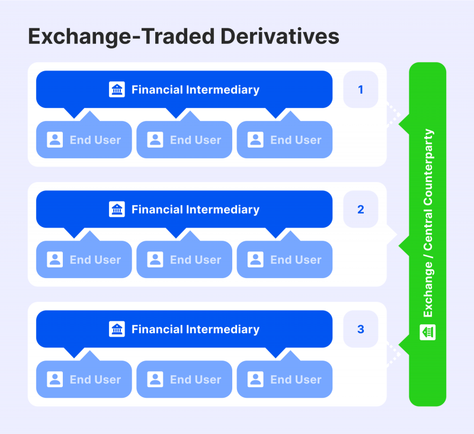

## Table of Contents

## What are exchange-traded derivatives?

Exchange-traded derivatives are financial contracts that are traded on a regulated exchange, like stocks. These derivatives get their value from an underlying asset, which could be things like commodities, currencies, or stock indexes. Because they are traded on an exchange, they have standard terms and are more transparent and safer than other types of derivatives.

People use exchange-traded derivatives for different reasons. Some use them to hedge, which means they want to protect themselves from price changes in the underlying asset. Others use them to speculate, hoping to make money from price movements. Because these derivatives are standardized and regulated, they are easier to buy and sell, making them popular among investors and traders.

## How do exchange-traded derivatives differ from over-the-counter derivatives?

Exchange-traded derivatives and over-the-counter (OTC) derivatives are two types of financial contracts, but they have some key differences. Exchange-traded derivatives are bought and sold on a regulated exchange, like the stock market. This means they have standard rules and terms that everyone follows. Because they are traded on an exchange, they are more transparent and safer. Anyone can buy or sell them as long as they have an account with a broker.

On the other hand, OTC derivatives are not traded on an exchange. Instead, they are privately negotiated between two parties, like banks or big companies. This means the terms of the contract can be customized to fit the needs of the people involved. But because they are not regulated by an exchange, they can be riskier. It's harder to know all the details and there's more chance that one party might not be able to fulfill their part of the deal.

In summary, exchange-traded derivatives offer more safety and transparency because they are standardized and regulated. OTC derivatives offer more flexibility because they can be tailored to specific needs, but they come with higher risks due to less regulation and oversight.

## What are the main types of exchange-traded derivatives?

The main types of exchange-traded derivatives are futures and options. Futures are contracts where you agree to buy or sell an asset at a set price on a future date. For example, if you think the price of oil will go up, you can buy a futures contract to buy oil later at today's price. This way, if the price does go up, you save money. Futures are used a lot by farmers and businesses to protect against price changes.

Options are another type of exchange-traded derivative. They give you the right, but not the obligation, to buy or sell an asset at a set price before a certain date. There are two kinds of options: call options and put options. A call option lets you buy the asset, while a put option lets you sell it. Options can be used for speculation, hoping to make money from price movements, or for hedging, to protect against losses. Both futures and options are popular because they are easy to trade on an exchange and help manage risk.

## How can someone start trading exchange-traded derivatives?

To start trading exchange-traded derivatives, you first need to open a brokerage account. This is like a special bank account where you can buy and sell financial products. You can find many online brokers that let you trade derivatives. When choosing a broker, look for one that is regulated and has good reviews. Once your account is set up, you'll need to add money to it. This money is called your trading capital, and you'll use it to buy derivatives.

After setting up your account and adding money, you can start trading. You'll need to learn about the different types of derivatives, like futures and options, and how they work. Many brokers offer educational resources and practice accounts where you can try trading without risking real money. Once you feel ready, you can place your first trade. Remember to start small and always be careful, as trading derivatives can be risky. Keep learning and stay updated on market news to make better trading decisions.

## What are the risks associated with trading exchange-traded derivatives?

Trading exchange-traded derivatives can be risky. One big risk is losing money. The prices of derivatives can go up and down a lot, and if you guess wrong, you could lose more than you put in. This is called leverage. It means you can control a big position with a small amount of money, but it also means your losses can be big if things go the wrong way. Another risk is market risk. This means that things outside your control, like economic news or big events, can change the price of the derivative suddenly and hurt your trade.

There's also the risk of not understanding what you're doing. Derivatives can be complicated, and if you don't know how they work, you might make bad decisions. It's important to learn a lot before you start trading. Liquidity risk is another concern. Sometimes, it can be hard to buy or sell a derivative quickly at a good price. If you need to get out of a trade fast and there's not enough trading going on, you might lose money. Lastly, there's counterparty risk, but this is smaller with exchange-traded derivatives because the exchange acts as the middleman, making sure trades are completed safely.

## What role do clearinghouses play in the trading of exchange-traded derivatives?

Clearinghouses are very important when you trade exchange-traded derivatives. They act like a middleman between buyers and sellers. When you make a trade, the clearinghouse steps in and makes sure that both sides of the deal do what they promised. This means if one person can't pay up, the clearinghouse will cover it. This makes trading safer because it reduces the chance that you'll lose money if the other person doesn't keep their end of the deal.

Clearinghouses also help keep everything organized. They keep track of all the trades and make sure everyone follows the rules. They also manage something called margin, which is like a deposit you have to put down when you trade. This margin acts as a safety net, making sure you have enough money to cover any losses. By doing all these things, clearinghouses make trading exchange-traded derivatives more reliable and less risky for everyone involved.

## How are exchange-traded derivatives priced?

Exchange-traded derivatives are priced based on the value of the underlying asset they are linked to. This could be things like stocks, commodities, or interest rates. The price of the derivative will move up and down as the price of the underlying asset changes. For example, if you have a futures contract on oil, the price of that contract will go up if the price of oil goes up. The pricing also takes into account other factors like the time until the contract expires, the expected [volatility](/wiki/volatility-trading-strategies) of the underlying asset, and current interest rates.

In addition to the underlying asset's value, the pricing of exchange-traded derivatives involves some math. For futures, the price is often set to the expected future price of the asset plus or minus costs like storage or interest. For options, pricing can get more complex. It uses models like the Black-Scholes model, which looks at things like the current price of the asset, the option's strike price, time until expiration, expected volatility, and interest rates. All these factors together help set the price that you see when you trade exchange-traded derivatives on an exchange.

## What are some common strategies used in trading exchange-traded derivatives?

When trading exchange-traded derivatives, people often use strategies like hedging and speculation. Hedging is when someone wants to protect themselves from price changes in the underlying asset. For example, a farmer might use futures contracts to lock in a price for their crops ahead of time, so they don't lose money if prices fall. This way, they can plan better and feel safer about their business. On the other hand, speculation is when traders try to make money by guessing which way prices will go. They might buy options or futures contracts hoping that the price will move in their favor, allowing them to sell at a profit.

Another common strategy is spreading, where traders take positions in two or more related derivatives to benefit from the difference in their price movements. For example, someone might buy one futures contract and sell another one that's similar but expires at a different time. This can help reduce risk because the gains from one contract might offset losses from the other. Arbitrage is another strategy, where traders look for price differences between the same asset in different markets. They buy low in one market and sell high in another, making a profit from the difference. All these strategies can help traders manage risk and potentially make money, but they also require a good understanding of the market and the derivatives being traded.

## How do regulatory frameworks impact the trading of exchange-traded derivatives?

Regulatory frameworks play a big role in how exchange-traded derivatives are traded. They help make sure that trading is fair and safe for everyone. For example, rules set by organizations like the Securities and Exchange Commission (SEC) or the Commodity Futures Trading Commission (CFTC) in the United States make sure that exchanges follow certain standards. These rules cover things like how much money you need to have in your account to trade, how trades are reported, and how to handle any problems that come up. By having these rules, regulators try to stop fraud and make sure that the market works well for everyone.

These regulations also affect how new derivatives are created and how they can be traded. Before a new derivative can be listed on an exchange, it has to meet certain requirements. This can include things like proving that there's enough interest in the derivative and showing that it's not too risky. Once a derivative is approved, the rules help make sure that trading is transparent and that everyone knows what's happening. This can make people feel more confident about trading because they know there's a system in place to protect them. Overall, regulatory frameworks are important for keeping the trading of exchange-traded derivatives safe and fair.

## What is the impact of market volatility on exchange-traded derivatives?

Market volatility can have a big impact on exchange-traded derivatives. When the market is volatile, the prices of the underlying assets, like stocks or commodities, can change a lot and very quickly. This means that the prices of the derivatives, which are linked to these assets, will also move up and down more than usual. For traders, this can be both good and bad. If they guess the right way, they can make a lot of money because the big price swings can lead to big profits. But if they guess wrong, they can lose a lot of money very quickly because the same big swings can lead to big losses.

Because of this, market volatility can make trading exchange-traded derivatives riskier. Traders need to be very careful and keep a close eye on the market. They might need to use strategies like setting stop-loss orders, which automatically sell a derivative if its price drops to a certain level, to limit their losses. Also, during times of high volatility, the demand for certain derivatives might go up as more people try to use them to protect themselves from big price changes or to take advantage of them. This can make the market even more volatile, as more trading happens and prices keep moving around.

## How do exchange-traded derivatives contribute to financial market efficiency?

Exchange-traded derivatives help make financial markets work better by letting people manage risk and set prices more accurately. When people can use derivatives like futures and options, they can protect themselves from big price changes. For example, a farmer can use a futures contract to lock in a good price for their crops, even if the market goes down later. This makes them feel safer about their business and more willing to trade. When more people trade, the market gets more active and prices become more accurate because they reflect what everyone thinks the future value will be.

Derivatives also help bring more money into the market and make it easier for people to buy and sell things. When people can use derivatives to guess about future prices, they might be more likely to invest. This can bring in more buyers and sellers, making the market more liquid. A liquid market is one where you can easily buy or sell without the price moving a lot. This helps everyone because it means they can get in and out of trades more easily, and the prices they see are more likely to be fair and accurate.

## What are the latest trends and innovations in the market for exchange-traded derivatives?

One big trend in the market for exchange-traded derivatives is the growth of electronic trading. More and more, people are using computers and the internet to trade derivatives instead of calling someone on the phone or going to a trading floor. This makes trading faster and easier. It also means that people from all over the world can trade at any time, which makes the market more active and liquid. Another trend is the use of new technology like blockchain and smart contracts. These can help make trading even safer and more transparent by keeping track of everything in a way that's hard to change or cheat.

Another innovation is the creation of new types of exchange-traded derivatives. For example, there are now derivatives that are based on things like cryptocurrencies, environmental credits, and even weather patterns. These new products let people manage risks and make investments in areas that were hard to do before. Also, there's a focus on making derivatives easier to understand and use. Exchanges are working on better education and tools to help people learn about derivatives and trade them more confidently. This can bring more people into the market and make it work better for everyone.

## References & Further Reading

[1]: Hull, J. C. (2017). ["Options, Futures, and Other Derivatives"](https://www.semanticscholar.org/paper/Options%2C-Futures%2C-and-Other-Derivatives-Hull/89bdee500c8623864fc9eb7a471546aa713acc44). Pearson.

[2]: Aldridge, I. (2013). ["High-Frequency Trading: A Practical Guide to Algorithmic Strategies and Trading Systems"](https://www.wiley.com/en-us/High+Frequency+Trading%3A+A+Practical+Guide+to+Algorithmic+Strategies+and+Trading+Systems%2C+2nd+Edition-p-9781118343500). Wiley.

[3]: Lopez de Prado, M. (2018). ["Advances in Financial Machine Learning"](https://www.amazon.com/Advances-Financial-Machine-Learning-Marcos/dp/1119482089). Wiley.

[4]: Chan, E. P. (2008). ["Quantitative Trading: How to Build Your Own Algorithmic Trading Business"](https://github.com/ftvision/quant_trading_echan_book). Wiley.

[5]: CME Group. ["Education Resources on Futures and Options"](https://www.cmegroup.com/education/brochures-and-handbooks/options-on-futures-brochure.html).

[6]: CBOE. ["Options Education"](https://www.cboe.com/education/).

[7]: Hasbrouck, J. (2007). ["Empirical Market Microstructure: The Institutions, Economics, and Econometrics of Securities Trading"](https://academic.oup.com/book/52241). Oxford University Press.