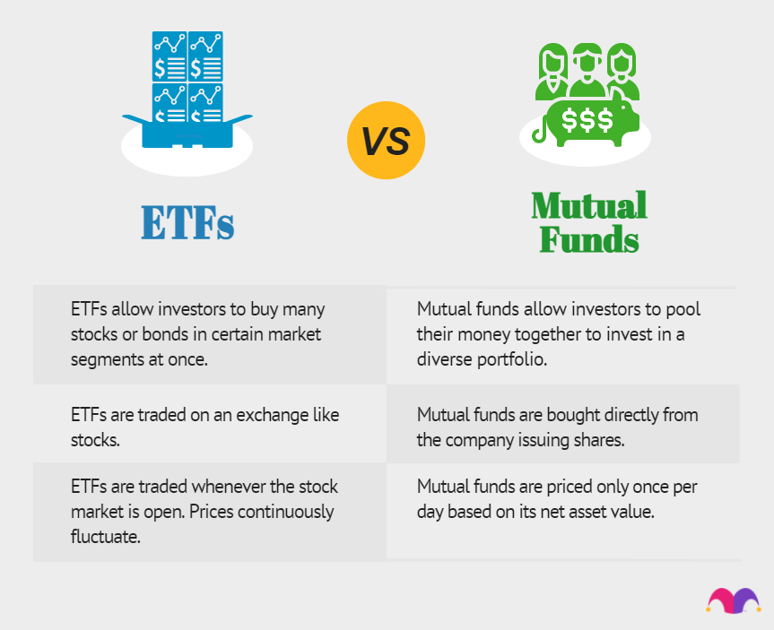

## Table of Contents

## What is an Exchange-Traded Fund (ETF)?

An Exchange-Traded Fund (ETF) is a type of investment that works a lot like a mutual fund but trades on a stock exchange like a stock. It's a basket of securities, such as stocks, bonds, or commodities, that you can buy or sell during the trading day at market prices. ETFs are popular because they offer an easy way to diversify your investments without having to buy each security individually.

ETFs can track anything from a broad market index, like the S&P 500, to a specific sector or even a single commodity. This means you can invest in a wide range of assets with just one purchase. They are also known for their low costs and tax efficiency, making them attractive to both new and experienced investors. By investing in an ETF, you can get exposure to a variety of assets, which can help spread out your risk.

## How do ETFs differ from mutual funds?

ETFs and mutual funds both let you invest in a bunch of different things at once, but they work a bit differently. ETFs trade on a stock exchange, just like individual stocks. This means you can buy or sell them anytime during the trading day at the current market price. On the other hand, mutual funds are bought or sold at the end of the day at a price that's set once, based on the total value of all the investments in the fund.

Another big difference is how they're managed and what they cost. ETFs usually have lower fees because they often just try to match the performance of an index, like the S&P 500, without a lot of buying and selling. This is called passive management. Mutual funds, though, often have a manager who picks and chooses investments, trying to beat the market. This active management can lead to higher fees. Also, because of how ETFs are structured, they can be more tax-efficient, meaning you might pay less in taxes compared to mutual funds.

## What are the benefits of investing in ETFs?

Investing in ETFs has a bunch of benefits. One big plus is that they're easy to buy and sell. Since they trade on stock exchanges just like individual stocks, you can get in or out of your investment whenever you want during the trading day. This is different from mutual funds, where you have to wait until the end of the day. ETFs also let you spread out your money across lots of different investments with just one purchase. This can help lower your risk because you're not putting all your eggs in one basket.

Another great thing about ETFs is that they often have lower fees than other types of investments. This is because many ETFs are designed to simply follow an index, like the S&P 500, without a lot of buying and selling by a manager. This "passive" approach keeps costs down, which means more of your money stays invested and working for you. Plus, ETFs tend to be more tax-efficient. This means you might pay less in taxes compared to other investments, leaving more money in your pocket over time.

## What are the risks associated with ETFs?

Investing in ETFs can be great, but there are some risks you should know about. One big risk is that the value of an [ETF](/wiki/etf-trading-strategies) can go up and down a lot, depending on what it's invested in. If the ETF follows a stock market index and the market goes down, the value of your ETF will likely go down too. This is called market risk. Also, some ETFs focus on specific sectors or regions, so if something bad happens in that area, your ETF could lose value. This is called concentration risk.

Another thing to watch out for is [liquidity](/wiki/liquidity-risk-premium) risk. This means that sometimes it can be hard to buy or sell your ETF quickly, especially if it's not very popular. If you need to sell your ETF fast and there aren't many buyers, you might have to sell it for less than you wanted. There's also something called tracking error, where an ETF doesn't follow its index as closely as it should. This can happen because of fees or how the ETF is managed, and it can affect your returns.

Lastly, while ETFs often have lower fees, those fees can still add up over time and eat into your returns. Plus, if you're investing in ETFs that use more complex strategies, like leveraged or inverse ETFs, the risks can be even higher. These types of ETFs aim to give you bigger gains, but they can also lead to bigger losses. So, it's important to understand what you're investing in and how it might affect your money.

## How can beginners start investing in ETFs?

If you're new to investing, getting started with ETFs is pretty easy. First, you need to open a brokerage account. You can do this online with many different companies. Once your account is set up, you can start looking for ETFs to buy. There are lots of them out there, so you might want to start with ones that track big indexes like the S&P 500. These are often a good choice for beginners because they spread your money across many different companies, which can help lower your risk.

After you've picked an ETF, you can place an order to buy it through your brokerage account. You can decide how much money you want to invest and then buy the ETF just like you would buy a stock. It's a good idea to keep an eye on your investment and maybe add more money over time. Remember, investing is a long-term thing, so don't worry too much about short-term ups and downs. Just keep learning and stay patient, and you'll be on your way to building your investment portfolio.

## What are the different types of ETFs available in the market?

There are many different types of ETFs out there, each designed to help you invest in different ways. Some ETFs track broad market indexes, like the S&P 500 or the Dow Jones Industrial Average. These are called index ETFs, and they give you a piece of the overall market. There are also sector ETFs, which focus on specific parts of the economy, like technology or health care. If you're interested in a certain industry, these can be a good choice. Another type is commodity ETFs, which let you invest in things like gold, oil, or agricultural products without actually buying them.

Then there are ETFs that focus on different countries or regions, called international ETFs. These can help you spread your money around the world, which can be a good way to diversify your investments. There are also bond ETFs, which invest in different types of bonds, like government or corporate bonds. These can be a bit safer than stock ETFs and can provide regular income. Lastly, there are more complex ETFs like leveraged and inverse ETFs. These aim to give you bigger gains (or losses) by using financial strategies that can make their performance go up or down faster than the market. They're riskier, so they're usually better for more experienced investors.

## How do you choose the right ETF for your investment goals?

Choosing the right ETF for your investment goals starts with understanding what you want to achieve. Are you looking to grow your money over the long term, or do you need regular income? If you're aiming for growth, you might want to look at ETFs that track broad market indexes like the S&P 500. These ETFs give you a piece of the overall market and can help your money grow over time. If you need income, bond ETFs could be a good choice because they often pay out interest regularly. Also, think about how much risk you're comfortable with. If you don't want to take big risks, ETFs that spread your money across lots of different companies or sectors might be best for you.

Next, consider the costs and how well the ETF matches its index. ETFs usually have lower fees than other types of investments, but it's still a good idea to compare the expense ratios of different ETFs. Lower fees mean more of your money stays invested and working for you. Also, check how closely the ETF follows its index. This is called the tracking error, and a lower tracking error means the ETF is doing a better job of matching the performance of its index. Finally, think about how easy it is to buy and sell the ETF. Some ETFs are more popular and have more buyers and sellers, which can make it easier to trade them when you need to. By keeping these things in mind, you can pick an ETF that fits your goals and helps you build your investment portfolio.

## What are the costs associated with trading ETFs?

When you trade ETFs, there are a few costs you need to know about. One big cost is the expense ratio, which is a yearly fee that the ETF charges to cover its operating costs. This fee is a percentage of your investment, so if you have $1,000 in an ETF with a 0.10% expense ratio, you'll pay $1 every year. ETFs usually have lower expense ratios than other types of investments, but it's still a good idea to compare them and pick one with a lower fee to keep more of your money working for you.

Another cost is the trading commission, which is what your broker charges you every time you buy or sell an ETF. Some brokers offer commission-free trading for certain ETFs, which can save you money. But if you have to pay a commission, it can add up, especially if you trade a lot. Also, there might be a bid-ask spread, which is the difference between the price someone is willing to pay for the ETF and the price someone is willing to sell it for. This spread can be small or big, depending on how popular the ETF is, and it's another cost to think about when you're trading ETFs.

## How does ETF trading impact the market?

When people trade ETFs, it can affect the whole market. ETFs are made up of lots of different investments, like stocks or bonds. When someone buys or sells an ETF, it can cause the price of those investments to go up or down. For example, if lots of people want to buy an ETF that follows the S&P 500, the demand for the stocks in that index might go up, pushing their prices higher. On the other hand, if lots of people want to sell that ETF, it could push the prices of those stocks down. This is because ETFs make it easy for big amounts of money to move quickly, which can shake things up in the market.

ETFs can also help make the market more stable. They let investors spread their money across lots of different investments, which can lower the risk of big losses. When the market gets rocky, ETFs can help keep things calm because they make it easier for people to buy and sell investments without causing big price swings. But sometimes, if too many people are trading ETFs at the same time, it can make the market more volatile. So, ETFs can have both good and bad effects on the market, depending on how people use them.

## What are some advanced strategies for ETF investing?

If you're looking to get a bit more advanced with your ETF investing, one strategy you can use is called sector rotation. This means you move your money into different sectors of the economy at different times, based on what's doing well or what you think will do well soon. For example, if you think technology stocks are going to do better than other sectors, you might put more of your money into a tech ETF. This can help you make the most of the ups and downs in different parts of the market. But remember, it takes some work to keep an eye on the economy and figure out where to put your money next.

Another advanced strategy is using leveraged or inverse ETFs. These ETFs aim to give you bigger gains or losses than the market, which can be exciting but also risky. A leveraged ETF tries to make your money grow faster by using financial tricks to double or even triple the daily performance of an index. An inverse ETF, on the other hand, goes up when the market goes down, which can be a way to make money in a falling market. These types of ETFs are usually for more experienced investors because they can be hard to understand and can lead to big losses if you're not careful. Always do your homework and think about how much risk you're okay with before trying these strategies.

## How do ETFs fit into a diversified investment portfolio?

ETFs can be a great way to make your investment portfolio more diverse. When you buy an ETF, you're not just investing in one company or one type of investment. Instead, you're getting a piece of a whole bunch of different investments all at once. This can help spread out your risk because if one investment doesn't do well, the others might still be doing okay. For example, if you buy an ETF that follows the S&P 500, you're investing in 500 big companies all at once. This way, your money isn't tied to just one company's success or failure.

Adding ETFs to your portfolio can also help you invest in different parts of the market or different types of investments without having to buy each one separately. You can use ETFs to invest in stocks, bonds, commodities, or even specific sectors or countries. This means you can build a well-rounded portfolio that covers a lot of ground. By mixing ETFs that focus on different things, like a stock ETF, a bond ETF, and maybe an international ETF, you can make sure your investments are spread out and less likely to be hurt by problems in just one area.

## What are the tax implications of investing in ETFs?

When you invest in ETFs, you need to think about how they might affect your taxes. One good thing about ETFs is that they can be more tax-efficient than other types of investments like mutual funds. This is because of how they're structured. ETFs usually don't have to sell their investments as often, which means they don't create as many capital gains that you have to pay taxes on. So, if you're holding onto your ETFs for a long time, you might not have to pay as much in taxes each year.

But there are still some tax things to keep in mind. If you sell your ETF for more than you paid for it, you'll have to pay capital gains tax on the profit. How much tax you pay depends on how long you held the ETF. If you held it for more than a year, you'll pay a lower long-term capital gains tax rate. If you held it for less than a year, you'll pay a higher short-term capital gains tax rate, which is the same as your regular income tax rate. Also, if the ETF pays out dividends, you'll have to pay taxes on those too. So, it's a good idea to think about these tax rules when you're planning your investments.

## References & Further Reading

[1]: Bergstra, J., Bardenet, R., Bengio, Y., & Kégl, B. (2011). ["Algorithms for Hyper-Parameter Optimization."](https://proceedings.neurips.cc/paper/2011/file/86e8f7ab32cfd12577bc2619bc635690-Paper.pdf) Advances in Neural Information Processing Systems 24.

[2]: ["Advances in Financial Machine Learning"](https://www.amazon.com/Advances-Financial-Machine-Learning-Marcos/dp/1119482089) by Marcos Lopez de Prado

[3]: ["Evidence-Based Technical Analysis: Applying the Scientific Method and Statistical Inference to Trading Signals"](https://www.amazon.com/Evidence-Based-Technical-Analysis-Scientific-Statistical/dp/0470008741) by David Aronson

[4]: ["Machine Learning for Algorithmic Trading"](https://github.com/PacktPublishing/Machine-Learning-for-Algorithmic-Trading-Second-Edition) by Stefan Jansen

[5]: ["Quantitative Trading: How to Build Your Own Algorithmic Trading Business"](https://books.google.com/books/about/Quantitative_Trading.html?id=j70yEAAAQBAJ) by Ernest P. Chan