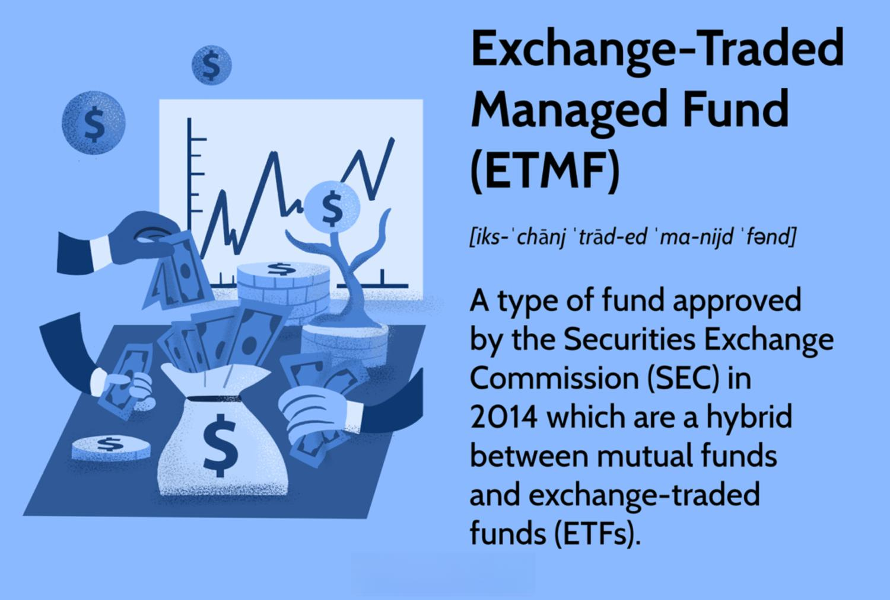

The modern landscape of investment options is characterized by a diverse array of vehicles that cater to varying risk appetites and financial goals. Among these, Exchange-Traded Funds (ETFs) have emerged as a significant component, offering investors an efficient means to achieve diversification and potentially higher returns. ETFs function as pooled investment securities that track indices, commodities, or sectors, providing exposure to a specific market or asset class without requiring the purchase of individual assets. This has contributed to their growing popularity, as they enable investors to build diversified portfolios with relative ease.

A major factor driving the interest in ETFs is the current low-interest-rate environment, which has rendered traditional savings accounts less appealing. Historically, savings accounts have been favored for their safety and liquidity, but the returns they offer are typically low and often fail to keep pace with inflation. This scenario has encouraged investors to seek alternatives that offer better growth potential, with ETFs standing out as a viable option due to their cost-effectiveness and flexibility.



In parallel with the rise of ETFs, algorithmic trading has gained traction as a tool for optimizing investment strategies. Algorithmic trading involves using computer algorithms to execute trades at speeds and frequencies beyond human capability, thus enhancing the efficiency of trading operations. This technique can be particularly beneficial in the context of ETF investments, where timing and precision are crucial. Algorithmic trading can optimize trade execution, improve portfolio rebalancing, and minimize transaction costs, providing retail and institutional investors with the means to enhance returns and manage risks more effectively.

The convergence of ETFs and algorithmic trading represents a novel approach to investment management, offering innovative solutions for contemporary financial challenges. This article aims to explore the potential of ETFs as alternatives to traditional savings accounts, examining their advantages and limitations while highlighting the synergistic role of algorithmic trading in maximizing their benefits. Through this analysis, investors can better understand how to leverage these modern tools to meet their financial objectives amidst the evolving economic landscape.

## Table of Contents

## Understanding Exchange-Traded Funds (ETFs)

Exchange-Traded Funds (ETFs) represent a significant innovation in the investment landscape, providing access to a diverse range of assets through a single, tradable security. ETFs function by pooling capital from multiple investors to purchase a portfolio of assets, such as stocks, bonds, or commodities. These funds are designed to track the performance of a specific index or benchmark, and shares of these funds are traded on major stock exchanges, similar to individual stocks.

The diversity of ETFs is vast, catering to a wide range of investment preferences and strategies. Broadly categorized, ETFs include sector ETFs, which focus on specific industries like technology or healthcare; bond ETFs, which consist of fixed-income securities; and broad index ETFs, which aim to replicate major market indices such as the S&P 500 or the MSCI World Index. Additionally, there are more specialized ETFs, such as commodity ETFs, designed to invest in physical commodities like gold or oil, and thematic ETFs, focusing on trends such as clean energy or [artificial intelligence](/wiki/ai-artificial-intelligence).

One of the primary advantages of investing in ETFs is their [liquidity](/wiki/liquidity-risk-premium). Because ETFs are traded on exchanges, they can be bought or sold at market prices throughout the trading day, offering flexibility and ease for investors. This characteristic also contributes to their transparency, as [ETF](/wiki/etf-trading-strategies) holdings are typically disclosed on a daily basis. Another benefit is diversification, as ETFs allow investors to gain exposure to a broad array of assets, reducing the risk associated with individual securities. This diversification is often achieved at a lower cost compared to mutual funds, as ETFs tend to have lower management fees and expenses due to their passive nature and the economies of scale they benefit from.

Despite these advantages, there are common misconceptions and risks associated with ETF investments. One misconception is that all ETFs are low-risk, which is not necessarily true; the risk profile of an ETF depends on the underlying assets it holds. Furthermore, while liquidity is an advantage, it can also pose a risk in volatile markets where bid-ask spreads might widen significantly, affecting the price at which shares can be traded. Another risk includes tracking errors, where the ETF does not perfectly replicate the performance of its benchmark index due to various factors, including fees and changes in the underlying market.

In conclusion, ETFs offer a versatile and efficient means of investment, providing access to a diverse selection of assets with notable advantages such as liquidity, diversification, and cost-effectiveness. However, investors must be mindful of the specific characteristics and risks associated with each ETF to optimize their investment strategies.

## Traditional Savings Accounts: Pros and Cons

Traditional savings accounts have long been a fundamental component of personal finance, providing a secure and easily accessible way to store money. Historically, these accounts gained popularity due to the combination of stability, regulatory protection, and minimal risk of loss. Underpinning their appeal is the safety assured by governmental insurance schemes, such as the Federal Deposit Insurance Corporation (FDIC) in the United States, which guarantees deposits up to a certain limit.

**Benefits: Safety, Ease of Use, and Liquidity**

The primary advantages of traditional savings accounts include safety, ease of use, and liquidity. Safety is paramount, as deposits in these accounts are typically insured by government entities, providing a guarantee against loss up to a specified amount. This security makes savings accounts an attractive option for risk-averse individuals. Moreover, these accounts offer simplicity in terms of account management and transactions. Users can easily deposit and withdraw funds, often without facing complex financial barriers or encountering transactional fees. Liquidity is another crucial benefit, as savings accounts enable depositors to access their funds quickly when needed, thus offering financial flexibility for unforeseen expenses or emergencies.

**Drawbacks: Low Returns Amid Inflationary Pressures**

Despite their safety and accessibility, traditional savings accounts are not without drawbacks, primarily concerning low returns. Interest rates on these accounts tend to be significantly lower than potential earnings available through other investment vehicles. For example, in recent low-interest-rate environments, returns from savings accounts often fail to outpace inflation, meaning account holders could experience a reduction in purchasing power over time. The real [interest rate](/wiki/interest-rate-trading-strategies), which is the nominal interest rate adjusted for inflation, can sometimes be negative, leading to a loss in the real value of saved funds. This situation presents a challenge for those seeking to grow their wealth over the long term.

**Comparison with Market-Based Alternatives like ETFs**

When considering long-term savings growth, traditional savings accounts may fall short compared to market-based alternatives like Exchange-Traded Funds (ETFs). While savings accounts provide a fixed and predictable return, the interest earned is generally lower than the potential gains from market-based investments. ETFs, which typically have higher risk exposure, offer the possibility of substantially greater returns due to their market-linked nature. For instance, while the average annual return on savings accounts might linger around 0.5% in certain economic climates, the historical average annual return of stock market-linked ETFs can range from 7% to 10%, depending on market conditions.

In conclusion, while traditional savings accounts offer unparalleled safety and liquidity advantages, they may not be the most efficient means for individuals seeking appreciable growth in their savings. The decision between maintaining a traditional savings account and investing in alternatives such as ETFs should be informed by an individual's risk tolerance, financial goals, and the current economic landscape.

## The Role of Algorithmic Trading in ETF Investment

Algorithmic trading has become a prominent feature in modern financial markets, driven by technological advancements and the need for efficiency and speed in executing trades. It involves the use of complex mathematical models and automated systems to make trading decisions, typically at a speed and frequency that is impossible for human traders to mimic. This technological shift has found significant application in the trading of Exchange-Traded Funds (ETFs), providing a robust toolset for optimizing investment strategies.

The core advantage of [algorithmic trading](/wiki/algorithmic-trading) lies in its ability to process vast amounts of data and execute trades at optimal prices, reducing transaction costs and mitigating human error. By pre-programming trading rules based on various market indicators, algorithms can identify and capitalize on market inefficiencies with precision. This capability is particularly beneficial in the ETF market, where algorithmic models can be used to track specific indices, sectors, or commodities, ensuring that an investor's portfolio is aligned with their strategic objectives.

For retail investors, the advent of algorithmic trading has opened doors previously accessible only to institutional players. Advances in technology, such as user-friendly trading platforms and API-based solutions, have democratized access to algorithmic trading. Platforms like QuantConnect, Alpaca, and TradeStation offer tools that allow individuals to develop, backtest, and deploy their trading algorithms on real-world markets. These platforms often support various programming languages, with Python being a popular choice due to its robust libraries for data analysis and [machine learning](/wiki/machine-learning), such as Pandas and NumPy.

Below is an example of a basic Python algorithm using the `pandas` and `numpy` libraries to implement a simple moving average crossover strategy for an ETF:

```python
import pandas as pd
import numpy as np

# Load ETF data
data = pd.read_csv('etf_data.csv')
data['Date'] = pd.to_datetime(data['Date'])

# Calculate moving averages
data['SMA20'] = data['Close'].rolling(window=20).mean()
data['SMA50'] = data['Close'].rolling(window=50).mean()

# Generate signals
data['Signal'] = 0
data['Signal'][20:] = np.where(data['SMA20'][20:] > data['SMA50'][20:], 1, -1)

# Calculate daily returns
data['Returns'] = data['Close'].pct_change()

# Compute strategy returns
data['Strategy'] = data['Signal'].shift(1) * data['Returns']

# Output strategy performance
cumulative_strategy_return = (data['Strategy'] + 1).cumprod()
print(f"Cumulative Strategy Return: {cumulative_strategy_return[-1]}")
```

This code provides an example of how retail investors can employ algorithmic trading to potentially enhance ETF investment returns through systematic data analysis and automated trading strategies. As algorithmic trading tools and platforms become increasingly accessible, retail investors can leverage these advancements to optimize their portfolios, upholding the principle of diversification while adapting to market conditions swiftly.

To capitalize on the full potential of algorithmic trading in ETFs, investors should stay informed about continuous technological advancements and consider the implications of market data, regulatory changes, and strategic adaptability. As the financial landscape evolves, the integration of algorithmic trading stands as a critical complement to traditional investment methodologies, further bridging the gap between institutional and individual investors in managing ETF investments efficiently.

## ETFs as a Viable Alternative to Savings Accounts

Exchange-Traded Funds (ETFs) have gained prominence as a viable alternative to traditional savings accounts, primarily due to their potential for higher returns. Savings accounts, while offering safety and liquidity, typically provide minimal interest rates, often failing to outpace inflation. Consequently, savvy investors are increasingly exploring ETFs, which offer diversified exposure to various asset classes, including equities, bonds, and commodities.

ETFs and the Risk-Reward Ratio:

ETFs present a different risk-reward profile compared to savings accounts. Unlike the guaranteed returns and government insurance (up to a certain limit) associated with savings accounts, ETFs are subject to market fluctuations. While this introduces a higher level of risk, it also allows the possibility of greater returns, especially over longer investment horizons. The risk-reward ratio can be analyzed through metrics such as the Sharpe Ratio, which measures the excess return per unit of risk. A higher Sharpe Ratio indicates a more attractive risk-adjusted return.

```python
def sharpe_ratio(returns, risk_free_rate):
    excess_return = returns.mean() - risk_free_rate
    return excess_return / returns.std()
```

Time Horizon and Financial Goals:

The decision to invest in ETFs rather than use savings accounts should align with the investor's time horizon and financial goals. Investors with longer time horizons can afford to weather short-term market [volatility](/wiki/volatility-trading-strategies), potentially benefiting from the capital growth that ETFs can provide. On the other hand, short-term financial goals may be better served by the stability and certainty of savings accounts. Therefore, understanding one's investment timeline and risk tolerance is crucial when considering ETFs as a savings alternative.

Successful ETF-Based Savings Strategies:

Numerous strategies have demonstrated the efficacy of using ETFs for savings growth. One such example is the dollar-cost averaging strategy, where an investor consistently invests a fixed amount in ETFs over time. This approach reduces the impact of market volatility by spreading out the investment entries, allowing the investor to purchase more shares when prices are low and fewer when prices are high. Historical data suggest that this method can smooth out market fluctuations and lead to substantial returns over the long term.

Another successful strategy involves investing in broad market index ETFs, such as those tracking the S&P 500, which have historically delivered robust returns over extended periods. According to historical market performance, the S&P 500 has averaged annual returns of about 7-10% after inflation adjustments, significantly outperforming typical savings account interest rates.

In summary, while ETFs introduce a level of risk absent in traditional savings accounts, they offer a compelling opportunity for greater returns, especially for investors with appropriate time horizons and clear financial objectives. By employing strategic investment approaches like dollar-cost averaging and broad market exposure, ETFs can serve as a potent tool for long-term wealth accumulation, challenging the conventional reliance on savings accounts.

## Building a Balanced Portfolio with ETFs and Algo Trading

Building a balanced portfolio using Exchange-Traded Funds (ETFs) and algorithmic trading involves strategic diversification and technology-driven decision-making. This approach merges the benefits of broad market exposure provided by ETFs with the precision and efficiency of algorithmic trading tools.

### Diversified Portfolio Suggestions with ETFs

A well-diversified portfolio minimizes risk by investing across various asset classes. ETFs naturally lend themselves to diversification, given their ability to span different sectors, geographies, and asset types. To construct a balanced portfolio, consider incorporating:

1. **Broad Market ETFs**: These track major indices like the S&P 500 or MSCI World, offering comprehensive market exposure.
2. **Sector-Specific ETFs**: Allocate investments in specific sectors such as technology, healthcare, or energy, to capitalize on industry trends.
3. **Bond ETFs**: Include government or corporate bond ETFs to add stability and generate income through interest.
4. **International ETFs**: Gain exposure to foreign markets, thus reducing the risk associated with domestic market fluctuations.

### Balancing Growth and Risk with Algorithmic Trading

Algorithmic trading enhances portfolio management by utilizing automated processes for rebalancing and asset allocation. Key strategies include:

- **Automated Rebalancing**: This process ensures that asset allocations remain aligned with the investor's risk tolerance and financial goals. Algorithms can be programmed to rebalance portfolios periodically or when certain thresholds are crossed.

```python
def rebalance_portfolio(portfolio, target_allocations):
    total_value = sum(portfolio.values())
    for asset, target in target_allocations.items():
        current_value = portfolio.get(asset, 0)
        target_value = total_value * target
        if abs(current_value - target_value) / total_value > 0.05:  # 5% threshold
            # Execute trade to rebalance
            pass
    return portfolio
```

- **Tactical Asset Allocation**: Utilize algorithms to shift asset distribution tactically based on market conditions. Algorithms can rapidly process immense datasets, identifying trends and executing trades faster than manual methods.

### Integration of Market Data and Predictive Analytics

Integrating real-time market data and predictive analytics into trading systems enhances decision-making. Algorithms can analyze historical data to forecast price movements or identify investment opportunities. Machine learning techniques, such as regression analysis or neural networks, can predict trends and optimize ETF selections.

```python
# Example using Python's sklearn for predictive analytics
from sklearn.linear_model import LinearRegression
import numpy as np

# Historical data example
X = np.array([[1], [2], [3], [4]])
y = np.array([1.1, 1.9, 3.0, 4.2])

model = LinearRegression().fit(X, y)
trend_prediction = model.predict(np.array([[5]]))
```

### Tips for Beginners in Algorithmic ETF Trading

1. **Start Small**: Begin with a limited budget until you become comfortable with the trading process and algorithms.
2. **Educate Yourself**: Utilize online resources, courses, and financial news to familiarize yourself with ETFs and algorithmic trading concepts.
3. **Use Demo Accounts**: Test strategies in simulated environments provided by broker platforms to understand market dynamics without financial risk.
4. **Choose Reliable Platforms**: Select platforms that offer robust tools for algorithmic trading, like TradeStation or Interactive Brokers.

Constructing a balanced portfolio with ETFs and algorithmic trading involves careful strategy and continuous learning. By integrating technology and market insights, investors can optimize their portfolios for both growth and risk management.

## Conclusion

Exchange-Traded Funds (ETFs) combined with algorithmic trading present a compelling alternative to traditional savings accounts, particularly in today's low-interest-rate environment. ETFs offer greater potential returns, liquidity, and diversification, traits that are particularly appealing given the limitations of conventional savings avenues. While traditional savings accounts prioritize safety and accessibility, their returns are often outpaced by inflation, diminishing real earnings over time.

Algorithmic trading enhances the investment potential of ETFs by leveraging advanced mathematical models and computational algorithms to maximize returns. This technology-driven approach facilitates strategic, data-informed decisions that can offer significant advantages over manual trading, including efficiency, speed, and precision. Retail investors can now access tools and platforms that were once exclusive to institutional players, enabling them to partake in sophisticated trading strategies.

Despite their advantages, investing in ETFs accompanied by algorithmic trading demands a thorough understanding of risk tolerance and investment goals. Investors must weigh the risk-return profile of ETFs against the stable, albeit lower, yields of savings accounts. It's imperative to align the investment strategy with one's financial timeline and objectives.

Staying informed about market trends and technological advancements is crucial as the landscape of personal finance management continues to evolve. Innovations in trading technology and the growing complexity of financial markets propel ongoing changes in investment strategies. By being well-informed, investors can better navigate these developments and optimize their portfolios accordingly.

As personal finance management continues to advance with ETFs and algorithmic trading, it is essential to [carry](/wiki/carry-trading) out comprehensive research, reflect on personal financial objectives, and stay updated with current market trends. This proactive approach will enhance one's ability to make educated investment decisions, ultimately shaping a future where personalized, tech-driven investment strategies play a pivotal role in achieving financial goals.

## Call to Action

As you venture into the dynamic world of ETFs and algorithmic trading, consider exploring various brokerage options that offer robust platforms and tools tailored for these investment strategies. A diversified choice of brokerages can provide specialized features ranging from low-cost trading to advanced analytical capabilities, crucial for optimizing your ETF investment journey.

Engaging with a financial advisor can significantly enhance your investment approach. These professionals can help tailor strategies that align with your specific financial goals and risk tolerance. By leveraging their expertise, you can navigate the complexities of ETF investments and algorithmic trading more effectively, ensuring a pathway that harmonizes with your long-term objectives.

Staying informed is key to successful investing. Consider subscribing to newsletters or following resources dedicated to the latest developments in ETF markets and algorithmic trading. This ensures you are updated with cutting-edge trends, regulatory changes, and innovative strategies that could potentially impact your investment portfolio. 

Lastly, share this article on social media platforms to initiate conversations and exchange insights with fellow investors. Such interactions can provide diverse perspectives and foster a collaborative learning environment, enriching your understanding and strategic approach toward ETFs and algorithmic trading. Engaging with a community of like-minded individuals can offer support and inspiration as you refine your personal finance management strategies.

## References & Further Reading

[1]: Kosev, M., & Williams, T. (2011). ["Exchange-Traded Funds."](https://www.rba.gov.au/publications/bulletin/2011/mar/pdf/bu-0311-8.pdf) Reserve Bank of Australia Bulletin, December Quarter.

[2]: ["A Comprehensive Guide to Exchange-Traded Funds (ETFs)"](https://rpc.cfainstitute.org/en/research/foundation/2015/a-comprehensive-guide-to-exchange-traded-funds-etfs) - CFA Institute

[3]: Engle, R., & Sarkar, D. (2006). ["Premiums-Discounts and Exchange Traded Funds"](https://www.semanticscholar.org/paper/Premiums-Discounts-and-Exchange-Traded-Funds-Engle-Sarkar/dd9001d2ccfc83163b35d7d40c7750e238a47c1f). The Journal of Derivatives.

[4]: Hasbrouck, J. (2003). ["Intraday Price Formation in U.S. Equity Index Markets"](https://onlinelibrary.wiley.com/doi/10.1046/j.1540-6261.2003.00609.x) The Journal of Finance, 58(6), 2375-2400.

[5]: Nathan, A. (2013) ["Algorithms in Trading: Optimizing Performance with Computation"](https://www.wallstreetzen.com/blog/what-is-algorithmic-trading/) MIT Press.

[6]: ["The Intelligent Investor: The Definitive Book on Value Investing"](https://www.amazon.com/Intelligent-Investor-Definitive-Investing-Essentials/dp/0060555661) by Benjamin Graham

[7]: López de Prado, M. (2018). ["Advances in Financial Machine Learning"](https://www.amazon.com/Advances-Financial-Machine-Learning-Marcos/dp/1119482089) Wiley & Sons.

[8]: Poterba, J., & Shoven, J. (2002). ["Exchange-Traded Funds: A New Investment Option for Taxable Investors"](https://www.nber.org/papers/w8781) National Bureau of Economic Research Working Paper No. 8781.