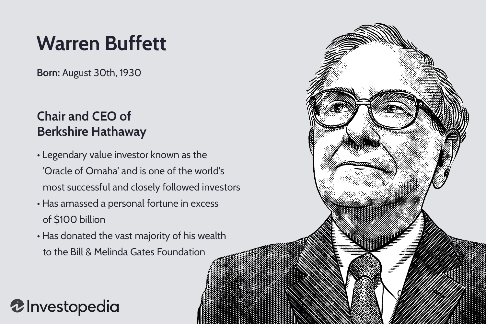

## Table of Contents

## What are Exchange-Traded Funds (ETFs)?

Exchange-Traded Funds, or ETFs, are a type of investment that combines the benefits of stocks and mutual funds. They are baskets of securities, like stocks, bonds, or commodities, that you can buy and sell on a stock exchange, just like individual stocks. This means you can trade them throughout the day at market prices, unlike mutual funds which are only traded once a day after the market closes.

ETFs are popular because they offer a way to diversify your investments easily and at a lower cost than buying many individual stocks. For example, if you want to invest in the technology sector, you can buy an ETF that holds a variety of tech company stocks. This spreads out your risk compared to putting all your money into one company. Plus, ETFs often have lower fees than mutual funds, making them an attractive option for many investors.

## Who is Warren Buffett and why is his investment strategy influential?

Warren Buffett is a very famous investor and businessman. He was born in 1930 and is known as the "Oracle of Omaha" because he lives in Omaha, Nebraska. He started investing when he was very young and became very rich by buying and holding onto good companies for a long time. He runs a company called Berkshire Hathaway, which owns many different businesses and investments.

Buffett's investment strategy is influential because it is simple and works well over time. He believes in buying good companies at fair prices and holding onto them forever. This is called "value investing." He looks for companies that have strong businesses, make a lot of money, and are run by honest people. Many people follow his strategy because it has made him one of the richest people in the world, and it shows that you don't need to do complicated things to be successful in investing. His approach encourages patience and long-term thinking, which is different from trying to make quick money by trading a lot.

## What are the key principles of Warren Buffett's investment strategy?

Warren Buffett's investment strategy is based on the idea of value investing. This means he looks for companies that are good businesses but are selling for less than they are really worth. He believes in buying these companies at a fair price and holding onto them for a long time. He thinks that if you buy a great company, it will keep making money and growing, and your investment will become more valuable over time. He doesn't like to trade a lot or try to predict the ups and downs of the stock market. Instead, he focuses on the quality of the business and its long-term potential.

Another important part of Buffett's strategy is understanding the business you are investing in. He only buys companies that he understands well. This means he reads a lot about the company, its industry, and how it makes money. He also looks for companies run by honest and smart people, because he knows that good management can make a big difference. Buffett believes that if you don't understand a business, you shouldn't invest in it, no matter how good it might seem.

Lastly, Buffett is known for his patience. He is willing to wait for the right opportunity to buy a good company at the right price. He doesn't rush into investments just because everyone else is doing it. This patience has helped him avoid many bad investments and focus on the ones that really matter. His approach shows that successful investing is about being smart, patient, and sticking to what you know.

## How can ETFs be used to mimic Warren Buffett's investment strategy?

ETFs can be a good way to follow Warren Buffett's investment strategy because they let you buy a bunch of good companies at once. Buffett likes to buy companies that are undervalued and hold them for a long time. You can find ETFs that focus on value investing, which means they pick companies that are good but not too expensive. By buying these ETFs, you can spread your money across many companies that fit Buffett's idea of a good investment. This way, you don't have to pick individual stocks, which can be hard, but you still get to invest in the same kind of companies Buffett likes.

Another way ETFs can help you mimic Buffett's strategy is by letting you invest in sectors or industries that he likes. For example, Buffett has often invested in companies in the financial sector or in consumer goods. There are ETFs that focus on these areas, so you can buy them and get exposure to the same kinds of businesses Buffett invests in. This makes it easier to follow his strategy without having to do a lot of research on individual companies. By using ETFs, you can build a portfolio that reflects Buffett's long-term, value-focused approach to investing.

## What are some ETFs that specifically aim to reflect Warren Buffett's portfolio?

Some ETFs that aim to reflect Warren Buffett's portfolio are designed to mimic the holdings of his company, Berkshire Hathaway. One such [ETF](/wiki/etf-trading-strategies) is the iShares U.S. Home Construction ETF (ITB). This ETF focuses on the home construction industry, which is an area where Buffett has invested through companies like Clayton Homes. By investing in ITB, you can get exposure to a sector that Buffett believes in without having to buy individual stocks.

Another ETF that tries to follow Buffett's strategy is the SPDR S&P 500 ETF Trust (SPY). This ETF tracks the S&P 500, which is a broad market index. Buffett has said that a low-cost S&P 500 index fund is a good choice for most investors. By buying SPY, you can invest in a diversified portfolio of large U.S. companies, which is similar to how Buffett thinks about long-term investing. These ETFs make it easier for regular investors to follow Buffett's approach without having to pick individual stocks or manage a complex portfolio.

## What are the advantages of investing in ETFs that follow Warren Buffett's strategy?

Investing in ETFs that follow Warren Buffett's strategy can make it easier for you to invest like him without needing to do a lot of research on individual companies. These ETFs pick stocks that are good value and hold them for a long time, just like Buffett does. By buying these ETFs, you can spread your money across many different companies that are undervalued, which is what Buffett looks for. This way, you don't have to worry about [picking](/wiki/asset-class-picking) the right stocks yourself, but you still get to invest in the same kinds of businesses that Buffett believes in.

Another advantage is that these ETFs can help you invest in specific sectors that Buffett likes, like home construction or the overall U.S. market. For example, if you buy an ETF like the iShares U.S. Home Construction ETF, you're investing in a sector that Buffett has shown interest in. Or, if you choose an S&P 500 ETF, you're following Buffett's advice to invest in a broad, diversified index. These ETFs often have lower fees than actively managed funds, which means you get to keep more of your money while still following a successful investment strategy.

## What are the potential risks and drawbacks of using ETFs to replicate Buffett's strategy?

One risk of using ETFs to copy Warren Buffett's strategy is that ETFs might not exactly match what Buffett does. ETFs are made up of many stocks, and they might include some that Buffett wouldn't pick himself. Also, ETFs have to follow certain rules about what they can buy and sell, which means they might not be able to hold onto stocks for as long as Buffett would. This can make the performance of the ETF different from what Buffett might achieve with his own picks.

Another drawback is that ETFs can be affected by market trends and other investors' actions. If a lot of people start buying or selling the ETF, it can cause the price to go up or down quickly. This might not fit with Buffett's long-term approach, where he doesn't worry about short-term price changes. Also, while ETFs can be a good way to diversify your investments, they still come with fees, and over time, these fees can eat into your returns, even if the ETF is trying to follow a successful strategy like Buffett's.

## How do the performance metrics of Buffett-focused ETFs compare to the broader market?

ETFs that try to follow Warren Buffett's strategy often do well, but they don't always beat the broader market. For example, an ETF like the iShares U.S. Home Construction ETF might do better than the market when the housing industry is doing well, but it could lag behind if the industry struggles. The SPDR S&P 500 ETF Trust, which tracks the S&P 500, usually performs very close to the market because it's designed to mimic it. This means if the market goes up, the ETF goes up, and if the market goes down, the ETF goes down too. Over the long term, these ETFs can be a good way to invest, but they won't always do better than the market as a whole.

Another thing to think about is that Buffett's own portfolio, managed through Berkshire Hathaway, often does better than the market. This is because Buffett picks specific stocks and holds them for a long time, and he's very good at it. ETFs that try to copy his strategy can't do exactly what he does, so their performance might not be as good. Also, ETFs have fees that can reduce your returns over time. So, while these ETFs can be a good way to invest like Buffett, they might not give you the same great results he gets because they have to follow different rules and they come with costs.

## What role do sector-specific ETFs play in a portfolio designed to mirror Buffett's approach?

Sector-specific ETFs can be a useful part of a portfolio that tries to copy Warren Buffett's way of investing. Buffett often picks companies in certain industries that he believes will do well over time. By using ETFs that focus on these sectors, like home construction or financial services, you can invest in the same kinds of businesses that Buffett likes without having to choose individual stocks. This makes it easier to follow his strategy and still spread your money across many companies in the sector, which can lower your risk.

However, using sector-specific ETFs also means your portfolio might not do as well as Buffett's. These ETFs have to follow certain rules about what they can buy and sell, and they can't hold onto stocks for as long as Buffett might. Also, if the sector the ETF focuses on doesn't do well, your investment might go down. But if you pick the right sector and it does well, these ETFs can help you get good returns in a way that matches Buffett's long-term approach to investing.

## How should an investor adjust their asset allocation when using ETFs to follow Buffett's strategy?

When you want to follow Warren Buffett's strategy using ETFs, you should think about how much of your money you put into different types of investments. Buffett likes to invest in good companies that are not too expensive and hold them for a long time. So, you might want to put a big part of your money into ETFs that focus on value investing. These ETFs pick stocks that are good but not too pricey, which is what Buffett looks for. You could also put some money into ETFs that invest in sectors Buffett likes, like home construction or the overall U.S. market. This way, you spread your money across different areas, which can help lower your risk.

But you also need to think about other parts of your portfolio. Buffett's strategy is all about the long term, so you might not want to change your investments too often. But you should still have some money in other kinds of investments, like bonds or cash, to make your portfolio more balanced. This can help protect your money if the stock market goes down. Also, remember that ETFs have fees, so you want to pick ones that don't cost too much. By mixing ETFs that follow Buffett's strategy with other types of investments, you can build a portfolio that grows over time while still being safe.

## What are the tax implications of investing in ETFs that track Warren Buffett's investment choices?

When you invest in ETFs that try to copy Warren Buffett's choices, you need to think about taxes. ETFs can be good for taxes because they usually have fewer taxable events than buying and selling individual stocks a lot. This is because ETFs often use a special way of trading that can help them avoid triggering taxes until you sell the ETF. But, if the ETF you pick pays out dividends, you'll have to pay taxes on those dividends every year. The tax rate on dividends depends on how much money you make overall.

Also, when you sell your ETFs, you might have to pay capital gains tax. If you sell the ETF for more than you paid for it, you'll owe taxes on the profit. How much you pay depends on how long you held the ETF. If you held it for more than a year, you'll pay a lower tax rate than if you sold it in less than a year. Since Buffett's strategy is about holding onto investments for a long time, you might be able to take advantage of these lower long-term capital gains rates. But always remember to talk to a tax advisor to understand exactly how your investments will affect your taxes.

## How can an investor use advanced techniques like options and leverage with Buffett-inspired ETFs to enhance returns?

Using options and leverage with ETFs that follow Warren Buffett's strategy can be a way to try to make more money, but it's also riskier. Options are like bets on where the ETF's price will go. You can buy options that let you buy the ETF at a certain price in the future, hoping the ETF's price will go up more than you paid for the option. Or you can sell options, betting that the ETF's price won't move too much, and you can keep the money people pay you for the option. But options can lose all their value if the ETF doesn't move the way you hoped, so you need to be careful.

Leverage means borrowing money to buy more of the ETF than you could with just your own money. This can make your gains bigger if the ETF goes up, but it also makes your losses bigger if it goes down. For example, if you use leverage to buy twice as much of an ETF and it goes up 10%, your gain is 20%. But if it goes down 10%, your loss is 20%. Using leverage and options can be tricky and is not something Buffett does, because he likes to keep things simple and safe. If you want to try these advanced techniques, make sure you understand them well and maybe talk to a financial advisor first.

## References & Further Reading

[1]: ["The Essays of Warren Buffett: Lessons for Corporate America"](https://www.amazon.com/Essays-Warren-Buffett-Lessons-Corporate/dp/1611634091) by Warren E. Buffett and Lawrence A. Cunningham

[2]: Bogle, J. C. (2009). ["Common Sense on Mutual Funds: New Imperatives for the Intelligent Investor"](https://books.google.com/books/about/Common_Sense_on_Mutual_Funds.html?id=KZbOlCjj9dEC). John Wiley & Sons.

[3]: Mayo, H. B. (2020). ["Investments: An Introduction"](https://www.amazon.com/Investments-Introduction-MindTap-Course-List/dp/0357127951). Cengage Learning.

[4]: Poterba, J. M., & Shoven, J. B. (2002). ["Exchange-Traded Funds: A New Investment Option for Taxable Investors"](https://www.nber.org/papers/w8781). National Bureau of Economic Research.

[5]: ["Understanding Risk Management in Algorithmic Trading"](https://theaiquant.medium.com/real-time-risk-management-in-algorithmic-trading-strategies-for-mitigating-exposure-0a940b5e924b) by S. K. Stark in Financial Analysts Journal, CFA Institute.

[6]: Malkiel, B. G. (2019). ["A Random Walk Down Wall Street: The Time-tested Strategy for Successful Investing"](https://www.amazon.com/Random-Walk-Down-Wall-Street/dp/0393358380). W. W. Norton & Company.