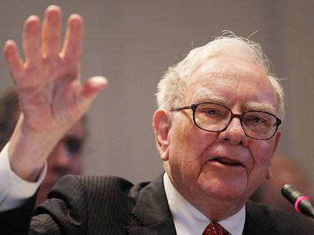

Warren Buffett, often referred to as the "Oracle of Omaha," is widely regarded as one of the most successful investors of all time. His investment strategies, primarily grounded in the principles of value investing, have consistently yielded substantial returns and have set a benchmark in the investment world. Value investing involves analyzing a company's intrinsic worth, buying stocks that trade for less than their intrinsic values, and holding onto them for the long term. Buffett's approach emphasizes investing in businesses with sound fundamentals, competitive advantages, and robust financial health. This method contrasts sharply with speculative trading, which focuses on short-term market movements.

In recent years, there has been a burgeoning interest in ETFs (Exchange-Traded Funds), which offer diversification, liquidity, and lower costs, making them attractive to a wide array of investors, from individuals to large institutions. Additionally, algorithmic trading, which employs complex algorithms and technology to execute trades at high speeds, has gained prominence for its precision and ability to handle large data volumes. These modern investment vehicles cater to a market that is increasingly driven by technological advancements and data analytics.



The objective of this article is to explore how Warren Buffett's time-tested traditional investment strategies can be harmoniously integrated with modern instruments such as ETFs and algorithmic trading. Understanding this integration is crucial for both novice and seasoned investors aiming to navigate the evolving investment landscape. It provides a pathway to incorporate the wisdom of long-standing investment principles with the efficiency and innovation of contemporary financial tools.

Readers can expect an in-depth analysis of Buffett’s investment philosophy, the role of ETFs in modern investing, and the impact of algorithmic trading. Through this exploration, the article will present practical insights on blending these strategies, offering a balanced perspective on their application across different investor profiles. Whether you are starting your investment journey or are a seasoned market participant, this article strives to enhance your knowledge and adaptability in today's dynamic financial markets.

## Table of Contents

## Understanding Warren Buffett's Investment Philosophy

Warren Buffett, often heralded as the "Oracle of Omaha," is renowned for his disciplined and consistent investment philosophy. His approach is primarily rooted in value investing, a strategy that involves picking stocks that appear to be trading for less than their intrinsic or book value. Value investing is based on the idea that the market can misprice a security in the short term, but its true value will be realized over the long term. The ultimate goal for a value investor is to purchase quality investments with an expectation of them increasing in value over the years.

A cornerstone of Buffett's strategy is the evaluation of a company's intrinsic value, which is the present value of the company's expected future cash flows. To calculate intrinsic value, Buffett reviews key financial metrics, such as earnings, dividends, growth rate, and capital, focusing on a company's ability to generate cash flow. This rigorous analysis helps him identify undervalued companies with the potential for long-term growth.

Buffett famously prefers investing in businesses with strong fundamentals and significant competitive advantages, often referred to as "economic moats." These moats protect a company from the competition and help ensure its earnings power. Characteristics of such companies include strong brand identity, proprietary technology, cost advantages, regulatory protection, and efficient scale. A classic example is his investment in Coca-Cola, where the brand's global recognition and distribution network provide a significant moat.

One of the defining elements of Buffett's investment philosophy is his aversion to market speculation, favoring instead a conservative approach. He shuns investments that rely heavily on market timing or short-term gains, focusing instead on companies with stable earnings and proven business models. Buffett's philosophy is well summarized by his famous adage: "It's far better to buy a wonderful company at a fair price than a fair company at a wonderful price."

Buffett's track record includes numerous successful investments exemplifying his approach. For instance, his investment in American Express during the 1960s, when the company struggled with a significant financial fraud incident, demonstrated his belief in the brand's enduring strength and future profit potential. Similarly, his stake in the insurance giant Geico highlights an investment in a company with lower costs and high customer retention, features that aligned with his criteria for a productive economic moat.

In summary, Warren Buffett's investment philosophy champions value investing, a focus on intrinsic value, a preference for companies with robust competitive advantages, and a conservative investment approach. His adept selection of high-quality investments, characterized by their enduring value and growth potential, has solidified his reputation as one of history's most successful investors.

## The Rise of ETFs in Modern Investing

Exchange-Traded Funds (ETFs) have revolutionized investing, offering a blend of features that make them attractive to various types of investors. ETFs are investment instruments that hold a basket of assets, such as stocks, bonds, or commodities, and are traded on stock exchanges. This allows investors to purchase shares of the [ETF](/wiki/etf-trading-strategies) just like they would with individual stocks, providing portfolio exposure to multiple securities without having to buy each individually.

One of the primary benefits of ETFs is diversification. By holding a variety of assets, ETFs inherently spread risk, reducing the impact of poor performance by any single investment within the fund. Liquidity is another major advantage, as ETFs can be sold and bought throughout the trading day at market prices, offering the flexibility not typically available with mutual funds, which are only priced at the end of each trading day. Additionally, ETFs are generally cost-effective, often having lower expense ratios compared to mutual funds due to their passive management style and reduced administrative costs.

The growing popularity of ETFs among both retail and institutional investors is evident from their substantial market growth. According to data from Statista, the global assets held in ETFs reached approximately $9 trillion as of 2021, a significant increase from about $4 trillion in 2016. This rise can be attributed to an increasing preference for passive investment strategies, facilitated by ETFs that track various indices and sectors efficiently.

Warren Buffett, known for his cautious approach to investing, has acknowledged the advantages of ETFs. Although not heavily integrated into his investment vehicle, Berkshire Hathaway, Buffett has supported the idea of ETFs as a suitable option for investors seeking long-term, passive growth. He famously recommended investing in low-cost S&P 500 index ETFs for those who are not well-versed in the complexities of [picking](/wiki/asset-class-picking) individual stocks. This recommendation aligns with his value investing philosophy by minimizing costs and encouraging investment in funds representing stable, established companies.

Buffett’s selective incorporation of ETFs is reflected in his personal estate planning advice, often suggesting that the majority of his estate be invested in index-tracking ETFs. This approach underscores the potential for integrating traditional investment principles with modern financial instruments, providing investors with a balanced strategy that emphasizes both performance stability and cost efficiency.

## Algorithmic Trading: The Modern Edge

Algorithmic trading is a method of executing trades using pre-programmed instructions that account for variables such as timing, price, and [volume](/wiki/volume-trading-strategy). By employing technological tools and algorithms, it automates the trading process, reducing the need for manual intervention. This approach leverages advanced computational techniques to quickly analyze market data and execute trades at optimal prices.

One of the primary advantages of [algorithmic trading](/wiki/algorithmic-trading) is speed. Algorithms can process information and execute trades in fractions of a second, which is far beyond human capabilities. This speed allows traders to capitalize on fleeting market opportunities and inefficiencies, potentially leading to increased profitability. Additionally, algorithmic trading enhances accuracy by minimizing human errors like emotional decision-making, which can negatively impact trading outcomes.

Another benefit of algorithmic trading is its ability to handle large volumes of data efficiently. Algorithms can analyze vast datasets to identify trading patterns and trends that might be missed by traditional analysis techniques. By parsing through historical data and real-time market feeds, algorithmic systems can develop strategic insights and make informed trading decisions.

However, algorithmic trading carries certain risks and drawbacks. One notable concern is market [volatility](/wiki/volatility-trading-strategies), which can be exacerbated by the rapid and large-scale transactions executed by algorithms. This could lead to situations where the market reacts to algorithm-driven movements rather than fundamental economic indicators. Moreover, there is an inherent over-reliance on technology, which can pose significant risks if systems fail or produce unexpected results. Traders must ensure robust risk management protocols and continuously update their algorithms to adapt to changing market conditions.

Integrating algorithmic trading with Warren Buffett's long-term investment strategies presents a unique challenge. Buffett's approach, rooted in value investing and [fundamental analysis](/wiki/fundamental-analysis), focuses on evaluating a company's intrinsic worth and maintaining investments over the long term. In contrast, algorithmic trading often highlights short-term gains driven by rapid market movements. However, some investors are finding ways to blend these approaches, creating a balanced strategy that benefits from both methodologies.

For instance, certain investors use algorithmic tools to identify undervalued stocks that align with Buffett's fundamental criteria, thereby accelerating the screening process while adhering to value investing principles. Additionally, algorithms can be employed to manage and gradually build positions over time, complementing a long-term investment perspective. By combining Buffett's strategic insights with algorithmic precision, investors can maximize returns while maintaining the integrity of their portfolio objectives.

In conclusion, algorithmic trading represents a modern edge in financial markets, offering speed, accuracy, and the capability to process extensive data. While its fast-paced nature might seem at odds with Warren Buffett's traditional strategies, thoughtful integration can lead to a harmonized approach that leverages both innovative technology and proven investment principles.

## Integrating Warren Buffett's Strategy with ETFs and Algo Trading

Integrating Warren Buffett's timeless investment principles with contemporary tools like Exchange-Traded Funds (ETFs) and algorithmic trading can be a sophisticated strategy that aligns value investing with modern financial technology. Warren Buffett's focus on value investing emphasizes diligent analysis of intrinsic company value, prioritizing investments in businesses with strong fundamentals and durable competitive advantages. By incorporating ETFs and algorithmic trading, investors can potentially amplify these principles for enhanced portfolio management and performance.

**Possibilities and Challenges**

One of the possibilities of integrating Buffett's value investing with ETFs is through selective ETF choice that mirrors his investment philosophy. Unlike traditional mutual funds, ETFs offer exposure to a diversified range of assets, including specific sectors or value-based indices, aligning with Buffett's preference for businesses with sustainable competitive advantages. However, the challenge is maintaining the careful selection process inherent in Buffett's approach; investors must thoroughly evaluate ETFs to ensure they reflect the desired value-oriented characteristics.

Similarly, algorithmic trading introduces both opportunities and challenges. Algorithms can assist in identifying undervalued stocks with strong fundamentals quickly, processing vast datasets beyond human capabilities. Despite this, algorithmic trading's focus on speed and short-term gains can conflict with Buffett's long-term investment horizon. Careful algorithm design, focusing on long-term metrics and fundamental attributes rather than short-term market fluctuations, can help reconcile these approaches.

**Practical Integration Advice**

To integrate these strategies practically, investors should ensure any ETFs chosen align with Buffett's value investment criteria, such as low expense ratios, consistency in dividend payments, and holdings in fundamentally strong businesses. Furthermore, algorithmic trading programs should be tailored to screen and prioritize potential investments based on metrics like low price-to-earnings (P/E) ratios, high return on equity (ROE), and strong cash flow generation.

Here's a simple Python snippet to illustrate a potential screening algorithm:

```python
import pandas as pd

# Sample data for stocks
data = {
    'Ticker': ['AAPL', 'MSFT', 'GOOGL'],
    'PE_Ratio': [15, 20, 25],
    'ROE': [0.25, 0.30, 0.35],
    'Cash_Flow': [50000, 70000, 65000]
}

# Create DataFrame
stocks_df = pd.DataFrame(data)

# Screening for value stocks based on PE and ROE
value_stocks = stocks_df[(stocks_df['PE_Ratio'] < 20) & (stocks_df['ROE'] > 0.30)]

print(value_stocks)
```

**Examples of Successful Integration**

Numerous firms and investors have successfully integrated traditional value investing principles with ETFs and algorithmic trading. For instance, some hedge funds employ customized algorithms that emphasize value investing principles, leveraging technology to assess broad market opportunities while adhering to Buffett-like criteria for investment selection. These hybrid approaches demonstrate that value investing can be technologically enhanced without sacrificing its foundational principles.

**Suitability for Different Investors**

The suitability of integrating these strategies varies among investor types. Seasoned investors with a deep understanding of value investing may find the technical complexity of algorithmic trading and ETF evaluation a beneficial expansion of their toolkit. For novice investors, a cautious approach is advisable. Focusing on value-oriented ETFs may offer a simpler entry point without the immediate need for technical expertise.

**Key Takeaways for Hybrid Approach**

1. Aligning ETFs and algorithms with value investing requires a disciplined focus on fundamentals.
2. Careful selection and design can leverage technology to enhance value investment methods.
3. Real-world examples illustrate the viability of these integrations in the financial landscape.
4. Understanding one's investment goals and technical comfort level is essential to successfully employing a hybrid strategy.

By effectively combining traditional and advanced methods, investors may find opportunities for improved portfolio management and returns, adhering to time-tested value investing principles while embracing innovative financial tools.

## Conclusion

Warren Buffett's investment philosophy is characterized by principles such as value investing, focusing on intrinsic value, and long-term growth. This approach emphasizes investing in companies with strong fundamentals and competitive advantages, while avoiding speculative market behavior. Buffett's strategies have set a benchmark for successful investing, yet the financial world continues to evolve with modern investment tools like ETFs and algorithmic trading.

ETFs have revolutionized investing due to their diversification, [liquidity](/wiki/liquidity-risk-premium), and cost-effectiveness. They appeal to both retail and institutional investors, and their growth has been significant. ETFs can complement Buffett's strategy by providing access to diverse markets while maintaining selective investment practices.

Algorithmic trading exemplifies innovation in finance, offering advantages like speed, accuracy, and data processing capabilities. While it presents risks such as potential market volatility, it aligns with the precision and computational rigor desired in investment processes. Some investors successfully combine traditional strategies with algorithmic methods, enhancing their portfolio management.

As investors consider integrating Warren Buffett's time-tested strategies with contemporary tools like ETFs and algorithmic trading, it is crucial to understand one’s investment goals and risk tolerance. Recognizing personal financial objectives ensures that the adoption of new strategies aligns with individual profiles and market conditions.

The investment landscape is dynamic; it demands continuous learning and adaptation. The future of investing may increasingly blend traditional approaches with technological advancements, offering exciting opportunities for growth and innovation. Readers are encouraged to actively engage with these evolving strategies, enhancing both their knowledge and execution in investment practices. Please feel free to share thoughts or questions in the comments as we explore these possibilities further.

## References & Further Reading

[1]: ["The Essays of Warren Buffett: Lessons for Corporate America"](https://www.amazon.com/Essays-Warren-Buffett-Lessons-Corporate/dp/1611634091) by Warren E. Buffett and Lawrence A. Cunningham

[2]: Bogle, J. C. (2009). ["Common Sense on Mutual Funds: New Imperatives for the Intelligent Investor"](https://books.google.com/books/about/Common_Sense_on_Mutual_Funds.html?id=KZbOlCjj9dEC). John Wiley & Sons.

[3]: Mayo, H. B. (2020). ["Investments: An Introduction"](https://www.amazon.com/Investments-Introduction-MindTap-Course-List/dp/0357127951). Cengage Learning.

[4]: Poterba, J. M., & Shoven, J. B. (2002). ["Exchange-Traded Funds: A New Investment Option for Taxable Investors"](https://www.nber.org/papers/w8781). National Bureau of Economic Research.

[5]: ["Understanding Risk Management in Algorithmic Trading"](https://theaiquant.medium.com/real-time-risk-management-in-algorithmic-trading-strategies-for-mitigating-exposure-0a940b5e924b) by S. K. Stark in Financial Analysts Journal, CFA Institute.

[6]: Malkiel, B. G. (2019). ["A Random Walk Down Wall Street: The Time-tested Strategy for Successful Investing"](https://www.amazon.com/Random-Walk-Down-Wall-Street/dp/0393358380). W. W. Norton & Company.