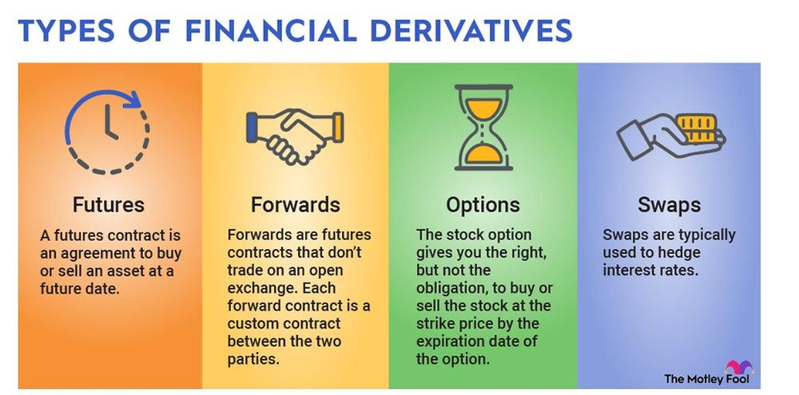

## Table of Contents

## What are Exchange-Traded Funds (ETFs)?

Exchange-Traded Funds, or ETFs, are a type of investment that lets you buy a bunch of different stocks or other assets all at once. They work a lot like mutual funds, but you can buy and sell them on a stock exchange, just like regular stocks. This means you can trade them throughout the day at whatever price they're currently at, instead of waiting until the end of the day like you do with mutual funds.

ETFs are popular because they offer a way to diversify your investments without having to pick and choose individual stocks. For example, if you want to invest in the tech industry, you can buy an ETF that includes a bunch of different tech companies. This can help spread out your risk, because if one company in the ETF does poorly, it might be balanced out by other companies doing well. Plus, ETFs often have lower fees than mutual funds, which can save you money over time.

## How do ETFs differ from mutual funds?

ETFs and mutual funds are both ways to invest in a group of assets, but they work a bit differently. ETFs are traded on stock exchanges, which means you can buy and sell them throughout the day at the current market price. On the other hand, mutual funds are bought and sold at the end of the trading day at a price that's calculated based on the total value of all the assets in the fund. This means that with ETFs, you have more control over when you buy and sell, while with mutual funds, you have to wait until the end of the day.

Another big difference is how they are managed and their costs. ETFs often have lower fees than mutual funds because they are usually passively managed, meaning they track an index like the S&P 500 without a lot of active buying and selling by a fund manager. Mutual funds, on the other hand, are often actively managed, which means a professional manager is making decisions about what to buy and sell, and this can lead to higher fees. So, if you're looking for a cheaper way to invest and don't mind tracking an index, ETFs might be a better choice, but if you want someone actively managing your investments, you might prefer a mutual fund.

## What are derivatives and what types exist?

Derivatives are financial contracts that get their value from something else, like a stock, a commodity, or an [interest rate](/wiki/interest-rate-trading-strategies). They're called derivatives because their value is derived from the performance of the underlying asset. People use derivatives to manage risk, to bet on the future price of an asset, or to make their investments more flexible. They can be a bit complicated because they don't have any real value on their own, but they can be very useful if you know how to use them.

There are several types of derivatives, but the main ones are futures, options, and swaps. Futures are agreements to buy or sell an asset at a future date for a price agreed upon today. They're often used by farmers and companies to lock in prices for their products. Options give you the right, but not the obligation, to buy or sell an asset at a set price before a certain date. They're popular for investors who want to limit their risk while still having the chance to make a profit. Swaps are agreements to exchange cash flows or other financial instruments, often used by companies to manage interest rate or currency risks. Each type of derivative serves a different purpose, but they all help people manage financial risks and opportunities.

## How are ETFs used in investment portfolios?

ETFs are used in investment portfolios to help spread out risk and make investing easier. When you buy an [ETF](/wiki/etf-trading-strategies), you're buying a little piece of many different investments all at once. This means you don't have to pick and choose individual stocks or bonds, which can be hard and risky. Instead, you can buy an ETF that follows a whole market or a specific part of it, like tech companies or green energy. This way, if one company in the ETF does badly, it might not hurt your whole investment because there are so many other companies in there too.

ETFs are also popular because they're easy to buy and sell. Since they trade on stock exchanges like regular stocks, you can buy or sell them whenever the market is open. This can be really helpful if you need to get your money out quickly or if you want to change your investments without waiting until the end of the day. Plus, ETFs often have lower fees than other types of investments, which means you get to keep more of your money over time. So, many people use ETFs to build a strong, diverse investment portfolio that's easy to manage and doesn't cost a lot.

## What is the process of ETF creation and redemption?

The process of ETF creation starts when an authorized participant, usually a big financial institution, wants to create new shares of an ETF. They do this by gathering a basket of securities that matches the ETF's index, like a bunch of stocks if it's a stock ETF. Then, they give this basket to the ETF issuer. In return, the ETF issuer gives them new ETF shares. These new shares are then sold to the public on the stock exchange, and that's how more ETF shares come into existence.

The redemption process is kind of the opposite. When an authorized participant wants to redeem ETF shares, they buy a bunch of ETF shares from the market. They then give these shares back to the ETF issuer. In return, the ETF issuer gives them a basket of the underlying securities that the ETF is made of. This way, the number of ETF shares in the market goes down. Both creation and redemption help keep the ETF's price in line with the value of the assets it holds, making sure it stays a good reflection of the index it's tracking.

## How do ETFs track their underlying assets?

ETFs track their underlying assets by trying to match the performance of a specific index, like the S&P 500 or a group of tech companies. They do this by holding the same stocks or assets that are in the index they're tracking. For example, if an ETF is supposed to track the S&P 500, it will buy all the stocks that make up the S&P 500 in the same proportions. This way, when the S&P 500 goes up or down, the ETF's value should go up or down in a similar way.

Sometimes, ETFs use a method called "sampling" to track their index. Instead of buying every single stock in the index, they buy a smaller selection that they think will give similar results. This can be easier and cheaper, but it still aims to follow the index as closely as possible. Either way, the goal is to make sure the ETF's performance stays close to the performance of the index it's tracking, so investors get the same returns as if they owned the whole index themselves.

## What are the risks associated with investing in ETFs?

Investing in ETFs can be a good way to spread out your money and reduce risk, but there are still some risks you should know about. One big risk is market risk, which means that if the market goes down, your ETF will likely go down too. Since ETFs track a whole index or sector, they can't avoid this risk. Another risk is tracking error, which happens when the ETF doesn't follow its index as closely as it should. This can happen because of fees, how the ETF is managed, or if it uses sampling instead of buying all the stocks in the index.

Liquidity risk is another thing to watch out for. If not many people are buying and selling the ETF, it can be hard to sell your shares quickly without losing money. This is more of a problem with smaller or less popular ETFs. Also, ETFs can have different levels of risk depending on what they invest in. For example, an ETF that focuses on a specific industry, like tech or energy, can be riskier than one that follows a broad market index because that industry might go through big ups and downs.

Finally, there's the risk of high costs. While many ETFs have low fees, some can be expensive, especially if they are actively managed or focus on niche markets. These higher fees can eat into your returns over time. It's important to understand these risks and think about how they fit with your own investment goals and how much risk you're willing to take.

## How are derivatives used in the context of ETFs?

Derivatives are sometimes used in ETFs to help them track their indexes more closely or to manage risk. For example, some ETFs use futures contracts, which are agreements to buy or sell an asset at a future date, to mimic the performance of an index without having to buy all the stocks in it. This can be cheaper and easier, especially for indexes that include a lot of different stocks. Options, which give the right but not the obligation to buy or sell an asset, can also be used to protect the ETF from big drops in the market, kind of like insurance.

However, using derivatives can add some risks to ETFs. They can make the ETF's performance less predictable because derivatives can be complicated and their value can change quickly. Also, if the ETF uses a lot of derivatives, it might not be as closely tied to the actual stocks or assets in the index it's supposed to track. This can lead to something called tracking error, where the ETF doesn't perform exactly like the index. So, while derivatives can be helpful, they need to be used carefully to make sure they don't add too much risk to the ETF.

## What is the role of synthetic ETFs and how do they use derivatives?

Synthetic ETFs are a type of ETF that use derivatives to track the performance of an index instead of buying the actual stocks or assets in that index. They do this by entering into agreements like swaps, where they trade the returns of the index for something else. This can be useful because it might be cheaper and easier to use derivatives than to buy all the stocks in an index, especially if the index includes a lot of different or hard-to-buy assets.

However, synthetic ETFs can be riskier than regular ETFs because they rely on these derivative agreements. If the company on the other side of the swap doesn't pay up, the synthetic ETF could lose money. Also, because they're using derivatives instead of actual stocks, their performance might not match the index as closely, which is called tracking error. So, while synthetic ETFs can be a good way to invest, they come with their own set of risks that you need to think about.

## How are ETFs and derivatives regulated?

ETFs and derivatives are regulated to make sure they're safe and fair for everyone. In the United States, the main regulator for ETFs is the Securities and Exchange Commission (SEC). The SEC makes rules that ETFs have to follow, like how they need to tell people what they're investing in and how much they charge in fees. The SEC also keeps an eye on how ETFs are traded to make sure no one is cheating or doing anything wrong. For derivatives, the Commodity Futures Trading Commission (CFTC) and the SEC both have a role. The CFTC looks after futures and some swaps, while the SEC oversees options and securities-based swaps. Both agencies want to make sure that derivatives are used in a way that's clear and doesn't put people at too much risk.

There are also rules about how ETFs can use derivatives. If an ETF wants to use derivatives, it has to follow special rules set by the SEC. These rules say things like how much risk the ETF can take with derivatives and how it needs to report what it's doing. The goal is to make sure that ETFs using derivatives don't get too risky and that people know what's going on with their investments. In other countries, there are similar regulators and rules, but they might be a bit different. Overall, the idea is the same: to keep the markets safe and fair for everyone who uses them.

## What advanced strategies involve the use of ETFs and derivatives?

One advanced strategy that involves ETFs and derivatives is called "pairs trading." In this strategy, an investor finds two ETFs that usually move together, like one that tracks the S&P 500 and another that tracks a similar broad market index. The investor then uses derivatives, like options, to bet that one ETF will do better than the other. If the investor thinks the S&P 500 ETF will outperform the other one, they might buy options on the S&P 500 ETF and sell options on the other ETF. This way, they can make money from the difference in performance, even if the market as a whole doesn't go up or down much.

Another strategy is called "leverage and inverse ETFs." These are special types of ETFs that use derivatives to give investors more risk and reward. A leveraged ETF might use futures or swaps to try to give you double or triple the return of an index, but it can also lose you double or triple the money if the index goes down. An inverse ETF uses derivatives to go up when an index goes down, which can be useful if you think the market is going to fall. These strategies can be very risky because they use a lot of derivatives, so they're not for everyone. But for experienced investors who understand the risks, they can be a way to try to make bigger profits or protect against losses.

## How can one analyze the performance and risk of ETFs using derivatives?

Analyzing the performance and risk of ETFs that use derivatives can be a bit tricky, but it's important to understand how they're doing. One way to do this is by looking at the ETF's tracking error, which shows how closely the ETF follows its index. If the ETF uses derivatives, the tracking error might be bigger because derivatives can be more complicated and their value can change quickly. You can also look at the ETF's historical performance to see how it has done in the past. This can give you an idea of how risky it might be, but remember that past performance doesn't always tell you what will happen in the future.

Another thing to consider is the ETF's exposure to derivatives. You can find this information in the ETF's prospectus or fact sheet, which will tell you how much of the ETF's value comes from derivatives. If the ETF has a lot of derivatives, it might be riskier because it depends more on those agreements working out. Also, you should check the ETF's expense ratio, which is how much it costs to own the ETF. ETFs that use a lot of derivatives might have higher fees because managing them can be more complicated. By looking at all these things, you can get a better idea of how the ETF performs and how risky it might be.

## References & Further Reading

[1]: Agapova, A. (2011). ["Conventional Mutual Index Funds versus Exchange-Traded Funds"](https://www.sciencedirect.com/science/article/pii/S138641811000042X). Journal of Financial Markets, 14(2), 323-343.

[2]: BlackRock. "Sustainable Investing: Resilience amid Uncertainty". Retrieved from [BlackRock.com](https://nordsip.com/wp-content/uploads/2020/07/BlackRock_sustainable-investing-resilience_May2020.pdf)

[3]: Chance, D. M., & Brooks, R. (2015). ["An Introduction to Derivatives and Risk Management"](https://archive.org/details/introductiontode0000chan_m1l1). Cengage Learning.

[4]: Loeper, G. R. (2009). ["Algorithmic and High-Frequency Trading"](https://assets.cambridge.org/97811070/91146/frontmatter/9781107091146_frontmatter.pdf). Academic Press.

[5]: Barclays AI Labs. "The Impact of Machine Learning on Investment Strategies: An Overview". Retrieved from [Barclays.com](https://aws.amazon.com/blogs/aws/new-apis-in-amazon-bedrock-to-enhance-rag-applications-now-available/)

[6]: Malkiel, B. G. (2019). ["A Random Walk Down Wall Street: The Time-Tested Strategy for Successful Investing"](https://www.amazon.com/Random-Walk-Down-Wall-Street/dp/1324002182). W. W. Norton & Company.

[7]: Shreve, S. E. (2004). ["Stochastic Calculus for Finance I: The Binomial Asset Pricing Model"](https://link.springer.com/book/10.1007/978-0-387-22527-2). Springer.