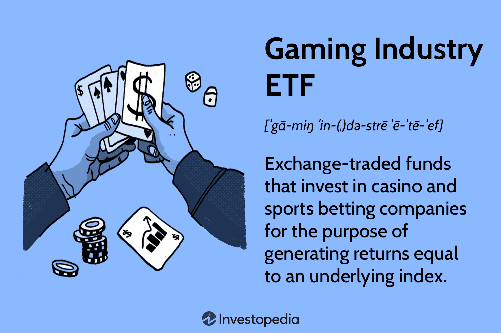

## Table of Contents

## What are Exchange-Traded Funds (ETFs)?

Exchange-Traded Funds, or ETFs, are a type of investment that works a lot like a mutual fund but trades on a stock exchange like a stock. They are designed to track the performance of a specific index, like the S&P 500, a commodity, bonds, or a basket of assets. This means that when you buy shares of an ETF, you're buying a small piece of everything that's in that index or basket.

ETFs are popular because they offer a lot of diversification, which means you're spreading out your investment across many different assets instead of putting all your money into one thing. This can help reduce risk. Also, ETFs usually have lower fees than mutual funds, making them a cost-effective way to invest. You can buy and sell ETFs throughout the trading day at market prices, which gives you more flexibility compared to mutual funds, which are only priced at the end of the trading day.

## How do ETFs work in the stock market?

ETFs work in the stock market by letting investors buy and sell shares of them just like they would with regular stocks. These shares are traded on stock exchanges throughout the day, so their prices can go up and down based on what people are willing to pay for them. When you buy an ETF, you're actually buying a little piece of everything that's inside it. For example, if an ETF follows the S&P 500, you're getting a tiny bit of each of the 500 companies in that index. This makes it easy for investors to own a diverse set of assets without having to buy each one separately.

The way ETFs keep their value in line with what they're supposed to track is through something called creation and redemption. Big investors, called authorized participants, can exchange baskets of the underlying assets for new shares of the [ETF](/wiki/etf-trading-strategies), or they can give back ETF shares to get the underlying assets. This process helps keep the price of the ETF close to the actual value of the things it's tracking. If the ETF's price gets too high or too low compared to what it should be, these big investors step in to bring it back in line, making ETFs a reliable way to invest in a broad market or specific sector.

## What is the gambling industry and its key segments?

The gambling industry is all about games and activities where people bet money or something valuable on the outcome. It's a big business that lets people have fun and try to win money. There are different parts of the gambling industry, like casinos, sports betting, and lotteries. Casinos are places where you can play games like slots, poker, blackjack, and roulette. Sports betting is when you bet on the results of sports games, like who will win a football match. Lotteries are games where you buy a ticket and hope to win a big prize by matching numbers.

Another important part of the gambling industry is online gambling. This is when people play casino games, bet on sports, or join lotteries using the internet. It's become really popular because it's easy to do from home. There's also something called skill gaming, where the games depend more on the player's skills than just luck. This includes things like poker and fantasy sports. All these parts make up the gambling industry, and they each have their own rules and ways of working.

## Why might someone invest in ETFs focused on the gambling industry?

Someone might invest in ETFs focused on the gambling industry because they think this industry will grow and make money. The gambling industry, including casinos, sports betting, and online gambling, is getting bigger every year. More people are enjoying these activities, and as more places make gambling legal, the industry can grow even more. By investing in an ETF that focuses on gambling, someone can own a little bit of many different companies in this industry, which spreads out the risk and gives them a chance to benefit from the industry's growth.

Another reason to invest in gambling ETFs is that they can be a way to diversify an investment portfolio. Instead of putting all their money into one company, an investor can buy shares in an ETF and get exposure to a whole group of companies in the gambling sector. This can help reduce the risk of losing money if one company doesn't do well. Plus, ETFs usually have lower fees than buying many individual stocks, so it's a cost-effective way to invest in the gambling industry.

## What are some examples of ETFs that include gambling companies?

There are a few ETFs that include gambling companies. One example is the VanEck Vectors Gaming ETF (BJK). This ETF invests in companies that are involved in casinos and casino hotels, sports betting, lottery services, gaming technology, and gaming equipment. It's a good way for someone to invest in the gambling industry without [picking](/wiki/asset-class-picking) individual companies.

Another example is the Roundhill Sports Betting & iGaming ETF (BETZ). This ETF focuses on companies that are part of the sports betting and online gambling industry. It includes companies that provide online gambling services, as well as those that make the technology and software used in these activities. This ETF is a way for investors to bet on the growth of online gambling and sports betting.

## How can an investor evaluate the performance of gambling ETFs?

An investor can evaluate the performance of gambling ETFs by looking at a few important things. First, they should check the ETF's total return, which shows how much the ETF has grown over time. This includes any dividends or interest the ETF has paid out. They can compare this to other ETFs or to the overall market to see if the gambling ETF is doing better or worse. Also, they should look at the ETF's expense ratio, which is how much it costs to own the ETF. A lower expense ratio means more of the investor's money stays in their pocket.

Another way to evaluate gambling ETFs is by looking at how well they track their index. Most ETFs try to match the performance of a specific index, like one that follows gambling companies. Investors should see if the ETF is doing a good job of this by comparing its performance to the index it's supposed to track. If the ETF is not matching the index closely, it might not be a good investment. Also, it's important to look at the ETF's risk, which can be measured by its [volatility](/wiki/volatility-trading-strategies). A more volatile ETF might have bigger ups and downs, which could be riskier for the investor.

## What are the risks associated with investing in gambling industry ETFs?

Investing in gambling industry ETFs comes with some risks that investors should know about. One big risk is that the gambling industry can be affected a lot by changes in the law. If a country or state decides to make gambling more strict or even illegal, it can hurt the companies in the ETF. Also, the gambling industry can be sensitive to economic changes. When people have less money to spend, they might not gamble as much, which can make the companies in the ETF do worse.

Another risk is that gambling ETFs can be more volatile than other types of investments. This means their prices can go up and down a lot in a short time. If an investor needs to sell their shares quickly, they might not get as much money as they hoped. Plus, because gambling ETFs focus on just one industry, they don't spread out risk as much as a more diverse ETF. If the gambling industry has a bad year, the ETF's value could drop a lot.

## How does regulatory environment affect gambling ETFs?

The regulatory environment can really change how gambling ETFs do. When governments make new rules about gambling, it can affect the companies in the ETF. If a place makes gambling more strict or even illegal, the companies that run casinos, sports betting, or online gambling might lose money. This can make the ETF's value go down. On the other hand, if a country or state decides to make gambling legal where it wasn't before, it can help the companies grow and make more money, which can make the ETF's value go up.

Because gambling laws can change a lot, it can make gambling ETFs risky. Investors need to keep an eye on what lawmakers are doing. If they hear about new rules that might hurt the gambling industry, they might want to think twice before investing in a gambling ETF. But if the rules seem like they will help the industry grow, it could be a good time to buy shares in the ETF. Keeping up with the news and understanding the laws can help investors make better choices about gambling ETFs.

## What trends are currently shaping the gambling industry and its ETFs?

The gambling industry is changing because of technology and new laws. More people are using their phones and computers to gamble online. This is making online gambling and sports betting grow a lot. Also, more places are making gambling legal, which is good for the companies in gambling ETFs. For example, when sports betting became legal in more states in the U.S., it helped companies like DraftKings and FanDuel, which are in some gambling ETFs.

Another big trend is that people want to gamble in new ways. Games like esports betting and fantasy sports are getting more popular. These are games where you bet on video game competitions or make your own sports team. Also, companies are using new technology like virtual reality to make gambling more fun. These trends can make gambling ETFs do well if the companies inside them are keeping up with what people want. But if the companies don't change with the trends, the ETFs might not do as well.

## How do global economic factors impact gambling ETFs?

Global economic factors can have a big impact on gambling ETFs. When the economy is doing well, people usually have more money to spend on things like gambling. This can be good for the companies in the ETF, because more people might go to casinos, bet on sports, or play online games. But if the economy is doing badly, people might not have as much extra money to spend on gambling. This can hurt the companies in the ETF, and make its value go down.

Another way global economic factors can affect gambling ETFs is through changes in currency values. If the currency of a country where a gambling company operates gets weaker, it can make that company's earnings worth less when they are reported in another currency, like the U.S. dollar. This can make the ETF's value go down, even if the company is doing well in its own country. Also, big economic events like a recession or a financial crisis can make people less likely to gamble, which can hurt the whole industry and the ETFs that invest in it.

## What advanced strategies can be used to optimize returns from gambling ETFs?

One way to get more out of gambling ETFs is to use a strategy called dollar-cost averaging. This means you put a little bit of money into the ETF every month instead of putting all your money in at once. By doing this, you buy more shares when the price is low and fewer when the price is high. Over time, this can help you pay a lower average price for your shares and make more money. Also, you should keep an eye on the news about the gambling industry. If you hear about new laws that might help the industry grow, it could be a good time to buy more shares. But if you hear about new rules that might hurt the industry, you might want to sell some of your shares or wait to buy more.

Another good strategy is to use stop-loss orders to protect your money. A stop-loss order is like a safety net that tells your broker to sell your shares if they drop to a certain price. This can help you avoid losing too much money if the ETF's value goes down a lot. Also, you can try to make more money by using a strategy called rebalancing. This means you check your investments every so often and sell some of the ETFs that have gone up a lot to buy more of the ones that haven't done as well. This can help you keep your investments spread out and might help you make more money over time.

## How can investors use gambling ETFs as part of a diversified investment portfolio?

Investors can use gambling ETFs to add variety to their investment portfolio. By buying shares in a gambling ETF, an investor gets a little piece of many different companies in the gambling industry, like casinos, sports betting, and online gambling. This helps spread out the risk because if one company does badly, the whole ETF might not go down as much. Adding a gambling ETF to a portfolio that already has other types of investments, like stocks from different industries or bonds, can make the whole portfolio more balanced. This way, if one part of the market does badly, the other parts might do better and help keep the investor's money safe.

Another way to use gambling ETFs in a diversified portfolio is to think about how much of the portfolio should be in gambling. Since gambling ETFs can be more risky because they focus on just one industry, an investor might want to put only a small part of their money into them. For example, they could decide to put 5% or 10% of their portfolio into a gambling ETF. The rest of the money can go into other types of investments that are less risky. By doing this, the investor can still try to make money from the growth of the gambling industry without putting all their eggs in one basket.

## References & Further Reading

[1]: ["Understanding Python for Algorithmic Trading"](https://github.com/PacktPublishing/Python-for-Algorithmic-Trading-Cookbook) by Chris Conlan

[2]: Gomber, P., Arndt, B., Lutat, M., & Uhle, T. (2011). ["High-Frequency Trading."](https://papers.ssrn.com/sol3/papers.cfm?abstract_id=1858626) In Handbook on Electronic Securities Markets and Trading.

[3]: ["Gambling Market - Forecasts from 2021 to 2026"](https://www.statista.com/outlook/amo/online-gambling/worldwide) by Research and Markets

[4]: Fiedler, I. (2011). ["Gambling and Risk-Taking: The Social Context."](https://www.semanticscholar.org/paper/Regulation-of-online-gambling-Fiedler/fba4d954124ef8c6da7b7de66c908b10ed2faf38) Risk Management and Insurance Review.

[5]: ["Exchange-Traded Funds: Concepts, Trends, and Changes to Rule 6c-11"](https://www.sec.gov/newsroom/press-releases/2019-190) by the U.S. Securities and Exchange Commission