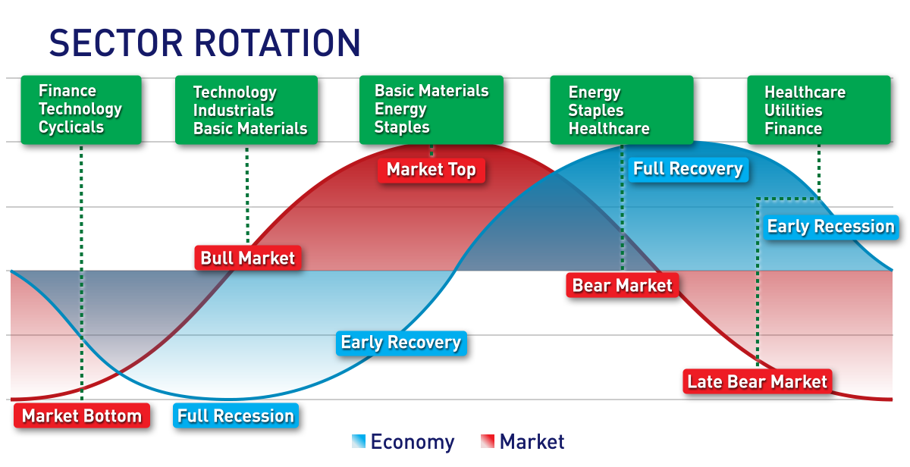

## Table of Contents

## What is an Exchange-Traded Fund (ETF)?

An Exchange-Traded Fund (ETF) is a type of investment fund that you can buy and sell on a stock exchange, just like you would with individual stocks. It's a basket of securities, such as stocks, bonds, or commodities, that tracks an underlying index, like the S&P 500. This means when you buy shares of an ETF, you're actually investing in a small piece of all the different assets within that index.

ETFs are popular because they offer a simple way to diversify your investments. Instead of buying many different stocks or bonds one by one, you can get exposure to a broad range of assets with just one purchase. They also tend to have lower fees than mutual funds, making them a cost-effective option for investors. Plus, because they trade on an exchange, you can buy and sell them throughout the trading day at market prices, unlike mutual funds which only trade once a day after the market closes.

## What is sector rotation and why is it used in investment strategies?

Sector rotation is when investors move their money from one industry or sector to another. They do this because they think some sectors will do better than others at different times. For example, when the economy is growing, people might invest more in technology or consumer goods. But when the economy is slowing down, they might move their money to more stable sectors like utilities or healthcare.

Investors use sector rotation in their strategies to try to make more money and reduce risk. By watching the economy and how different sectors are doing, they can guess which sectors might do well next. This can help them buy into sectors before they start to grow and sell out of sectors before they start to decline. It's like trying to catch the wave at just the right time in the stock market.

## How can ETFs be used in sector rotation strategies?

ETFs can be used in sector rotation strategies by allowing investors to easily move their money from one sector to another. Since ETFs track specific sectors like technology, healthcare, or energy, an investor can buy an [ETF](/wiki/etf-trading-strategies) that focuses on a sector they think will do well. For example, if they believe the technology sector will grow, they can buy a tech ETF. When they think it's time to switch, they can sell that ETF and buy one from a different sector, like utilities, if they think that sector will do better next.

This approach is helpful because ETFs are easy to trade and usually have lower costs than buying individual stocks. By using ETFs, investors can quickly adjust their portfolios to take advantage of changing economic conditions without having to buy and sell many different stocks. This makes sector rotation more efficient and accessible, even for people who don't have a lot of money to invest or time to spend on managing their investments.

## What are the benefits of using ETFs for sector rotation?

Using ETFs for sector rotation makes it easier for investors to switch their money from one industry to another. ETFs are like baskets of stocks from a specific sector, so when you think a sector will do well, you can just buy one ETF instead of many different stocks. This saves time and makes it simpler to manage your investments. Also, ETFs usually have lower fees than buying individual stocks or mutual funds, so you can keep more of your money.

Another benefit is that ETFs trade on stock exchanges, so you can buy and sell them quickly during the day. This is great for sector rotation because you can move your money around faster to take advantage of changes in the market. Plus, ETFs give you a way to spread out your risk. Instead of betting on just one or two companies, you're investing in a whole sector, which can be safer if you're trying to guess which part of the economy will do well next.

## What are the common sectors targeted in sector rotation with ETFs?

When people use ETFs for sector rotation, they often look at sectors like technology, healthcare, and consumer goods. These sectors tend to do well when the economy is growing. Technology companies can grow fast, healthcare is always important, and people buy more stuff when they feel good about the economy. So, if someone thinks the economy will be strong, they might buy ETFs from these sectors.

On the other hand, when the economy is slowing down, people might move their money to more stable sectors like utilities, consumer staples, and energy. Utilities are needed no matter what the economy is doing, consumer staples are things like food and household products that people always need, and energy can be a safe bet because everyone uses it. By switching to ETFs in these sectors, investors hope to protect their money during tougher economic times.

Overall, sector rotation with ETFs is about trying to guess which parts of the economy will do well next and moving money around to take advantage of that. It's a way to try to make more money and keep it safer by spreading it across different sectors at different times.

## How do economic cycles influence sector rotation strategies using ETFs?

Economic cycles play a big role in sector rotation strategies using ETFs. When the economy is growing, people feel confident and spend more money. This is a good time for sectors like technology, consumer goods, and industrials. Investors might buy ETFs that focus on these sectors because they think these companies will do well when people are buying more things. For example, if a new tech product is popular, a tech ETF could go up in value.

But when the economy slows down, people get more careful with their money. They might spend less on things they don't need right away. During these times, sectors like utilities, consumer staples, and healthcare can be safer bets. Utilities are always needed, people still need to buy food and medicine, and healthcare is important no matter what the economy is doing. So, investors might switch their money to ETFs in these sectors to protect their investments during tough economic times. By watching the economic cycles and using ETFs, investors can try to make more money and keep it safer by moving it around at the right times.

## What are the risks associated with using ETFs in sector rotation?

Using ETFs in sector rotation can be risky because it's hard to guess which sectors will do well next. Even if you think you know what's going to happen with the economy, you can still be wrong. If you move your money to a sector that doesn't do as well as you thought, you could lose money. Plus, ETFs that focus on one sector can be more risky than ETFs that include many different sectors because if that one sector has problems, your whole investment could go down.

Another risk is that moving money around a lot can cost you more money. Every time you buy or sell an ETF, you might have to pay fees or taxes. If you're switching sectors all the time, these costs can add up and eat into your profits. Also, sector rotation can make your investments less stable because you're always changing things. If you're not careful, you might end up buying and selling at the wrong times and miss out on good opportunities or lose more money than you expected.

## How can investors identify the right time to rotate sectors using ETFs?

Investors can try to figure out the right time to rotate sectors by watching the economy and seeing what's going on in the world. They look at things like how fast the economy is growing, what the unemployment rate is, and if people are spending more money. They also pay attention to news and events that could affect different industries. For example, if there's a new law that helps the technology sector, it might be a good time to buy a tech ETF. By keeping an eye on these signs, investors can guess which sectors might do well next and switch their money around.

Another way to identify the right time for sector rotation is by using technical analysis. This means looking at charts and patterns of how ETFs have been doing in the past. Investors look for signs that an ETF might be going up or down soon. If they see a pattern that usually means a sector is about to do well, they might buy that ETF. But if they see a pattern that means a sector might start to do worse, they might sell it and buy an ETF from a different sector. It's like trying to read the future from the past, but it's not always easy to get it right.

## What tools and resources are available for tracking sector performance for ETF rotation?

Investors can use many different tools and resources to track how sectors are doing for ETF rotation. Websites like Yahoo Finance and Google Finance are easy to use and give you lots of information about different sectors and ETFs. They show charts, news, and data that can help you see which sectors are doing well or not so well. Another useful tool is Bloomberg Terminal, but it's more expensive and usually used by professionals. There are also financial news sites like CNBC and Reuters that keep you updated on what's happening in different sectors.

Another helpful resource is investment research platforms like Morningstar and Zacks. These sites give you detailed reports and analysis on ETFs and the sectors they track. They can help you understand why a sector might be doing well or poorly and what might happen next. Also, many brokerages, like Fidelity and Charles Schwab, offer their own research tools and sector performance data. These can be really useful because they're often included with your account, so you don't have to pay extra to use them. By using these tools and resources, investors can make smarter choices about when to switch their money from one sector to another.

## How do tax considerations affect ETF sector rotation strategies?

When you use ETFs for sector rotation, you need to think about taxes. Every time you sell an ETF to switch to another one, you might have to pay taxes on any profits you made. This is called capital gains tax. If you're always moving your money around from one sector to another, you might have to pay these taxes more often. That means you could end up with less money than you expected because some of it goes to taxes.

There's a way to be a bit smarter about this, though. If you hold onto an ETF for more than a year before selling it, you might pay a lower tax rate on your profits. This is called the long-term capital gains tax rate, and it's usually less than the short-term rate. So, if you can, try to time your sector rotation to keep your ETFs for at least a year. That way, you might save some money on taxes and keep more of your profits.

## What advanced techniques can be applied to enhance returns in ETF sector rotation?

One advanced technique for enhancing returns in ETF sector rotation is to use [momentum](/wiki/momentum) investing. This means you look at which ETFs have been doing really well recently and buy those, hoping they will keep going up. You can use tools like moving averages or relative strength indicators to spot these trends. The idea is to ride the wave of a sector that's doing well until it starts to slow down, then switch to another sector that's [picking](/wiki/asset-class-picking) up steam. This can help you make more money, but it's also riskier because past performance doesn't always predict the future.

Another technique is to use a combination of fundamental and technical analysis. Fundamental analysis looks at the health of the companies in a sector, like their earnings and growth potential. If a sector looks strong based on this, you might buy an ETF from that sector. Technical analysis, on the other hand, looks at charts and patterns to guess where an ETF's price might go next. By using both types of analysis, you can make better guesses about which sectors to rotate into. This can help you find the best times to switch sectors and possibly make more money, but it takes more work and knowledge to do it right.

## How can one evaluate the performance of an ETF sector rotation strategy over time?

To evaluate the performance of an ETF sector rotation strategy over time, you need to look at how well your investments are doing compared to a benchmark. A benchmark could be a broad market index like the S&P 500 or another ETF that tracks the overall market. You can compare the returns of your sector rotation strategy to this benchmark to see if you're doing better or worse. Another thing to check is how much risk you're taking. If your strategy is making more money than the benchmark, but it's also a lot riskier, you need to decide if that's worth it. You can measure risk by looking at how much your investments go up and down over time, which is called [volatility](/wiki/volatility-trading-strategies).

It's also important to keep track of how often you're making changes to your strategy. If you're switching sectors too much, you might be losing money on fees and taxes. You can look at your trading costs and see if they're eating into your profits. Over time, you should also see if your strategy is working consistently. Are you making money most of the time, or is it hit or miss? Keeping a record of your performance, like a journal or a spreadsheet, can help you see patterns and make better decisions in the future. By looking at all these things together, you can get a good idea of how well your ETF sector rotation strategy is doing.

## References & Further Reading

[1]: Fabozzi, F. J., & Focardi, S. M. (2008). ["Handbook of Finance, Volume 1: Financial Markets and Instruments"](https://onlinelibrary.wiley.com/doi/book/10.1002/9781118856406). Wiley.

[2]: Swedroe, L., & Berkin, A. (2014). ["The Incredible Shrinking Alpha: And What You Can Do to Escape Its Clutches"](https://www.amazon.com/Incredible-Shrinking-Alpha-Escape-Clutches-ebook/dp/B00S9UKXN2). Buckingham.

[3]: Ferri, R. A. (2010). ["The ETF Book: All You Need to Know About Exchange-Traded Funds"](https://www.amazon.com/ETF-Book-About-Exchange-Traded-Funds/dp/0470537469). Wiley.

[4]: Chan, E. (2013). ["Algorithmic Trading: Winning Strategies and Their Rationale"](https://github.com/NehrenD/algo_trading_and_quant_strategies). Wiley.

[5]: Antonacci, G. (2014). ["Dual Momentum Investing: An Innovative Strategy for Higher Returns with Lower Risk"](https://www.amazon.com/Dual-Momentum-Investing-Innovative-Strategy/dp/0071849440). McGraw-Hill Education.