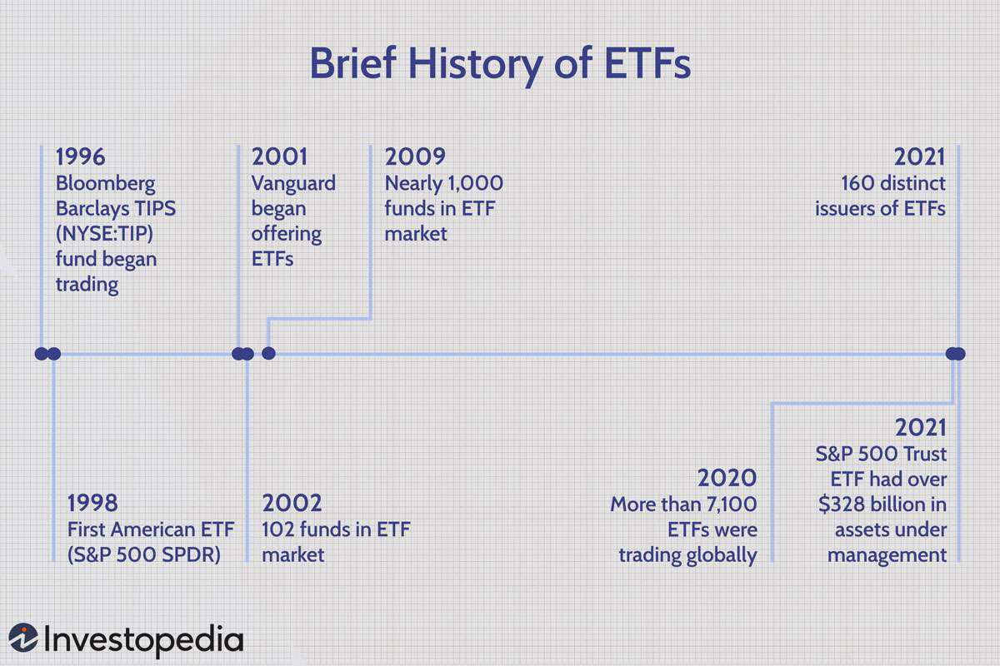

The world of investment is in a constant state of flux, with Exchange-Traded Funds (ETFs) rapidly ascending as a favored option among investors. These vehicles provide a blend of diversification and efficiency, offering exposure to a broad array of assets while being traded on stock exchanges like individual stocks. As the landscape evolves, the role of technology in finance becomes increasingly pronounced, exemplified by major corporations such as Walmart venturing into financial technology. Walmart's strategic exploration into algorithmic trading, known as algo trading, underscores its potential for increased precision and efficiency in financial transactions. Algorithmic trading employs complex algorithms to execute trades at speeds and frequencies impossible for human traders, thereby optimizing financial operations.

This article seeks to examine the interrelationship between investment ETFs, the initiatives undertaken by Walmart, and the overarching role of algo trading within the domain of modern finance. The synthesis of these elements is not merely reshaping investment strategies but also influencing the broader financial markets. By dissecting these dynamics, we aim to furnish insights into how these factors are currently molding investment approaches and paving the way for future trends. A deep understanding of these connections is crucial for investors aiming to make well-informed decisions and harness emerging trends in the financial sector. As technology and innovation continue to drive the evolution of finance, investors equipped with this knowledge will be better positioned to capitalize on new opportunities within this complex ecosystem.



## Table of Contents

## Understanding Investment ETFs

Investment Exchange-Traded Funds (ETFs) have emerged as a compelling investment vehicle for a wide range of investors, from individuals to large institutional entities. Like individual stocks, ETFs are traded on stock exchanges, enabling investors to buy and sell them throughout the trading day at market prices. This feature provides flexibility and accessibility, making ETFs an attractive option for those seeking a practical approach to portfolio management.

One of the core benefits of ETFs is their capacity to offer exposure to a diversified portfolio of assets. An ETF might encompass a mix of different asset classes such as stocks, bonds, and commodities, thus providing a built-in diversification that can help mitigate risk. This diversification is achieved because ETFs typically track an underlying index, mirroring its performance by holding similar securities. For instance, an S&P 500 ETF aims to replicate the performance of the S&P 500 Index, representing exposure to 500 of the largest U.S. companies.

Another significant advantage of ETFs over traditional mutual funds is their liquidity. Since ETFs are traded on exchanges, they can be bought and sold easily, offering higher liquidity compared to mutual funds which are typically settled at the end of the trading day. Additionally, ETFs generally have a lower cost structure. They often have reduced management fees, termed 'expense ratios', and fewer other operational expenses, making them a cost-effective choice for investors aiming for maximum returns on their investments.

Tax efficiency is another appealing characteristic of ETFs. Typically, ETFs incur fewer capital gains taxes than mutual funds. This efficiency is largely due to their unique 'creation and redemption' mechanism, which allows for in-kind redemptions and limits the necessity for the fund to sell securities, thereby avoiding taxable events.

Investors have the option to choose from an extensive array of ETFs that can be tailored to fit specific investment strategies. They can focus on particular sectors such as technology or healthcare, target geographic regions like emerging markets, or track well-known market indices such as the NASDAQ-100 or the Dow Jones Industrial Average. This versatility aligns with different investor goals, whether they are seeking growth, income, or a balance of both.

The increased popularity of ETFs indicates a growing demand for investment solutions that are not only diversified but also transparent and affordable. Their transparency stems from the ability for investors to know exactly what assets are held within the [ETF](/wiki/etf-trading-strategies), typically on a daily basis, which enhances investor confidence and trust. Consequently, ETFs have established themselves as an integral component in modern investment portfolios, capturing the interest of both the investment community and individual investors alike.

## Walmart's Role in Financial Technology and Algo Trading

Walmart has been strategically expanding its presence in the financial technology (fintech) sector, signifying a notable shift from its traditional retail operations to more comprehensive financial services. This expansion is primarily achieved through strategic partnerships and innovative approaches to integrating technology into financial operations, positioning Walmart as a proactive entity within fintech.

A crucial component of Walmart's involvement in fintech is its exploration of [algorithmic trading](/wiki/algorithmic-trading). Algorithmic trading, often referred to as algo trading, utilizes sophisticated algorithms and high-speed computational systems to execute trades with little to no human intervention. This approach allows for rapid decision-making and execution in financial markets, offering improved precision and efficiency. By adopting algo trading, Walmart aims to enhance its financial operations, achieving greater optimization and cost efficiency. This adoption is aligned with Walmart’s broader strategy to leverage technology to enhance its supply chain and financial transaction processes, ultimately delivering more advanced services to its customers.

The strategic incorporation of algo trading into Walmart's financial activities positions the company as a forward-thinking contender in both retail and finance sectors. By employing technology-driven solutions, Walmart not only enhances its internal financial processing capabilities but also sets a precedent for integrating fintech into traditional business models. This innovation illustrates Walmart’s commitment to staying at the forefront of technological advancements, showcasing its adaptability in a rapidly evolving economic landscape.

Overall, Walmart’s investment in algorithmic trading reflects a broader trend within the business world, where large corporations are embracing technology to redefine their operational frameworks and achieve competitive advantages in increasingly digitalized markets.

## How Algo Trading Impacts ETFs

Algorithmic trading, or algo trading, has become integral to the modern financial landscape, exerting a profound impact on the Exchange-Traded Fund (ETF) market. By automating trade executions and leveraging advanced mathematical models, algo trading enhances both efficiency and [liquidity](/wiki/liquidity-risk-premium). These improvements enable faster transactions at lower costs and with reduced human error, thereby facilitating a more streamlined trading process. 

One of the critical roles of algorithmic trading is its contribution to price discovery. This process involves determining the fair value of an asset based on supply and demand dynamics present in real-time market data. Algorithms, through high-frequency trading, can analyze vast quantities of these data points to forecast asset price movements more accurately. By doing so, they help market participants identify [arbitrage](/wiki/arbitrage) opportunities and rectify price disparities across different exchanges, smoothing price variations and aligning asset values more closely with their intrinsic worth.

ETFs, known for their highly liquid characteristics, are particularly well-suited for algorithmic trading. The inherent ability of algorithms to execute large volumes of trades swiftly aligns perfectly with the liquidity features of ETFs. As a result, ETF prices tend to remain more stable and reflective of underlying asset values, providing additional confidence for investors.

Furthermore, the implementation of algorithmic strategies promotes competitive pricing in ETF markets. By reducing bid-ask spreads and enabling more frequent trading, algo trading creates a more dynamic market environment. This heightened activity can lead to better prices and favorable trading conditions for retail investors, who benefit from narrower spreads and quicker trade executions.

Moreover, understanding the interface between algorithmic trading and ETFs is crucial, particularly for investors concentrating on short-term market movements. Algo trading strategies, such as [statistical arbitrage](/wiki/statistical-arbitrage) or [momentum](/wiki/momentum) trading, are designed to capitalize on brief inefficiencies or patterns in the market, thus offering tactical advantages for active investors. 

To illustrate how algorithmic trading functions in this context, here is a rudimentary Python example of [backtesting](/wiki/backtesting) a simple moving average crossover strategy on an ETF:

```python
import pandas as pd
import numpy as np

def moving_average_crossover_strategy(data, short_window=40, long_window=100):
    signals = pd.DataFrame(index=data.index)
    signals['price'] = data['price']
    signals['short_mavg'] = data['price'].rolling(window=short_window, min_periods=1).mean()
    signals['long_mavg'] = data['price'].rolling(window=long_window, min_periods=1).mean()
    signals['signal'] = 0
    signals['signal'][short_window:] = np.where(signals['short_mavg'][short_window:] 
                                                > signals['long_mavg'][short_window:], 1, 0)
    signals['positions'] = signals['signal'].diff()
    return signals

# Assume 'etf_data' is a DataFrame with DateTime index and a 'price' column
etf_data = pd.read_csv('etf_data.csv', index_col='Date', parse_dates=True)
signals = moving_average_crossover_strategy(etf_data)
```

This simple strategy generates buy and sell signals based on the crossing of short-term and long-term moving averages, providing a basic model for assessing potential trades. Such algorithmic strategies, though simplistic, form the building blocks for more complex models that handle real-time data and incorporate [machine learning](/wiki/machine-learning) techniques, ultimately enhancing the adaptability and robustness of algorithmic trading systems in ETF markets.

## The Future of Investment Strategies with ETFs and Algo Trading

As technology continues to evolve, the integration of Exchange-Traded Funds (ETFs) and algorithmic trading is poised for significant growth, reshaping the future of investment strategies. Investors can anticipate the emergence of more sophisticated and customizable ETFs, which are designed to meet the needs of niche market segments and investment themes. These advancements in ETF offerings enable investors to diversify their portfolios and align their investment strategies with specific sectors, industries, or global trends.

Walmart's strategic involvement in financial technology and algorithmic trading could act as a catalyst for other large corporations to explore and invest in financial innovations. This corporate interest in fintech is likely to spur market competition, leading to the development of new and improved financial products and services. As companies like Walmart leverage technology to enhance financial solutions, advancements in trading algorithms and systems may become more prevalent across the industry, driving efficiency and reducing transaction costs.

Future investment strategies are likely to concentrate on personalized investment solutions, enabled by the power of algorithms. These algorithms can analyze vast amounts of data to identify patterns and trends, thereby facilitating more accurate investment decisions. Such personalized strategies can help manage risk more effectively, tailor investments to individual preferences, and enhance portfolio performance.

In this rapidly evolving financial landscape, it is crucial for investors to remain informed about technological advancements and their implications. Keeping abreast of these developments will be essential for adapting and succeeding in the next generation of finance. As ETFs and algo trading become increasingly intertwined, investors who understand these technologies will be better positioned to capitalize on new opportunities and navigate potential challenges.

## Conclusion

The interconnected world of investment Exchange-Traded Funds (ETFs), Walmart's technological initiatives, and algorithmic trading presents a complex landscape filled with both opportunities and challenges for investors. The rapid pace of technological advancement in the financial sector necessitates that investors remain vigilant and informed about the latest developments influencing investment strategies. 

Walmart's growing interest in algorithmic trading signals a significant shift toward more tech-driven approaches to finance. By embracing algorithmic technologies, companies like Walmart are setting a precedent for other large corporations to potentially harness similar advancements, suggesting a broader industry trend. This could lead to enhanced trading operations, offering increased efficiency and precision in financial decision-making.

Algorithmic trading is progressively becoming a mainstay in ETF markets due to its ability to improve market efficiency and functionality. As these algorithms become more sophisticated, they can facilitate quicker and more informed trading decisions, which could lead to reduced transaction costs and better price discovery mechanisms. This enhances the overall liquidity of ETF markets, creating opportunities for investors to take advantage of short-term market movements with greater ease.

Understanding the implications of these trends is vital for investors looking to position themselves advantageously in an evolving financial ecosystem. By keeping abreast of technological advances and market dynamics, investors can not only mitigate potential risks associated with innovations in fintech but also leverage these developments to optimize their investment strategies. Such proactive engagement with technology-driven changes is likely to become increasingly crucial as the financial landscape continues to transform.

## References & Further Reading

[1]: Bergstra, J., Bardenet, R., Bengio, Y., & Kégl, B. (2011). ["Algorithms for Hyper-Parameter Optimization."](https://papers.nips.cc/paper/4443-algorithms-for-hyper-parameter-optimization) Advances in Neural Information Processing Systems 24.

[2]: ["Advances in Financial Machine Learning"](https://www.amazon.com/Advances-Financial-Machine-Learning-Marcos/dp/1119482089) by Marcos Lopez de Prado

[3]: ["Evidence-Based Technical Analysis: Applying the Scientific Method and Statistical Inference to Trading Signals"](https://www.amazon.com/Evidence-Based-Technical-Analysis-Scientific-Statistical/dp/0470008741) by David Aronson

[4]: ["Machine Learning for Algorithmic Trading"](https://github.com/stefan-jansen/machine-learning-for-trading) by Stefan Jansen

[5]: ["Quantitative Trading: How to Build Your Own Algorithmic Trading Business"](https://www.amazon.com/Quantitative-Trading-Build-Algorithmic-Business/dp/1119800064) by Ernest P. Chan