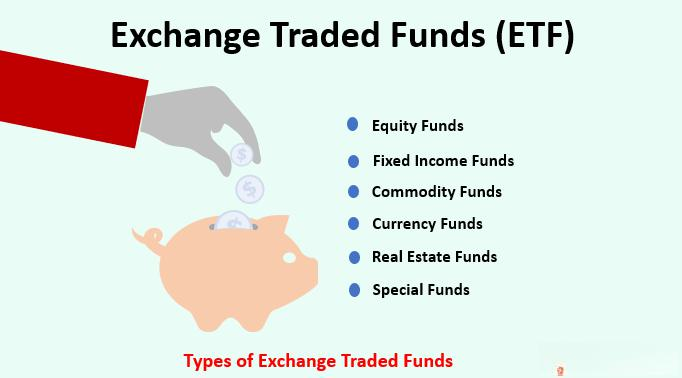

Exchange-Traded Funds (ETFs) have transformed the landscape of financial investments since their introduction in the early 1990s. They have grown in popularity due to their unique structure, which combines features of both individual stocks and mutual funds, offering investors diversified exposure with the ability to trade throughout the day on major stock exchanges.

ETFs provide a platform for investors to access a wide range of asset classes, including stocks, bonds, commodities, and more recently, cryptocurrencies. This versatility has made them an essential tool for investors seeking to optimize their portfolios with varying levels of risk and diversification. Unlike mutual funds, which are priced at the end of the trading day, ETFs trade like stocks, allowing investors to buy and sell intraday, take advantage of market movements, and implement various trading strategies with great flexibility.



The growing adoption of ETFs also aligns with the advancement in algorithmic trading technologies. Algorithmic trading, which utilizes pre-programmed instructions to execute trades at high speeds and volumes, has further enhanced the efficiency and accessibility of trading ETFs. These algorithms are designed to execute strategies such as trend following, statistical arbitrage, and market making, ensuring that investors can capitalize on market opportunities while minimizing human error.

Understanding ETFs and their function in the modern investment ecosystem is critical for investors aiming to make informed decisions. This article provides insights into the fundamentals of ETFs, their diverse types, and the benefits they offer. Furthermore, it discusses the impact of algorithmic trading on the ETF market, illustrating how technology is reshaping the way these financial instruments are managed and traded. Through this exploration, investors can gain a deeper appreciation of the strategic advantage that ETFs, and the algorithms that trade them, hold in contemporary finance.

## Table of Contents

## What Are Exchange-Traded Funds (ETFs)?

Exchange-Traded Funds (ETFs) are a type of investment vehicle that trades on stock exchanges, similar to individual stocks. These funds are designed to track the performance of a specific index, sector, commodity, or asset class, providing investors with exposure to a wide range of underlying assets without having to buy each security individually. 

An ETF holds a collection of assets such as stocks, commodities, or bonds and typically maintains an arbitrage mechanism that ensures its market price remains close to its net asset value (NAV). This is achieved through the process of creating and redeeming shares using the underlying securities. When the market price of an ETF deviates from its NAV, institutional investors can buy or sell the underlying assets to take advantage of arbitrage opportunities, thus aligning the ETF's price with its NAV.

The first [ETF](/wiki/etf-trading-strategies) in the United States was launched in 1993, known as the SPDR S&P 500 ETF (SPY). This pioneering fund was structured to provide investors with a way to invest in the S&P 500 Index, which is a broad representation of the U.S. stock market. As such, SPY became an efficient tool for investors to achieve diversification across many large-cap U.S. companies.

ETFs offer the combined benefits of diversification, typical of mutual funds, and the trading flexibility akin to individual stocks. They can be bought and sold on an exchange throughout the trading day at market prices, which provides a level of [liquidity](/wiki/liquidity-risk-premium) and price transparency that mutual funds do not offer, as mutual funds are typically priced only once at the end of each trading day. The trading flexibility of ETFs allows for a range of investment strategies, including hedging and short selling, which are generally not possible with mutual funds.

## Types of ETFs

Exchange-Traded Funds (ETFs) are diverse investment vehicles that cater to various financial strategies and preferences. These funds can be broadly categorized into several types, each focusing on different asset classes and financial instruments.

1. **Bond ETFs**: These ETFs are designed to provide investors with exposure to fixed-income securities. Bond ETFs can include government bonds, municipal bonds, corporate bonds, and international bonds. They offer the benefits of regular income and capital preservation, although their prices may fluctuate with interest rate changes.

2. **Commodity ETFs**: These funds invest in physical commodities like gold, silver, oil, or agricultural products. Commodity ETFs enable investors to gain exposure to commodity markets without directly buying the commodity. They are often used as a hedge against inflation since their prices are tied to the commodity's market value.

3. **Crypto ETFs**: A newer category, Crypto ETFs provide exposure to digital assets, such as Bitcoin and Ethereum, without requiring investors to directly purchase cryptocurrencies. While these ETFs allow for investment in the growing crypto market, they also come with the inherent volatility of digital currencies.

4. **Currency ETFs**: These funds invest in foreign currencies and offer exposure to currency markets. Investors might use Currency ETFs to hedge against currency risk or to speculate on currency movements. These ETFs can help diversify an investment portfolio by adding foreign currency exposure.

5. **Equities ETFs**: One of the most popular types of ETFs, Equities ETFs invest in stocks. They can track specific stock indices like the S&P 500 or focus on particular sectors such as technology, healthcare, or energy. Equities ETFs are favored for their ability to provide diversification across numerous stocks within a single fund, often at lower costs compared to individual stock selection.

Each type of ETF provides unique features and benefits, matched to different investor needs and market conditions. Through these varied options, ETFs have become a vital tool for investors seeking tailored investment strategies and asset diversification.

## Advantages and Disadvantages of Investing in ETFs

Exchange-Traded Funds (ETFs) have gained substantial popularity among investors due to several inherent advantages. One primary benefit is their ability to offer instant diversification. By investing in a single ETF, investors can gain exposure to a wide range of securities, such as stocks, bonds, commodities, or other assets. This diversification can often reduce the risk associated with investing in individual securities.

Another advantage of ETFs is their typically lower cost structure compared to mutual funds. ETFs are primarily passively managed, meaning they aim to replicate the performance of a specific index rather than outperform it. This passive management usually results in lower expense ratios, as fewer resources are required compared to actively managed funds. Additionally, ETFs have certain tax efficiency benefits. This efficiency largely comes from their unique structure and the "in-kind" creation and redemption process, which minimizes capital gains distributions.

ETFs also exhibit high liquidity, allowing investors to buy and sell shares on stock exchanges throughout the trading day at market prices. This feature contrasts with mutual funds, which are only traded at the closing net asset value (NAV) at the end of the trading day. The ease of trading ETFs implies that investors can respond quickly to market changes, enhancing flexibility in managing investment portfolios.

However, investing in ETFs is not devoid of disadvantages. While ETFs generally have lower fees, they may include additional costs, such as brokerage fees, which are incurred each time a trade is made. Moreover, like all market-traded securities, ETFs are subject to market [volatility](/wiki/volatility-trading-strategies). The fact that ETF prices fluctuate throughout the day can result in significant value changes, similar to individual stocks.

In the case of certain actively managed ETFs, investors may encounter higher management fees compared to passively managed ETFs. Active management involves the fund manager making specific investment decisions with the aim of outperforming a benchmark index, which can drive up operational costs.

In summary, while ETFs provide several appealing advantages, including diversification, lower fees, and tax efficiency, investors must also consider the implications of potential brokerage costs, market risks, and varying management fees. A thorough evaluation of these factors is essential for making informed investment decisions.

## Exploring Algorithmic Trading in ETFs

Algorithmic trading refers to the incorporation of sophisticated mathematical models and computational algorithms to conduct trading activities in a methodical way. In the context of Exchange-Traded Funds (ETFs), this technology is leveraged to enhance trading efficiency by automating processes that would otherwise be manual and prone to human error. Algorithms actively monitor markets and execute trades based on predefined criteria, ensuring that trading aligns with specified strategies or market conditions.

In ETF trading, algorithmic strategies are particularly advantageous for managing large portfolios and executing complex trades rapidly. By employing algorithms, traders can handle vast amounts of data and make informed trading decisions nearly instantaneously. This capability is especially vital given the high [volume](/wiki/volume-trading-strategy) and speed of modern financial markets. Algorithmic trading systems can identify price trends, assess risk, and execute trades at optimal prices without the delays associated with manual intervention.

One of the key features enabled by [algorithmic trading](/wiki/algorithmic-trading) in ETFs is the ability to exploit [arbitrage](/wiki/arbitrage) opportunities. Arbitrage involves profiting from temporary price discrepancies between similar financial instruments across different markets. Algorithms can simultaneously buy and sell ETFs in various markets, capitalizing on differences in price before they converge. This practice is facilitated by the speed and precision of algorithms, which can quickly detect and act upon such price inefficiencies.

Moreover, automated trading strategies reduce human biases and emotional decision-making, a common pitfall in manual trading. By sticking to predefined rules and removing emotional impulses, algorithmic systems ensure consistent strategy execution. This objectivity is crucial for maintaining disciplined trading operations, especially in volatile markets where emotions might sway decisions.

In conclusion, the application of algorithmic trading in ETFs signifies a transformative shift in financial markets, promoting a more efficient, systematic, and potentially more profitable way to engage with investment opportunities. As technology continues to advance, algorithmic trading is likely to play an increasingly pivotal role in ETF management and trading, paving the way for further innovations in the financial sector.

## Algorithmic Trading Strategies for ETFs

Algorithmic trading strategies have significantly transformed the way Exchange-Traded Funds (ETFs) are traded, offering precise, swift, and efficient techniques to engage with the market. Three predominant strategies stand out for their application in ETF trading: [trend following](/wiki/trend-following), [statistical arbitrage](/wiki/statistical-arbitrage), and [market making](/wiki/market-making).

Trend following strategies are designed to capitalize on the established price movements of ETFs. These algorithms operate based on predefined rules that identify and leverage price patterns, such as moving averages and breakouts. The fundamental principle is to buy ETFs when prices are trending upwards and sell when they begin to decline. This approach assumes that current trends will continue for some time before reversing. For implementation, a simple moving average crossover strategy might be used, where a short-term moving average crossing above a long-term moving average signals a buy, and vice versa for a sell.

```python
import numpy as np
import pandas as pd

# Sample data
etf_data = pd.DataFrame({
    'Price': [100, 102, 105, 107, 104, 108, 110, 112, 109, 111]
})

# Calculate moving averages
etf_data['Short_MA'] = etf_data['Price'].rolling(window=3).mean()
etf_data['Long_MA'] = etf_data['Price'].rolling(window=5).mean()

# Generate buy/sell signals
etf_data['Signal'] = np.where(etf_data['Short_MA'] > etf_data['Long_MA'], 1, -1)
```

Statistical arbitrage exploits deviations in the pricing of similar ETFs, hypothesizing that any short-term divergence from the established statistical relationships will revert over time. This strategy involves constructing pairs of ETFs with historically correlated performances and trading based on the spread between them. For example, if two ETFs generally move together but diverge temporarily, an algorithm might short the outperforming ETF while simultaneously going long on the underperforming one. Techniques such as cointegration and mean reversion models are often employed to pinpoint these opportunities.

Market making is a strategy that aims to provide liquidity in ETF markets by placing simultaneous buy and sell orders. Market makers earn profits through the bid-ask spread—the difference between the price a buyer is willing to pay (bid) and the price a seller is willing to accept (ask). Algorithms in this strategy are designed to detect optimal times and prices for placing such orders, ensuring quick execution at favorable prices while minimizing risks. This method requires sophisticated models that can predict ETF price movements with high accuracy and react instantaneously to market conditions.

By integrating these algorithmic strategies, traders and firms enhance their ability to pursue diverse investment objectives while benefiting from increased precision and reduced human intervention. These strategies underscore the technological advancements propelling ETF trading into new realms of efficiency and effectiveness.

## Considerations When Investing in ETFs with Algorithmic Strategies

When considering investments in Exchange-Traded Funds (ETFs), especially those managed through algorithmic strategies, investors need to conduct thorough assessments to ensure alignment with their financial goals and risk tolerance. 

Understanding the underlying assets and the overall strategy of the ETF is imperative. Each ETF has a unique composition that mirrors a specific index, sector, or asset class, which dictates its risk and return profile. Therefore, investors must assess how these align with their investment expectations.

Algorithmic strategies used in managing ETFs offer enhanced trading efficiency but require a closer look at specific parameters. Key among these is the expense ratio, representing the annual fee charged by the fund management. Lower expense ratios typically lead to better net returns provided other factors are constant.

Tracking error is another crucial aspect. It measures how closely an ETF follows its benchmark index. A smaller tracking error indicates better index replication, essential for investors who wish their returns to closely mirror the index performance.

Historical performance is a valuable indicator of algorithmic strategies' effective execution within the ETF. Evaluating past results provides insights into potential future performance and highlights the consistency of the strategy under varying market conditions.

Liquidity is vital; it influences how easily an investor can enter or [exit](/wiki/exit-strategy) positions without significantly impacting the ETF's market price. High liquidity ensures tighter bid-ask spreads and more cost-effective trading.

The reputation of the ETF issuer should also be considered. Reputable issuers often have established operational frameworks that may positively impact fund management and investor confidence.

Tax implications, a sometimes-overlooked facet, can greatly affect net returns. ETFs typically offer tax efficiency compared to mutual funds due to their creation and redemption process, which minimizes capital gains distributions. However, understanding the specific tax nuances related to algorithmic trading within ETFs is critical, as frequent trading may trigger capital gains.

In summary, informed investment decisions in ETFs employing algorithmic strategies necessitate a multifaceted review of the algorithm and fund-specific aspects, considering the investor's overarching investment strategy and potential tax impacts.

## Conclusion

Exchange-Traded Funds (ETFs) have become an integral component of the investment landscape, offering accessibility and diversification to a diverse array of investors. These financial instruments have democratized investment opportunities, allowing individuals to participate in markets previously dominated by institutional investors.

The adoption of algorithmic trading strategies in ETF management signifies a pivotal shift towards technological innovation in finance. Algorithms enhance the precision and speed of ETF trading, allowing for the execution of complex strategies and minimizing human error. Such efficiency is crucial for maintaining optimal portfolio performance and leveraging market opportunities effectively.

Understanding the intricacies of both ETFs and algorithmic trading is vital for investors aiming to maximize their potential returns. A comprehensive grasp of these elements equips investors with the acumen to navigate the market's complexities, enabling informed decision-making and strategic positioning.

As with any investment vehicle, engaging in ETFs requires meticulous due diligence. Investors must carefully evaluate risk factors, expense ratios, and the quality of algorithmic strategies being employed. This ensures alignment with their financial goals and risk tolerance. The nuanced assessment and strategic foresight ultimately underpin successful investment endeavors in ETF markets.

## References & Further Reading

[1]: Bergstra, J., Bardenet, R., Bengio, Y., & Kégl, B. (2011). ["Algorithms for Hyper-Parameter Optimization."](https://papers.nips.cc/paper/4443-algorithms-for-hyper-parameter-optimization) Advances in Neural Information Processing Systems 24.

[2]: ["Advances in Financial Machine Learning"](https://www.amazon.com/Advances-Financial-Machine-Learning-Marcos/dp/1119482089) by Marcos Lopez de Prado

[3]: ["Evidence-Based Technical Analysis: Applying the Scientific Method and Statistical Inference to Trading Signals"](https://www.amazon.com/Evidence-Based-Technical-Analysis-Scientific-Statistical/dp/0470008741) by David Aronson

[4]: ["Machine Learning for Algorithmic Trading"](https://github.com/PacktPublishing/Machine-Learning-for-Algorithmic-Trading-Second-Edition) by Stefan Jansen

[5]: ["Quantitative Trading: How to Build Your Own Algorithmic Trading Business"](https://books.google.com/books/about/Quantitative_Trading.html?id=j70yEAAAQBAJ) by Ernest P. Chan