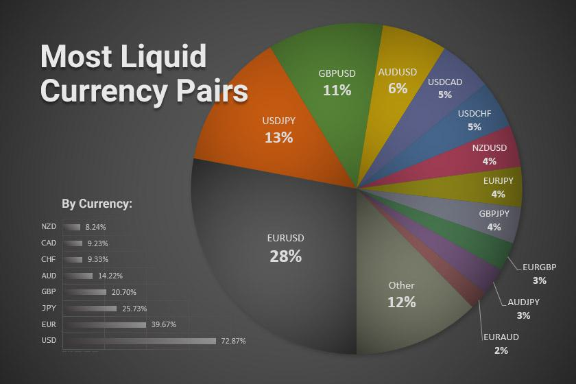

## Table of Contents

## What is exchange-traded liquidity?

Exchange-traded liquidity refers to how easily you can buy or sell assets on a stock exchange without affecting their price too much. When an asset has high liquidity, it means there are lots of buyers and sellers, so you can quickly trade it at a fair price. On the other hand, if an asset has low liquidity, it might be hard to find someone to trade with, and you might have to accept a worse price.

This concept is important for investors because it affects how easily they can get in and out of investments. High liquidity is usually good because it means less risk and more flexibility. For example, if you need to sell a stock quickly, you'll want it to be liquid so you can do that without losing much money. Low liquidity can make trading more difficult and riskier, as it might take longer to find a buyer and you might have to sell for less than you hoped.

## How does exchange-traded liquidity differ from other types of liquidity?

Exchange-traded liquidity is about how easy it is to buy or sell things on a stock exchange. It's all about the number of people who want to buy and sell the same thing at the same time. If lots of people are interested, it's easy to trade, and that's called high liquidity. If not many people want to trade, it's hard, and that's low liquidity. This type of liquidity is important for stocks, bonds, and other things traded on exchanges.

Other types of [liquidity](/wiki/liquidity-risk-premium) can be different. For example, cash is the most liquid asset because you can use it right away to buy things. Bank liquidity is about how easily a bank can meet its financial obligations, like giving money to people who want to withdraw it. Market liquidity is a broader idea that includes not just exchanges but also how easy it is to trade things in other markets, like real estate or art. Each type of liquidity matters in different ways, depending on what you're trying to do with your money.

## What are the key factors that affect exchange-traded liquidity?

Several things can make it easier or harder to trade things on a stock exchange. One big thing is how many people want to buy and sell the same thing at the same time. If lots of people are interested, it's easier to trade, and that's called high liquidity. Another thing is how much the price changes when you try to trade. If the price stays pretty much the same, that's good for liquidity. But if the price jumps around a lot, it might be harder to trade, which means lower liquidity.

Another [factor](/wiki/factor-investing) is how much information people have about what they're trading. If everyone knows a lot about a stock, they're more likely to trade it, which helps with liquidity. Also, the rules of the exchange can affect liquidity. If it's easy to trade and the costs are low, more people will do it, which makes things more liquid. On the other hand, if trading is hard or expensive, fewer people will want to do it, which can lower liquidity.

## How can investors measure exchange-traded liquidity?

Investors can measure exchange-traded liquidity by looking at a few key things. One way is to check the trading [volume](/wiki/volume-trading-strategy), which is how many shares of a stock are bought and sold each day. If a stock has a high trading volume, it means lots of people are trading it, so it's probably easy to buy or sell. Another way is to look at the bid-ask spread, which is the difference between the highest price someone is willing to pay for a stock and the lowest price someone is willing to sell it for. A smaller spread usually means it's easier to trade the stock because the price doesn't change much when you buy or sell.

Another important measure is the market depth, which shows how many buy and sell orders there are at different prices. If there are lots of orders at prices close to the current price, it's easier to trade without moving the price too much. Investors can also use something called the turnover ratio, which is how often the stock changes hands compared to how many shares exist. A high turnover ratio means the stock is traded a lot, which usually means it's liquid. By looking at these measures, investors can get a good idea of how easy it is to trade a stock on an exchange.

## What role do market makers play in exchange-traded liquidity?

Market makers are important for making it easier to trade things on a stock exchange. They do this by always being ready to buy and sell certain stocks. When you want to buy a stock, a market maker will sell it to you, and when you want to sell, they will buy it from you. This helps keep the market liquid because there's always someone ready to trade, even if there aren't many other buyers or sellers around.

By doing this, market makers help keep the prices stable. They make sure that the price doesn't jump around too much when people want to trade. This is good for everyone because it makes trading smoother and less risky. So, market makers play a big role in making sure that stocks and other things on the exchange are easy to buy and sell.

## How does the trading volume impact exchange-traded liquidity?

Trading volume is how many shares of a stock are bought and sold every day. When the trading volume is high, it means lots of people are interested in trading that stock. This makes it easier for you to buy or sell the stock because there are more people to trade with. High trading volume is a sign of high liquidity because it shows that the market for that stock is active and busy.

On the other hand, if the trading volume is low, it means fewer people are trading the stock. This can make it harder for you to buy or sell because there might not be many people on the other side of the trade. Low trading volume is a sign of low liquidity, which can make trading more difficult and riskier because you might have to wait longer to find someone to trade with, or you might have to accept a worse price.

## What are the implications of high liquidity for traders and investors?

High liquidity is good news for traders and investors. It means that it's easy to buy and sell stocks without the price changing too much. When a stock is highly liquid, you can quickly get in and out of your investments. This is helpful if you need to sell your stocks fast or if you want to buy more without worrying about the price going up a lot. High liquidity also means lower risk because you're less likely to get stuck with a stock you can't sell.

Another big advantage of high liquidity is that it makes the market more fair and efficient. With lots of people buying and selling, the price of a stock is more likely to be a true reflection of its value. This helps investors make better decisions because they can trust that the prices they see are accurate. Plus, high liquidity can lead to smaller costs for trading because there are more people to trade with, which can make the difference between the buying and selling price smaller.

## How can low liquidity affect the pricing and trading of exchange-traded products?

Low liquidity can make it harder to buy and sell exchange-traded products like stocks. When not many people want to trade, you might have to wait a long time to find someone to trade with. This can be a problem if you need to sell your stock quickly. Also, because there aren't many buyers and sellers, the price can change a lot when you do trade. You might have to sell your stock for less money than you wanted, or pay more to buy it.

This can make trading riskier and more expensive. When the price jumps around a lot, it's harder to know if you're getting a good deal. And if the difference between the buying and selling price is big, you might lose more money just from trading. So, low liquidity can make it harder to make smart investment choices and can lead to bigger losses.

## What strategies can be used to manage liquidity risk in exchange-traded markets?

One way to manage liquidity risk in exchange-traded markets is to focus on stocks or other assets that have high trading volumes. When lots of people are buying and selling, it's easier to trade without the price moving too much. You can check the trading volume and the bid-ask spread to see how liquid a stock is. If the spread is small and the volume is high, it's a good sign that the stock is liquid. This can help you avoid getting stuck with a stock you can't sell or having to sell it for less than you wanted.

Another strategy is to diversify your investments. Instead of putting all your money into one stock, you can spread it out across many different stocks or even different types of investments like bonds or ETFs. This way, if one stock is hard to sell, you can still trade the others more easily. It's also a good idea to keep some cash or very liquid assets in your portfolio. That way, if you need money quickly, you can use those instead of trying to sell a stock that's not liquid.

Lastly, you can use limit orders when you trade. Instead of buying or selling at whatever price is available, you can set a specific price you're willing to accept. This can help you avoid selling for too little or buying for too much, especially in a market with low liquidity. By using these strategies, you can better manage the risks that come with trading in markets where it's hard to buy and sell quickly.

## How do regulatory changes influence exchange-traded liquidity?

Regulatory changes can have a big impact on how easy it is to buy and sell things on a stock exchange. When rules change, it can affect how many people want to trade and how easy it is for them to do it. For example, if new rules make trading cheaper or easier, more people might want to buy and sell, which can make the market more liquid. But if the rules make trading more expensive or harder, fewer people might want to trade, which can make the market less liquid.

These changes can also affect how much information people have about what they're trading. If new rules make companies share more information, people might feel more comfortable trading, which can boost liquidity. On the other hand, if rules make it harder to get good information, people might be less willing to trade, which can lower liquidity. So, when regulators change the rules, they need to think about how it might affect how easy it is for everyone to trade on the exchange.

## What advanced metrics and tools are used to analyze exchange-traded liquidity?

To get a better understanding of how easy it is to trade on a stock exchange, people use advanced metrics and tools. One important metric is the [order book](/wiki/order-book-trading-strategies), which shows all the buy and sell orders for a stock at different prices. By looking at the order book, you can see how many people want to trade and at what prices, which helps you understand the liquidity of the stock. Another useful tool is the volume-weighted average price (VWAP), which calculates the average price of a stock based on both the price and the volume traded. This helps traders see if they are getting a good deal compared to the average.

Another advanced metric is the liquidity ratio, which measures how much of a stock can be traded without moving the price too much. This helps investors understand how stable the price is likely to be when they trade. There are also tools like liquidity heat maps, which show how liquid different stocks are at a glance, making it easier to compare them. These advanced metrics and tools give traders and investors more detailed information about liquidity, helping them make better decisions about when and what to trade.

## How does exchange-traded liquidity interact with broader market dynamics and economic indicators?

Exchange-traded liquidity is closely tied to what's happening in the overall market and economy. When the economy is doing well, people feel more confident and are more likely to trade stocks, which can boost liquidity. On the other hand, if the economy is struggling, people might be more cautious and trade less, leading to lower liquidity. Economic indicators like GDP growth, unemployment rates, and inflation can all affect how people feel about investing, which in turn impacts how much they trade. For example, if inflation is high, people might move their money into stocks to try to outpace inflation, increasing trading volume and liquidity.

Market dynamics also play a big role in exchange-traded liquidity. For instance, when there's a lot of excitement or news about a certain industry or company, more people might want to buy or sell those stocks, making them more liquid. Events like earnings announcements, mergers, or economic reports can cause big changes in trading activity. Additionally, the actions of big investors, like institutional investors or hedge funds, can influence liquidity. If these big players are actively trading, it can make the market more liquid because they bring more volume to the market. So, understanding how liquidity interacts with these broader factors can help investors make better decisions.

## References & Further Reading

[1]: Fabrizio Lillo, Szabolcs Mike, J. Doyne Farmer. ["Theory for Long Memory in Supply and Demand."](https://iris.unipa.it/bitstream/10447/9549/1/PhysRevE.71.066122.pdf) Physical Review E 71, 066122, 2005.

[2]: Aldridge, I. (2013). ["High-Frequency Trading: A Practical Guide to Algorithmic Strategies and Trading Systems."](https://www.ahmetbeyefendi.com/wp-content/uploads/2020/07/High-Frequency-Trading-Irene-Aldridge.pdf) Wiley Finance.

[3]: Hasbrouck, J. (2007). ["Empirical Market Microstructure."](https://academic.oup.com/book/52241) Oxford University Press.

[4]: Narang, R. K. (2009). ["Inside the Black Box: The Simple Truth About Quantitative Trading."](https://onlinelibrary.wiley.com/doi/book/10.1002/9781118267738) Wiley.

[5]: Menkveld, A. J. (2013). ["High Frequency Trading and the New Market Makers."](https://www.sciencedirect.com/science/article/pii/S1386418113000281) Journal of Financial Markets, 16(4), 712-740.

[6]: O’Hara, M. (2015). ["High Frequency Market Microstructure."](https://www.sciencedirect.com/science/article/pii/S0304405X15000045) Journal of Financial Economics, 116(2), 257-270.