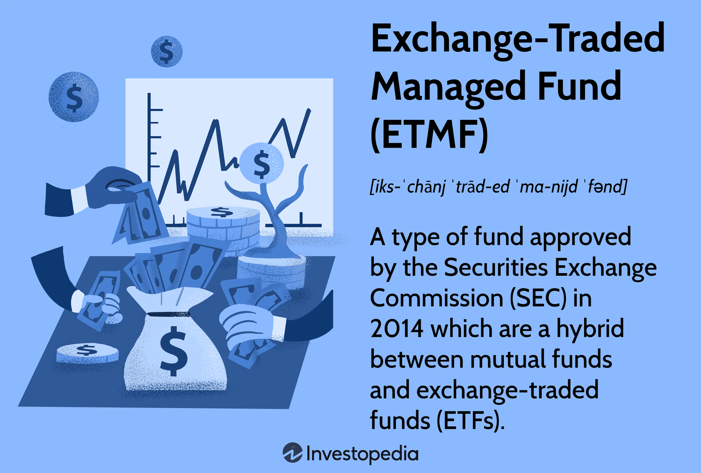

## Table of Contents

## What is an Exchange-Traded Managed Fund (ETMF)?

An Exchange-Traded Managed Fund (ETMF) is a type of investment fund that combines features of both mutual funds and exchange-traded funds (ETFs). Like mutual funds, ETMFs are actively managed, meaning that a professional manager makes decisions about which securities to buy and sell within the fund. However, like ETFs, ETMFs can be bought and sold throughout the trading day on a stock exchange at market prices, offering investors the flexibility to trade them just like stocks.

ETMFs are designed to provide investors with the benefits of active management while also offering the trading flexibility of ETFs. This means that investors can potentially benefit from the expertise of a professional manager who actively seeks to outperform the market, while also having the ability to buy or sell their shares at any time during trading hours. This combination of features makes ETMFs an attractive option for investors looking for both active management and intraday trading capabilities.

## How does an ETMF differ from a traditional mutual fund?

An ETMF and a traditional mutual fund are similar because they are both managed by professionals who choose what to buy and sell within the fund. But, there's a big difference in how you can buy and sell them. With a traditional mutual fund, you can only buy or sell your shares at the end of the trading day, based on the fund's net asset value (NAV). This means you have to wait until the market closes to know what price you'll get.

On the other hand, an ETMF lets you trade its shares throughout the trading day, just like you would with stocks. This means you can buy or sell at any time during the market hours, and the price will change based on what people are willing to pay at that moment. So, ETMFs give you more flexibility to react to market changes quickly, while traditional mutual funds are more set in their timing for transactions.

## What are the benefits of investing in an ETMF?

Investing in an ETMF can be a good choice because it gives you the best of both worlds. ETMFs are managed by experts who pick and choose investments to try and do better than the market. This is like having a professional help you make smart choices with your money. At the same time, ETMFs let you buy and sell them anytime during the trading day, just like stocks. This means you can quickly react to what's happening in the market and make trades when you think it's the right time.

Another benefit is that ETMFs can be more tax-efficient than traditional mutual funds. Because you can trade ETMFs throughout the day, there's less chance of the fund having to sell assets to meet redemption requests, which can trigger capital gains taxes. This means you might end up paying less in taxes over time. Plus, the ability to trade during the day gives you more control over your investments, which can be really helpful if you like to keep a close eye on your money and make changes as needed.

## Can you explain the structure and operation of an ETMF?

An ETMF is a special kind of investment fund that mixes the good parts of mutual funds and ETFs. It's set up so that a professional manager picks what to buy and sell within the fund, just like in a mutual fund. This manager is always working to make the fund's value go up. But, unlike a regular mutual fund, you can trade ETMFs anytime during the trading day, just like you would with a stock or an [ETF](/wiki/etf-trading-strategies). This means you can buy or sell your shares whenever you want, and the price will change based on what other people are willing to pay at that moment.

The way ETMFs work is pretty cool. They use a special system called a "NAV-based trading model." This means that the price of an ETMF share is based on the net asset value (NAV) of the fund, but with a twist. The price you see during the day isn't the exact NAV, but it's close to it. At the end of the day, the price gets adjusted to match the actual NAV. This helps keep things fair for everyone. Also, because you can trade ETMFs throughout the day, it's less likely that the fund will need to sell its assets to give money back to people who want to cash out, which can be good for taxes.

## What are the typical fees associated with ETMFs?

ETMFs, like other investment funds, have fees that you need to pay. These fees can include an expense ratio, which is a yearly fee that covers the cost of managing the fund. The expense ratio for ETMFs can be similar to those of mutual funds and ETFs, often ranging from about 0.1% to 1% or more, depending on the fund. This fee is taken out of the fund's assets, so it reduces the return you get.

There might also be trading fees when you buy or sell ETMFs. These are called brokerage commissions, and they depend on which broker you use. Some brokers might charge you a small fee each time you trade, while others might offer free trades but have other fees. It's important to check these costs because they can add up over time and affect how much money you make from your investment.

## How is the performance of an ETMF measured and reported?

The performance of an ETMF is measured and reported in a way that's easy for investors to understand. Just like with other investment funds, the main way to see how well an ETMF is doing is by looking at its net asset value (NAV). The NAV is the total value of all the investments in the fund minus any liabilities, divided by the number of shares. This number is calculated at the end of each trading day and shows what each share of the ETMF is worth. Investors can track the NAV over time to see if the fund's value is going up or down.

Another important way to measure ETMF performance is by comparing it to a benchmark, which is usually a stock or bond index. This helps investors see if the ETMF is doing better or worse than the overall market. ETMFs also report their returns, which show how much the fund has grown over certain periods, like one year, three years, or five years. These returns are often shown as percentages and can be compared to the returns of similar funds or the benchmark. By looking at these measures, investors can get a good idea of how their ETMF is performing and make smarter choices about their investments.

## What are the tax implications of investing in an ETMF?

Investing in an ETMF can have some tax benefits compared to traditional mutual funds. One big reason is that ETMFs can be more tax-efficient. This is because they can be traded throughout the day, which means the fund doesn't have to sell its investments as often to give money back to investors who want to cash out. When a fund sells its investments, it can create capital gains, which are then passed on to the investors and can lead to taxes. With ETMFs, this happens less often, so you might end up paying less in taxes.

However, just like with any investment, there can still be tax implications when you buy or sell ETMF shares. If you sell your shares for more than you paid for them, you'll have a capital gain, and you might have to pay taxes on that gain. The amount of tax depends on how long you held the shares. If you held them for a year or less, it's a short-term capital gain, and you'll be taxed at your regular income tax rate. If you held them for more than a year, it's a long-term capital gain, and the tax rate is usually lower. It's always a good idea to talk to a tax professional to understand how ETMFs might affect your taxes.

## How can one buy and sell shares of an ETMF?

Buying and selling shares of an ETMF is easy and works a lot like trading stocks. You can do it through a brokerage account, which is like a special bank account for buying and selling investments. Just log into your account, search for the ETMF you want by its ticker symbol, and place an order to buy or sell. You can choose to buy or sell at the current market price or set a specific price you're willing to pay or accept. Once you place your order, it goes to the stock exchange where other people are also buying and selling ETMF shares.

The cool thing about ETMFs is that you can trade them anytime during the trading day, not just at the end like with some other funds. This means you can react quickly to what's happening in the market. If you see a good opportunity or need to sell for any reason, you can do it right away. Just remember that the price you get will depend on what other people are willing to pay or accept at that moment, so it might be a bit different from the fund's net asset value (NAV) that's calculated at the end of the day.

## What are the risks involved in investing in ETMFs?

Investing in ETMFs comes with some risks, just like any other investment. One big risk is that the value of the ETMF can go up and down based on what's happening in the market. If the stocks or bonds that the ETMF holds don't do well, the value of your investment can drop. Also, since ETMFs are managed by people, there's a chance that the manager might make choices that don't work out as planned. This means the ETMF might not do as well as you hoped, or even lose money.

Another risk to think about is the cost of trading ETMFs. When you buy or sell shares, you might have to pay fees, like brokerage commissions. These costs can add up over time and eat into your returns. Plus, even though ETMFs can be more tax-efficient than some other funds, you still might have to pay taxes on any profits you make when you sell your shares. It's important to keep these costs and taxes in mind because they can affect how much money you actually make from your investment.

## How do ETMFs handle transparency and disclosure of their holdings?

ETMFs handle transparency and disclosure of their holdings a bit differently from some other funds. They don't have to tell everyone exactly what they own every day, like some ETFs do. Instead, they give out a general idea of what's in the fund, like the types of stocks or bonds they're investing in. This helps keep their strategy secret so other people can't copy it too easily. But, they do share the full list of their holdings every quarter, which means you get a detailed look at what they own, but not as often as with some other funds.

This way of handling transparency can be good for the people managing the ETMF because it lets them keep their best ideas private. But it might be a bit harder for investors who like to know exactly what they're investing in all the time. Still, the quarterly reports give you enough information to understand the fund's direction and make sure it fits with your investment goals. So, while ETMFs aren't as open about their daily moves, they still give you the info you need to stay informed.

## What role do ETMFs play in a diversified investment portfolio?

ETMFs can be a great addition to a diversified investment portfolio because they offer a mix of active management and the flexibility to trade throughout the day. Since ETMFs are managed by professionals who pick and choose investments, they can help you spread your money across different types of assets. This can lower your risk because if one investment doesn't do well, others might balance it out. Plus, because you can buy and sell ETMFs anytime during trading hours, you can quickly adjust your portfolio if you need to.

Adding ETMFs to your portfolio can also help you take advantage of different market opportunities. The professional managers of ETMFs are always looking for good investments, which means they can spot trends and opportunities that you might miss on your own. This active management can help your portfolio grow in ways that just following a broad market index might not. So, ETMFs can be a smart way to diversify and potentially boost your returns while keeping your investments flexible.

## How have regulatory changes affected the development and operation of ETMFs?

Regulatory changes have played a big role in how ETMFs have grown and worked over time. In the U.S., the Securities and Exchange Commission (SEC) has made rules that let ETMFs exist and trade. These rules have helped ETMFs become more popular because they let investors trade them during the day, just like stocks. The SEC has also made sure that ETMFs are fair and clear about what they're doing. This means ETMFs have to tell investors some basic stuff about their investments, even if they don't share everything every day.

These rules have also made it easier for ETMFs to be more tax-friendly. Because of the way the rules are set up, ETMFs don't have to sell their investments as often when people want to take their money out. This can help investors pay less in taxes. But, the rules can also change over time, so ETMFs have to keep up with new laws and make sure they're still doing things the right way. This means that how ETMFs work and grow can keep changing as the rules do.

## What is Understanding Managed Fund Investments?

Managed funds represent a sophisticated investment vehicle wherein capital is aggregated from a multitude of investors to create a diversified portfolio of assets. This collective approach allows individual investors to participate in large-scale investments that may otherwise be inaccessible due to high entry barriers. Managed funds can include a wide array of asset types such as equities, bonds, real estate, and more, thus offering a comprehensive exposure to various markets and sectors.

One defining characteristic of managed funds is their professional management. These funds are overseen by skilled fund managers who possess significant expertise in market analysis and asset selection. By leveraging their knowledge and access to resources, fund managers are able to make informed investment decisions, adjust strategies based on market conditions, and aim to achieve the highest possible returns for the investors. This level of professional oversight is a substantial advantage, particularly for individual investors who may lack the time, expertise, or resources to effectively manage their own portfolios.

Diversification is another critical benefit associated with managed funds. By spreading investments across a broad spectrum of asset classes, geographical regions, and industries, managed funds mitigate the impact of [volatility](/wiki/volatility-trading-strategies) inherent in individual assets. This diversification can significantly reduce the risk of substantial losses, as downturns in one sector may be offset by gains in another. The mathematical foundation for this risk reduction through diversification can be understood through the concept of variance and correlation in portfolio theory, often capturing the principle of reduced portfolio variance $\sigma_p^2$ as follows:

$$
\sigma_p^2 = \sum_{i=1}^{n} w_i^2 \sigma_i^2 + \sum_{i=1}^{n} \sum_{j \neq i} w_i w_j \sigma_i \sigma_j \rho_{ij}
$$

where $w_i$ and $w_j$ represent the weight of assets $i$ and $j$ in the portfolio, $\sigma_i$ and $\sigma_j$ are the standard deviations of asset returns, and $\rho_{ij}$ is the correlation between the returns of asset $i$ and asset $j$.

Furthermore, managed funds provide a level of customization and adaptability that appeals to a wide range of investors. Fund managers can tailor investment strategies to meet specific investor objectives, whether those objectives are growth-oriented, income-focused, or balanced between the two. This adaptable nature means managed funds can be aligned with individual risk appetites and investment timelines, thus broadening their appeal to both conservative and aggressive investors.

In summary, managed funds are a versatile investment solution that combines the expertise of professional management with the risk-reduction benefits of diversification. Their ability to cater to various investment goals while reducing exposure to market volatility makes them an attractive option for investors seeking a balanced, strategic approach to wealth accumulation.

## References & Further Reading

Investopedia provides extensive resources for understanding the dynamics of ETFs and [algorithmic trading](/wiki/algorithmic-trading). Articles such as "What Are ETFs?" and "Algorithmic Trading" offer foundational insights into these financial instruments and trading strategies.

For those interested in a deeper dive into algorithmic trading strategies and financial [machine learning](/wiki/machine-learning), several key [books](/wiki/algo-trading-books) can serve as invaluable resources. "Algorithmic Trading: Winning Strategies and Their Rationale" by Ernie Chan provides practical guidance on developing and implementing algorithmic trading strategies. Another essential read is "Advances in Financial Machine Learning" by Marcos López de Prado, which explores cutting-edge techniques in machine learning and their application to finance.

Industry reports are crucial for understanding the evolving trends in the ETF and managed fund markets. Reports from reputable firms such as BlackRock, Morningstar, and Vanguard provide comprehensive analyses of market growth, investor behavior, and future outlooks. These reports often highlight the impact of technological advancements and offer projections that are valuable for strategic planning.

White papers and academic journals focusing on the integration of technology in finance offer rigorous analyses and case studies. Journals such as the "Journal of Financial Markets" and the "Algorithmic Finance" journal publish peer-reviewed articles that explore the intersection of technology and financial markets. These publications are instrumental for those looking to understand the efficacy and risks associated with automated trading systems and the regulatory challenges they entail.

For further practical engagement, numerous online courses and tutorials on platforms like Coursera, edX, and Khan Academy offer modules on the mechanics and strategies of algotrading, allowing a practical deepening of knowledge with real-world applications. These educational tools are perfect complements to the theoretical and practical knowledge found in literature and reports.

