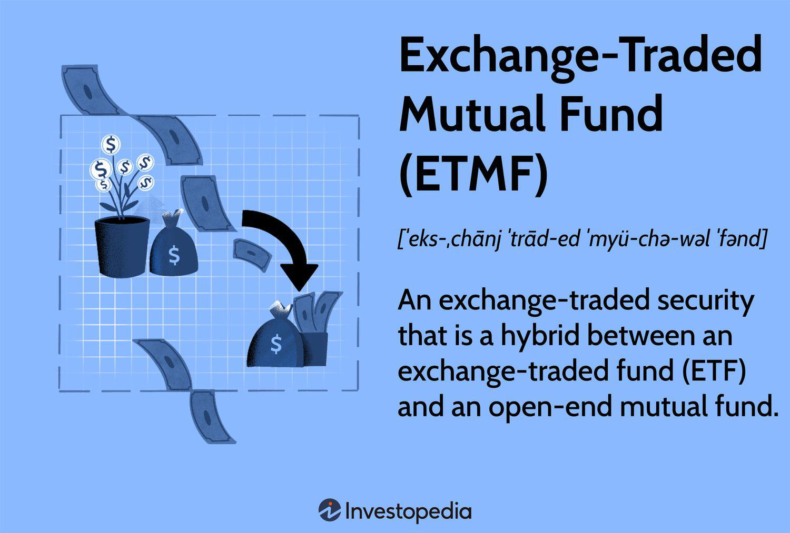

In recent years, the financial industry has witnessed rapid advancements in investment vehicles, leading to innovative solutions designed to meet the evolving needs of investors. Among these innovations, Exchange-Traded Mutual Funds (ETMFs) have emerged as a significant development, effectively bridging the gap between traditional mutual funds and Exchange-Traded Funds (ETFs). ETMFs combine the structural elements of both mutual funds and ETFs, offering the potential for enhanced efficiency and flexibility.

ETMFs trade in a manner similar to ETFs, allowing for real-time exchange transactions; however, they are uniquely valued based on their end-of-day Net Asset Value (NAV). This valuation method ensures greater transparency and accuracy in pricing, providing a blend of the benefits associated with both mutual funds and ETFs. Furthermore, by not disclosing daily portfolio holdings, ETMFs maintain a level of confidentiality often sought by investors seeking to protect proprietary investment strategies.



In parallel with the evolution of ETMFs, algorithmic trading has emerged as a powerful tool within asset management. This technologically advanced methodology uses complex algorithms to execute trades at optimal times, significantly enhancing trading efficiency. Within the context of ETMFs, algorithmic trading can automate and optimize trades in accordance with the fund's unique NAV-linked trading mechanism.

This article will explore ETMFs, their inherent advantages, and how the integration of algorithmic trading can enhance ETMF investment strategies. Through an analysis of the benefits of ETMF investments and the role of algorithmic trading, this piece aims to provide a comprehensive overview for investors interested in understanding and utilizing these sophisticated investment vehicles.

## Table of Contents

## What are Exchange-Traded Mutual Funds (ETMFs)?

Exchange-Traded Mutual Funds (ETMFs) are a financial innovation that blends the characteristics of Exchange-Traded Funds (ETFs) and mutual funds. ETMFs are designed to offer investors a unique investment vehicle that combines the real-time trading advantages of ETFs with the investment management features of traditional mutual funds.

One of the defining features of ETMFs is their trading mechanism. Unlike traditional mutual funds, which are priced once at the end of the trading day based on the net asset value (NAV), ETMFs are exchange-traded securities that allow investors to buy and sell shares throughout the trading day, akin to ETFs. This real-time trading capability provides investors with greater flexibility to react to market changes. However, despite being exchange-traded, ETMFs maintain the end-of-day NAV-based valuation to determine share prices. This structure enables them to offer the same inherent transparency and assurance provided by mutual funds, ensuring that investors pay or receive a fair price that reflects the fund's portfolio holdings and any accrued income.

A significant advantage of ETMFs over traditional ETFs is their approach to confidentiality. ETFs are required to disclose their holdings daily, which can expose their trading strategies to the public. In contrast, ETMFs protect investors' and fund managers' confidentiality by not disclosing daily portfolio holdings. This privacy ensures that the trading strategies are not affected by other market participants anticipating or copying them, which is particularly beneficial for actively managed funds seeking to maintain a competitive edge.

The combination of these factors makes ETMFs a compelling choice for investors who are looking for an investment vehicle that provides both the transparency and strategic benefits of a mutual fund, while also offering the flexibility and real-time trading opportunities of an [ETF](/wiki/etf-trading-strategies).

## Benefits of ETMF Investments

ETMFs, or Exchange-Traded Managed Funds, represent a significant advancement in investment vehicles, offering a blend of the traditional mutual fund and the exchange-traded fund (ETF). This hybrid model leverages the broad investment strategies typical of mutual funds, while encapsulating the efficiency and flexibility characteristic of ETFs. One of the primary advantages of ETMFs is their potential for tax efficiency. Unlike traditional mutual funds, which often incur capital gains taxes when portfolio managers buy or sell assets, ETMFs can mitigate this through mechanisms like "in-kind" transfers. These transfers allow for the exchange of securities without involving a cash transaction, potentially minimizing taxable events for the investor.

Additionally, ETMFs are designed to reduce portfolio trading costs. By trading based on net asset value (NAV) at the end of the day, ETMFs lower the price impact and market timing costs associated with intraday trading typical of ETFs. This structure can also lead to more efficient trading, as the trading execution is synchronized with the NAV, providing a transparent and predictable transaction environment.

A notable example in the ETMF space is Eaton Vance's NextShares, which has served as a trailblazer in demonstrating the long-term potential and viability of ETMFs. NextShares has shown that ETMFs can achieve competitive returns while maintaining operational efficiency and investor confidentiality by not disclosing daily portfolio holdings.

In summary, ETMFs provide investors with a strategic combination of mutual funds' comprehensive investment approaches and ETFs' operating efficiencies. The structural benefits, including tax efficiencies and reduced trading costs, make ETMFs a compelling option for investors seeking diversified investment strategies with enhanced operational benefits.

## Understanding Algorithmic Trading

Algorithmic trading employs sophisticated algorithms to execute trades at optimal moments, thereby enhancing efficiency and precision in the financial markets. By relying on predefined criteria and complex mathematical models, [algorithmic trading](/wiki/algorithmic-trading) systems can process vast amounts of market data, analyze it, and automatically make trading decisions without human intervention. This minimizes the risk of human errors, such as emotional trading and timing mistakes, and ensures that trades are executed based on consistent strategies.

The core advantage of algorithmic trading is its ability to handle high-frequency trading scenarios by utilizing real-time data inputs and executing multiple trades within fractions of a second. This capability is essential for financial instruments and trading environments that demand swift transaction processing, such as those linked to the net asset value (NAV) of securities.

In the context of managing Exchange-Traded Mutual Funds (ETMFs), algorithmic trading plays a crucial role due to the NAV-linked trading mechanism inherent in these financial instruments. ETMFs, which combine characteristics of mutual funds and ETFs, require precise and timely trades that reflect the end-of-day NAV calculations. Algorithmic trading systems are designed to align with these requirements, ensuring that trades are conducted with minimal slippage and at prices closely linked to the NAV, thereby maintaining the integrity and efficiency of the trading process.

The algorithms used can range from simple rule-based systems to advanced [machine learning](/wiki/machine-learning) models, depending on the complexity of the trading strategy and the nature of the market data being analyzed. For instance, a basic [arbitrage](/wiki/arbitrage) strategy might involve algorithms that exploit price discrepancies between ETMFs and their underlying portfolio values, while more complex strategies could implement pattern recognition through machine learning to anticipate market movements and adjust trading positions accordingly.

In summary, algorithmic trading is a pivotal tool in the trading of ETMFs, providing the necessary framework for executing precise and efficient trades that align with the NAV-linked nature of these funds. By leveraging the power of algorithms, traders can achieve greater consistency, reduce errors, and optimize the overall performance of their investment strategies.

## Integration of Algo Trading with ETMFs

Algorithmic trading, often referred to as algo trading, is integral to the effective functioning of Exchange-Traded Mutual Funds (ETMFs). By leveraging highly sophisticated algorithms, ETMFs can capitalize on rapid market movements to enhance investment returns. The primary mechanism through which algo trading interfaces with ETMFs is by automating the execution of trades, thereby enabling timely responses to market changes and minimizing human error.

Algo trading algorithms are adept at identifying and acting upon arbitrage opportunities, a process essential for maintaining optimal trading positions. Arbitrage involves exploiting price discrepancies across different markets or securities. In the context of ETMFs, these discrepancies can occur due to their unique trading structure, where shares are exchanged at a price reflecting the fund's net asset value (NAV) at the end of the trading day. Algorithms can detect and exploit these discrepancies in real-time, ensuring that trades align closely with the theoretical NAV, thereby protecting and potentially enhancing investor returns.

Beyond arbitrage, algo trading contributes to the efficient pricing of ETMFs. One significant benefit is the enhancement of [liquidity](/wiki/liquidity-risk-premium). Liquidity refers to the ability to buy or sell securities without causing a substantial shift in price. ETMFs, through algo trading strategies, can maintain liquidity even in volatile markets by executing trades that adjust supply and demand dynamics instantaneously.

In reducing operational costs, algo trading offers another crucial advantage for ETMFs. Traditional trading methods involve higher transaction costs due to reliance on manual processes and market timing, which can be inefficient and error-prone. Automated trading systems lower these costs by executing large volumes of trades quickly and with precision. This implies a reduction in bid-ask spreads and an overall more cost-effective trading approach.

In conclusion, the integration of algorithmic trading into ETMFs plays a pivotal role in enhancing financial performance by allowing these investment vehicles to respond swiftly and efficiently to market dynamics, minimize the cost structure, boost liquidity, and exploit arbitrage opportunities. This integration not only provides a competitive edge in the market but also offers investors attractive features and benefits.

## Investment Strategies using ETMFs and Algo Trading

Long-term investors often find value in leveraging algorithmic trading for strategic growth within Exchange-Traded Mutual Funds (ETMFs). By employing algorithms, investors can systematically adjust their portfolios to align with long-term market trends and forecasts. This structured approach enables investors to capitalize on potential growth opportunities while maintaining a disciplined strategy that minimizes human error and emotional biases.

For short-term traders, the real-time trading capabilities of ETMFs combined with algorithmic strategies present lucrative opportunities. Algo trading uses pre-defined criteria and rapid computation to exploit short-term market fluctuations and liquidity variations, allowing traders to execute numerous trades swiftly and efficiently. By continuously analyzing real-time market data, traders can optimize their positions and enhance returns through quick transactions.

Incorporating algorithmic strategies for portfolio diversification can be particularly effective with sector-specific ETMFs. Algorithms can be designed to continuously assess various sectors' performance metrics, risk factors, and macroeconomic indicators. By integrating these variables, algorithms can assist in reallocating investments among sector-specific ETMFs, ensuring a balanced and diversified portfolio tailored to current and predictive market conditions.

```python
import numpy as np

# Simple example of how a rebalancing algorithm might look
def rebalance_portfolio(weights, returns, target_weights, threshold=0.05):
    """
    Rebalance portfolio weights based on returns and target weights.

    Parameters:
    - weights: Current portfolio weights as a numpy array.
    - returns: Returns for each asset as a numpy array.
    - target_weights: Desired weights for each asset.
    - threshold: Threshold to trigger rebalancing.

    Returns:
    - New weights after rebalancing.
    """
    portfolio_return = np.dot(weights, returns)
    drift = weights * (1 + returns) / (1 + portfolio_return)
    new_weights = (drift / np.sum(drift))

    # Check for deviation from the target weights
    if np.any(np.abs(new_weights - target_weights) > threshold):
        new_weights = target_weights

    return new_weights

# Example usage
current_weights = np.array([0.3, 0.4, 0.3])
assumed_returns = np.array([0.05, 0.02, 0.03])  # hypothetical returns
target_weights = np.array([0.33, 0.33, 0.34])

new_weights = rebalance_portfolio(current_weights, assumed_returns, target_weights)
print(new_weights)
```

This Python snippet represents a simplified example of a portfolio rebalancing algorithm. By rebalancing based on target weights and returns, the algorithm maintains the desired allocation across various ETMFs, enhancing diversification and aligning with strategic investment goals. The result is an updated set of portfolio weights, reflecting a balanced approach aligned with market performance and investor objectives.

## Conclusion

Exchange-Traded Mutual Funds (ETMFs) are financial instruments that offer a combination of the advantages found in mutual funds and Exchange-Traded Funds (ETFs). This hybrid nature provides investors with a flexible and dynamic investment option that combines the diversification and professional management typical of mutual funds with the trading liquidity and transparency associated with ETFs.

One of the key advancements in the deployment and management of ETMFs is the integration of algorithmic trading. Algorithmic trading enhances the efficiency and timing of trades by utilizing complex algorithms that can process vast amounts of market data quickly and execute trades at optimal prices. This capability is particularly beneficial for ETMFs, as it ensures that trading decisions align closely with the Net Asset Value (NAV), minimizing discrepancies and potentially enhancing return on investment.

Algorithmic trading supports ETMFs by providing liquidity and reducing transaction costs, which are essential in maintaining the competitiveness of these investment vehicles. The ability to swiftly respond to market changes and capitalize on arbitrage opportunities positions ETMFs as robust tools in an investor's portfolio.

As part of a diversified investment strategy, investors are encouraged to consider ETMFs due to these sophisticated features. When combined with algorithmic trading, ETMFs not only improve the efficiency of trade execution but also potentially enhance long-term returns through strategic management. By incorporating ETMFs into their financial plans, investors can leverage the benefits of innovation in the financial markets while maintaining a balanced and well-managed investment portfolio.

## References & Further Reading

[1]: Bjork, T. (2009). ["Arbitrage Theory in Continuous Time."](http://www.nigerianwomeninmaths.org/cs/books/Tomas%20Bjork-Arbitrage%20Theory%20in%20Continuous%20Time%20(Oxford%20Finance)%20(2009)%20(1).pdf) Oxford University Press.

[2]: Hasbrouck, J. (2007). ["Empirical Market Microstructure: The Institutions, Economics, and Econometrics of Securities Trading."](https://academic.oup.com/book/52241) Oxford University Press.

[3]: Cartea, Á., Jaimungal, S., & Penalva, J. (2015). ["Algorithmic and High-Frequency Trading."](https://assets.cambridge.org/97811070/91146/frontmatter/9781107091146_frontmatter.pdf) Cambridge University Press.

[4]: Kosev, M., & Williams, T. (2011). ["Exchange-Traded Funds."](https://www.rba.gov.au/publications/bulletin/2011/mar/bu-0311-8a.html) Reserve Bank of Australia Bulletin.

[5]: Lopez de Prado, M. (2018). ["Advances in Financial Machine Learning."](https://www.amazon.com/Advances-Financial-Machine-Learning-Marcos/dp/1119482089) Wiley.