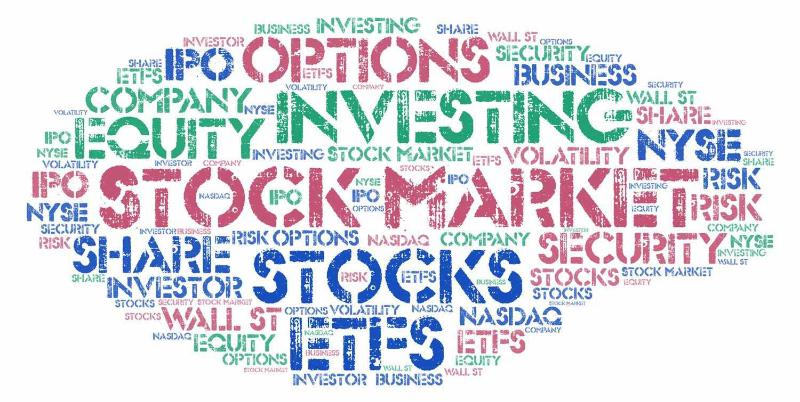

Financial derivatives, particularly exchange-traded options, are pivotal instruments in contemporary investment strategies. These derivatives offer investors a structured mechanism to manage risk, harness market fluctuations, and enhance portfolio performance. Exchange-traded options are standardized contracts available on regulated exchanges, which ensures transparency and a secure trading environment. This standardization is crucial for liquidity and efficient market functioning, making these options accessible to a broad spectrum of investors.

The advent of algorithmic trading, commonly referred to as algo trading, has significantly transformed the derivatives trading landscape. Algoritmic trading leverages computer algorithms to execute trades at speeds and efficiencies far beyond what manual trading can achieve. By processing vast amounts of market data in real-time, algo trading systems can detect and act on market opportunities within milliseconds, thus optimizing trading outcomes.



This article investigates the advantages of investing in exchange-traded options, examining how algorithmic trading can enhance these benefits. We will explore the foundational aspects of exchange-traded options, including their market dynamics, and discuss how the integration of algo trading strategies can optimize investment returns. Through a comprehensive understanding of these elements, investors can better position themselves to navigate and capitalize on evolving market conditions.

## Table of Contents

## Understanding Exchange-Traded Options

Exchange-traded options are standardized financial contracts that provide investors the opportunity to buy or sell an underlying asset at a predetermined price before a specified expiration date. These contracts are fundamental components of the financial markets, facilitating diverse trading strategies and risk management approaches.

A distinctive feature of exchange-traded options is their listing on regulated exchanges, such as the Cboe Options Exchange. The listing process involves a standardized framework for option contracts, ensuring uniformity and consistency in terms, like the contract size, expiration dates, and strike prices. This standardization enhances market liquidity, permitting ease in trade execution and enabling traders to enter or exit positions efficiently.

The role of clearinghouses such as the Options Clearing Corporation (OCC) is crucial in exchange-traded options. These entities act as intermediaries between buyers and sellers, thus mitigating counterparty risk. By guaranteeing the performance of options contracts, clearinghouses fortify the market's integrity, affording participants a secure trading environment.

Regulatory oversight by agencies such as the Securities and Exchange Commission (SEC) and the Commodity Futures Trading Commission (CFTC) is essential in maintaining the legitimacy and transparency of options markets. These regulators implement stringent guidelines for trading practices, ensuring that options markets operate fairly and securely, thus protecting investors.

Exchange-traded options are celebrated for their versatility, empowering traders to engage in a wide spectrum of strategies. They are instrumental in income generation — often through covered call strategies and cash-secured puts — as well as in speculative approaches to capitalize on anticipated price movements of underlying assets. Additionally, options are a quintessential tool for hedging, allowing investors to protect against adverse price shifts in stocks, indices, or commodities.

The ability to craft tailored strategies using options makes them attractive to a broad demographic of investors, from individuals to large institutional players. Their strategic flexibility, coupled with the robustness provided by standardization and regulation, cements exchange-traded options as a pivotal asset in modern financial portfolios.

## Benefits of Investing in Exchange-Traded Options

Exchange-traded options offer a variety of benefits to investors, making them a valuable tool in modern financial markets. Primarily, they serve as essential instruments for risk management. By securing specific prices for stocks, indices, or commodities, investors can hedge against potential losses in their portfolios. This feature allows for better stability and predictability in investment outcomes, safeguarding against adverse price movements.

Another significant advantage of exchange-traded options is leverage. Leverage allows investors to achieve substantial returns with only a modest capital commitment. For example, purchasing options instead of the underlying asset itself can yield proportional returns magnified by the option's inherent leverage. This means that an investor can control a larger position than would be possible by directly buying the asset, potentially amplifying gains.

The standardization and regulation of exchange-traded options play a crucial role in reducing counterparty risk, providing a reliable and secure investment platform. Options contracts are standardized, meaning their terms, such as expiration dates and strike prices, are uniform and well-defined. This standardization ensures that all participants in the market have clear expectations and understand the product they are trading. Alongside regulation by entities such as the Securities and Exchange Commission (SEC) and the Commodity Futures Trading Commission (CFTC), this creates a transparent market environment that protects investors from fraud and market manipulation.

Liquidity is another vital benefit inherent in options markets. The high [liquidity](/wiki/liquidity-risk-premium) levels in these markets enable traders to efficiently enter and [exit](/wiki/exit-strategy) positions. This fluidity results in tighter bid-ask spreads, lowering the cost of transactions for investors and enhancing overall market efficiency. High liquidity also minimizes price slippage, ensuring that trades are executed at prices close to the investor’s targets.

Finally, exchange-traded options facilitate speculative strategies that capitalize on market [volatility](/wiki/volatility-trading-strategies) and price fluctuations. By utilizing options, investors can profit in both rising and falling markets, employing strategies like straddles, strangles, and spreads to take advantage of market movements. Options provide the flexibility to tailor positions based on market expectations and individual risk appetites, making them a powerful tool for speculation.

In summary, exchange-traded options are instrumental for risk management, leverage, reduced counterparty risk, liquidity, and speculative opportunities. Their structured and regulated nature makes them an appealing choice for a wide array of investors aiming to navigate and optimize the complexities of financial markets.

## The Role of Algorithmic Trading in Options Investment

Algorithmic trading has transformed options trading by providing traders the capability to manage trades with exceptional speed, accuracy, and efficiency. By utilizing algorithms, traders can process large quantities of market data in real-time, which enables them to identify and capitalize on fleeting market opportunities that would be missed in manual trading.

Algorithms have the ability to optimize various trading strategies, such as [market making](/wiki/market-making), [arbitrage](/wiki/arbitrage), and spread trading. Market making involves placing buy and sell orders for a security simultaneously to capture the bid-ask spread. Algorithms can analyze market depth and historical volatility to optimize price quotes and manage inventory risks effectively.

Arbitrage strategies also greatly benefit from [algorithmic trading](/wiki/algorithmic-trading). By identifying price discrepancies across different markets or securities, algorithms can execute trades instantly to exploit these inefficiencies, restoring pricing equilibrium and ensuring profits. The precision with which algorithms operate allows for capturing these fleeting opportunities, which may last only seconds.

Spread trading, another commonly used strategy, involves taking positions in two or more options to capitalize on expected changes in their relative prices. Algorithmic execution can ensure the timely placement and adjustment of positions, which is vital in volatile markets where prices can shift rapidly.

Another significant advantage of algorithmic trading is the reduction of human emotional and psychological biases that might negatively affect trading decisions. Traders often encounter emotions such as fear and greed, which can lead to inconsistent decision-making. Algorithms, being devoid of emotions, ensure that trading strategies are implemented systematically, providing more consistent performance over time.

Furthermore, the use of automated systems in options trading enhances execution speed and reduces transaction costs. Algorithms can scan multiple markets simultaneously, execute trades at the best available prices, and manage orders based on pre-defined criteria, ensuring optimal trade execution. This not only facilitates tighter bid-ask spreads but also contributes to overall market liquidity.

In practice, consider the Python library `pandas` for managing large datasets and `numpy` for mathematical calculations involved in algorithmic strategies. Here's a basic Python example of a moving average strategy:

```python
import pandas as pd
import numpy as np

# Example market data - typically retrieved from a financial data API
data = {'Date': ['2023-01-01', '2023-01-02', '2023-01-03'],
        'Price': [100, 102, 101]}
df = pd.DataFrame(data)

# Calculate a simple moving average
df['SMA'] = df['Price'].rolling(window=2).mean()

# Define a simple trading strategy
df['Signal'] = np.where(df['Price'] > df['SMA'], 1, 0)

print(df)
```

This code computes a simple moving average and generates trading signals based on whether the current price is above the moving average. While rudimentary, this model illustrates how basic algorithmic trading systems can be implemented and scaled to complex strategies in real-world applications, contributing to more efficient markets and improved investment outcomes.

## Choosing the Right Algorithmic Trading Strategy

Selecting the right algorithmic trading strategy requires a nuanced understanding of various factors including an investor's objectives, risk tolerance, and the prevailing market conditions. Here, we explore some of the most common strategies and considerations involved in their selection and implementation.

Momentum trading harnesses the [momentum](/wiki/momentum) of asset price movements. The core principle is that assets which have performed well recently will continue to do so in the near term. Conversely, assets that have performed poorly are expected to continue their descent. This strategy often involves technical indicators such as moving averages or relative strength indices to identify and capitalize on trends.

Arbitrage exploits price discrepancies of the same or similar financial instruments in different markets or forms. The efficiency of algorithms allows traders to quickly identify and act on these discrepancies before they naturally resolve. Common forms include spatial arbitrage, which takes advantage of price differences across exchanges, and temporal arbitrage, which seeks to profit from price lags over time.

Statistical arbitrage involves using quantitative models to identify and trade on pricing inefficiencies across correlated instruments. By employing statistical methods like mean reversion or co-integration, traders can forecast short-term returns. The precision of algorithms in processing and analyzing large datasets boosts the effectiveness of this strategy.

Backtesting is indispensable in the development of any algorithmic strategy as it uses historical data to simulate trades, evaluating the potential performance of the strategy. This benchmarking process helps in refining the algorithm parameters and assessing risk-adjusted returns. Traders can use various software tools to backtest their strategies in Python, utilizing libraries like [backtrader](/wiki/backtrader) or zipline for efficient analysis.

```python
import backtrader as bt

# Define a simple moving average trading strategy
class SmaCross(bt.Strategy):
    def __init__(self):
        self.sma1 = bt.indicators.SimpleMovingAverage(self.data.close, period=10)
        self.sma2 = bt.indicators.SimpleMovingAverage(self.data.close, period=30)

    def next(self):
        if self.sma1 > self.sma2 and not self.position:
            self.buy()
        elif self.sma1 < self.sma2 and self.position:
            self.sell()

# Setup the backtest
cerebro = bt.Cerebro()
cerebro.addstrategy(SmaCross)
data = bt.feeds.YahooFinanceData(dataname='AAPL', fromdate=datetime(2020, 1, 1), todate=datetime(2021, 1, 1))
cerebro.adddata(data)
cerebro.run()

# Plot the results
cerebro.plot()
```

The technological infrastructure forms the backbone of successful algorithmic trading. Investors must ensure they have the requisite computational power and data feeds for real-time data access and processing. Reliable hardware and high-speed internet connectivity are crucial in minimizing latency and avoiding slippage, which can adversely affect the execution of trades.

Ultimately, the choice of an algorithmic trading strategy hinges on aligning it with the trader’s financial goals and risk appetite while considering the technological demands and market environment. Through careful selection and robust testing, traders can develop strategies that effectively capitalize on market opportunities.

## Challenges and Considerations

Algorithmic trading, while advantageous, presents several challenges that investors must navigate. One primary concern is the significant requirement for robust technological infrastructure. High-frequency trading, for instance, demands systems capable of processing and executing trades within microseconds. This necessitates substantial investment in hardware, network capabilities, and data processing speed to maintain a competitive edge.

Market volatility further complicates algorithmic trading. Fluctuations in asset prices can lead to inconsistent performance of algorithms, which are often designed based on historical data and expected market conditions. To address this, continuous adjustment and real-time monitoring of algorithms are imperative, ensuring they remain effective even as market dynamics evolve. For example, using real-time data feeds and adaptive algorithms that can recalibrate their parameters based on current market conditions can mitigate some volatility risks.

Regulatory compliance is another critical aspect. As regulatory bodies like the U.S. Securities and Exchange Commission (SEC) and the Commodity Futures Trading Commission (CFTC) impose strict guidelines to prevent market manipulation and ensure fairness, traders must ensure that their algorithms adhere to these regulations. Non-compliance may result in heavy penalties and sanctions. As such, it is crucial for firms to integrate legal compliance checks within their trading algorithms.

Operational risks present further challenges, including system failures and latency issues. A minor glitch in the system or delay in data transmission can lead to significant financial losses, especially in high-frequency trading scenarios where opportunities can be both fleeting and costly. Building redundancies and infrastructure resilience is essential. Employing strategies such as fault tolerance systems and real-time diagnostic tools can help mitigate these risks. For instance, implementing automated failover systems can ensure that trading operations continue smoothly in the event of a primary system failure.

Developing a comprehensive risk management framework is paramount for managing exposure, particularly during volatile market conditions or unforeseen events, such as geopolitical crises or sudden economic shifts. This framework should include stress testing, scenario analysis, and contingency planning to evaluate and prepare for potential loss scenarios. Technologically, it might involve utilizing [machine learning](/wiki/machine-learning) models that can predict and respond to volatility spikes, enhancing resilience and adaptability.

In summary, while algorithmic trading has transformed the financial landscape by offering efficiency and the ability to capitalize on intricate market dynamics, it requires meticulous attention to technological, regulatory, and operational challenges to fully realize its potential and safeguard against potential pitfalls.

## Conclusion

Exchange-traded options are valued by investors for their versatility, liquidity, and ability to manage risk. These attributes make them an appealing investment tool, allowing for diverse strategies such as hedging, speculation, and income generation. The standardized nature of these contracts and their exchange-based trading contribute to a higher degree of transparency and security, which is essential for both individual and institutional investors.

As technology advances, algorithmic trading has become crucial in enhancing investment returns and reducing risks in options trading. This method leverages computational algorithms to execute trades at speeds and efficiencies unattainable by humans. Algorithmic trading offers a competitive edge by utilizing complex strategies, like arbitrage and market making, with precision and real-time data analysis. 

Despite the apparent benefits, algorithmic trading presents challenges that must be thoughtfully addressed. A carefully crafted trading strategy can overcome these challenges by effectively harnessing the advantages of algorithmic methods. Key elements of a successful strategy include comprehensive [backtesting](/wiki/backtesting), continuous monitoring, and adaptive risk management to respond to the ever-changing market conditions.

For investors interested in incorporating algorithmic trading into their options trading strategy, focusing on education and continuous learning is imperative. Ensuring robust technological infrastructure and implementing resilient systems are vital to navigating these financial markets effectively. 

As the financial landscape continues to evolve, the combination of options trading and algorithmic strategies is expected to offer expanded opportunities. For investors who are well-prepared and proactive, this synergy can lead to innovative investment prospects and enhanced portfolio performance.

## References & Further Reading

[1]: Bergstra, J., Bardenet, R., Bengio, Y., & Kégl, B. (2011). ["Algorithms for Hyper-Parameter Optimization."](https://dl.acm.org/doi/10.5555/2986459.2986743) Advances in Neural Information Processing Systems 24.

[2]: ["Advances in Financial Machine Learning"](https://www.amazon.com/Advances-Financial-Machine-Learning-Marcos/dp/1119482089) by Marcos Lopez de Prado

[3]: ["Evidence-Based Technical Analysis: Applying the Scientific Method and Statistical Inference to Trading Signals"](https://www.amazon.com/Evidence-Based-Technical-Analysis-Scientific-Statistical/dp/0470008741) by David Aronson

[4]: ["Machine Learning for Algorithmic Trading"](https://github.com/stefan-jansen/machine-learning-for-trading) by Stefan Jansen

[5]: ["Quantitative Trading: How to Build Your Own Algorithmic Trading Business"](https://www.amazon.com/Quantitative-Trading-Build-Algorithmic-Business/dp/1119800064) by Ernest P. Chan

[6]: Chance, Don M., and Brooks, Robert. (2015). ["An Introduction to Derivatives and Risk Management."](https://books.google.com/books/about/Introduction_to_Derivatives_and_Risk_Man.html?id=b8PgBQAAQBAJ) Cengage Learning.

[7]: Hull, John C. (2017). ["Options, Futures, and Other Derivatives."](https://www.semanticscholar.org/paper/Options%2C-Futures%2C-and-Other-Derivatives-Hull/89bdee500c8623864fc9eb7a471546aa713acc44) Pearson Education Limited.

[8]: Harris, Larry. (2003). ["Trading and Exchanges: Market Microstructure for Practitioners."](https://www.amazon.com/Trading-Exchanges-Market-Microstructure-Practitioners/dp/0195144708) Oxford University Press.