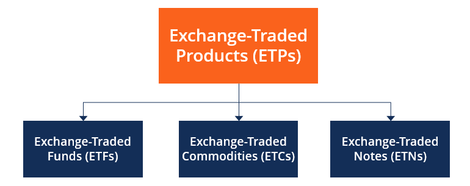

## Table of Contents

## What is an Exchange-Traded Product (ETP)?

An Exchange-Traded Product (ETP) is a type of investment that is traded on a stock exchange, similar to stocks. It's designed to track the performance of an underlying asset, like a commodity, currency, or a basket of assets, such as an index. ETPs can be bought and sold throughout the trading day at market prices, making them very flexible for investors.

There are different types of ETPs, including exchange-traded funds (ETFs), exchange-traded notes (ETNs), and exchange-traded commodities (ETCs). Each type has its own features and risks. For example, ETFs often track a broad market index like the S&P 500, while ETNs are debt instruments issued by banks that promise to pay based on the performance of a specific index. ETPs offer investors a way to diversify their portfolios and gain exposure to various markets without having to buy the assets directly.

## How does an ETP differ from a mutual fund?

An ETP, or Exchange-Traded Product, and a mutual fund are both investment options, but they work differently. An ETP trades on a stock exchange like a stock, which means you can buy and sell it anytime during the trading day at the current market price. On the other hand, a mutual fund is bought and sold at the end of the trading day based on its net asset value (NAV), which is calculated after the market closes. This means if you want to buy or sell a mutual fund, you have to wait until the end of the day to get the price.

Another difference is how they are managed and what they track. ETPs often try to match the performance of a specific index, commodity, or asset, and they can be passively managed, meaning they just follow the index without trying to beat it. Mutual funds can be actively managed, where a fund manager picks and chooses investments to try to outperform the market, or they can be passively managed too. Also, ETPs can be more tax-efficient because of how they are structured, while mutual funds might have more tax implications due to the way they handle gains and losses.

## What are the main types of ETPs?

The main types of ETPs are Exchange-Traded Funds (ETFs), Exchange-Traded Notes (ETNs), and Exchange-Traded Commodities (ETCs). ETFs are the most common type of ETP. They usually track a stock index, like the S&P 500, or a basket of stocks. ETFs are popular because they let you invest in many different stocks or other assets at once, which can help spread out your risk. They are also easy to buy and sell on the stock market.

ETNs are a bit different. They are debt instruments issued by banks, and they promise to pay you based on the performance of a specific index or asset. Unlike ETFs, ETNs don't actually own the assets they track. Instead, they rely on the bank's promise to pay. This can make them riskier, but they can also be useful for investing in hard-to-reach markets. ETCs focus on commodities like gold, oil, or agricultural products. They let you invest in these commodities without having to buy them directly, which can be easier and more convenient.

Each type of ETP has its own benefits and risks. ETFs are generally seen as safer and more straightforward, while ETNs and ETCs can offer more specialized investment opportunities but come with additional risks. Understanding these differences can help you choose the right ETP for your investment goals.

## Can you explain the difference between an ETF and an ETN?

An [ETF](/wiki/etf-trading-strategies), or Exchange-Traded Fund, is like a basket of investments that you can buy and sell on the stock market. It usually follows the performance of a group of stocks, like the S&P 500, or other assets like bonds. When you buy an ETF, you're actually buying a small piece of all the things inside it. This can help spread out your risk because you're not putting all your money into just one stock. ETFs are popular because they are easy to buy and sell, and they can be a good way to invest in a lot of different things at once.

An ETN, or Exchange-Traded Note, is different because it's a promise from a bank to pay you based on how well a certain index or asset does. Unlike ETFs, ETNs don't hold the actual assets they track. Instead, they rely on the bank's promise to pay you the return of the index. This can make them riskier because if the bank gets into trouble, you might not get your money back. ETNs can be useful for investing in things that are hard to buy directly, but they come with extra risks that you need to think about before investing.

## What are the benefits of investing in ETPs?

Investing in ETPs can help you spread your money across many different things, like stocks, bonds, or even commodities, without having to buy them one by one. This can make your investments safer because if one thing goes down, the others might help balance it out. Plus, ETPs are easy to buy and sell on the stock market, just like regular stocks. This means you can quickly change your investments whenever you want during the trading day.

ETPs can also be a good way to get into markets that might be hard to invest in otherwise. For example, if you want to invest in gold or a foreign stock market, an ETP can make it easier without having to deal with the hassle of buying those things directly. Also, many ETPs are designed to follow a certain index or group of assets, which can help keep your investment costs lower than if you were trying to pick and choose your own stocks.

## What are the risks associated with ETPs?

Investing in ETPs comes with some risks that you should know about. One big risk is the market risk, which means the value of the ETP can go up and down based on how the things it's tracking are doing. If the stocks, bonds, or commodities in the ETP go down in value, your investment will too. Another risk is the [liquidity](/wiki/liquidity-risk-premium) risk. This means it might be hard to buy or sell the ETP quickly at a good price, especially if not many people are trading it. If you need to sell your ETP fast and there aren't many buyers, you might have to sell it for less than you wanted.

There's also the risk that comes with the type of ETP you're investing in. For example, if you're investing in an ETN, you're relying on a bank's promise to pay you based on how well an index does. If the bank gets into financial trouble, you might not get your money back. ETFs have their own risks too, like tracking error, where the ETF doesn't follow the index it's supposed to as closely as you'd hope. This can happen because of fees or other costs that eat into the ETF's returns. Understanding these risks can help you make smarter choices about which ETPs to invest in.

## How are ETPs traded and what are the trading hours?

ETPs are traded on stock exchanges, just like regular stocks. This means you can buy and sell them through a broker during the trading day. The price of an ETP can change throughout the day, so you can see what it's worth and decide when to trade. This is different from mutual funds, which you can only buy or sell at the end of the day based on a set price.

The trading hours for ETPs depend on the stock exchange they are listed on. In the United States, for example, most ETPs are traded on the New York Stock Exchange (NYSE) or the NASDAQ, which are open from 9:30 AM to 4:00 PM Eastern Time, Monday through Friday. Some ETPs might also be available to trade in after-hours sessions, but the main trading happens during these regular hours. It's a good idea to check the specific exchange and trading hours for the ETP you're interested in before you start trading.

## What fees are associated with ETPs?

When you invest in ETPs, you might have to pay some fees. One common fee is the expense ratio, which is a yearly fee that the ETP charges to cover its costs. This fee is a percentage of your investment and can make your returns a bit smaller. Another fee you might see is the trading commission, which is what your broker charges you every time you buy or sell the ETP. Not all brokers charge this fee, so it's good to check before you start trading.

There can also be other fees depending on the type of ETP and how you trade it. For example, some ETPs might have a bid-ask spread, which is the difference between the price someone is willing to buy the ETP for and the price someone is willing to sell it for. This isn't exactly a fee, but it can affect how much you pay or get when you trade. Also, if you're trading in a retirement account, you might have to pay extra fees for things like account maintenance or early withdrawals. It's important to understand all these costs so you can make the best choices for your investments.

## How do ETPs generate returns for investors?

ETPs generate returns for investors by tracking the performance of the assets they hold or the index they follow. When the value of the stocks, bonds, commodities, or other assets inside the ETP goes up, the value of the ETP usually goes up too. This means if you own the ETP, your investment can grow. Sometimes, ETPs might also pay dividends if the assets they hold pay dividends. These dividends can be reinvested to buy more shares of the ETP or taken as cash, adding to your overall returns.

However, ETPs can also lose value if the assets they track go down in price. This is why it's important to understand what the ETP is invested in. Some ETPs might use strategies like lending out securities or investing in derivatives to try to boost their returns, but these strategies can also add more risk. Overall, the returns from ETPs come from the changes in the value of their underlying assets and any income they generate, like dividends, but they can be affected by fees and other costs.

## What role do ETPs play in portfolio diversification?

ETPs can help you spread your money across different types of investments, which is called diversification. When you invest in an ETP, you're not just putting your money into one stock or bond. Instead, you're investing in a whole bunch of them at once. This can make your investments safer because if one thing doesn't do well, the others might help balance it out. For example, if you buy an ETP that tracks the S&P 500, you're getting a piece of 500 different companies, not just one.

Using ETPs for diversification can also help you get into markets that might be hard to reach otherwise. You can invest in things like gold, foreign stocks, or even real estate without having to buy those things directly. This can make it easier to have a well-rounded investment plan. By spreading your investments across different types of assets with ETPs, you can lower your risk and maybe even get better returns over time.

## How are ETPs regulated and what are the key regulatory bodies involved?

ETPs are watched over by different groups to make sure they follow the rules and protect people who invest in them. In the United States, the main group that looks after ETPs is the Securities and Exchange Commission (SEC). The SEC makes rules that ETPs have to follow, like how they need to tell people what they're investing in and how much they're charging in fees. They also check to make sure ETPs are being honest about how they're doing and that they're not doing anything risky that could hurt investors.

Another important group is the Financial Industry Regulatory Authority (FINRA). FINRA helps make sure that the people and companies selling ETPs are doing it the right way. They check to make sure brokers are giving good advice and not charging too much. Together, the SEC and FINRA work to keep the ETP market fair and safe for everyone. If you're thinking about investing in ETPs, knowing that these groups are watching out for you can give you some peace of mind.

## What advanced strategies can investors use with ETPs to enhance returns?

Investors can use a few smart tricks with ETPs to try to get better returns. One way is by using leverage, which means borrowing money to invest more than you have. Some ETPs are designed to do this, like leveraged ETFs, which can make your gains bigger but also your losses. Another trick is called short selling, where you bet that an ETP's price will go down. You can do this with inverse ETFs, which go up when the market goes down. These strategies can be risky, so you need to know what you're doing and be ready for big ups and downs.

Another strategy is to use sector rotation, where you move your money into different types of ETPs based on what's doing well in the market at different times. For example, if technology stocks are doing great, you might put more money into a tech ETF. When the market changes, you can switch to another sector, like healthcare or energy. This can help you catch the best parts of the market cycle. Also, some investors use options with ETPs, like buying call or put options, to make money from their guesses about where the market is going. These advanced moves can help boost your returns, but they need a lot of care and understanding to work well.

## References & Further Reading

[1]: Hull, J. C. (2018). *Options, Futures, and Other Derivatives*. Pearson. 

[2]: Chan, E. (2017). *Algorithmic Trading: Winning Strategies and Their Rationale*. Wiley.

[3]: Hendershott, T., & Riordan, R. (2013). Algorithmic Trading and the Market for Liquidity. *Journal of Financial and Quantitative Analysis, 48*(4), 1001-1024.

[4]: Hasbrouck, J., & Saar, G. (2013). Low-latency trading. *Journal of Financial Markets, 16*(4), 646-679.

[5]: Investopedia. (n.d.). *Exchange-Traded Product (ETP)*. [Investopedia](https://www.investopedia.com/terms/e/exchange-traded-products-etp.asp).

[6]: Financial Times. (n.d.). *Algorithmic Trading*. [FT](https://www.ft.com/content/447f9832-c9c6-11df-b3d6-00144feab49a).

[7]: Narang, R. K. (2013). *Inside the Black Box: A Simple Guide to Quantitative and High Frequency Trading*. Wiley. 

[8]: Griffiths, M. D., & Webster, I. (2019). *Quantitative Trading Systems and Implementable Strategies*. Available at SSRN: [Quantitative Trading](https://www.quantifiedstrategies.com/quantitative-trading-strategies/). 