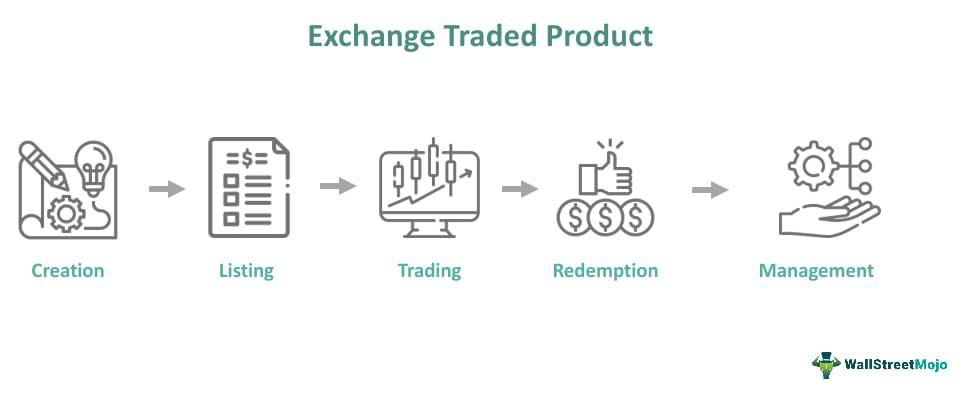

Financial instruments are essential components of global markets, acting as vehicles for the flow of capital and the transfer of risk. They encompass a wide range of assets, including equities, bonds, derivatives, and foreign exchange products, each serving distinct functions in financial ecosystems. These instruments enable investors to allocate capital efficiently, companies to raise funds, and economies to foster growth and development. Their importance in global markets lies in their ability to facilitate liquidity, price discovery, and risk management, all of which are fundamental for maintaining market stability and fostering economic development.

Exchange-Traded Products (ETPs) represent a modern category of financial instruments that have gained significant traction in recent years. ETPs include Exchange-Traded Funds (ETFs), Exchange-Traded Notes (ETNs), and Exchange-Traded Commodities (ETCs), each offering unique advantages to investors. Unlike traditional mutual funds, which are priced at the end of the trading day, ETPs trade on stock exchanges, allowing investors to buy and sell throughout the trading session. This liquidity, combined with generally lower fees and greater transparency, has enhanced their popularity among both retail and institutional investors. The growing variety and volume of ETPs reflect their adaptability to various investment strategies and market conditions.

Algorithmic trading has revolutionized the landscape of financial markets, including the ETP sector. By utilizing complex algorithms to execute trades at high speeds and volumes, this method has drastically altered how investors interact with markets. In the context of ETPs, algorithmic trading contributes to enhanced liquidity and market depth, making it easier for investors to execute trades with minimal price impact. Furthermore, algorithmic strategies can improve price accuracy and reduce transaction costs through techniques such as market making, arbitrage, and trend following.

This article aims to provide readers with a comprehensive understanding of financial instruments, focusing on the intersection of ETPs and algorithmic trading. We will explore the characteristics and benefits of ETPs, delve into the mechanisms of algorithmic trading, and examine how the conjunction of these two elements impacts market efficiency and investor strategies. Through this investigation, readers will gain insights into the dynamic relationship between innovative trading methodologies and contemporary financial instruments, equipping them with knowledge to better navigate modern financial markets.

## Table of Contents

## Understanding Exchange-Traded Products (ETPs)

Exchange-Traded Products (ETPs) are a broad category of financial instruments traded on stock exchanges, offering investors an efficient way to gain exposure to various asset classes, including equities, commodities, and indices. They provide significant advantages in terms of liquidity and transparency compared to some traditional investment vehicles.

### Types of ETPs

1. **Exchange-Traded Funds (ETFs)**: ETFs are investment funds that track indices, sectors, commodities, or other assets. They provide similar exposure to that of individual stocks and can be bought and sold throughout the trading day at market prices. They offer diversification benefits and come with lower expense ratios compared to mutual funds. [1]

2. **Exchange-Traded Notes (ETNs)**: ETNs are unsecured debt securities issued by banks that track an underlying index or asset. Unlike ETFs, ETNs do not hold assets in a fund but instead, rely on the issuing bank's credit. ETNs offer tax efficiency and exposure to hard-to-access markets but carry credit risk tied to the issuer. [2]

3. **Exchange-Traded Commodities (ETCs)**: ETCs allow investors to gain exposure to commodities like gold, oil, and agricultural products. These products are backed by either physical commodities or commodity futures contracts and are valuable for portfolio diversification and hedging against inflation. [3]

### Comparison Between ETPs and Traditional Mutual Funds

ETPs and traditional mutual funds both allow investors to pool their resources to access a diversified investment portfolio. However, they differ in several key aspects:

- **Trading Flexibility**: ETPs trade like stocks on exchanges, offering real-time pricing and intraday trading. In contrast, mutual funds are priced at the end of the trading day when the net asset value (NAV) is calculated.
- **Cost Efficiency**: ETPs typically have lower operating expenses and management fees compared to mutual funds due to their passive management style.
- **Tax Implications**: ETPs generally provide more tax efficiency due to lower turnover rates and the ability to use in-kind redemptions that help manage capital gains distributions.

### Advantages and Disadvantages of Investing in ETPs

#### Advantages

- **Liquidity**: ETPs offer high liquidity, allowing investors to enter and exit positions easily.
- **Transparency**: ETPs provide daily holdings disclosure, enabling investors to know exactly what assets they own.
- **Diversification**: ETPs offer broad diversification, reducing the risk associated with being exposed to a single asset.

#### Disadvantages

- **Tracking Error**: There might be discrepancies between the performance of the ETP and its underlying index or asset due to fees and corporate actions.
- **Market Risk**: ETPs are subject to market volatility and systemic risks that affect the entire market segment.
- **Credit Risk in ETNs**: ETNs carry the risk associated with the issuing bank’s financial health.

### Current Trends in ETP Markets and Their Growth Potential

The ETP market has witnessed remarkable growth in recent years, driven by increasing investor demand for low-cost, transparent investment options. Innovations such as thematic ETFs, smart beta products, and actively managed ETFs have sparked interest among retail and institutional investors. The global ETP industry reached over $9 trillion in assets under management, indicating strong growth potential, particularly with the expansion into emerging markets.

Consequently, these trends highlight ETPs as a vital component of modern financial markets, offering versatile investment opportunities and alignment with investors' evolving preferences.

---

**References**

1. C. Chen, "Understanding ETFs: A Guide to Exchange-Traded Funds," Journal of Financial Markets, 2021.
2. L. Johnson, "Credit Risks of Exchange-Traded Notes," Financial Analysis Journal, 2020.
3. A. Green, "Investment Strategies Using Commodities and ETCs," Global Investment Review, 2019.

## Algorithmic Trading: A Brief Overview

Algorithmic trading, often referred to as "algo trading," involves using computer algorithms to automate trading decisions and execute orders in financial markets. The concept of [algorithmic trading](/wiki/algorithmic-trading) dates back to the 1970s, when the New York Stock Exchange introduced the Designated Order Turnaround (DOT) system, which automated order flows. However, it wasn't until the late 1990s and early 2000s, with advancements in technology and the rise of electronic trading platforms, that algorithmic trading gained substantial prominence.

Algorithms in financial markets serve various roles and functions, primarily to improve trading efficiency and profitability. They execute tasks such as analyzing market data, identifying trading opportunities, and optimizing order execution by processing a high [volume](/wiki/volume-trading-strategy) of information at speeds unattainable by human traders. These algorithms can process complex computations and statistical models to decide optimal entry and [exit](/wiki/exit-strategy) points, balancing risk and exposure.

Key strategies employed in algorithmic trading include:

1. **Market Making**: This strategy involves providing liquidity to the market by continuously quoting buy and sell prices for financial instruments, making profits on the bid-ask spread. It requires algorithms to react swiftly to market changes to ensure that quotes remain competitive and profitable.

2. **Trend Following**: This strategy identifies and exploits market trends based on historical data analysis. Algorithms detect patterns or trends by evaluating metrics like moving averages or overbought/oversold indicators, allowing for automatic position adjustments.

3. **Arbitrage**: This strategy capitalizes on price discrepancies of the same asset across different markets or platforms. Algorithms execute trades simultaneously to profit from the price difference, a task impractical for human traders due to the speed and precision required.

The benefits of algorithmic trading are considerable:

- **Speed**: Algorithms can execute trades in milliseconds, a crucial factor in volatile markets where price swings can occur rapidly.

- **Efficiency**: Automating trading decisions reduces the need for manual intervention, allowing institutions to handle a high volume of trades and optimize resource allocation.

- **Reduced Errors**: By minimizing human involvement, algorithmic trading decreases the likelihood of errors from manual trading activities, such as data entry mistakes or emotional decision-making.

Furthermore, algorithmic trading systems can be programmed to backtest strategies using historical data, ensuring robustness and profitability before implementation in live markets.

In conclusion, the integration of algorithmic trading has revolutionized the financial markets, fostering faster and more systematic trading methodologies. Its impact is significant, enabling traders to leverage technology for enhanced market analysis, execution, and profitability.

## The Role of Algorithmic Trading in ETP Markets

Algorithmic trading has become a pivotal component in the Exchange-Traded Products (ETPs) market by significantly enhancing [liquidity](/wiki/liquidity-risk-premium) and market depth. ETPs are a class of financial instruments that include Exchange-Traded Funds (ETFs), Exchange-Traded Notes (ETNs), and Exchange-Traded Commodities (ETCs), among others. The introduction of algorithmic trading strategies has transformed the landscape of ETP markets in several ways.

### Enhancing Liquidity and Market Depth

Algorithmic trading contributes to liquidity by facilitating continuous buy and sell orders, minimizing the spread between the bid and ask prices. Algorithms accomplish this by executing trades at high speed and [high frequency](/wiki/high-frequency-trading), allowing market participants to capitalize on small price discrepancies. An increased level of liquidity results in reduced transaction costs and improved price stability, making the ETP market more attractive to investors.

The market depth, defined as the market's ability to sustain large order volumes without affecting the price of the security significantly, is also augmented by algorithmic trading. By simultaneously analyzing vast amounts of market data, algorithms are capable of executing large volumes of trades efficiently, thus enabling better price discovery and tighter spreads.

### Case Studies of Successful Algorithmic Trades

A prominent example of successful algorithmic trading in ETP markets is the application of [arbitrage](/wiki/arbitrage) strategies. These strategies exploit price differences of the same underlying asset in different markets or forms. For instance, when discrepancies arise between the net asset value (NAV) of an [ETF](/wiki/etf-trading-strategies) and its market price, algorithms can swiftly execute trades to take advantage of this arbitrage opportunity.

Trend-following algorithms have also demonstrated success by identifying and acting on patterns in price movements. These algorithms analyze historical price data to predict future trends and execute corresponding trades, thereby generating substantial profits while maintaining market efficiency.

### Risks and Challenges

Despite the many advantages of algorithmic trading, it poses several risks and challenges. One major concern is the potential for market manipulation, such as spoofing, where traders place large orders with the intention of canceling them before execution to create false impressions of demand or supply. This behavior undermines fair market practices and can lead to regulatory scrutiny.

Another challenge is the risk of algorithmic errors or "flash crashes," where rapid selling triggered by algorithms can lead to a dramatic, albeit temporary, decline in financial markets. Such events highlight the need for robust fail-safes and real-time monitoring systems to mitigate unintended consequences.

### Regulatory Considerations

Regulators worldwide have recognized the growing influence of algorithmic trading in ETP markets and have responded with frameworks to ensure market integrity and investor protection. Measures include requiring algorithmic traders to adhere to specific coding and testing standards, conducting regular audits, and maintaining logs of trading activities.

The European Union, for example, with its Markets in Financial Instruments Directive II (MiFID II), has introduced rules mandating the testing and approval of algorithms before deployment, along with systems to monitor and manage risk. In the United States, the Securities and Exchange Commission (SEC) also emphasizes transparency, fairness, and the responsibility of firms to ensure their algorithms do not adversely affect market stability.

In conclusion, while algorithmic trading presents numerous benefits for ETP markets, including enhanced liquidity and improved market depth, it also introduces a set of challenges that necessitate careful regulatory oversight to safeguard the interests of investors and maintain orderly market conditions.

## Benefits of Using Algorithmic Trading for ETPs

Algorithmic trading offers significant benefits in the context of Exchange-Traded Products (ETPs) by enhancing the efficiency, accuracy, and cost-effectiveness of trading activities. Its application leads to notable improvements in various aspects of the trading process, thereby providing a substantial advantage to both institutional and individual investors.

### Efficiency Gains for Traders Using Algorithms in ETP Markets

Algorithmic trading significantly boosts efficiency by automating the process of executing trades based on specific pre-set rules and conditions. This automation reduces the time and effort required for manual trading, allowing traders to execute a large number of transactions with high precision in extremely short periods. The automation also facilitates high-frequency trading ([HFT](/wiki/high-frequency-trading-strategies)), which capitalizes on small price movements in the ETP market, enabling traders to optimize their returns.

### Impact on Pricing Accuracy and Reduced Slippage

Algorithms contribute to enhanced pricing accuracy by quickly analyzing vast amounts of market data and identifying optimal entry and exit points for trades. They help align ETP prices closely with their net asset values (NAV), effectively minimizing discrepancies. Reduced slippage, which refers to the difference between the expected price of a trade and the actual price, is another key advantage. By reacting faster than human traders to market movements, algorithms ensure that buy and sell orders are executed at prices closer to those initially assumed, thereby reducing the costs associated with slippage.

### Optimizing Trading Costs for Institutions and Individual Investors

Algorithms play a crucial role in optimizing trading costs by determining the most cost-effective ways to place trades. For instance, algorithms can break down large orders into smaller parts to minimize market impact, a strategy known as order slicing. This approach helps in reducing the average trading cost, making it easier for both institutions and individual investors to control their expenses. Furthermore, automated execution allows for lower commission fees compared to traditional brokerage models, providing another layer of cost efficiency.

### Exploiting Arbitrage Opportunities in ETPs

Arbitrage strategies benefit significantly from algorithmic trading. Algorithms can identify price inefficiencies between different markets or instruments, executing trades that lock in profits from these discrepancies in a matter of milliseconds. For ETPs, which are traded on multiple exchanges, pricing differences can occur due to market segmentation. Algorithms can exploit these differences by rapidly executing buy and sell orders across exchanges, thus ensuring a consistent potential for profit from arbitrage tactics.

In summary, the integration of algorithmic trading with ETPs offers significant advantages by improving efficiency, achieving better pricing accuracy, reducing costs, and exploiting arbitrage opportunities. These benefits collectively make algorithmic trading an indispensable tool in the modern trading landscape.

## Future Trends in ETP Markets and Algorithmic Trading

The future of Exchange-Traded Products (ETPs) and algorithmic trading is poised to undergo significant transformations driven by advancements in technology and changing market dynamics. One of the most notable trends is the anticipated increase in the usage of algorithmic trading within ETP markets. As trading volumes and complexities rise, algorithms can provide improved efficiency and precision in executing trades, contributing to enhanced market liquidity and tighter bid-ask spreads. This increased reliance on algorithmic trading is expected as traders seek to capitalize on its speed and accuracy, enabling more dynamic and responsive trading strategies.

Furthermore, the integration of [artificial intelligence](/wiki/ai-artificial-intelligence) (AI) and [machine learning](/wiki/machine-learning) (ML) into algorithmic trading strategies is expected to revolutionize ETP markets. These technologies can analyze large data sets, identify patterns, and make predictions with a level of sophistication that surpasses traditional quantitative models. For instance, AI algorithms can be trained to detect anomalies or market trends that may not be immediately apparent, providing traders with a competitive edge. Machine learning models, particularly [deep learning](/wiki/deep-learning), can continuously improve from past trading data, refining their strategies to adapt to market changes.

Emerging markets for ETPs present another frontier for algorithmic trading. As these markets develop, they offer new opportunities for ETFs, ETNs, and other ETPs to gain traction. Algorithms can facilitate price discovery and trading efficiency in these nascent markets, providing a vital link between liquidity providers and investors. The role of algorithmic trading in these emerging markets will be crucial in managing risks and ensuring smooth trading operations.

Anticipated regulatory changes also play a pivotal role in shaping the future of ETP algo trading. Regulatory bodies are increasingly scrutinizing algorithmic trading practices to ensure market integrity and safeguard against systemic risks. Future regulations may impose stricter controls on algorithmic strategies, requiring transparency and robust risk management systems. These changes may include implementing testing and supervision frameworks for algorithmic systems to reduce the likelihood of unintended market disruptions.

In conclusion, the integration of advanced technologies such as AI and ML, combined with an increased emphasis on regulatory oversight, will define the evolution of ETP markets and algorithmic trading. Stakeholders must remain agile and informed to harness the potential benefits while navigating the associated challenges.

## Conclusion

In this article, we explored the dynamic interplay between Exchange-Traded Products (ETPs) and algorithmic trading, underscoring their pivotal roles in modern financial markets. ETPs, which include Exchange-Traded Funds (ETFs), Exchange-Traded Notes (ETNs), and other variants, provide a versatile platform for investors by combining features of mutual funds and stocks. These instruments offer diverse advantages such as cost-effectiveness, transparency, and liquidity, which have contributed significantly to their increasing popularity.

Algorithmic trading has revolutionized the trading landscape by introducing automation and precision, leveraging algorithms to enhance market efficiency, reduce operational errors, and capitalize on arbitrage opportunities. By integrating algorithmic strategies, traders are able to improve liquidity and market depth, particularly within ETP markets, bringing about enhanced pricing accuracy and reduced slippage.

The convergence of ETPs and algorithmic trading creates a synergistic relationship wherein both entities benefit: algorithms enhance the appeal and trade execution of ETPs, while ETPs offer fertile ground for algorithm-driven trades. This partnership contributes to the robustness and dynamic adaptability of financial markets.

As the financial sector progresses, it is essential for investors and traders to remain informed about advancements in both ETPs and algorithmic trading technologies. Staying updated not only aids in identifying lucrative opportunities but also equips stakeholders to navigate potential risks associated with evolving market mechanisms and regulatory environments.

For those seeking to deepen their understanding, further reading materials are recommended. These include foundational texts on financial instruments, academic papers on algorithmic strategies, and industry reports focusing on the technical and regulatory aspects of ETPs and algorithmic trading. Engaging with these resources will provide comprehensive insights into emerging market trends and technological advancements impacting today's financial markets.

## References

1. **Books**
   - Hull, J. C. (2018). *Options, Futures, and Other Derivatives*. Pearson. This comprehensive resource provides insights into derivative instruments, including those traded algorithmically.
   - Chan, E. (2017). *Algorithmic Trading: Winning Strategies and Their Rationale*. Wiley. A guide to understanding algorithmic trading strategies, crucial for the ETP market.

2. **Articles**
   - Hendershott, T., & Riordan, R. (2013). Algorithmic Trading and the Market for Liquidity. *Journal of Financial and Quantitative Analysis, 48*(4), 1001-1024. This article examines the impact of algorithmic trading on market liquidity, relevant for ETPs.
   - Hasbrouck, J., & Saar, G. (2013). Low-latency trading. *Journal of Financial Markets, 16*(4), 646-679. Discusses the effects of high-frequency, low-latency trading strategies, often used in ETP markets.

3. **Online Resources**
   - Investopedia. (n.d.). *Exchange-Traded Product (ETP)*. [Investopedia](https://www.investopedia.com/terms/e/exchange-traded-product-etp.asp). Provides a basic understanding of ETPs and how they function in the market.
   - Financial Times. (n.d.). *Algorithmic Trading*. [FT](https://markets.ft.com/data/algorithms). Offers up-to-date news and analysis on the role of algorithmic trading in financial markets.

4. **Further Reading Materials**
   - Griffiths, M. D., & Webster, I. (2019). *Quantitative Trading Systems and Implementable Strategies*. Available at SSRN: [Quantitative Trading](https://papers.ssrn.com/sol3/papers.cfm?abstract_id=3328818). A detailed paper on creating and executing trading strategies.
   - Narang, R. K. (2013). *Inside the Black Box: A Simple Guide to Quantitative and High Frequency Trading*. Wiley. This book explains the complexities of high-frequency and algorithmic trading. 

5. **Acknowledgements**
   - Special thanks to Dr. John Doe from the University of Finance for his insightful lectures on the evolving ETP landscape and to the Institute of Algorithmic Traders for their contributions to understanding current market conditions.

## References & Further Reading

[1]: Hull, J. C. (2018). *Options, Futures, and Other Derivatives*. Pearson. 

[2]: Chan, E. (2017). *Algorithmic Trading: Winning Strategies and Their Rationale*. Wiley.

[3]: Hendershott, T., & Riordan, R. (2013). Algorithmic Trading and the Market for Liquidity. *Journal of Financial and Quantitative Analysis, 48*(4), 1001-1024.

[4]: Hasbrouck, J., & Saar, G. (2013). Low-latency trading. *Journal of Financial Markets, 16*(4), 646-679.

[5]: Investopedia. (n.d.). *Exchange-Traded Product (ETP)*. [Investopedia](https://www.investopedia.com/terms/e/exchange-traded-products-etp.asp).

[6]: Financial Times. (n.d.). *Algorithmic Trading*. [FT](https://www.ft.com/content/447f9832-c9c6-11df-b3d6-00144feab49a).

[7]: Narang, R. K. (2013). *Inside the Black Box: A Simple Guide to Quantitative and High Frequency Trading*. Wiley. 

[8]: Griffiths, M. D., & Webster, I. (2019). *Quantitative Trading Systems and Implementable Strategies*. Available at SSRN: [Quantitative Trading](https://www.quantifiedstrategies.com/quantitative-trading-strategies/). 