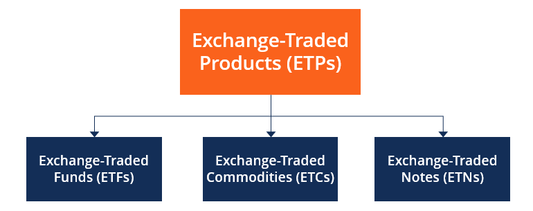

## Table of Contents

## What is an Exchange-Traded Product (ETP)?

An Exchange-Traded Product (ETP) is a type of investment that is traded on a stock exchange, just like stocks. It can track various assets, such as commodities, currencies, or a basket of securities like stocks or bonds. ETPs are popular because they offer investors an easy way to gain exposure to different markets without having to buy the assets directly. They are also flexible, as they can be bought and sold throughout the trading day at market prices.

There are different types of ETPs, including exchange-traded funds (ETFs), exchange-traded notes (ETNs), and exchange-traded commodities (ETCs). ETFs are the most common type and usually track an index, like the S&P 500. ETNs are debt instruments issued by banks that promise to pay the return of an index, minus fees. ETCs are similar to ETFs but focus on commodities like gold or oil. Each type of ETP has its own features and risks, so it's important for investors to understand them before investing.

## How does an ETP differ from a mutual fund?

An ETP and a mutual fund are both ways to invest money, but they have some key differences. An ETP can be bought and sold on a stock exchange throughout the trading day, just like a stock. This means you can see the price and trade it whenever the market is open. On the other hand, a mutual fund is bought and sold at the end of the trading day, based on its net asset value (NAV). This means you won't know the exact price until after the market closes.

Another difference is how they are managed. ETPs often track an index, like the S&P 500, which means they aim to match the performance of that index. This is called passive management. Mutual funds can be actively managed, where a fund manager tries to beat the market by [picking](/wiki/asset-class-picking) specific stocks or bonds. This can lead to higher fees for mutual funds because of the active management. ETPs usually have lower fees because they are passively managed.

## What are the types of ETPs available in the market?

There are three main types of ETPs you can find in the market: ETFs, ETNs, and ETCs. ETFs, or Exchange-Traded Funds, are the most popular type. They usually track an index, like the S&P 500, and aim to match its performance. This means if the index goes up, the [ETF](/wiki/etf-trading-strategies) goes up too. ETFs are easy to buy and sell on a stock exchange, just like stocks, and they often have lower fees because they are passively managed.

ETNs, or Exchange-Traded Notes, are a bit different. They are debt instruments issued by banks. When you buy an ETN, the bank promises to pay you the return of a specific index, minus any fees. ETNs don't actually own the assets in the index; they just promise to give you the return. This can make them riskier if the bank has financial trouble, but they can also offer exposure to markets that are hard to invest in directly.

ETCs, or Exchange-Traded Commodities, focus on commodities like gold, oil, or agricultural products. They allow you to invest in these commodities without having to buy and store them yourself. ETCs can track the price of a single commodity or a basket of commodities. Like ETFs, they are traded on a stock exchange, making them easy to buy and sell. Each type of ETP has its own features and risks, so it's important to understand them before you invest.

## How can someone start investing in ETPs?

To start investing in ETPs, you first need to open a brokerage account. This is like a bank account but for buying and selling investments. You can choose from many online brokers that offer easy-to-use platforms. Once your account is set up, you'll need to add money to it. This is called funding your account. After that, you can start looking for ETPs that interest you. You can search for them by name, ticker symbol, or the type of asset they track, like stocks, bonds, or commodities.

When you find an ETP you want to invest in, you can place an order to buy it. Just like buying a stock, you'll need to decide how many shares you want and what kind of order you want to use, like a market order or a limit order. A market order buys the ETP at the current market price, while a limit order lets you set a specific price you're willing to pay. Once your order is filled, you'll own the ETP, and its value will go up or down based on the performance of the assets it tracks. Remember to keep an eye on your investment and think about your long-term goals.

## What are the benefits of investing in ETPs?

Investing in ETPs has several benefits. One big advantage is that they are easy to buy and sell. You can trade them on a stock exchange just like stocks, which means you can see the price and make a trade whenever the market is open. This gives you a lot of flexibility. Another benefit is that ETPs often have lower fees than mutual funds. This is because many ETPs are passively managed, which means they just track an index and don't need a lot of active management. Lower fees can help you keep more of your investment returns.

ETPs also offer a lot of variety. You can find ETPs that track almost any market, from stocks and bonds to commodities like gold or oil. This makes it easy to build a diverse investment portfolio without having to buy each asset individually. Plus, ETPs can help you spread out your risk. By investing in an ETP that tracks a broad index, you're not putting all your money into one company or one type of asset. This can help protect your investment if one part of the market goes down.

## What are the risks associated with ETPs?

Investing in ETPs comes with some risks you should know about. One risk is market risk. This means the value of your ETP can go up or down based on how the market is doing. If the market goes down, your ETP will likely go down too. Another risk is tracking error. This happens when the ETP doesn't match the performance of the index it's supposed to track. It might be because of fees or other costs, and it can make your returns different from what you expected.

There's also the risk of [liquidity](/wiki/liquidity-risk-premium). Some ETPs might not be as easy to buy and sell as others, especially if they're not very popular. If you want to sell your ETP but there aren't many buyers, you might have to sell it for less than you wanted. Lastly, if you're investing in ETNs, there's credit risk. This means if the bank that issued the ETN has financial problems, you might lose your investment. It's important to understand these risks before you start investing in ETPs.

## How are ETPs priced and traded?

ETPs are priced and traded on a stock exchange, just like stocks. The price of an ETP changes throughout the trading day, based on what people are willing to pay for it. This is called the market price. You can buy or sell an ETP at any time during the trading day, as long as the market is open. To buy an ETP, you place an order through your brokerage account, choosing how many shares you want and what type of order you want to use, like a market order or a limit order.

The price of an ETP is also influenced by the value of the assets it tracks. For example, if an ETP tracks the S&P 500 and the stocks in the S&P 500 go up, the ETP's price will usually go up too. But sometimes the ETP's price might not match the value of the assets perfectly. This difference is called the tracking error, and it can happen because of fees or other costs. It's good to keep an eye on this when you're investing in ETPs.

## What are the tax implications of investing in ETPs?

Investing in ETPs can have tax implications that you should know about. When you sell an ETP for more than you paid for it, you'll have to pay capital gains tax on the profit. If you held the ETP for a year or less, it's considered a short-term capital gain, and you'll pay tax at your regular income tax rate. If you held it for more than a year, it's a long-term capital gain, and the tax rate is usually lower. Also, if your ETP pays dividends, you'll have to pay tax on those too. The tax rate on dividends can be different depending on whether they are qualified or non-qualified dividends.

Some ETPs, like ETFs, can be more tax-efficient than others. This is because of how they are structured. For example, ETFs usually don't have to sell their holdings as often as mutual funds, which can help you avoid some capital gains taxes. But it's not the same for all ETPs. ETNs, for instance, don't pay out dividends, so you won't have to worry about dividend taxes with them. But when you sell an ETN, you might have to pay capital gains tax on the whole amount if it has gone up in value. It's a good idea to talk to a tax advisor to understand how investing in ETPs might affect your taxes.

## How do ETPs track their underlying assets?

ETPs track their underlying assets in different ways depending on the type of ETP. For ETFs, which are the most common type, they usually track an index like the S&P 500 by holding the same stocks or bonds that are in that index. The ETF tries to match the performance of the index by buying and selling the assets in the same proportions. This is called a replication strategy. Sometimes, if an ETF can't buy all the assets in the index, it might use a sampling strategy, where it buys a smaller number of assets that are similar to the ones in the index.

ETNs and ETCs track their underlying assets differently. ETNs are debt instruments issued by banks, and they promise to pay you the return of a specific index. They don't actually own the assets in the index; they just promise to give you the return. This means they track the index by making payments based on how the index performs. ETCs, on the other hand, focus on commodities like gold or oil. They track the price of these commodities by holding them or using futures contracts. This way, the value of the ETC goes up or down with the price of the commodity it tracks.

## What role do ETPs play in portfolio diversification?

ETPs can help you spread out your investments, which is called diversification. When you invest in an ETP, you're not just putting your money into one stock or bond. Instead, you're investing in a whole group of them. For example, if you buy an ETP that tracks the S&P 500, you're investing in 500 different companies all at once. This can help lower your risk because if one company does badly, it won't hurt your whole investment as much.

ETPs also let you invest in different kinds of assets easily. You can find ETPs that track stocks, bonds, commodities like gold or oil, and even things like real estate or foreign markets. By adding different types of ETPs to your portfolio, you can make it more diverse. This means you're not just relying on one type of investment to do well. Diversification can help protect your money and might even help you get better returns over time.

## How can one evaluate the performance of an ETP?

To evaluate the performance of an ETP, you can start by looking at its total return. This means how much the ETP has gone up or down in value over time, including any dividends it paid out. You can compare this to how well the index or asset it's supposed to track has done. If the ETP's return is close to the index's return, it's doing a good job of tracking. But if there's a big difference, it might have a tracking error, which can happen because of fees or other costs.

Another way to evaluate an ETP is by looking at its expense ratio. This is how much it costs to own the ETP each year, usually shown as a percentage of your investment. Lower expense ratios are better because they mean you get to keep more of your returns. You can also look at the ETP's trading [volume](/wiki/volume-trading-strategy). If it has a high trading volume, it's more popular and usually easier to buy and sell. Lastly, consider how the ETP fits into your overall investment plan. Does it help you spread out your investments and reach your goals? These are all important things to think about when evaluating an ETP's performance.

## What advanced strategies can be used with ETPs for experienced investors?

Experienced investors can use advanced strategies with ETPs to try and get better returns or manage risk. One strategy is called sector rotation. This means moving money from one type of ETP to another based on what's doing well in the market. For example, if technology stocks are doing great, you might buy an ETP that focuses on tech. Then, if another sector like healthcare starts to do better, you might switch your money to a healthcare ETP. This can help you take advantage of different parts of the market at different times.

Another strategy is using leveraged or inverse ETPs. Leveraged ETPs try to give you double or even triple the return of an index in a single day. They can be very risky but might help you make more money if you're right about the market. Inverse ETPs do the opposite; they go up when the market goes down. This can be a way to protect your portfolio if you think the market is going to drop. But these ETPs are for short-term trading and can be very risky, so they're not for everyone.

## References & Further Reading

[1]: ETF Research Academy. (n.d.). ["Exchange-Traded Products: Growth, Diversification, and Expense Ratios."](https://www.cfainstitute.org/-/media/documents/book/rf-publication/2015/rf-v2015-n3-1-pdf.ashx)

[2]: Narang, R. K. (2013). ["Inside the Black Box: The Simple Truth About Quantitative Trading."](https://www.amazon.com/Inside-Black-Box-Quantitative-Trading/dp/0470432063) Wiley.

[3]: Fabozzi, F. J., & Focardi, S. M. (2004). ["The Mathematics of Financial Modeling and Investment Management."](https://www.semanticscholar.org/paper/The-Mathematics-of-Financial-Modeling-and-Focardi-Fabozzi/9ef7cbeee77cf22e2ee62cfef22f466a27aec6c8) Wiley.

[4]: Hendershott, T., & Riordan, R. (2013). ["Algorithmic trading and the market for liquidity."](https://faculty.haas.berkeley.edu/hender/ATMonitor.pdf) Journal of Financial and Quantitative Analysis, 48(4), 1001-1024.

[5]: Sutton, R. S., & Barto, A. G. (2018). ["Reinforcement Learning: An Introduction."](https://web.stanford.edu/class/psych209/Readings/SuttonBartoIPRLBook2ndEd.pdf) MIT Press.

[6]: Shreve, S. E. (2004). ["Stochastic Calculus for Finance I: The Binomial Asset Pricing Model."](https://link.springer.com/book/10.1007/978-0-387-22527-2) Springer.

[7]: Scholtes, S. (2011). ["ETFs remain popular despite market turmoil."](https://money.usnews.com/investing/articles/best-etfs-to-buy-for-long-term-investors) Financial Times.

[8]: Hirsa, A. (Ed.). (2012). ["Computational Methods in Finance."](https://www.taylorfrancis.com/books/mono/10.1201/b12755/computational-methods-finance-ali-hirsa) Chapman and Hall/CRC.