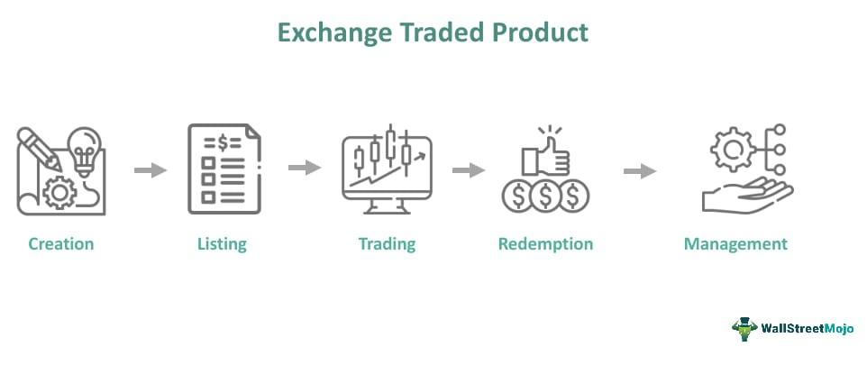

Exchange-Traded Products (ETPs) have emerged as significant tools for investors aiming to diversify their portfolios in contemporary financial markets. ETPs are financial instruments that track the performance of assets such as commodities, indices, or other financial products and are traded on exchanges akin to stocks. This functionality provides investors with a convenient and efficient method to engage with a broad spectrum of asset classes while maintaining flexibility in trading.

Algoritmic trading represents another transformative trend in modern finance by utilizing computer algorithms to execute trading decisions and strategies. This technology-driven approach allows for quicker and more precise trading decisions, minimizing the impact of human error and emotional biases that often plague traditional trading methods. Algorithmic trading has become particularly useful in the context of ETPs, where it can enhance investment strategies by efficiently responding to market movements.



The combination of ETPs and algorithmic trading offers a potent opportunity for investors to achieve optimized portfolio management. This article will discuss how these financial innovations complement each other to enhance the efficacy and dynamism of investment strategies in today's markets. By understanding these concepts, investors can leverage advanced technological tools to make informed financial decisions and stay competitive in a rapidly evolving investment landscape.

## Table of Contents

## Understanding Exchange-Traded Products (ETPs)

Exchange-Traded Products (ETPs) represent a versatile investment vehicle allowing investors to access various asset classes such as stocks, bonds, and commodities. These financial instruments are traded on major exchanges, similar to individual stocks, providing unique features and benefits that cater to a wide range of investment strategies.

ETPs can be broadly categorized into three primary types: Exchange-Traded Funds (ETFs), Exchange-Traded Notes (ETNs), and Exchange-Traded Commodities (ETCs). Each of these products offers distinct advantages and potential risks that investors must consider.

**Exchange-Traded Funds (ETFs)** are among the most popular forms of ETPs. They are pooled investment securities that operate like mutual funds, offering investors exposure to a diverse portfolio of assets. ETFs are appreciated for their cost-effectiveness and capacity to provide broad market exposure. They cover various indices, sectors, and geographies, enabling investors to diversify their portfolios efficiently. One of the key benefits of ETFs is their low expense ratios compared to mutual funds, making them an attractive option for cost-conscious investors.

**Exchange-Traded Notes (ETNs)**, on the other hand, are unsecured debt instruments issued by financial institutions. Unlike ETFs, which hold the underlying assets, ETNs are a promise to pay investors the return of a specified index. The issuer's creditworthiness is crucial here, as ETNs carry the credit risk of the issuing entity. While they offer exposure to markets and indices that might be difficult to access through direct investments, investors need to be mindful of the credit risk involved.

**Exchange-Traded Commodities (ETCs)** provide investors with direct exposure to commodities markets. Similar to ETFs, ETCs are backed by physical commodities or commodity contracts. They offer an efficient way to gain exposure to commodities without having to trade futures contracts directly. This direct exposure can help diversify investment portfolios and hedge against inflation.

A significant advantage of ETPs over traditional mutual funds is their intraday trading capability. ETPs can be bought and sold on exchanges throughout the trading day at market-driven prices, providing investors the flexibility to react swiftly to market changes. This characteristic makes ETPs particularly appealing for dynamic trading strategies, allowing for timely entry and [exit](/wiki/exit-strategy) from positions as market conditions evolve.

In summary, ETPs offer a flexible framework for accessing diverse asset classes, with ETFs, ETNs, and ETCs meeting various investment needs through cost efficiency, market access, and trading flexibility. Understanding the unique features and risks associated with each type of ETP is critical for leveraging these products in strategic asset allocation and portfolio management.

## Benefits and Risks of ETPs

Exchange-Traded Products (ETPs) provide investors with a versatile platform to diversify their portfolios across a wide range of asset classes, such as stocks, bonds, and commodities. This diversification is crucial in managing risk and enhancing potential returns. By holding a wide variety of assets, investors can mitigate the impact of individual asset [volatility](/wiki/volatility-trading-strategies) on their overall investment portfolio.

One significant advantage of ETPs is their cost-efficiency. ETPs allow investors to access markets at reduced costs due to economies of scale. These products enable investors to obtain broad market exposure with lower management fees compared to traditional mutual funds. Traditional mutual funds often incur higher transaction and operational costs, which are typically passed on to the investor. The streamlined structure of ETPs, which involves fewer intermediary processes, contributes to a reduction in individual transaction costs.

Despite these benefits, ETPs are not without risks. One primary concern is the inherent market risk associated with the underlying assets. Market risk refers to the potential for losses due to movements in market prices. Since ETPs track the performance of a specific index or commodity, they are subject to price fluctuations that can lead to significant losses if the market moves unfavorably.

Liquidity risk is another critical [factor](/wiki/factor-investing) to consider when investing in ETPs. Although ETPs generally offer higher [liquidity](/wiki/liquidity-risk-premium) compared to some other investment vehicles, liquidity can vary significantly based on the type of assets in the ETP and market conditions. During periods of market stress, like financial crises, this risk can be exacerbated, potentially making it difficult for investors to buy or sell ETP shares without affecting the price significantly.

To effectively leverage ETPs in investment portfolios, understanding and managing these risks is crucial. Employing strategies such as regular portfolio rebalancing can help in maintaining the desired level of risk exposure. Moreover, investors should keep abreast of changes in the market environment and the specific characteristics of the ETPs they hold, staying informed about the performance, fees, and liquidity of their investments. The careful examination of ETPs, from an evaluation of structure to a comprehensive understanding of associated risks, is essential for maximizing their potential benefits while safeguarding against potential downsides.

## The Role of Algorithmic Trading in ETP Investments

Algorithmic trading is central to modern investment strategies, especially concerning Exchange-Traded Products (ETPs). It utilizes advanced computer algorithms to automate trading decisions, significantly improving the speed and efficiency of transactions. Algorithms can monitor a variety of market indicators, such as price movements and [volume](/wiki/volume-trading-strategy), enabling rapid reaction to market changes—a critical advantage in the fast-paced securities landscape of ETPs.

The automatic nature of [algorithmic trading](/wiki/algorithmic-trading) provides a significant edge by reducing human error and eliminating emotional biases, which are often detrimental during periods of market volatility. Algorithms operate based on predefined criteria and statistical models, enabling traders to implement complex strategies consistently without emotion-driven disruptions.

In the realm of ETP investments, algorithmic trading systems can manage high volumes of transactions effectively. This capability is vital, as ETPs offer intraday liquidity and require swift adjustments to seize opportunities or mitigate risks. For example, [momentum](/wiki/momentum)-based strategies can track asset prices, buying when there is a clear price uptrend or selling during downturns, while mean reversion strategies might focus on executing trades when prices diverge from their historical average, anticipating a return to the average.

Python is often used to develop algorithmic trading strategies due to its powerful libraries and ease of use. A simple script using the `pandas` and `numpy` libraries, combined with stock data, can illustrate a basic algorithm for detecting moving averages, a common trading signal:

```python
import pandas as pd
import numpy as np

# Sample data: a DataFrame with a 'Close' column of stock prices
df = pd.DataFrame({'Close': [100, 102, 103, 105, 104, 106, 108, 110]})

# Calculate the short-term and long-term moving averages
short_window = 3
long_window = 5

df['Short_MA'] = df['Close'].rolling(window=short_window, min_periods=1).mean()
df['Long_MA'] = df['Close'].rolling(window=long_window, min_periods=1).mean()

# Basic strategy: Buy signal when short MA > long MA
df['Signal'] = np.where(df['Short_MA'] > df['Long_MA'], 1.0, 0.0)

print(df)
```

As algorithmic trading evolves, [artificial intelligence](/wiki/ai-artificial-intelligence) and [machine learning](/wiki/machine-learning) are being integrated to refine these models further. These technologies allow the development of predictive models capable of learning from vast datasets, offering insights into potential market behaviors. This advancement enhances the ability to formulate dynamic trading strategies, making the use of algorithmic solutions in ETPs even more formidable.

In conclusion, algorithmic trading plays a transformative role in the world of ETP investments. By providing speed, precision, and the ability to handle large-scale operations, it sets the stage for more efficient and effective investment strategies, crucial in today’s data-driven financial markets.

## ETPs vs. Traditional Investment Vehicles

Exchange-Traded Products (ETPs) and traditional investment vehicles like mutual funds hold distinct characteristics that cater to different investor needs. One of the most notable differences lies in their trading mechanisms. While mutual funds are priced at the end of the trading day based on their net asset value (NAV), ETPs provide the advantage of intraday liquidity, allowing investors to buy and sell throughout the trading day at real-time market prices. This flexibility makes ETPs particularly appealing to investors who prefer to react swiftly to market developments. 

The real-time pricing of ETPs is facilitated by their structure, usually following indexes that are monitored continuously during market hours. This continuous monitoring mirrors the functions of stocks, allowing for a responsive and fluid trading experience. In contrast, mutual funds operate on a different basis, setting their NAV once a day after markets close. This can be limiting for investors aiming to capitalize on short-term market movements.

When comparing cost structures, ETPs often present a more cost-effective option due to their typically lower expense ratios and the absence of certain fees associated with mutual funds, such as load fees. Additionally, the direct trading on exchanges means that investors can avoid some of the sales charges that might accompany mutual fund investments. However, it is important to consider the potential brokerage fees associated with the frequent trading of ETPs.

ETPs also offer diverse market exposure options, from broad market indices to sector-specific or geographically targeted areas, bringing customized diversification to investors' portfolios. Traditional mutual funds provide diversification but are often more constrained by management strategies and fund objectives, which can lack the granularity available in ETPs.

Liquidity is another differentiating factor. ETPs allow for easy entry and exit points throughout the trading day, whereas mutual funds may involve waiting for end-of-day processing to realize transactions. This liquidity feature is appealing for tactical investors engaged in active management of their portfolios.

Ultimately, the decision between ETPs and traditional investment vehicles hinges on an investor's strategy, need for liquidity, and fee considerations. Evaluating these elements helps investors align their choices with their financial objectives, risk tolerance, and market views.

## Case Studies: Successful ETP Algo Trading Strategies

Exchange-Traded Products (ETPs) have become increasingly popular in modern investment strategies, particularly with the integration of algorithmic trading techniques. Analyzing real-world examples of successful algo trading in ETPs demonstrates the sophistication and efficacy of these strategies, which can significantly enhance investment outcomes.

### Momentum Trading in ETPs

Momentum trading is based on the idea that assets that have performed well in the past will continue to do so in the future. This strategy can be effectively applied to ETPs by using algorithms to identify trends and execute trades when certain momentum indicators are triggered.

For instance, an algorithmic trader might employ a simple moving average crossover strategy, where a short-term moving average crosses above a long-term moving average, signaling a buy. Conversely, when the short-term moving average crosses below the long-term moving average, a sell signal is generated. This method can be coded in Python as follows:

```python
import pandas as pd
import numpy as np

# Assume 'data' is a DataFrame that contains ETP price data with a 'Close' column
short_window = 40
long_window = 100

# Calculate moving averages
data['Short_MA'] = data['Close'].rolling(window=short_window, min_periods=1).mean()
data['Long_MA'] = data['Close'].rolling(window=long_window, min_periods=1).mean()

# Generate signals
data['Signal'] = np.where(data['Short_MA'] > data['Long_MA'], 1, 0)

# Calculate daily returns
data['Strategy_Returns'] = data['Signal'].shift(1) * data['Close'].pct_change()
```

This algorithmic strategy can take advantage of the intraday liquidity and real-time pricing of ETPs, potentially generating alpha by capturing upward price movements while minimizing downside risks.

### Mean Reversion Strategies

Mean reversion strategies are based on the principle that prices will eventually revert back to their historical averages. In ETP trading, this can be particularly useful, given the relatively tighter tracking of ETPs around their underlying indices or assets.

A mean reversion algorithm might involve statistical techniques like Bollinger Bands, which use standard deviations to define bands around a moving average. When the price moves outside these bands, it is expected to revert, offering trading opportunities.

### High-Frequency Trading in ETPs

High-frequency trading ([HFT](/wiki/high-frequency-trading-strategies)) employs sophisticated algorithms that can execute a large number of orders at extremely high speeds, often within milliseconds. In ETP markets, HFT can enhance trading efficiency and profitability by exploiting minute price discrepancies.

Successful HFT algorithms in ETPs typically focus on liquidity provision and [arbitrage](/wiki/arbitrage) strategies, where they buy ETPs slightly below market price and sell them slightly above it, effectively capitalizing on spread differences. This type of trading demands robust technology and risk management frameworks to optimize performance and manage execution risks.

### Strategic Importance in Modern Trading

The inclusion of algorithmic trading strategies like momentum trading, mean reversion, and high-frequency trading in ETP markets underscores the fundamental role of technology in modern finance. These examples highlight the importance of strategic planning and advanced computing techniques to achieve superior investment performance. Moreover, as algorithms evolve with advancements in artificial intelligence and machine learning, the potential for enhancing ETP trading efficiency and profitability continues to grow. This exemplifies the transformative power of integrating technology with investment strategies, offering a compelling edge to investors willing to adapt and innovate.

## Future Trends in ETPs and Algorithmic Trading

As technology continues to advance, the fusion of big data analytics and algorithmic trading is significantly impacting Exchange-Traded Product (ETP) investments. This development is essential for investors who aim to utilize data-driven approaches to optimize their trading strategies.

**Role of Artificial Intelligence (AI) in ETPs**

Artificial intelligence is increasingly critical in refining trading models and predicting market behaviors. By leveraging AI, algorithms can process and analyze large volumes of data efficiently, identifying patterns and trends that human analysts might overlook. Machine learning models, for example, can be trained to recognize market signals and make real-time predictions, thus enhancing the decision-making process. This capability allows for more sophisticated and responsive trading strategies, capable of adapting to dynamic market conditions.

Consider the use of a machine learning algorithm to predict ETP price movements using time series data. Python offers several libraries, such as TensorFlow or PyTorch, which can facilitate the development of models suitable for this task. For instance:

```python
import pandas as pd
from sklearn.model_selection import train_test_split
from sklearn.ensemble import RandomForestRegressor

# Sample dataset loading (replace with actual ETP dataset)
data = pd.read_csv('etp_data.csv')
features = data.drop('price', axis=1)
target = data['price']

# Split data into training and testing sets
X_train, X_test, y_train, y_test = train_test_split(features, target, test_size=0.2, random_state=42)

# Initialize and train the model
model = RandomForestRegressor(n_estimators=100, random_state=42)
model.fit(X_train, y_train)

# Make predictions
predictions = model.predict(X_test)
```

**ESG-Focused ETPs**

Environmental, Social, and Governance ([ESG](/wiki/esg-investing)) considerations are increasingly influencing investor choices, spurring the growth of ESG-focused ETPs. These products integrate sustainability criteria into the investment process, appealing to investors who prioritize ethical considerations alongside financial returns. The shift towards ESG is partly driven by regulatory changes and increasing awareness about environmental and social issues, which are encouraging investors to adopt more sustainable investment practices.

**Innovations in ETP Structures and Trading Platforms**

The future promises continued innovation in ETP structures and trading platforms. Technological advancements are likely to result in more complex and customizable ETPs, which cater to diverse investor preferences and risk tolerances. Moreover, enhancements in trading platforms will improve accessibility and reduce transaction costs, making ETPs more appealing to a broader range of investors.

These trends point towards a future where the synergy between technology and finance will lead to more efficient, responsive, and responsible investment products. As innovations progress, they will provide investors with enhanced tools to manage their portfolios effectively, aligning financial performance with broader economic, social, and regulatory changes.

## Conclusion

Exchange-Traded Products (ETPs) represent a versatile financial instrument that enables investors to engage with a wide array of markets dynamically and efficiently. The diverse offering of ETPs, including Exchange-Traded Funds (ETFs), Exchange-Traded Notes (ETNs), and Exchange-Traded Commodities (ETCs), provides avenues to invest in various asset classes, ensuring that portfolios can be both diversified and robust. This flexibility, coupled with the ability to trade these instruments throughout the trading day, distinguishes ETPs from traditional investment vehicles and presents them as a compelling option for both individual and institutional investors.

The incorporation of algorithmic trading into ETPs represents a fundamental shift towards technologically advanced investment strategies. Algorithms, or algos, enhance the potential of ETPs by executing trades with speed and precision, adapting swiftly to market changes, and reducing the impact of human errors and emotional biases. As algorithms become more sophisticated through advancements in artificial intelligence and machine learning, their ability to optimize trading strategies increases, offering traders the potential for enhanced returns and reduced risks.

Understanding the intricacies and potential of ETPs allows investors to make informed decisions crucial for achieving their financial objectives. By leveraging the market accessibility provided by ETPs and enhanced through algorithmic trading, investors can tap into global markets and manage their investments with increased agility and intelligence.

The ongoing transformation driven by algo trading within the realm of ETPs continues to foster innovation within the financial sector. As technology progresses and trading strategies become more refined, the potential to revolutionize investment practices grows, promising even greater efficiencies and opportunities for portfolio diversification and risk management. Investors and financial professionals alike stand to benefit immensely from these advancements, marking a positive trajectory in the ever-evolving landscape of modern finance.

## References & Further Reading

[1]: ETF Research Academy. (n.d.). ["Exchange-Traded Products: Growth, Diversification, and Expense Ratios."](https://www.cfainstitute.org/-/media/documents/book/rf-publication/2015/rf-v2015-n3-1-pdf.ashx)

[2]: Narang, R. K. (2013). ["Inside the Black Box: The Simple Truth About Quantitative Trading."](https://www.amazon.com/Inside-Black-Box-Quantitative-Trading/dp/0470432063) Wiley.

[3]: Fabozzi, F. J., & Focardi, S. M. (2004). ["The Mathematics of Financial Modeling and Investment Management."](https://www.semanticscholar.org/paper/The-Mathematics-of-Financial-Modeling-and-Focardi-Fabozzi/9ef7cbeee77cf22e2ee62cfef22f466a27aec6c8) Wiley.

[4]: Hendershott, T., & Riordan, R. (2013). ["Algorithmic trading and the market for liquidity."](https://faculty.haas.berkeley.edu/hender/ATMonitor.pdf) Journal of Financial and Quantitative Analysis, 48(4), 1001-1024.

[5]: Sutton, R. S., & Barto, A. G. (2018). ["Reinforcement Learning: An Introduction."](https://web.stanford.edu/class/psych209/Readings/SuttonBartoIPRLBook2ndEd.pdf) MIT Press.

[6]: Shreve, S. E. (2004). ["Stochastic Calculus for Finance I: The Binomial Asset Pricing Model."](https://link.springer.com/book/10.1007/978-0-387-22527-2) Springer.

[7]: Scholtes, S. (2011). ["ETFs remain popular despite market turmoil."](https://money.usnews.com/investing/articles/best-etfs-to-buy-for-long-term-investors) Financial Times.

[8]: Hirsa, A. (Ed.). (2012). ["Computational Methods in Finance."](https://www.taylorfrancis.com/books/mono/10.1201/b12755/computational-methods-finance-ali-hirsa) Chapman and Hall/CRC.