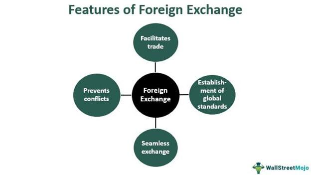

In today's fast-paced financial markets, technological advancements have significantly transformed the way trading is conducted. Algorithmic trading, commonly known as algo trading, leverages computer programs to execute trading orders automatically based on predefined strategies. This technological development marks a significant departure from traditional manual trading methods, enabling transactions to occur at a scale and speed that were previously unattainable.

The convergence of trade exchange commerce and algorithmic trading has ushered in a new era for financial markets. This article will investigate the mechanisms that underpin algorithmic trading and examine the advantages and challenges it brings to market participants. Algorithmic trading uses complex mathematical models and high-speed data analysis to make trading decisions, allowing traders to quickly adapt to market conditions and execute orders with precision. Through the use of these sophisticated algorithms, traders can achieve greater efficiency and reduce the role of human error and emotional bias.



Moreover, algorithmic trading has created opportunities for traders to improve their performance by employing strategies that are rigorously backtested on historical data. These automated systems can handle vast amounts of data across multiple markets simultaneously, which enhances scalability and provides traders with a comprehensive view of market dynamics. 

While algorithmic trading offers numerous benefits, it is not devoid of challenges and risks. Technical issues such as system failures and market volatility can impact trading outcomes. Traders and institutions must carefully consider these factors and develop robust strategies to mitigate potential risks.

As the financial markets continue to evolve, algorithmic trading is expected to play an increasingly vital role. Traders who harness the power of advanced technologies and develop well-crafted trading strategies will be better positioned to capitalize on the opportunities presented by this dynamic landscape. Through a strategic approach to algorithmic trading, market participants can enhance their trading performance and navigate the complexities of modern financial markets effectively.

## Table of Contents

## Understanding Trade Exchanges

A trade exchange is an organized marketplace where financial instruments, such as stocks, commodities, and currencies, are actively bought and sold. These exchanges serve as critical platforms, providing a structured environment for bringing buyers and sellers together to facilitate seamless trading processes. By operating under a set of standardized rules and regulations, trade exchanges offer transparency, ensuring that all market participants have access to the same information. This transparency is crucial for maintaining trust in the market.

Furthermore, exchanges provide [liquidity](/wiki/liquidity-risk-premium), which is the ability to quickly buy or sell assets without causing significant price changes. Liquidity is essential for the efficient functioning of markets, allowing traders to execute large orders without significant impact on the overall market. Security is another fundamental feature of trade exchanges, as they implement measures to ensure that trading activities occur under fair conditions and protect against fraud and manipulation.

A distinction can be made between physical exchanges and electronic exchanges. Physical exchanges, such as the New York Stock Exchange (NYSE), have a physical location where trading occurs with the presence of traders on the floor actively buying and selling securities. Electronic exchanges, like the NASDAQ, conduct all their transactions digitally, with traders connecting to the exchange via electronic systems. This digital nature often allows for faster and more efficient trading operations across global markets.

These exchanges play a pivotal role in the global economy. By providing a platform for commerce and investment, they enable investors to allocate capital efficiently, support business growth, and contribute to economic development. Whether facilitating the initial public offering of companies or enabling the trading of complex derivatives, trade exchanges remain fundamental to the financial ecosystem.

## The Rise of Algorithmic Trading

Algorithmic trading, commonly abbreviated as algo trading, has become an integral component of modern financial markets. By leveraging computer algorithms, this trading methodology automates the management and execution of trade orders, predicated upon predefined criteria such as timing, price, and [volume](/wiki/volume-trading-strategy). The proliferation of algo trading is primarily driven by technological advancements and the burgeoning availability of data, enabling traders to execute trades at a velocity and frequency unattainable by human counterparts.

One of the critical advantages of [algorithmic trading](/wiki/algorithmic-trading) is its capability to harness various market conditions. Algorithms can swiftly respond to market trends, adjusting their trading strategies within milliseconds. This feature is particularly beneficial in volatile markets, where rapid changes can significantly impact trading outcomes. For instance, if a stock's price drops suddenly, an algorithm programmed to capitalize on such dips can quickly initiate a purchase order to seize the opportunity before the market corrects itself.

The expansion of algo trading has been considerable, with significant uptake among hedge funds and large financial institutions. These market participants rely on algorithmic trading to enhance their operational efficiencies and trading performance. A typical algorithmic strategy may involve programming algorithms for trend-following, where the algorithm analyzes historical data to identify potential upward or downward trends and executes trades accordingly.

Furthermore, algo trading supplements human decision-making by mitigating emotional biases that frequently lead to suboptimal trading decisions. The algorithm's predetermined rules act devoid of emotional influences, ensuring consistency and adherence to the trader's strategy. It also facilitates the execution of complex strategies, such as [arbitrage](/wiki/arbitrage), where the algorithm can simultaneously buy and sell an asset in different markets to exploit price differentials.

The impact of algorithmic trading extends beyond individual traders or institutions, influencing overall market dynamics. As algorithms execute trades based on quantitative models and extensive data analysis, they contribute to market liquidity by providing a steady stream of buy and sell orders. However, this surge in automated trading also underscores the need for robust algorithm design, ensuring precision and reliability in market execution.

In summary, the rise of algorithmic trading is emblematic of the broader digital transformation occurring within financial markets. By embedding predefined criteria into sophisticated algorithms, traders can exploit market conditions with unprecedented speed and precision, a development that has fundamentally altered the landscape of trading and investment practices worldwide.

## Benefits of Algorithmic Trading

Algorithmic trading offers several compelling advantages across various aspects of trading, thereby enhancing overall market operations and trader performance. One of the most significant benefits of algo trading is the increased speed and efficiency in executing trades. By utilizing computer algorithms, trades can be executed within fractions of a second, capitalizing on even the slightest market movements and often resulting in better pricing compared to manual trading methods.

Another crucial advantage is the reduction of human intervention and error. Algorithmic trading minimizes the influence of emotional biases, such as fear and greed, which can adversely affect trading decisions. By systematically adhering to predefined trading rules, algorithms can make objective decisions based purely on data, enhancing decision-making accuracy and consistency.

Algo trading also exhibits exceptional scalability. Algorithms can handle large volumes of trades and monitor multiple markets and instruments simultaneously. This capability allows traders and institutions to exploit multiple trading opportunities across diverse markets without the constraints typically associated with human-centric trading approaches.

Traders employing algorithmic strategies benefit significantly from the ability to backtest their algorithms on historical data. Backtesting involves simulating the algorithm's trading strategy on past market data to evaluate its performance and viability before deployment in live markets. This process helps in identifying and refining strategies, potentially increasing profitability once implemented.

Additionally, the automation of trading processes permits traders to allocate more time and resources towards strategy development and risk management rather than focusing on the operational aspects of trade execution. By automating routine trading tasks, traders can focus on refining their models, adapting to market changes, and effectively managing the risks associated with their trading activities.

In summary, algorithmic trading provides significant strategic advantages, including increased speed, reduced errors, enhanced scalability, and effective resource allocation, which can all contribute to improved trading outcomes.

## Challenges and Risks

Algorithmic trading, while providing significant benefits in terms of speed, efficiency, and accuracy, also introduces several challenges and risks that traders and financial institutions must address. One primary concern is the management of technical issues. System failures, software bugs, and connectivity problems can result in erroneous trades or significant financial losses. Trading platforms and algorithms depend on complex software and hardware systems that must function seamlessly to execute trades accurately and timely. Failure in any component of the system can disrupt trading operations.

Moreover, algorithmic trading's propensity to amplify market [volatility](/wiki/volatility-trading-strategies) is a growing concern. The practice can contribute to sudden, large market swings, often referred to as "flash crashes." Such events occur when algorithms execute large volumes of trades in a very short period, overwhelming the available liquidity in the market. The 2010 Flash Crash is a notable example, where the Dow Jones Industrial Average experienced a rapid and massive decline within minutes before rebounding quickly. 

Ensuring the robustness and reliability of trading algorithms is critical. These algorithms must be rigorously tested and regularly updated to prevent potential flaws from leading to catastrophic financial errors. Algorithms operate based on predefined rules; if these rules are not meticulously constructed, the algorithms might execute trades that are inconsistent with the intended strategy, resulting in significant losses.

As algorithmic trading grows, it faces increasing regulatory scrutiny. Governments and regulatory bodies are implementing stricter rules to ensure fairness and stability in financial markets. Regulations are being developed to address concerns such as market manipulation, transparency, and systemic risk. Traders and financial institutions must comply with these evolving regulations, integrating them into their trading systems to avoid non-compliance penalties and ensure sustainable operations.

In summary, while algorithmic trading offers numerous enhancements to trading efficiency and effectiveness, it also demands rigorous oversight and management to mitigate the inherent challenges and risks it poses. Maintaining robust systems, well-tested algorithms, and compliance with regulatory requirements are critical for successful algorithmic trading operations.

## Implementing Algo Trading Strategies

Successful implementation of algorithmic trading strategies necessitates a strong amalgamation of market acumen and technical expertise. Traders embark on this process by designing, coding, and rigorously testing algorithms that align with their distinct strategies and risk tolerances. This phase involves determining parameters such as entry and [exit](/wiki/exit-strategy) points, position sizing, and risk management rules, which are encoded into algorithms to automate trading decisions.

There are several popular algorithmic trading strategies, each with its own intricacies:

1. **Trend-Following Strategies**: These revolve around the idea that asset prices tend to move in observable trends. A simple algorithm might use moving averages to signal when to buy or sell. For instance, a crossover strategy might involve buying an asset when its short-term moving average crosses above its long-term moving average, indicating an upward trend.

   ```python
   def moving_average(prices, window_size):
       weights = np.repeat(1.0, window_size) / window_size
       smas = np.convolve(prices, weights, 'valid')
       return smas

   # Example of a crossover implementation
   short_window = 40
   long_window = 100

   signals['short_mavg'] = moving_average(signals['price'], short_window)
   signals['long_mavg'] = moving_average(signals['price'], long_window)

   signals['signal'] = 0.0
   signals['signal'][short_window:] = np.where(signals['short_mavg'][short_window:] > signals['long_mavg'][short_window:], 1.0, 0.0)
   ```

2. **Arbitrage Strategies**: These seek to profit from price discrepancies between different markets or instruments. For example, a trader might develop an algorithm that identifies when an asset is undervalued in one market compared to another and executes simultaneous buy and sell orders to capitalize on the price differences.

3. **Mean-Reversion Strategies**: These are based on the premise that asset prices will revert to their historical means. Algorithms can be programmed to execute trades when prices deviate significantly from their average, betting on a reversal.
$$
   z = \frac{X - \mu}{\sigma}

$$

   Where $X$ is the price, $\mu$ is the mean, and $\sigma$ is the standard deviation. If $z$ is significantly high or low, a mean-reversion trade might be initiated.

Advanced tools and platforms enhance the deployment of these algorithms. Application Programming Interfaces (APIs) and specialized trading software facilitate rapid execution and integration with trading systems. Platforms like MetaTrader or open-source libraries such as QuantConnect and Zipline in Python allow traders to test and implement their strategies efficiently.

Continuous monitoring and optimization are imperative to the success of algo trading. Market conditions are perpetually evolving, and strategies need adaptation to maintain their edge. Traders must employ robust data analytics to monitor performance metrics and tweak algorithms as necessary to respond to new patterns or anomalies. This iterative process ensures that the algorithms remain effective and can capitalize on prevailing market conditions while minimizing risk.

## Future Trends in Algorithmic Trading

Algorithmic trading is on the brink of significant transformation as technologies such as [artificial intelligence](/wiki/ai-artificial-intelligence) (AI) and [machine learning](/wiki/machine-learning) (ML) become increasingly integrated. AI and ML can significantly enhance the pattern recognition capabilities of trading algorithms. By processing massive datasets and identifying subtle market signals, these technologies enable algorithms to adaptively make decisions with greater accuracy. This adaptability is crucial for handling the unpredictable nature of financial markets.

The development of machine learning techniques, such as [reinforcement learning](/wiki/reinforcement-learning), offers promising avenues for algorithmic trading. These techniques allow algorithms to learn optimal trading strategies through trial and error, continuously improving their performance. For instance, a reinforcement learning agent can be programmed to maximize a reward function, which could represent trading profits or minimal risk.

```python
import numpy as np

class RLTrader:
    def __init__(self, n_actions):
        self.q_table = np.zeros((1, n_actions))

    def choose_action(self, state):
        return np.argmax(self.q_table[state])

    def update_q_value(self, state, action, reward, learning_rate=0.1):
        self.q_table[state, action] += learning_rate * (reward - self.q_table[state, action])
```

In parallel, the rise of decentralized finance (DeFi) is reshaping the trading landscape. DeFi platforms operate without centralized intermediaries, using blockchain technology to enable peer-to-peer trading. This environment offers new opportunities for developing and deploying algorithmic trading strategies, particularly in areas such as liquidity provision and arbitrage. However, the volatility and nascency of DeFi markets present unique challenges, including heightened risk and regulatory uncertainty.

The regulatory environment governing algorithmic trading is also undergoing change. With increasing regulatory scrutiny, market participants must stay abreast of new rules that aim to ensure stability and fairness in financial markets. For instance, regulations may impose constraints on high-frequency trading practices or enforce stricter risk management protocols. Thus, traders and institutions must be prepared to adapt to these changes to maintain compliance and competitiveness.

The proliferation of AI-enabled trading platforms and open-source tools further democratizes access to sophisticated trading capabilities. These platforms lower the barriers to entry for traders, encouraging innovation and diversity in trading strategies. As algorithmic trading continues to evolve, staying informed about technological advancements and regulatory developments becomes imperative for traders and institutions seeking to maintain an edge in the marketplace.

## Conclusion

Algorithmic trading has fundamentally reshaped trade exchange commerce, providing traders with significant benefits such as enhanced speed and efficiency in executing trades. The automation afforded by algorithmic trading reduces the likelihood of human error and emotional bias, enabling more precise trading decisions. However, this transformative technology is not without its challenges. Traders must be vigilant in addressing potential pitfalls such as technical failures, algorithmic errors, and regulatory compliance issues. Successfully navigating these challenges requires leveraging the latest technological advancements while fine-tuning trading strategies to optimize performance.

The continuous evolution of technology, including developments in artificial intelligence and machine learning, promises to further impact trading in unprecedented ways. These advancements are expected to enhance the adaptability and complexity of trading algorithms, offering new opportunities for traders to refine their strategies and improve profitability. Moreover, as the regulatory framework surrounding algorithmic trading continues to shift, it becomes increasingly important for traders to stay informed and adaptable. Ultimately, the key to success in algorithmic trading lies in maintaining a strategic approach, crafting well-informed algorithms, and staying agile enough to adapt to emerging trends and technological breakthroughs. This adaptability ensures that traders can capitalize on the dynamic opportunities presented by evolving markets, thus securing a competitive edge in a rapidly changing financial landscape.

## References & Further Reading

[1]: Bergstra, J., Bardenet, R., Bengio, Y., & Kégl, B. (2011). ["Algorithms for Hyper-Parameter Optimization."](https://dl.acm.org/doi/10.5555/2986459.2986743) Advances in Neural Information Processing Systems 24.

[2]: ["Advances in Financial Machine Learning"](https://www.amazon.com/Advances-Financial-Machine-Learning-Marcos/dp/1119482089) by Marcos Lopez de Prado

[3]: ["Evidence-Based Technical Analysis: Applying the Scientific Method and Statistical Inference to Trading Signals"](https://www.amazon.com/Evidence-Based-Technical-Analysis-Scientific-Statistical/dp/0470008741) by David Aronson

[4]: ["Machine Learning for Algorithmic Trading"](https://github.com/stefan-jansen/machine-learning-for-trading) by Stefan Jansen

[5]: ["Quantitative Trading: How to Build Your Own Algorithmic Trading Business"](https://books.google.com/books/about/Quantitative_Trading.html?id=j70yEAAAQBAJ) by Ernest P. Chan