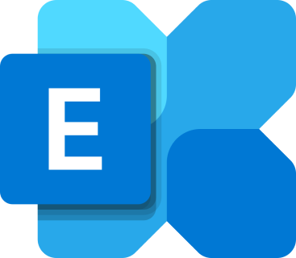

## Table of Contents

## What is an exchange in the context of finance and trading?

An exchange is like a big marketplace where people buy and sell things, but instead of fruits and vegetables, they trade stocks, bonds, and other financial products. It's a place where companies can raise money by selling pieces of themselves, called stocks, to the public. People can then buy and sell these stocks to each other on the exchange. Some famous exchanges are the New York Stock Exchange (NYSE) and the NASDAQ.

Exchanges make sure that trading is fair and follows the rules. They use computers and people to keep an eye on all the buying and selling. This helps to make sure no one is cheating and that everyone gets a fair price. Exchanges also provide important information about the prices of stocks and how much they are being traded, which helps people make smart decisions about buying and selling.

## How do exchanges facilitate the buying and selling of assets?

Exchanges make it easy for people to buy and sell things like stocks and bonds by bringing buyers and sellers together in one place. Imagine a big store where instead of buying clothes or food, you can buy pieces of companies. When you want to buy a stock, you go to the exchange, and they help you find someone who wants to sell that stock. The exchange makes sure that the price is fair and that everything goes smoothly.

To make this happen, exchanges use fancy computers and special rules. These computers keep track of all the buying and selling that happens every second. They make sure that when you want to buy or sell something, your order gets matched with someone else's order quickly. The rules help make sure that everyone plays fair and that no one can trick others. This way, people can trust that the exchange will help them buy and sell their assets safely and efficiently.

## What are the different types of exchanges, such as stock exchanges and cryptocurrency exchanges?

There are different kinds of exchanges, and each one is made for trading different things. A stock exchange is like a big store where people trade pieces of companies, called stocks. Some famous stock exchanges are the New York Stock Exchange (NYSE) and the NASDAQ. People use stock exchanges to buy and sell stocks, which can help them make money if the company does well. Stock exchanges have rules to make sure everyone plays fair and that the prices are right.

Another type of exchange is a cryptocurrency exchange, where people trade digital money like Bitcoin and Ethereum. These exchanges work a bit differently because they deal with digital currencies that aren't controlled by governments. People use cryptocurrency exchanges to buy, sell, or trade different kinds of digital money. Just like stock exchanges, they have rules to keep things safe and fair, but they also have extra security because digital money can be harder to protect.

Both stock exchanges and cryptocurrency exchanges help people trade things they want, but they do it in their own special ways. They make it easier for people to buy and sell, and they help keep everything running smoothly and safely.

## What are the key differences between centralized and decentralized exchanges?

A centralized exchange is like a big store where one company is in charge of everything. They keep your money and your digital stuff safe, and they make sure that buying and selling happens smoothly. But because one company is in charge, they can decide the rules and might have more control over your money. If something goes wrong with the company, like a hack or a problem with their computers, it could be risky for your money. People who use centralized exchanges often like them because they're easy to use and feel safe, but they have to trust the company a lot.

A decentralized exchange is different because it's more like a big group of people working together, without one company in charge. Instead of keeping your money and digital stuff in one place, it's spread out across many computers. This can make it harder for hackers to steal everything at once. On a decentralized exchange, you're more in control of your own money, but it can be trickier to use because you need to understand how it works. People who like decentralized exchanges often want more control and less risk of a single company messing things up, but they have to be more careful and know more about how to use them safely.

## How does one get started with trading on an exchange?

Getting started with trading on an exchange is like learning to ride a bike - it might seem hard at first, but with practice, it gets easier. First, you need to choose an exchange that fits what you want to trade. If you're interested in stocks, you might pick a stock exchange like the NYSE or NASDAQ. If you're into digital money, a cryptocurrency exchange like Coinbase or Binance might be better. Once you've picked your exchange, you'll need to sign up for an account. This usually means giving some personal information and maybe even proving who you are with a photo ID. After your account is set up, you'll need to add money to it, which is called depositing funds. You can usually do this with a bank transfer or a credit card.

Once you have money in your account, you're ready to start trading. On the exchange, you'll see a list of things you can buy and sell, like stocks or cryptocurrencies. You can pick what you want to trade and decide if you want to buy or sell it. When you make a trade, you'll need to set a price and how much you want to buy or sell. The exchange's computers will then match your order with someone else's, and if everything goes well, the trade will happen. It's a good idea to start small and learn as you go, because trading can be risky. Always do your research and maybe even talk to someone who knows more about trading to help you get started.

## What are the fees associated with using an exchange, and how do they vary?

When you use an exchange, you'll usually have to pay some fees. These fees can be different depending on the exchange and what you're trading. There are two main types of fees you might see: trading fees and withdrawal fees. Trading fees are what you pay every time you buy or sell something on the exchange. They're often a small percentage of the total amount you're trading, like 0.1% or 0.2%. Withdrawal fees are what you pay when you want to take your money out of the exchange and put it back into your bank account or wallet. These fees can be a flat amount, like $10, or a percentage of what you're withdrawing.

Fees can change a lot from one exchange to another. Some exchanges might have lower trading fees but higher withdrawal fees, or the other way around. Sometimes, if you trade a lot or keep a lot of money on the exchange, you might get a discount on your fees. Also, different exchanges might charge different fees for different things you're trading. For example, trading stocks might have different fees than trading cryptocurrencies. It's a good idea to look at the fee schedule on the exchange's website before you start trading, so you know what to expect and can choose the best exchange for you.

## What security measures should one look for in a reputable exchange?

When you're looking for a good exchange, it's important to check what they do to keep your money and information safe. A reputable exchange will have strong security measures like two-factor authentication (2FA). This means you need more than just a password to get into your account, like a code sent to your phone. They should also use encryption to protect your data, which is like putting your information in a secret code that only the exchange can understand. Another important thing is that they should keep most of your money in cold storage, which means it's kept offline where hackers can't reach it.

It's also a good idea to see if the exchange has been checked by outside experts to make sure it's safe. This is called an audit, and it shows that other people have looked at the exchange's security and said it's good. The exchange should also have insurance to protect your money if something bad happens, like a hack. Finally, they should have clear rules about what to do if there's a problem, so you know your money is safe even if something goes wrong. By looking for these things, you can feel more confident that the exchange will keep your money and information secure.

## How do regulations impact the operation and choice of exchanges?

Regulations are like rules that governments make to keep things safe and fair. When it comes to exchanges, these rules can affect how they work and which ones people choose to use. For example, some countries have strict rules about who can use an exchange and what they can trade. This means that exchanges in those countries have to be very careful about who they let in and what they let people do. These rules can make it harder for some exchanges to operate, but they also make people feel safer because they know the government is watching to make sure everything is fair.

Because of these rules, people might choose one exchange over another. If an exchange follows the rules well, people might trust it more and feel safer using it. On the other hand, if an exchange doesn't follow the rules, it could get in trouble with the government, and people might not want to use it. Also, some people might choose exchanges in countries with fewer rules because they might be easier to use, but this can be riskier because there's less protection. So, regulations play a big role in how exchanges work and which ones people decide to use.

## What advanced trading features do some exchanges offer to experienced traders?

Some exchanges have special tools for people who know a lot about trading. These tools can help them make better choices and trade more quickly. One of these tools is called margin trading, where you can borrow money from the exchange to buy more stocks or cryptocurrencies. This can help you make more money if things go well, but it's also riskier because you could lose more money if things go badly. Another tool is called futures and options trading, where you can make deals to buy or sell something at a certain price in the future. This can help you protect yourself from big changes in prices or try to make money from those changes.

Exchanges also offer things like stop-loss orders and take-profit orders. A stop-loss order helps you limit how much money you could lose by automatically selling something if its price drops too much. A take-profit order does the opposite - it sells something automatically if its price goes up to a certain level, so you can make sure you get the profit you want. Some exchanges even let you use computer programs called trading bots to make trades for you based on rules you set. These advanced features can help experienced traders do better, but they need to be careful because they can also make things more complicated and risky.

## How can one analyze the performance and reliability of an exchange?

To analyze the performance and reliability of an exchange, you can start by looking at how fast it works. A good exchange should let you buy and sell things quickly, without waiting a long time for your orders to go through. You can also check if the exchange ever goes down or has problems, because if it does, it might not be very reliable. Another thing to look at is how much the exchange charges in fees. If the fees are too high, it might not be the best choice for you. You can find out about these things by reading reviews from other people who use the exchange, or by trying it out yourself with a small amount of money first.

Another way to see if an exchange is reliable is by checking if it follows the rules and has good security. A trustworthy exchange will have strong security measures like two-factor authentication and encryption to keep your money and information safe. It's also important to see if the exchange has been checked by outside experts to make sure it's safe and fair. This is called an audit. If an exchange has been audited and has insurance to protect your money, it's more likely to be reliable. By looking at these things, you can get a good idea of how well an exchange performs and if you can trust it with your money.

## What are the risks involved in using exchanges, and how can they be mitigated?

Using exchanges comes with some risks that you should know about. One big risk is that hackers might try to steal your money or personal information. This can happen if the exchange doesn't have good security. Another risk is that the exchange might go out of business or have problems with its computers, which could make it hard for you to get your money back. Also, if you're not careful, you might make bad trades and lose money because the prices of stocks or cryptocurrencies can go up and down a lot.

To make these risks smaller, you can do a few things. First, always pick an exchange that has strong security measures like two-factor authentication and keeps most of your money in cold storage, which is safer from hackers. It's also a good idea to only put money into the exchange that you're okay with losing, and to take your money out when you're not trading. Finally, learn as much as you can about trading and the exchange you're using, so you can make smart choices and avoid big mistakes. By being careful and doing your homework, you can lower the risks of using exchanges.

## What future trends are likely to influence the development of exchanges?

In the future, exchanges might change a lot because of new technology. One big trend is the use of something called blockchain, which is like a special kind of computer record that's very hard to change or cheat. This could make exchanges safer and more transparent, so people can trust them more. Also, more exchanges might start using artificial intelligence (AI) to help people make better trading choices. AI can look at a lot of information very quickly and find patterns that people might miss. This could make trading easier and more profitable for everyone.

Another trend that might influence exchanges is more rules from governments. As more people use exchanges, governments might want to make sure they're safe and fair. This could mean more checks and rules for exchanges to follow, which might make them safer but also more complicated to use. At the same time, people might want exchanges that work all over the world, not just in one country. This could lead to more global exchanges that let people trade with each other no matter where they live. These trends could make exchanges better and more useful, but they'll also bring new challenges that exchanges will need to solve.

## How can one implement algo trading strategies?

Successful implementation of algorithmic trading strategies necessitates a strong amalgamation of market acumen and technical expertise. Traders embark on this process by designing, coding, and rigorously testing algorithms that align with their distinct strategies and risk tolerances. This phase involves determining parameters such as entry and [exit](/wiki/exit-strategy) points, position sizing, and risk management rules, which are encoded into algorithms to automate trading decisions.

There are several popular algorithmic trading strategies, each with its own intricacies:

1. **Trend-Following Strategies**: These revolve around the idea that asset prices tend to move in observable trends. A simple algorithm might use moving averages to signal when to buy or sell. For instance, a crossover strategy might involve buying an asset when its short-term moving average crosses above its long-term moving average, indicating an upward trend.

   ```python
   def moving_average(prices, window_size):
       weights = np.repeat(1.0, window_size) / window_size
       smas = np.convolve(prices, weights, 'valid')
       return smas

   # Example of a crossover implementation
   short_window = 40
   long_window = 100

   signals['short_mavg'] = moving_average(signals['price'], short_window)
   signals['long_mavg'] = moving_average(signals['price'], long_window)

   signals['signal'] = 0.0
   signals['signal'][short_window:] = np.where(signals['short_mavg'][short_window:] > signals['long_mavg'][short_window:], 1.0, 0.0)
   ```

2. **Arbitrage Strategies**: These seek to profit from price discrepancies between different markets or instruments. For example, a trader might develop an algorithm that identifies when an asset is undervalued in one market compared to another and executes simultaneous buy and sell orders to capitalize on the price differences.

3. **Mean-Reversion Strategies**: These are based on the premise that asset prices will revert to their historical means. Algorithms can be programmed to execute trades when prices deviate significantly from their average, betting on a reversal.
$$
   z = \frac{X - \mu}{\sigma}

$$

   Where $X$ is the price, $\mu$ is the mean, and $\sigma$ is the standard deviation. If $z$ is significantly high or low, a mean-reversion trade might be initiated.

Advanced tools and platforms enhance the deployment of these algorithms. Application Programming Interfaces (APIs) and specialized trading software facilitate rapid execution and integration with trading systems. Platforms like MetaTrader or open-source libraries such as QuantConnect and Zipline in Python allow traders to test and implement their strategies efficiently.

Continuous monitoring and optimization are imperative to the success of algo trading. Market conditions are perpetually evolving, and strategies need adaptation to maintain their edge. Traders must employ robust data analytics to monitor performance metrics and tweak algorithms as necessary to respond to new patterns or anomalies. This iterative process ensures that the algorithms remain effective and can capitalize on prevailing market conditions while minimizing risk.

## References & Further Reading

[1]: Bergstra, J., Bardenet, R., Bengio, Y., & Kégl, B. (2011). ["Algorithms for Hyper-Parameter Optimization."](https://dl.acm.org/doi/10.5555/2986459.2986743) Advances in Neural Information Processing Systems 24.

[2]: ["Advances in Financial Machine Learning"](https://www.amazon.com/Advances-Financial-Machine-Learning-Marcos/dp/1119482089) by Marcos Lopez de Prado

[3]: ["Evidence-Based Technical Analysis: Applying the Scientific Method and Statistical Inference to Trading Signals"](https://www.amazon.com/Evidence-Based-Technical-Analysis-Scientific-Statistical/dp/0470008741) by David Aronson

[4]: ["Machine Learning for Algorithmic Trading"](https://github.com/stefan-jansen/machine-learning-for-trading) by Stefan Jansen

[5]: ["Quantitative Trading: How to Build Your Own Algorithmic Trading Business"](https://books.google.com/books/about/Quantitative_Trading.html?id=j70yEAAAQBAJ) by Ernest P. Chan