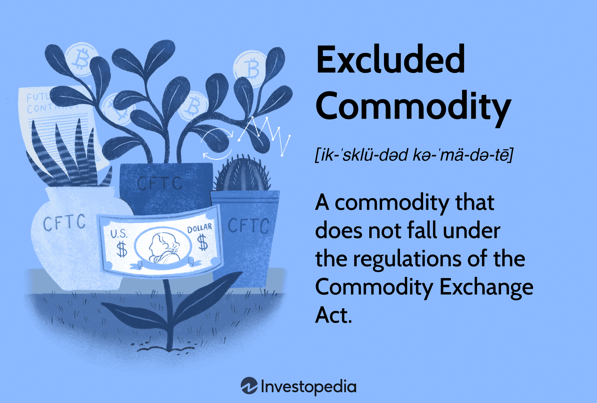

In today's dynamic financial environment, commodities are fundamental to economic development and investment strategies. As primary raw materials, commodities like oil, gold, and agricultural products have historically been vital for industry and trade. However, the world of commodities extends beyond these traditional markets to include complex financial instruments known as excluded commodities. These instruments, often derivatives, derive value from underlying assets but are governed by unique regulatory frameworks. This article will explore the nature of excluded commodities, reviewing their economic implications and the regulatory landscape shaped by the Commodity Exchange Act (CEA). Unlike traditional commodities, excluded commodities are not bound by the same regulatory constraints, allowing for distinct market behaviors and trading opportunities.

An important theme is the intersection of commodities markets with algorithmic trading. Algorithmic trading utilizes advanced computer algorithms to automate transactions, dramatically reshaping trading strategies by optimizing speed, accuracy, and cost-effectiveness. As these technologies converge, traditional trading paradigms are evolving, prompting a reexamination of how commodities are traded and managed within the market.



The following discussion offers a comprehensive overview of these topics, highlighting the significance of excluded commodities and algorithmic trading in the current economic framework. By understanding these elements, traders and investors can better navigate the complexities of modern commodities markets and leverage opportunities for strategic advantage.

## Table of Contents

## Understanding Excluded Commodities

Excluded commodities are unique financial instruments covered under the Commodity Exchange Act (CEA). Unlike standard commodities such as agricultural products or precious metals, excluded commodities do not possess intrinsic cash value and usually are not traded on traditional exchanges. They derive their value primarily from underlying assets or indicators, falling within the spectrum of derivatives, such as futures contracts.

Under the CEA, the concept of excluded commodities emerges from the idea that these instruments are less prone to market manipulation than typical commodities. Traditional commodities like oil or grain are subject to supply and demand fluctuations and geopolitical influences, which can lead to significant price volatility and potential market abuse. On the other hand, excluded commodities, because of their basis on financial indices or non-physical factors, are considered inherently more stable.

Characteristics of excluded commodities involve their close ties to underlying assets or financial metrics that influence their value. Generally, these include [interest rate](/wiki/interest-rate-trading-strategies) instruments, currencies, credit default swaps, and broad-based stock indices. The regulatory framework posits that the lack of physical attributes or storage requirements, as seen with conventional commodities, minimizes the risk of price manipulation through supply interference.

The implications of excluding certain commodities from standard regulatory frameworks are manifold. It allows for greater innovation and flexibility in financial markets, enabling speculative strategies which might be restricted under stricter commodity regulations. Investors can employ various derivative forms to hedge against risks or leverage financial positions in ways not possible with physical commodity markets.

Additionally, these commodities benefit from being largely immune to some of the marketplace's most pervasive risks, such as weather impacts or logistical disruptions. However, this also means that their valuation might be influenced heavily by abstract economic indicators and perceived market conditions rather than the straightforward physical demand-supply calculus.

In conclusion, the dynamics of excluded commodities enrich the spectrum of trading instruments available within financial markets. They facilitate sophisticated market strategies, owing to their unique characteristics of non-physical valuation and inherent regulatory advantages.

## Commodities Economics

Commodities are foundational raw materials that serve as the building blocks of various industries, influencing economic stability worldwide. As the global economy evolves, the trading of commodities has been shaped significantly by fluctuating market demands and technological advancements. The intrinsic value of commodities is primarily determined by the principles of supply and demand. An imbalance between these forces can lead to significant shifts in commodity prices. For instance, a surge in demand for a commodity like [crude oil](/wiki/crude-oil) amidst restricted supply can result in price spikes, impacting industries reliant on that commodity.

Geopolitical events are another critical [factor](/wiki/factor-investing) impacting commodities markets. Political instability, trade conflicts, and regulatory changes can introduce [volatility](/wiki/volatility-trading-strategies), influencing both short-term price movements and long-term market stability. For example, tensions in major oil-producing regions can lead to uncertainty in supply chains, directly affecting oil prices globally.

Investors often turn to commodities as a hedge against inflation. This strategy is grounded in the idea that commodities, being tangible assets, tend to appreciate in value during inflationary periods. As currencies depreciate, the relative value of commodities increases, making them an attractive option for preserving wealth. Consequently, commodities are frequently included in diversified investment portfolios to mitigate risks associated with currency fluctuations and inflation.

The economic dynamics of the commodities markets are complex, driven by a range of factors including technological advancements. The use of technology in trading—such as [algorithmic trading](/wiki/algorithmic-trading)—has enhanced market efficiency and expanded participation, reshaping how commodities are traded. Enhanced data analytics allow traders to make more informed predictions about market movements, thus optimizing investment strategies.

The industrial relevance of commodities is underscored by their role in the supply chains of numerous products and services. Industries such as energy, agriculture, and manufacturing heavily rely on commodities as inputs, making their prices and availability crucial to economic health and development. Simultaneously, their investment relevance highlights the strategic importance of commodities trading as a component of a balanced financial portfolio.

Understanding these economic dynamics is essential for stakeholders in commodities markets, as it allows for better navigation of market opportunities and risks associated with both industrial usage and investment potential in this vital sector.

## Algorithmic Trading in Commodities

Algorithmic trading in commodities has become an integral part of modern financial markets, leveraging computer algorithms to execute trading activities with minimal human intervention. This approach enhances speed and accuracy, crucial elements in today's fast-paced trading environment.

In the commodities market, algorithmic trading significantly boosts trading efficiency by providing rapid execution capabilities. This is particularly advantageous for high-frequency trading strategies, where milliseconds can define profit and loss margins. Algorithmic systems can analyze vast amounts of data at exceptional speed, allowing for precise and timely trading decisions. This level of efficiency also improves risk management as algorithms can dynamically adjust trading strategies based on real-time data inputs and market conditions.

Diversification benefits are another crucial advantage of algorithmic trading in commodities. By managing a broad range of assets simultaneously, algorithms can distribute risk across different commodities, thus providing more stable returns. This diversification reduces the impact of volatility inherent to individual commodity markets.

Technological advancements have profoundly transformed commodities trading. The implementation of algorithmic strategies has optimized data use by integrating advanced analytics and [machine learning](/wiki/machine-learning) techniques. These algorithms can extract insightful patterns from complex data sets, enhancing the decision-making process. This capability translates into more informed trading strategies, potentially increasing profitability.

Various strategies are employed in algorithmic trading, from statistical [arbitrage](/wiki/arbitrage) to market-making and trend-following. Statistical arbitrage involves exploiting price discrepancies between correlated commodity markets. Market-making strategies provide [liquidity](/wiki/liquidity-risk-premium) by placing simultaneous buy and sell orders, profiting from the bid-ask spread. Trend-following tactics identify sustained movements in commodity prices, enabling traders to capitalize on ongoing market trends.

The platforms facilitating algorithmic trading play a critical role in its widespread adoption. These platforms incorporate robust infrastructure supporting low latency data feeds and execution capabilities, essential for efficient trading. They often feature comprehensive toolsets for back-testing strategies, ensuring their viability before live deployment. Popular platforms like MetaTrader and [Interactive Brokers](/wiki/interactive-brokers-api) provide extensive APIs, allowing traders to customize and automate their trading strategies with precision.

In summary, algorithmic trading has revolutionized commodities markets by enhancing efficiency, optimizing data usage, and enabling sophisticated trading strategies. The continual evolution of this technology promises ongoing improvements in cost-effectiveness and market operation.

## Challenges and Future of Algorithmic Trading

Algorithmic trading, while offering numerous benefits, brings several challenges that require careful consideration. One of the primary concerns is the potential for market manipulation. Algorithms can be designed to engage in manipulative practices such as spoofing, where orders are placed with the intent to cancel them before execution, artificially influencing market prices. Regulatory concerns also stem from the opacity and complexity of algorithmic frameworks, which can obscure the origin of certain trades, complicating oversight and enforcement.

Flash crashes present another significant challenge. These are rapid, deep market declines within a very short period, often exacerbated by high-frequency trading ([HFT](/wiki/high-frequency-trading-strategies)). The speed at which these trades are executed can lead to market imbalances and severe liquidity shortages, prompting concerns about the stability and fairness of markets. Such events underscore the necessity for robust regulatory oversight and the establishment of ethical guidelines. Efforts such as implementing circuit breakers and requiring more transparency from traders are some measures being adopted to mitigate these risks.

Looking forward, advancements in [artificial intelligence](/wiki/ai-artificial-intelligence) (AI) and machine learning promise to transform algorithmic trading further. These technologies offer enhanced analytics and predictive capabilities, enabling more profound insights into market behavior and the development of sophisticated trading strategies. Machine learning models can identify complex patterns and correlations in vast datasets, potentially predicting price movements with greater accuracy. For instance, a predictive model can be trained on historical market data using Python and libraries like TensorFlow or PyTorch to forecast future trends:

```python
import pandas as pd
import tensorflow as tf
from sklearn.model_selection import train_test_split
from sklearn.preprocessing import MinMaxScaler

# Load data
data = pd.read_csv('market_data.csv')

# Preprocessing
scaler = MinMaxScaler(feature_range=(0, 1))
scaled_data = scaler.fit_transform(data)

# Split data
train_data, test_data = train_test_split(scaled_data, test_size=0.2, shuffle=False)

# Define neural network model
model = tf.keras.Sequential([
    tf.keras.layers.Dense(50, activation='relu', input_shape=(train_data.shape[1],)),
    tf.keras.layers.Dense(25, activation='relu'),
    tf.keras.layers.Dense(1)
])

model.compile(optimizer='adam', loss='mse')

# Train model
model.fit(train_data, epochs=10, batch_size=16)

# Predict
predictions = model.predict(test_data)
```

Despite technological advancements, algorithmic trading must navigate potential transformations within commodities markets. The integration of AI could lead to self-optimizing algorithms, although challenges related to data quality and interpretation remain. Additionally, as these systems grow more autonomous, ethical considerations surrounding their deployment and the potential consequences of their strategies become more pronounced.

Ultimately, the future trajectory of algorithmic trading hinges on balancing innovation with prudent regulation and ethical practices. This balance will be crucial to ensuring that the benefits of algorithmic trading can be leveraged while minimizing risks, thereby enabling a more efficient and stable commodities market.

## Conclusion

Commodities are fundamental to global markets, serving as essential building blocks for a myriad of industries. Their role is underscored by their capacity to influence economic stability and growth. Among these, excluded commodities present a unique subset distinguished by their regulatory frameworks and trading attributes. These financial instruments, while not bound by standard commodity regulations, add a layer of complexity and sophistication to the market dynamics.

As trading strategies evolve, algorithmic trading perpetually reshapes the landscape by offering enhanced accuracy and cost efficiency. This technological advancement has cemented its utility within commodities markets, presenting investors and traders with substantial strategic benefits. By leveraging algorithms, market participants can achieve rapid execution of trades, optimize risk management, and exploit market inefficiencies with precision. The integration of machine learning and data analytics further improves decision-making processes, providing an edge in competitive commodities trading environments.

Investors and traders are thus encouraged to incorporate algorithmic trading into their strategies to effectively harness market opportunities. The precision, speed, and analytical power of algorithmic systems present a compelling case for their adoption, allowing market players to navigate through volatilities with agility and informed foresight.

In conclusion, a comprehensive understanding of excluded commodities and the transformative role of algorithmic trading provides invaluable insights into modern investment and trading strategies. As the financial landscape continues to adapt to technological advancement, these elements become increasingly significant, offering opportunities to enhance market engagements and optimize investment outcomes.

## References & Further Reading

- **Advances in Financial Machine Learning by Marcos Lopez de Prado**: This book provides a comprehensive exploration of machine learning techniques applied to finance. It offers insights into algorithmic trading strategies, emphasizing the importance of data-driven decision-making in modern financial markets.

- **Evidence-Based Technical Analysis by David Aronson**: Aronson's work challenges traditional technical analysis by advocating a scientific approach to evaluating trading systems. This resource is crucial for traders seeking to incorporate algorithmic strategies grounded in statistical evidence.

- **Quantitative Trading: How to Build Your Own Algorithmic Trading Business by Ernest P. Chan**: Chan's book is a practical guide for those interested in developing their own quantitative trading systems. It covers various aspects of building, testing, and deploying automated trading algorithms, making it an essential resource for aspiring quant traders.

- **U.S. Commodity Futures Trading Commission resources on Excluded and Exempt Commodities**: The CFTC provides detailed regulatory information on excluded and exempt commodities. These resources are invaluable for understanding the legal framework and implications of trading in commodities that fall outside conventional regulatory boundaries.

- **Research literature on algorithmic trading and its impact on commodities markets**: Numerous academic and industry studies investigate the role of algorithmic trading in commodities markets. These studies often analyze the effects of automated trading on market efficiency, liquidity, and volatility, providing critical insights for stakeholders in these markets.

These references offer a blend of theoretical foundations and practical applications, invaluable for comprehending the complexities of commodities trading and the transformative role of algorithmic trading in contemporary financial markets.

