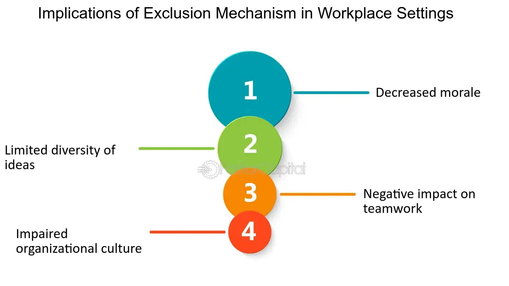

## Table of Contents

## What does it mean to exclude items in a set or list?

To exclude items from a set or list means to remove or leave out certain items that you don't want to include. For example, if you have a list of fruits and you want to exclude apples, you would take apples out of the list. This can be useful when you want to focus on specific items or when you need to remove items that don't meet certain criteria.

In programming, excluding items from a set or list often involves using specific functions or methods. For example, in Python, you might use a method like `remove()` or `pop()` to take out items from a list. In a set, you might use the `difference()` method to create a new set that does not include the items you want to exclude. These operations help you manage and organize your data more effectively.

## Why is the concept of exclusion important in data management?

The concept of exclusion is important in data management because it helps keep data clean and relevant. When you exclude items that you don't need, you make it easier to focus on the information that matters. For example, if you're looking at a list of customer feedback and you exclude comments that are not related to your product, you can better understand what customers think about your product.

Exclusion also helps in making data analysis more efficient. By removing unnecessary data, you can perform calculations and draw conclusions more quickly. This is especially useful when working with large datasets where including all data might slow down your work or lead to less accurate results. In summary, excluding items helps in managing data better and making smarter decisions based on that data.

## How can exclusion be applied in everyday life scenarios?

Exclusion can be useful in everyday life when you need to focus on what's important. For example, when you're studying for a test, you might choose to exclude distractions like social media or loud music. This helps you concentrate better on your study material and learn more effectively. By leaving out things that aren't helpful, you make it easier to achieve your goals.

Another way exclusion can be applied is in organizing your daily tasks. If you have a long list of things to do, you might decide to exclude tasks that are less urgent or not important. This way, you can focus on the most critical tasks first, like finishing a work project or doing the laundry. By excluding less important tasks, you can manage your time better and get more done.

## What are the basic mechanisms for excluding items in programming?

In programming, one way to exclude items is by using methods or functions. For example, in Python, you can use the `remove()` method to take out a specific item from a list. If you know the item you want to exclude, you can just tell the program to remove it. Another way is using the `pop()` method, which lets you remove an item by its position in the list. These methods help you get rid of items you don't want, making your list cleaner and easier to work with.

Another mechanism for excluding items is using sets. In Python, you can use the `difference()` method to create a new set that doesn't include the items you want to exclude. For example, if you have two sets and you want to keep only the items that are in the first set but not in the second set, you can use `difference()`. This way, you can easily exclude items and focus on the ones that matter. Both lists and sets are useful for managing and organizing data in programming.

## Can you explain the difference between filtering and exclusion in data processing?

Filtering and exclusion are both ways to manage data, but they work a bit differently. Filtering is like sorting through your data to keep only the items that meet certain rules. For example, if you have a list of numbers and you want to keep only the even numbers, you would filter out the odd ones. Filtering helps you focus on specific parts of your data that you want to work with.

Exclusion, on the other hand, is about removing items that you don't want. Instead of looking for what to keep, you're looking for what to take out. For instance, if you have a list of fruits and you want to remove all the apples, you would exclude apples from your list. Exclusion helps you clean up your data by getting rid of things that aren't useful or relevant to what you're doing.

## How does exclusion impact statistical analysis and results?

Exclusion can change the results of statistical analysis a lot. When you take out certain data points, you might end up with different averages, totals, or patterns. For example, if you're looking at the average test scores of a class and you exclude the lowest scores, the average will go up. This can make the class seem better than it really is. So, it's important to think carefully about what data you exclude because it can affect how you understand the results.

Exclusion also helps make your analysis more focused and accurate. If you remove data that isn't relevant or is incorrect, you can get a clearer picture of what's going on. For instance, if you're studying the heights of people in a city and you exclude data from children, you'll get a better idea of the average adult height. But you have to be careful not to exclude too much, or you might miss important information. Balancing what to exclude and what to keep is key to good statistical analysis.

## What are some common algorithms used for item exclusion in computer science?

One common algorithm for item exclusion is the use of hash tables. Imagine you have a list of items and you want to remove some of them. You can use a hash table to quickly check if an item should be excluded. You put the items you want to exclude into the hash table, and then as you go through your list, you can quickly look up each item in the hash table. If it's there, you leave it out. This method is fast because hash tables let you find things quickly, no matter how big your list is.

Another way to exclude items is by using sorting and binary search. First, you sort your list of items. Then, you can use binary search to find the items you want to exclude. Binary search is like looking up a word in a dictionary. It's much faster than looking at each item one by one. Once you find the items you want to exclude, you can remove them from your sorted list. This method works well when your list is already sorted or when you need to exclude items often.

A third common approach is the use of sets. Sets are like lists, but they don't allow duplicates and they can do some things faster. If you want to exclude items from one set that are in another set, you can use the set difference operation. This operation creates a new set with only the items that are in the first set but not in the second set. It's a simple and efficient way to exclude items, especially when you're working with large amounts of data.

## How do database systems handle exclusion in queries and indexing?

Database systems handle exclusion in queries by using special commands that tell the system which data to leave out. For example, in SQL, you can use the "WHERE" clause to say which items you don't want to see in your results. If you're looking at a list of customers and you want to exclude those from a certain city, you can write a query that says "WHERE city != 'New York'". This tells the database to show you all the customers except the ones from New York. This makes it easier to focus on the data you need without seeing the data you don't want.

Indexing also helps with exclusion in databases. An index is like a quick way to find things in a big list. When you use an index, the database can find and exclude items faster. For example, if you have an index on the "city" column, the database can quickly look up all the entries for New York and leave them out of your results. This speeds up your queries because the database doesn't have to look at every single row to find the ones to exclude. Using indexes smartly can make your database work better and help you manage your data more efficiently.

## What are the performance considerations when implementing exclusion mechanisms?

When you use exclusion mechanisms in your programs or databases, you need to think about how fast they will work. Some ways of excluding items can be slow if you have a lot of data. For example, if you go through a big list one item at a time to find the ones to exclude, it can take a long time. But if you use smart ways like hash tables or indexes, you can make it faster. These methods help you find and exclude items quickly, even if your list is very large.

Another thing to think about is how much memory your exclusion method will use. Some methods need more space to work, like using a hash table or a set. If you have a lot of data, using too much memory can slow down your computer or make it run out of space. You need to find a good balance between speed and memory use. Choosing the right method for your data can help you keep your program running smoothly and efficiently.

## How can exclusion be used strategically in machine learning models?

In machine learning, exclusion can be used to make models work better. When you train a model, you might find that some data is not helpful or even makes the model worse. By excluding this data, you can focus on the information that really matters. For example, if you're trying to predict house prices, you might exclude houses that are very old because they might not fit well with the rest of your data. This helps your model learn from the most relevant examples and make better predictions.

Exclusion can also help in making your model simpler and faster. Sometimes, a model can get too complicated if it tries to learn from all the data. By excluding less important features or data points, you can make the model easier to understand and quicker to run. For instance, if you're classifying images of animals, you might exclude images that are blurry or too dark because they might confuse the model. This way, your model can focus on clear, useful images and perform better overall.

## What are the ethical implications of excluding certain data or items?

When you choose to exclude certain data or items, it's important to think about the fairness of your choices. If you leave out data from certain groups of people, like those from different backgrounds or with different incomes, you might end up with results that aren't fair. For example, if a bank uses a model to decide who gets a loan and they exclude data from people who live in poorer neighborhoods, they might miss out on good customers just because of where they live. This can lead to unfair treatment and discrimination.

It's also important to be open about what data you're excluding and why. If you're not clear about your choices, people might think you're hiding something or trying to trick them. For example, if a company says their product works well but they've excluded negative reviews, people might feel cheated when they find out. Being honest about what data you're using and what you're leaving out helps build trust and makes sure everyone is treated fairly.

## How can advanced exclusion techniques be applied in big data environments?

In big data environments, advanced exclusion techniques can help manage and process huge amounts of information more efficiently. One way to do this is by using distributed computing systems like Apache Hadoop or Apache Spark. These systems let you break down your data into smaller parts and process them on different computers at the same time. When you want to exclude certain data, you can tell each part of the system what to leave out. This makes the process faster because you're not just working on one computer, but many. For example, if you're analyzing customer data and you want to exclude records from last year, you can tell each part of the system to ignore those records, speeding up your analysis.

Another advanced technique is using machine learning algorithms to automatically find and exclude irrelevant or noisy data. These algorithms can learn what kind of data is not helpful for your analysis and exclude it without you having to do it manually. This is especially useful in big data because it can be hard to go through all the data by yourself. For instance, if you're working with social media data, a machine learning model can help you exclude spam posts or unrelated comments, letting you focus on the most important information. By using these advanced techniques, you can make your big data analysis more accurate and efficient.

## What are the Mechanisms of Item Exclusion?

Item exclusion in financial calculations involves methods that can help streamline data and emphasize the most crucial elements for analysis. These processes predominantly include statistical techniques and data smoothing.

Statistical techniques in item exclusion often begin with identifying data outliers or anomalies that could skew results. For example, methods such as z-score analysis or interquartile range (IQR) can be employed. The z-score helps identify how far data points lie from the mean, offering a standardized method to flag potential outliers that might warrant exclusion:

$$
z = \frac{(X - \mu)}{\sigma}
$$

where $X$ is the data point, $\mu$ is the mean, and $\sigma$ is the standard deviation. Outliers with a z-score beyond a certain threshold (commonly set at 2 or 3) may be considered for exclusion.

Data smoothing methods, such as moving averages, also play a significant role. These techniques help reduce noise from short-term fluctuations by aggregating data points over given periods and averaging them, which can improve trend detection. For example, a simple moving average (SMA) over $n$ periods is calculated as:

$$
\text{SMA} = \frac{1}{n} \sum_{i=0}^{n-1} P_{i}
$$

where $P_{i}$ represents the price at period $i$.

In financial statements, item exclusion mechanisms help refine projections by removing volatile components such as one-time events or extraordinary gains, providing a clearer view of the underlying financial health. Similarly, consumer price indices might exclude hyper-volatile items like fuel prices to obtain a "core index" that better represents long-term inflation trends. Retail sales data can benefit from exclusion techniques by omitting seasonal items, which standardizes performance measurement across different times of the year.

Technology and software tools greatly enhance the automation of these processes. Algorithms can be coded to automatically apply statistical tests and smoothing filters. For example, Python's libraries like NumPy and Pandas are often used to automate these calculations, allowing for scalable and efficient data analysis. Here's a simple Python example to calculate and exclude outliers based on z-scores:

```python
import numpy as np
import pandas as pd

# Sample data
data = pd.Series([10, 12, 12, 9, 11, 23, 12, 9, 10, 22])

# Calculate z-scores
z_scores = (data - data.mean()) / data.std()

# Exclude outliers with z-score > 2 or < -2
filtered_data = data[(z_scores < 2) & (z_scores > -2)]
```

In this code snippet, outliers with z-scores greater than 2 or less than -2 are excluded, simplifying the dataset for clearer analysis.

Through the adoption of statistical techniques and automation by technology and software, traders can efficiently refine their datasets by excluding non-essential items, leading to heightened focus on core data trends and improved analytical outcomes.

## What are common challenges and solutions?

Algorithmic traders often encounter significant challenges when deciding which items to exclude from their data sets. One primary difficulty lies in determining the optimal balance between exclusion and inclusion of data points, as either action can profoundly affect the performance and reliability of trading algorithms.

### Identification of Relevant Data

One of the primary challenges is identifying which data points are genuinely irrelevant or detrimental to the trading strategy. Market noise, often characterized by short-term volatility and non-representative market movements, can obscure long-term trends critical to decision-making processes. However, completely excluding data that appears volatile may risk omitting crucial signals that affect algorithm outcomes.

### Risk of Over-Exclusion

Over-exclusion can potentially lead to biased models that do not account for essential variables, subsequently compromising the algorithm's effectiveness. This occurs when algorithms are too selective, disregarding data that might seem anomalous but actually hold predictive power concerning market shifts. An algorithm's robustness can be tested using backtesting with historical data to evaluate the effects of different exclusion criteria.

### Solutions to Maintain Data Integrity

Maintaining data integrity while applying exclusion rules involves using statistical methods and machine learning techniques to accurately identify and exclude only the data that skews results. For instance, techniques such as z-score analysis help to flag outliers by measuring their distance from the mean in terms of standard deviations. When an observed value's z-score exceeds a certain threshold (usually 2 or 3), it can be considered an outlier:

$$
Z = \frac{(X - \mu)}{\sigma}
$$

Where $X$ is the value, $\mu$ is the mean, and $\sigma$ is the standard deviation of the dataset.

In addition, the application of machine learning algorithms can assist in filtering noise from valuable data. Algorithms like clustering can automatically classify data into subsets, differentiating between what should and should not be excluded.

### Continuous Monitoring and Adjustment

Traders must ensure ongoing monitoring and adjustment of item exclusion criteria due to the dynamic nature of financial markets. The adaptability of an algorithm can be improved by employing frameworks that support real-time data analysis and iterative learning processes. For instance, Python's package `pandas` offers functionalities to continuously update datasets and criteria based on evolving market conditions. An example function to adjust exclusion criteria could be:

```python
import pandas as pd

def adjust_exclusion_criteria(data, threshold):
    # Calculate the rolling mean and std deviation
    rolling_mean = data.rolling(window=20).mean()
    rolling_std = data.rolling(window=20).std()

    # Define exclusion criteria using z-score method
    exclusion_criteria = (data - rolling_mean) > (threshold * rolling_std)

    # Apply exclusion criteria
    adjusted_data = data[~exclusion_criteria]
    return adjusted_data

# Sample usage with hypothetical data
data = pd.Series([generate_hypothetical_data()])
cleaned_data = adjust_exclusion_criteria(data, 2)
```

The above method ensures that the exclusion criteria evolve as new data flows into the system, honing the algorithm's reaction to the most recent market dynamics.

### Adaptation to Market Changes

Continuous adaptation also involves proactively anticipating market events and incorporating potential impacts into exclusion strategies. Whether through adjusting trigger points or refining algorithms to recognize new patterns, traders must be vigilant to instrument changes and evolving market conditions.

Through a deliberate approach to selecting exclusion criteria and leveraging advanced techniques for continuous adaptation, traders can mitigate the risks associated with improper item exclusion. This enhances the effectiveness and stability of algorithmic trading strategies, keeping them aligned with real-time market trends.

## References & Further Reading

[1]: Bergstra, J., Bardenet, R., Bengio, Y., & Kégl, B. (2011). ["Algorithms for Hyper-Parameter Optimization."](https://dl.acm.org/doi/10.5555/2986459.2986743) Advances in Neural Information Processing Systems 24.

[2]: ["Advances in Financial Machine Learning"](https://www.amazon.com/Advances-Financial-Machine-Learning-Marcos/dp/1119482089) by Marcos Lopez de Prado

[3]: ["Evidence-Based Technical Analysis: Applying the Scientific Method and Statistical Inference to Trading Signals"](https://www.amazon.com/Evidence-Based-Technical-Analysis-Scientific-Statistical/dp/0470008741) by David Aronson

[4]: ["Machine Learning for Algorithmic Trading"](https://github.com/stefan-jansen/machine-learning-for-trading) by Stefan Jansen

[5]: ["Quantitative Trading: How to Build Your Own Algorithmic Trading Business"](https://www.amazon.com/Quantitative-Trading-Build-Algorithmic-Business/dp/1119800064) by Ernest P. Chan