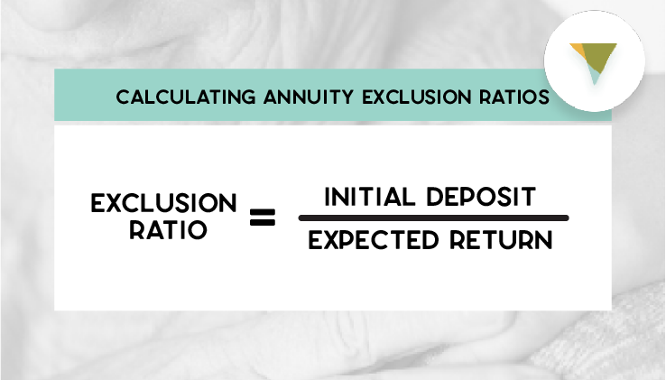

## Table of Contents

## What is an annuity?

An annuity is a financial product that people can buy to get regular payments over time. It's like a savings plan where you give a lump sum of money to an insurance company, and in return, they promise to pay you a certain amount of money each month or year. This can be helpful for people who want a steady income after they retire.

There are different types of annuities. Some start paying you right away, which are called immediate annuities. Others, called deferred annuities, start paying you later. You can also choose how long you want the payments to last. Some annuities pay you for the rest of your life, while others might pay for a set number of years. It's important to understand the terms and conditions before buying an annuity to make sure it fits your needs.

## What is the exclusion ratio in annuities?

The exclusion ratio is a way to figure out how much of the money you get from an annuity is not taxed. When you buy an annuity, part of your payment is a return of the money you put in, and part of it is interest or earnings. The exclusion ratio helps you know which part is not taxed. The part that is not taxed is the return of your own money, and the part that is taxed is the interest or earnings.

To find the exclusion ratio, you divide the total amount of money you paid for the annuity by the total expected payments you will get. For example, if you paid $100,000 for an annuity and expect to get $120,000 over time, the exclusion ratio is $100,000 divided by $120,000, which is about 83%. This means that 83% of each payment you get is not taxed, and the rest is taxed as income.

## How is the exclusion ratio calculated?

The exclusion ratio helps you figure out how much of your annuity payment is not taxed. When you buy an annuity, you give a lump sum of money to an insurance company. Over time, they pay you back this money plus some extra as interest or earnings. The part of the payment that is your original money is not taxed, but the interest or earnings part is taxed. The exclusion ratio tells you what part of each payment is your original money.

To calculate the exclusion ratio, you need to know two things: the total amount of money you paid for the annuity and the total amount of money you expect to get back from the annuity. You divide the amount you paid by the total expected payments. For example, if you paid $100,000 for an annuity and expect to get $120,000 over time, you divide $100,000 by $120,000. This gives you an exclusion ratio of about 83%. So, 83% of each payment you get is not taxed, and the other 17% is taxed as income.

## Why is the exclusion ratio important for annuity investors?

The exclusion ratio is important for annuity investors because it helps them know how much of their annuity payments will be taxed. When you buy an annuity, you give a lump sum of money to an insurance company. Over time, they pay you back this money plus some extra as interest or earnings. The part of the payment that is your original money is not taxed, but the interest or earnings part is taxed. The exclusion ratio tells you what part of each payment is your original money, so you can figure out how much of each payment you can keep without paying taxes on it.

Understanding the exclusion ratio can help annuity investors plan their finances better. If you know that a big part of your annuity payment won't be taxed, you can count on having more money to spend or save. This can be really helpful, especially for people who are retired and need a steady income. By knowing the exclusion ratio, you can make smarter choices about how to use your annuity payments and plan your taxes more effectively.

## What is the difference between the exclusion ratio and the inclusion ratio?

The exclusion ratio and the inclusion ratio are two important ideas for people who have annuities. The exclusion ratio is used to figure out how much of the money you get from an annuity is not taxed. When you buy an annuity, you give a lump sum of money to an insurance company. Over time, they pay you back this money plus some extra as interest or earnings. The part of the payment that is your original money is not taxed, and the exclusion ratio helps you find out what part of each payment is your original money.

The inclusion ratio, on the other hand, tells you how much of your annuity payment is taxed. It's the opposite of the exclusion ratio. If the exclusion ratio is the part of the payment that is not taxed, the inclusion ratio is the part that is taxed. For example, if your exclusion ratio is 83%, then your inclusion ratio would be 17%. This means that 17% of each payment you get from the annuity is taxed as income. Knowing both ratios can help you plan your finances and understand how much money you'll actually keep from your annuity payments.

## How does the exclusion ratio affect the taxation of annuity payments?

The exclusion ratio helps you figure out how much of your annuity payment is not taxed. When you buy an annuity, you give a lump sum of money to an insurance company. Over time, they pay you back this money plus some extra as interest or earnings. The part of the payment that is your original money is not taxed, and the exclusion ratio tells you what part of each payment is your original money. To find the exclusion ratio, you divide the total amount of money you paid for the annuity by the total expected payments you will get.

The exclusion ratio directly affects how much of your annuity payments you have to pay taxes on. If your exclusion ratio is high, it means a big part of each payment is your original money and won't be taxed. For example, if your exclusion ratio is 83%, then 83% of each payment is not taxed, and only the other 17% is taxed as income. This can make a big difference in how much money you actually get to keep from your annuity payments. Knowing your exclusion ratio helps you plan your finances better and understand your tax situation.

## Can the exclusion ratio change over the life of an annuity?

The exclusion ratio can change over the life of an annuity, but it depends on the type of annuity you have. For fixed annuities, where the payments stay the same, the exclusion ratio usually stays the same too. Once you figure out the exclusion ratio at the start, you use it for all your payments. But if you have a variable annuity, where the payments can go up or down, the exclusion ratio might change. This is because the total expected payments can change, which means you might need to recalculate the exclusion ratio.

Knowing if the exclusion ratio can change is important for planning your taxes and your money. If you have a fixed annuity, you can count on the same part of your payments being tax-free every time. But if you have a variable annuity, you might need to check the exclusion ratio again if your payments change a lot. This can affect how much money you keep after taxes, so it's good to keep an eye on it and maybe talk to a tax advisor to make sure you're doing things right.

## What are the implications of the exclusion ratio for retirement planning?

The exclusion ratio is really important for people planning their retirement because it helps them know how much of their annuity payments they can keep without paying taxes. When you buy an annuity, you give a lump sum of money to an insurance company. Over time, they pay you back this money plus some extra as interest or earnings. The part of the payment that is your original money is not taxed, and the exclusion ratio tells you what part of each payment is your original money. If your exclusion ratio is high, it means a big part of each payment is not taxed, so you get to keep more money. This can make a big difference in how much money you have to live on during retirement.

Understanding the exclusion ratio can help you plan your retirement better. If you know that a big part of your annuity payment won't be taxed, you can count on having more money to spend or save. This can be really helpful, especially for people who are retired and need a steady income. By knowing the exclusion ratio, you can make smarter choices about how to use your annuity payments and plan your taxes more effectively. It's a good idea to talk to a financial advisor to make sure you understand how the exclusion ratio works with your specific annuity and retirement plan.

## How do different types of annuities (fixed, variable, indexed) impact the exclusion ratio?

Different types of annuities like fixed, variable, and indexed annuities can impact the exclusion ratio in different ways. With a fixed annuity, the payments you get stay the same over time. Because the payments don't change, the exclusion ratio usually stays the same too. You figure out the exclusion ratio at the start by dividing the money you paid for the annuity by the total expected payments. Since the payments are fixed, you use this same exclusion ratio for all your payments, making it easy to know how much of each payment is not taxed.

Variable annuities are different because the payments can go up or down based on how well the investments inside the annuity do. When the payments change, the total expected payments might change too, which means you might need to recalculate the exclusion ratio. If your payments go up, the exclusion ratio might go down, and if your payments go down, the exclusion ratio might go up. This can make it harder to plan your taxes because you need to keep an eye on the exclusion ratio and maybe change it over time. Indexed annuities are a bit in between. They have payments that can change based on a market index, but they often have a minimum payment that stays the same. This means the exclusion ratio might change, but not as much as with a variable annuity. Knowing how your type of annuity works can help you understand how the exclusion ratio might change and plan your retirement better.

## What are common misconceptions about the exclusion ratio in annuities?

One common misconception about the exclusion ratio in annuities is that it applies to all types of annuities in the same way. People often think that the exclusion ratio stays the same no matter what kind of annuity they have. But that's not true. For fixed annuities, where the payments stay the same, the exclusion ratio usually stays the same too. But for variable annuities, where the payments can change, the exclusion ratio might need to be recalculated if the payments go up or down a lot. Indexed annuities can also have changing exclusion ratios, but not as much as variable annuities.

Another misconception is that the exclusion ratio means you don't have to pay any taxes on your annuity payments. The exclusion ratio only tells you what part of each payment is not taxed because it's your original money coming back to you. The rest of the payment, which is the interest or earnings, is taxed as income. So, even if your exclusion ratio is high, you still have to pay taxes on the part of the payment that's not covered by the exclusion ratio. Understanding this can help you plan your finances better and avoid surprises when it's time to file your taxes.

## How can one optimize the exclusion ratio to minimize tax liability?

To optimize the exclusion ratio and minimize tax liability, it's important to choose the right type of annuity for your needs. If you want a steady income without worrying about changes in the exclusion ratio, a fixed annuity might be the best choice. With a fixed annuity, the payments stay the same, so the exclusion ratio stays the same too. This means you can count on a certain part of your payment being tax-free every time. You can figure out the exclusion ratio at the start by dividing the money you paid for the annuity by the total expected payments, and then use that same ratio for all your payments.

If you're okay with some risk and want to possibly get more money from your annuity, a variable annuity might be better. But remember, with a variable annuity, the payments can go up or down, so the exclusion ratio might change too. To minimize your tax liability, you might want to keep an eye on your payments and recalculate the exclusion ratio if they change a lot. If your payments go up, the exclusion ratio might go down, meaning more of your payment is taxed. If your payments go down, the exclusion ratio might go up, meaning less of your payment is taxed. Talking to a financial advisor can help you understand how to make the best choice for your situation and keep your taxes as low as possible.

## What are the regulatory considerations and changes affecting the exclusion ratio in recent years?

In recent years, there haven't been big changes to the rules about the exclusion ratio for annuities. The main rule is still the same: the exclusion ratio helps you figure out how much of your annuity payment is not taxed. This is because the part of the payment that is your original money is not taxed, but the interest or earnings part is taxed. The government keeps an eye on these rules to make sure they are fair and work well for people. But there haven't been any big changes that would make the exclusion ratio work differently.

One thing to keep in mind is that tax laws can change, and this might affect how the exclusion ratio works. For example, if the government changes the tax rates or how they treat income from annuities, it could change how much tax you have to pay on your annuity payments. It's a good idea to stay updated on any changes to tax laws and maybe talk to a tax advisor to make sure you understand how these changes might affect your exclusion ratio and your taxes.

## What is the Exclusion Ratio: A Taxation Tool?

The exclusion ratio is a critical concept in the taxation of annuity payments, determining the portion of each payment that is tax-free. It essentially represents the return of the original investment in the annuity, spread over the expected period of payments. The exclusion ratio is calculated by dividing the investment in the contract (cost basis) by the expected return. For example, if an individual purchased an annuity for $100,000 and the expected return is $150,000, the exclusion ratio would be $\frac{100,000}{150,000} = \frac{2}{3}$ or approximately 66.67%. This means that 66.67% of each annuity payment is considered a return of principal and is not subject to taxation, while the remaining 33.33% is taxable income.

The application of the exclusion ratio in practice can vary. For instance, consider a fixed annuity where the annuitant receives $10,000 annually. With an exclusion ratio of 66.67%, $6,667 of each annual payment would be tax-free, and $3,333 would be taxable. It's important to note that once the entire initial investment has been returned tax-free, subsequent payments become fully taxable.

Life expectancy plays a significant role in computing the exclusion ratio, as it affects the expected return on the annuity. The longer the life expectancy, the more payments are anticipated, effectively reducing the exclusion ratio because the initial investment is spread over a longer period. Conversely, a shorter life expectancy increases the exclusion ratio, as the investment is recouped over fewer payments. 

In practical terms, if an annuitant with a life expectancy of 20 years receives annual payments of $5,000, and the investment in the contract is $50,000, the exclusion ratio would initially be calculated as follows:

$$
\text{Exclusion Ratio} = \frac{\text{Investment in Contract}}{\text{Annual Payment} \times \text{Life Expectancy}} = \frac{50,000}{5,000 \times 20} = 0.5
$$

This implies that 50% of each payment, or $2,500, is tax-free under the exclusion ratio, with the remaining $2,500 being subject to taxation.

Understanding the exclusion ratio helps annuitants and financial planners devise tax-efficient strategies, ensuring the optimal balance between income and tax liabilities over the life of the annuity.

## How Can You Maximize Annuity Benefits Through the Exclusion Ratio?

Annuities play a vital role in financial planning, particularly for retirement, and the exclusion ratio serves as a significant tool in maximizing their tax efficiency. By understanding and leveraging the exclusion ratio, individuals can optimize their annuity payments to achieve favorable tax outcomes.

### Strategies for Maximizing Tax Benefits Using the Exclusion Ratio:

1. **Understand the Components of the Exclusion Ratio**:
   The exclusion ratio determines the portion of annuity payments that is not subject to taxation. This ratio is calculated using the formula:
$$
   \text{Exclusion Ratio} = \frac{\text{Investment in the Contract}}{\text{Expected Return}}

$$

   The "Investment in the Contract" refers to the total amount of capital invested in the annuity, whereas the "Expected Return" represents the total anticipated payout over the annuity term. By maximizing the initial investment and carefully assessing the expected return, individuals can increase the portion of each payment that is excluded from taxable income.

2. **Utilize the Exclusion Ratio in Long-term Financial Planning**:
   In retirement planning, it is crucial to have a predictable income stream with minimal tax liability. By applying a high exclusion ratio, retirees can effectively increase their tax-free income. This can be an essential strategy for managing cash flows, as tax-free income reduces the effective tax burden and increases the net income available for living expenses.

3. **Adjusting Annuity Contracts**:
   There are ways to modify annuity contracts to take maximum advantage of exclusions:
   - **Front-load Investments**: Consider investing more upfront to increase the exclusion ratio. A higher initial investment means a greater portion of each annuity payment can be excluded from taxation.
   - **Reevaluate Life Expectancy Assumptions**: Adjusting the estimated life expectancy, if contracts allow, can impact the expected payout, thereby altering the exclusion ratio. It is important to review these assumptions periodically, ensuring they align with current health and life expectancy projections.
   - **Consider Joint and Survivor Annuities**: In joint annuities, which provide benefits for two lives (typically that of a couple), it's possible to optimize the exclusion ratio by calculating it based on the longest possible life expectancy. This can enhance lifetime tax benefits.

4. **Advanced Contract Structuring**:
   Advanced annuity structures, such as deferred annuities, allow for greater flexibility in exclusion ratio optimization. Deferred annuities compound over a period before payments begin, potentially increasing the initial investment value and adjusting the ratio to favor tax-free income.

In conclusion, maximizing annuity benefits via the exclusion ratio requires a strategic approach, informed financial decision-making, and careful monitoring of annuity contracts. Adjustments to investments, life expectancy assumptions, and contract structures can significantly enhance tax efficiency, providing more stable and secure financial planning for retirement.

## References & Further Reading

[1]: Babbel, D. F., & Merrill, C. B. (2007). ["Rational Decumulation."](https://media.crai.com/wp-content/uploads/2020/09/16163847/Rational-Decumulation.pdf) Pension Research Council Working Paper.

[2]: ["Annuities for Dummies"](https://www.dummies.com/article/business-careers-money/personal-finance/insurance/annuities/annuities-for-dummies-cheat-sheet-208928/) by Kerry Pezé

[3]: ["The Intelligent Investor: The Definitive Book on Value Investing. A Book of Practical Counsel"](https://www.amazon.com/Intelligent-Investor-Definitive-Investing-Essentials/dp/0060555661) by Benjamin Graham

[4]: ["Algorithmic Trading: Winning Strategies and Their Rationale"](https://www.amazon.com/Algorithmic-Trading-Winning-Strategies-Rationale-ebook/dp/B00CY5HC0U) by Ernie Chan

[5]: Culp, C. L. (2001). ["The Risk Management Process: Business Strategy and Tactics."](https://archive.org/details/riskmanagementpr0000culp) John Wiley & Sons.