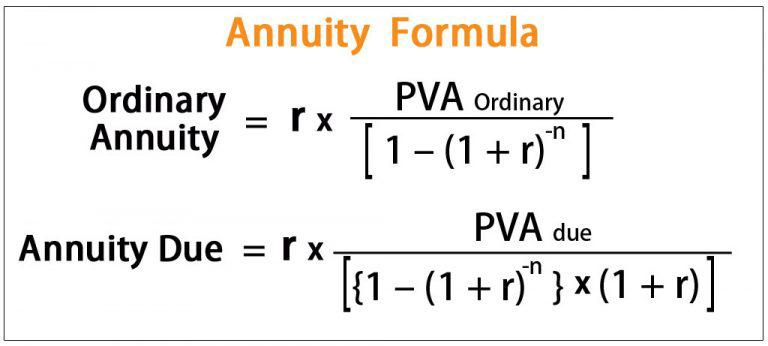

This article explores the intersection of annuities, taxation, the exclusion ratio, and algorithmic trading. Annuities, as financial instruments, are designed to provide a steady income stream, often considered a staple in retirement planning. Taxation issues related to annuities can be complex, with the exclusion ratio playing a crucial role in determining the taxable and non-taxable portions of annuity payments. The exclusion ratio is significant because it allows investors to understand the portion of annuity income that can remain tax-free, thus optimizing their financial planning and retirement strategies.

Algorithmic trading, on the other hand, represents a sophisticated and data-driven approach to participating in financial markets. Through the use of algorithms, investors can execute pre-programmed trading strategies, potentially enhancing efficiency and maximizing gains. When applied to investment strategies involving annuities, algorithmic trading can offer new opportunities for balancing investment gains and losses, ultimately impacting the overall tax strategy.



This article examines how these elements—annuities, taxation through the exclusion ratio, and algorithmic trading—can be intertwined to create more tax-efficient investment strategies. By leveraging annuities and algorithmic trading techniques, investors can manage tax liabilities effectively, ensuring that their investment portfolios are optimized for both income generation and tax savings.

## Table of Contents

## Understanding Annuities and Their Taxation

Annuities are financial products designed to provide a steady stream of income, most commonly utilized for retirement. They serve as a valuable tool for individuals seeking financial security during their non-working years. Annuities are typically acquired through contracts with insurance companies, where an individual makes either a single lump-sum payment or a series of payments. In return, the insurer promises to provide regular disbursements over a specified period. The taxation of annuities can be intricate, given the various forms they can assume, each with distinct tax implications.

### Types of Annuities

1. **Fixed Annuities**: These provide a guaranteed payout, determined at the outset of the contract. Fixed annuities are divided into immediate and deferred types. Immediate annuities start paying out shortly after a lump sum is paid. Deferred annuities accumulate interest until payouts begin at a later date. The funds in a fixed annuity grow tax-deferred, meaning taxes are only paid upon disbursement, typically as ordinary income, reflecting the retiree's tax bracket at the time of withdrawal.

2. **Variable Annuities**: Offer payments that fluctuate based on the performance of investments made by the annuity holders into a portfolio of securities. The holder assumes the investment risk, and the payments can increase or decrease accordingly. Taxation on variable annuities is deferred until withdrawal, akin to fixed annuities, but the taxable amount may apply to capital gains rates if the gains exceed ordinary income limits.

3. **Indexed Annuities**: These combine elements of fixed and variable annuities. They provide minimum guaranteed payouts, with the potential for additional earnings tied to a specific index, like the S&P 500. Given the link to market indices, the taxation on these is deferred, and they may offer growth potential akin to variable annuities, but with limits on losses, thus navigating the volatility seen in purely variable annuities.

### Tax Implications

The tax considerations for annuities revolve around the timing and nature of distributions, which determine how income will be taxed under the current IRS guidelines:

- **Growth Phase**: During the growth phase of an annuity, income grows tax-deferred, meaning it is not taxed until funds are withdrawn. This feature can be advantageous as it allows for the growth of investments without immediate tax implications, potentially resulting in larger payouts upon distribution.

- **Distribution Phase**: When distributions begin, typically during retirement, the tax treatment depends on whether the annuity was purchased with pre-tax (qualified) or after-tax (non-qualified) dollars. Distributions from non-qualified annuities are taxed as ordinary income on the earnings portion of each payment, while the principal contribution is tax-free returning the investor's cost basis.

### Complexity in Taxation

Annuities can present complex tax scenarios, such as the potential for penalties on early withdrawals—typically before age 59½—which might incur a 10% additional tax. Additionally, strategic considerations such as the decision to annuitize or take lump-sum withdrawals can each [carry](/wiki/carry-trading) divergent tax outcomes. The intricate nature of these tax implications necessitates careful financial planning to maximize the benefits of an annuity while minimizing tax liabilities. 

Understanding the type of annuity and its respective tax treatments is crucial for optimizing financial strategies, especially in retirement planning. Properly navigating the tax landscape associated with annuities helps ensure that investors can maximize their income while managing their tax obligations proficiently.

## The Exclusion Ratio: A Taxation Tool

The exclusion ratio is a critical concept in the taxation of annuity payments, determining the portion of each payment that is tax-free. It essentially represents the return of the original investment in the annuity, spread over the expected period of payments. The exclusion ratio is calculated by dividing the investment in the contract (cost basis) by the expected return. For example, if an individual purchased an annuity for $100,000 and the expected return is $150,000, the exclusion ratio would be $\frac{100,000}{150,000} = \frac{2}{3}$ or approximately 66.67%. This means that 66.67% of each annuity payment is considered a return of principal and is not subject to taxation, while the remaining 33.33% is taxable income.

The application of the exclusion ratio in practice can vary. For instance, consider a fixed annuity where the annuitant receives $10,000 annually. With an exclusion ratio of 66.67%, $6,667 of each annual payment would be tax-free, and $3,333 would be taxable. It's important to note that once the entire initial investment has been returned tax-free, subsequent payments become fully taxable.

Life expectancy plays a significant role in computing the exclusion ratio, as it affects the expected return on the annuity. The longer the life expectancy, the more payments are anticipated, effectively reducing the exclusion ratio because the initial investment is spread over a longer period. Conversely, a shorter life expectancy increases the exclusion ratio, as the investment is recouped over fewer payments. 

In practical terms, if an annuitant with a life expectancy of 20 years receives annual payments of $5,000, and the investment in the contract is $50,000, the exclusion ratio would initially be calculated as follows:

$$
\text{Exclusion Ratio} = \frac{\text{Investment in Contract}}{\text{Annual Payment} \times \text{Life Expectancy}} = \frac{50,000}{5,000 \times 20} = 0.5
$$

This implies that 50% of each payment, or $2,500, is tax-free under the exclusion ratio, with the remaining $2,500 being subject to taxation.

Understanding the exclusion ratio helps annuitants and financial planners devise tax-efficient strategies, ensuring the optimal balance between income and tax liabilities over the life of the annuity.

## Algorithmic Trading: An Overview

Algorithmic trading is an investment method that uses computer algorithms to automatically execute trading orders at high speeds and volumes. These algorithms follow pre-defined instructions to analyze market data and identify profitable trading opportunities, minimizing human intervention. This form of trading has gained significance in financial markets due to its ability to increase efficiency, reduce transaction costs, and exploit [arbitrage](/wiki/arbitrage) opportunities swiftly.

Algorithmic trading operates by breaking down a large order into smaller pieces and executing these based on market conditions. This practice helps in reducing the market impact and enhancing the average price of the trade. The basic architecture includes three primary components: input data (market data and trading signals), a strategy module (decision-making based on algorithms), and a trading interface for order execution.

Several strategies are employed in [algorithmic trading](/wiki/algorithmic-trading), including:

1. **Trend-following strategies**: These are based on moving averages or channel breakouts where the algorithm identifies trends using historical price data and executes trades in the direction of the trend.
2. **Arbitrage opportunities**: Algorithms look for price discrepancies between related assets across different markets or exchanges and execute trades to capitalize on these.
3. **Market-making**: This involves providing liquidity to the markets by placing both buy and sell limit orders close to the current market price and profiting from the bid-ask spread.
4. **Statistical arbitrage**: It employs mathematical models to identify price differentials among related instruments that are statistically likely to converge, resulting in profit.
5. **Mean reversion**: This strategy involves taking advantage of an asset's price deviation from its average value, assuming it will return to the mean over time.

The adoption of algorithmic trading in a diversified portfolio offers several benefits:

- **Speed and Efficiency**: Algorithms can process vast amounts of data and execute trades in milliseconds, which is impossible for human traders.
- **Reduced Bias and Emotion**: Algorithmic trading systematically follows predefined rules, removing emotional and psychological biases.
- **Lower Transaction Costs**: By optimizing the timing and size of trades, algorithms can reduce transaction costs.
- **Enhanced Market Liquidity**: Market-making strategies improve liquidity, tightening spreads and benefiting all market participants.

However, challenges also accompany algorithmic trading:

- **Technological Hurdles**: High-frequency trading demands significant technological infrastructure, including advanced hardware and low-latency networks.
- **Market Dependency**: Algorithms require robust and accurate market data; erroneous data can lead to substantial losses.
- **Regulatory Scrutiny**: As algorithmic trading influences market stability, it is subject to regulatory oversight which varies across different jurisdictions.

Algorithmic trading continues to evolve, driven by advances in technology and data sciences. Its integration into diversified investment portfolios requires careful strategy selection and risk management, ensuring alignment with overarching investment goals.

## Connecting Annuities and Algorithmic Trading

Annuities and algorithmic trading are two distinct financial tools that, when strategically combined, can offer significant advantages, particularly in terms of tax efficiency. Annuities are primarily favored for their ability to provide a stable income stream, often utilized in retirement planning. Meanwhile, algorithmic trading, which leverages computer algorithms to execute trades at optimal times, offers a sophisticated method for managing investment portfolios. The integration of these two strategies can result in enhanced tax efficiency, leveraging tax laws and market dynamics.

The primary synergy between annuities and algorithmic trading lies in their complementary functions. While annuities provide predictable cash flows, algorithmic trading can dynamically adjust a portfolio to optimize these flows against fluctuating tax obligations. For example, algorithmic trading can execute tax-loss harvesting strategies. This involves selling underperforming assets to realize capital losses, which can then offset capital gains realized elsewhere in the portfolio, thus reducing the overall tax liability. By timing these trades to coincide with annuity payouts, investors can minimize taxable income in higher tax years, enhancing net income from annuities.

Moreover, algorithmic trading can help maintain a balanced investment approach across various asset types, diversifying exposure and hedging against market [volatility](/wiki/volatility-trading-strategies). Python, a popular programming language, provides robust libraries such as `pandas` and `numpy` to implement these strategies. Consider a scenario where an investor holds a diversified portfolio including equities, bonds, and annuities. Here's an example Python code snippet to calculate potential tax savings from tax-loss harvesting, integrating annuity streams:

```python
import pandas as pd

# Hypothetical data: portfolio gains/losses and annuity payments
data = {'equities': [5000, -2000, 3000, -1000],
        'bonds': [-500, 1000, -1500, 2000],
        'annuities': [2000, 2000, 2000, 2000]}

# DataFrame to manage the data
df = pd.DataFrame(data)

# Calculate net gains/losses excluding annuities
df['net_gains'] = df['equities'] + df['bonds']

# Tax-effect of harvesting losses
df['tax_effect'] = df['net_gains'].apply(lambda x: x * 0.15 if x < 0 else x * 0.3)

# Total impact considering annuities
df['total_cash_flow'] = df['annuity'] - df['tax_effect']
df
```

This code illustrates how gains and losses can be balanced across different asset classes, considering both equities and bonds. By applying tax rates according to the nature of gains or losses, tax liabilities are dynamically managed, potentially providing better after-tax income when coupled with annuities.

Advanced strategies involve utilizing options and futures enhanced through algorithmic trading algorithms to hedge annuity payouts. Here, the goal is to maintain the purchasing power of annuity incomes while benefiting from tax deferment. Algorithmic trading's ability to execute high-frequency trades and rebalance portfolios can also protect annuity capital bases against inflationary pressures, further supporting stable income.

The combination of annuities and algorithmic trading demands comprehensive understanding and often, expert guidance. Investors should stay informed of market conditions, continuously adjusting strategies to optimize for both income stability and tax obligations. Such synergy not only enhances investment performance but aligns financial strategies with evolving tax landscapes.

## Maximizing Annuity Benefits Through the Exclusion Ratio

Annuities play a vital role in financial planning, particularly for retirement, and the exclusion ratio serves as a significant tool in maximizing their tax efficiency. By understanding and leveraging the exclusion ratio, individuals can optimize their annuity payments to achieve favorable tax outcomes.

### Strategies for Maximizing Tax Benefits Using the Exclusion Ratio:

1. **Understand the Components of the Exclusion Ratio**:
   The exclusion ratio determines the portion of annuity payments that is not subject to taxation. This ratio is calculated using the formula:
$$
   \text{Exclusion Ratio} = \frac{\text{Investment in the Contract}}{\text{Expected Return}}

$$

   The "Investment in the Contract" refers to the total amount of capital invested in the annuity, whereas the "Expected Return" represents the total anticipated payout over the annuity term. By maximizing the initial investment and carefully assessing the expected return, individuals can increase the portion of each payment that is excluded from taxable income.

2. **Utilize the Exclusion Ratio in Long-term Financial Planning**:
   In retirement planning, it is crucial to have a predictable income stream with minimal tax liability. By applying a high exclusion ratio, retirees can effectively increase their tax-free income. This can be an essential strategy for managing cash flows, as tax-free income reduces the effective tax burden and increases the net income available for living expenses.

3. **Adjusting Annuity Contracts**:
   There are ways to modify annuity contracts to take maximum advantage of exclusions:
   - **Front-load Investments**: Consider investing more upfront to increase the exclusion ratio. A higher initial investment means a greater portion of each annuity payment can be excluded from taxation.
   - **Reevaluate Life Expectancy Assumptions**: Adjusting the estimated life expectancy, if contracts allow, can impact the expected payout, thereby altering the exclusion ratio. It is important to review these assumptions periodically, ensuring they align with current health and life expectancy projections.
   - **Consider Joint and Survivor Annuities**: In joint annuities, which provide benefits for two lives (typically that of a couple), it's possible to optimize the exclusion ratio by calculating it based on the longest possible life expectancy. This can enhance lifetime tax benefits.

4. **Advanced Contract Structuring**:
   Advanced annuity structures, such as deferred annuities, allow for greater flexibility in exclusion ratio optimization. Deferred annuities compound over a period before payments begin, potentially increasing the initial investment value and adjusting the ratio to favor tax-free income.

In conclusion, maximizing annuity benefits via the exclusion ratio requires a strategic approach, informed financial decision-making, and careful monitoring of annuity contracts. Adjustments to investments, life expectancy assumptions, and contract structures can significantly enhance tax efficiency, providing more stable and secure financial planning for retirement.

## Future Trends in Taxation, Annuities, and Algorithmic Trading

Forecasting future trends at the intersection of taxation, annuities, and algorithmic trading involves considering a dynamic landscape influenced by policy changes, technological advancements, and evolving investor needs. This section explores potential legislative shifts, technological integration, and their implications for investment strategies.

Legislative Changes and Annuity Taxation:
The taxation of annuities may undergo significant reform as governments seek to enhance retirement savings incentives while addressing budgetary constraints. Potential changes could involve adjustments in tax rates on annuity income or revisions to rules governing the exclusion ratio. Policymakers might also introduce new incentives to encourage annuity use for retirement planning, such as increased caps on tax-deferred contributions.

Technological Advancements and Algorithmic Trading:
Technology plays a pivotal role in reshaping financial markets, and advancements in algorithmic trading are poised to further integrate these strategies into personal investment portfolios. The advent of [artificial intelligence](/wiki/ai-artificial-intelligence) and [machine learning](/wiki/machine-learning) enables more sophisticated algorithms capable of optimizing trades across diverse asset classes, potentially benefiting tax strategies as well.

Algorithmic trading, which relies on computer programs to execute trades at high speed, presents opportunities for optimizing tax efficiency by strategically timing trades to offset gains and losses. For instance, algorithms can be programmed to sell underperforming assets to realize tax losses, which can be used to offset taxable gains, thereby minimizing tax liabilities.

Python, a popular language in financial technology, is used extensively to develop algorithmic trading strategies. A sample Python code snippet that could form the basis for a tax optimization algorithm might look like the following:

```python
import numpy as np
import pandas as pd

# Sample portfolio data
portfolio = pd.DataFrame({
    'Asset': ['StockA', 'StockB', 'BondC'],
    'Purchase Price': [100, 150, 200],
    'Current Price': [120, 130, 210],
    'Shares': [10, 5, 8]
})

# Calculate returns
portfolio['Return'] = (portfolio['Current Price'] - portfolio['Purchase Price']) * portfolio['Shares']

# Identify assets to sell for tax loss
assets_to_sell = portfolio[portfolio['Return'] < 0]

# Output assets to be considered for tax-loss harvesting
print(assets_to_sell)
```

This code calculates returns for a sample portfolio, identifying assets with losses that could be sold to realize tax benefits. As algorithmic trading becomes more personalized, such tools will increasingly aid in aligning trading activities with individual tax strategies, potentially reducing the overall tax burden.

Future Trends:
Several trends are likely to shape the future of taxation, annuities, and algorithmic trading:

1. **Increased Personalization**: Algorithms that consider an investor's complete financial picture, including tax status, can create more tailored investment strategies.

2. **Regulatory Scrutiny**: As algorithmic trading expands, regulators may impose stricter oversight to ensure market stability and prevent manipulation, affecting how these methods are deployed for tax mitigation.

3. **Integration of Annuities with Fintech**: The adoption of fintech platforms will continue to streamline the purchase and management of annuities, potentially offering real-time tax optimization suggestions.

4. **Blockchain Technology**: This could enhance transparency and security in transactions, facilitating more seamless integration of complex investment products like annuities into tax strategies.

As these trends unfold, savvy investors and financial professionals will need to remain vigilant and adaptable. Active engagement with emerging technologies and awareness of legislative updates will be key elements in optimizing tax treatments and investment outcomes.

## Conclusion

The relationship between annuities, taxation, the exclusion ratio, and algorithmic trading exemplifies the intricate interplay between financial instruments and tax strategies. Annuities, with their potential for providing a reliable income stream, interact with tax regulations through mechanisms like the exclusion ratio, which determines the non-taxable portion of each annuity payment. By understanding and applying the exclusion ratio effectively, individuals can enhance their financial planning, potentially reducing taxable income through calculated annuity streams.

Algorithmic trading further influences this relationship by optimizing investment strategies to balance gains and losses, which can, in turn, impact taxable events. These trades, executed with precision and speed, allow for a strategic approach to managing portfolios that incorporate annuities, optimizing overall financial outcomes while considering tax liabilities. The combination of these elements underscores the importance of meticulous planning to minimize tax burdens and maximize income potential.

Given the fast-paced changes in financial markets and tax regulations, staying informed through continuous education and professional consultation is crucial. Financial advisors and tax experts can provide valuable insights into leveraging annuities, understanding tax implications like the exclusion ratio, and applying algorithmic trading strategies. By maintaining a proactive approach, individuals and investors can remain adept at navigating these complex financial landscapes, ensuring their strategies align with current laws and technological advancements for optimal tax-efficient investing.

## References & Further Reading

[1]: Babbel, D. F., & Merrill, C. B. (2007). ["Rational Decumulation."](https://media.crai.com/wp-content/uploads/2020/09/16163847/Rational-Decumulation.pdf) Pension Research Council Working Paper.

[2]: ["Annuities for Dummies"](https://www.dummies.com/article/business-careers-money/personal-finance/insurance/annuities/annuities-for-dummies-cheat-sheet-208928/) by Kerry Pezé

[3]: ["The Intelligent Investor: The Definitive Book on Value Investing. A Book of Practical Counsel"](https://www.amazon.com/Intelligent-Investor-Definitive-Investing-Essentials/dp/0060555661) by Benjamin Graham

[4]: ["Algorithmic Trading: Winning Strategies and Their Rationale"](https://www.amazon.com/Algorithmic-Trading-Winning-Strategies-Rationale-ebook/dp/B00CY5HC0U) by Ernie Chan

[5]: Culp, C. L. (2001). ["The Risk Management Process: Business Strategy and Tactics."](https://archive.org/details/riskmanagementpr0000culp) John Wiley & Sons.