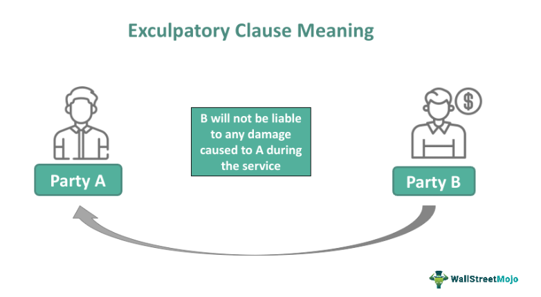

In the complex world of contract law, exculpatory clauses play a pivotal role in defining liability and responsibilities among parties involved in a contract. These clauses, often included to limit or eliminate liability for one or more parties, are key components in managing risk and legal exposure. Understanding exculpatory clauses and their implications is essential, particularly in high-stakes environments such as algorithmic trading.

Algorithmic trading, characterized by the use of computer algorithms to execute orders at high speeds, presents unique challenges and legal considerations. The velocity and complexity of transactions conducted in algorithmic trading amplify the potential for significant financial losses and systemic risks. In this context, exculpatory clauses serve to delineate the extent of liabilities and protections for parties involved in trading activities. They afford parties the ability to pre-define their risk exposure and adjust their operational and legal strategies accordingly.

This article aims to explore the intersection of exculpatory clauses, contract law, and algorithmic trading. We will assess the legal nuances that define their limitations and enforceability, focusing on the role these clauses play in safeguarding parties within trading agreements. By analyzing legal precedents and best practices for drafting exculpatory clauses, the article seeks to offer comprehensive insights into how these contractual provisions can be effectively utilized in the sophisticated landscape of algorithmic trading.

## Table of Contents

## Understanding Exculpatory Clauses

An exculpatory clause is a contractual provision designed to limit or eliminate liability for one party if certain specified damages occur. These clauses serve an essential function across a variety of contexts, offering protection against high-risk liabilities that are often encountered in contractual agreements, including those within the domain of trading.

Exculpatory clauses are versatile and appear in a broad spectrum of scenarios—from recreational services where a participant might waive their right to sue in case of an injury, to complex, large-scale business operations such as algorithmic trading. In such environments, they are utilized to allocate risk among parties and define responsibilities clearly, especially for unforeseen events or damages. The precise allocation of risks and responsibilities ensures that each party understands their obligations and potential exposure under the contract.

However, despite their widespread use, these clauses face significant scrutiny regarding their enforceability. Courts often examine exculpatory clauses closely, particularly if they are perceived as one-sided or overly broad in scope. A clause that appears to have been unfairly imposed on a less powerful party, or one that attempts to absolve a party of liability for serious misconduct, may be deemed unenforceable. This rigorous judicial examination ensures that exculpatory clauses do not unjustly shield a party from accountability, maintaining a balance between contractual freedom and equity.

The enforceability of exculpatory clauses is not universal and can vary significantly based on jurisdiction and the specific circumstances of each case. Factors such as the clarity of the language used in the clause, the relative bargaining power of the parties, and the presence of mutual assent all play crucial roles in determining whether an exculpatory clause will hold up in a legal context. Consequently, careful drafting and negotiation are paramount to ensure these clauses are fair, reasonable, and legally binding.

## Legal Limitations and Enforceability

A significant limitation of exculpatory clauses is that they generally cannot absolve a party from liability arising from gross negligence or willful misconduct. This principle is universally recognized across various legal systems and plays an essential role in maintaining ethical standards in contractual obligations. In [algorithmic trading](/wiki/algorithmic-trading)—where the speed and complexity of transactions can lead to substantial financial losses—this limitation is particularly pertinent. As algorithmic systems can execute thousands of trades per second, the potential for errors and the resulting financial damage is high, making the role of exculpatory clauses in delineating responsibilities critical.

The enforceability of exculpatory clauses is largely dependent on jurisdiction. Different states and countries may have varied interpretations and enforcement standards, influenced by specific statutes and case law precedents. Generally, courts are hesitant to enforce clauses that seem unfair or unconscionable, especially those that contravene public policy. For example, a clause that attempts to absolve a party from gross negligence typically will not stand in court as it contradicts public interest by potentially allowing reckless behavior without consequence.

Furthermore, the principle of clear mutual assent is crucial. Both parties must understand and agree to the terms explicitly, which underscores the importance of drafting exculpatory clauses with precision and transparency. Vague or ambiguous language can lead to disputes over interpretation and could potentially render the clause unenforceable.

For parties involved in algorithmic trading, familiarizing themselves with state-specific laws and judicial precedents is crucial for drafting effective exculpatory clauses. This ensures that their clauses are not only fair and clear but also legally sound. By doing so, they can better protect their interests while maintaining compliance with legal standards.

## Exculpatory Clauses in Algorithmic Trading

Algorithmic trading contracts often include exculpatory clauses to specifically address the diverse risks associated with automated and high-frequency trades. These clauses aim to shield parties from liabilities emerging due to factors such as system failures, data inaccuracies, or unexpected market events. However, enforceability of these clauses is not guaranteed and hinges on their clarity, the fairness of the terms, and the conditions under which they were negotiated.

The complex nature of algorithmic trading, characterized by its reliance on sophisticated software and high-speed transactions, necessitates a strategic approach to risk management through exculpatory clauses. Such clauses may specify limitations on liabilities related to technological malfunctions or data issues. For example, if a system failure results in unintended market positions, an exculpatory clause might limit the responsible party’s legal exposure. Nonetheless, to be effective, these provisions must be articulated in a way that is both clear and precise, avoiding ambiguous language that might lead to disputes over interpretation.

In addition to clarity and specificity, fairness plays a pivotal role in the enforceability of exculpatory clauses in algorithmic trading agreements. The contract should reflect a balanced and fair negotiation process. Courts are likely to scrutinize clauses perceived as one-sided or unfairly favoring a more powerful entity. Ensuring that both parties have negotiated terms in good faith and with equal bargaining power can reinforce the legitimacy of the exculpatory provisions.

Compliance with regulatory standards is another crucial aspect for firms engaged in algorithmic trading. Legal frameworks governing financial markets impose certain restrictions and requirements that such contracts must adhere to, which can influence the drafting of exculpatory clauses. Failure to comply with these regulations may render the clauses unenforceable, thereby exposing firms to potential legal troubles.

Transparency and informed consent are indispensable elements when drafting these clauses. Parties involved need to have a comprehensive understanding of the risks entailed and the exculpatory provisions employed to manage these risks. An informed consent process may involve detailed explanations of the contractual terms and potential implications, ensuring that all parties clearly understand what they are agreeing to.

In summary, while exculpatory clauses offer significant protective benefits in algorithmic trading contracts, their success depends upon careful drafting that respects clarity, fairness, transparency, and regulatory compliance. This strategic and balanced approach helps maintain trust and facilitates effective collaboration between contracting parties.

## Best Practices for Drafting Exculpatory Clauses

When drafting exculpatory clauses, clarity and precision in language are fundamental to prevent misinterpretations and to ensure the enforceability of the contract. The wording of these clauses should leave no room for ambiguity, as unclear terms can lead to disputes and potential invalidation by courts. Consistency and uniformity in terminology used throughout the contract are equally important, as they enhance understanding and eliminate confusion.

All terms within the exculpatory clauses must be conspicuous within the contract. This means avoiding placement in small print or less visible sections, as courts may view such placement as an attempt to obscure the terms, which could render them unenforceable. Instead, exculpatory clauses should be distinctly highlighted, perhaps using bold text or separate headings, to ensure that all parties are aware and informed of the clause's presence and implications.

The balance of bargaining power between parties is a critical consideration when drafting these clauses. If a clause is seen as disproportionately favoring one party, especially if it appears to have been forced upon a less powerful or less knowledgeable party, it may be deemed unenforceable on grounds of fairness. To address this, negotiations should be conducted in good faith, ensuring that all parties have the opportunity to discuss and understand the terms fully.

Given the complex nature of legal requirements and the rapidly evolving landscape of industries like algorithmic trading, seeking legal advice is an essential step in the drafting process. Legal professionals can provide insights that are vital for tailoring clauses to meet specific regulatory and industry standards. They can also assist in anticipating potential challenges and ensuring that the clauses are both comprehensive and adaptable to future changes in law and market conditions.

Finally, transparency and mutual assent are vital to the validity of exculpatory clauses. Ensuring that all parties are informed and in agreement with the terms encourages cooperation and trust, which are crucial for maintaining stable and effective trading relationships. This involves not only presenting the clause clearly but also engaging in open dialogue to ensure comprehension and consent from all involved parties.

## Conclusion

Exculpatory clauses are essential in navigating the complexities of modern contract law, especially within the fast-paced domain of algorithmic trading. They function as essential tools for managing legal risks, providing a mechanism for parties to allocate and define potential liabilities. However, these clauses are not blanket protections against all forms of liability. Their enforceability hinges on adherence to legal standards and ethical principles. Exculpatory clauses must align with public policy and address issues such as gross negligence or willful misconduct. Additionally, the specific statutory and jurisprudential frameworks of different jurisdictions can greatly affect their validity.

When drafting exculpatory clauses, transparency, clarity, and fairness are paramount. These aspects ensure that all parties understand the implications and ramifications of the terms to which they are agreeing. Informed consent, achieved through clear communication and negotiation, is critical. Drafting clauses with unambiguous language, ensuring that all terms are prominently displayed, promotes fairness and reduces the likelihood of disputes arising from misinterpretations.

In algorithmic trading, where transactions occur with lightning speed and potentially significant financial stakes, maintaining trust and cooperation through well-crafted exculpatory clauses is vital. These clauses should be carefully tailored to meet industry-specific needs and legal standards. Consulting legal professionals is advisable to navigate the intricate legal landscape and ensure compliance with current standards. In doing so, parties can safeguard their interests while respecting the ethical and legal frameworks that govern contractual obligations. This approach not only serves to protect individual parties but also contributes to the integrity and stability of trading relationships.

## FAQs About Exculpatory Clauses in Algo Trading

### Can exculpatory clauses completely eliminate liability in algorithmic trading contracts?

Exculpatory clauses in algorithmic trading contracts cannot completely eliminate liability. While these clauses aim to protect parties from certain damages or losses, they are generally not enforceable if they attempt to absolve a party from liability due to gross negligence or willful misconduct. In high-speed trading environments, where financial transactions occur at a rapid pace and significant monetary amounts are involved, courts scrutinize the reasonableness and fairness of such clauses. It is crucial for these clauses to be clearly worded and fairly negotiated to improve their enforceability.

### What are the common pitfalls to avoid when using exculpatory clauses?

Several pitfalls can undermine the effectiveness of exculpatory clauses:

1. **Lack of Clarity:** Ambiguous language can lead to misinterpretation and challenges to enforceability. 
2. **Imbalance of Power:** If a clause appears to be imposed on a less powerful party or is not mutually agreed upon, courts may invalidate it.
3. **Overbreadth:** Clauses that attempt to cover too broad a spectrum of liabilities may be perceived as unfair.
4. **Violation of Public Policy:** Clauses contravening public interests or standards are generally void.

Ensuring that the clauses meet legal standards and respect the contracting parties' rights and obligations is critical.

### How do state laws impact the enforceability of these clauses in trading agreements?

State laws significantly influence the enforceability of exculpatory clauses, as legal standards vary by jurisdiction. While some states allow a broader application of these clauses, others adopt a more stringent approach, especially concerning clauses that seek to limit liability for negligence. Judicial precedents and statutory laws within specific states can dictate how these clauses should be drafted and enforced. It's essential for parties in algorithmic trading agreements to be aware of the jurisdiction-specific regulations that affect the validity and enforcement of these clauses.

### Why is it important to consult legal professionals when drafting exculpatory clauses?

Consulting legal professionals is crucial when drafting exculpatory clauses to ensure they are legally sound and enforceable. Legal experts can provide guidance on the applicable laws, help identify potential loopholes, and assist in drafting provisions that align with industry norms. They can also advise on how to present the clauses to enhance fairness and mutual assent, reducing the risk of future legal disputes. Given the complexity and dynamic nature of the financial trading industry, expert legal advice is invaluable for drafting compliant and effective clauses.

### What role do exculpatory clauses play in protecting trading firms from unintended market risks?

Exculpatory clauses are pivotal in managing unintended market risks for trading firms by delineating liability boundaries. These clauses allow firms to specify particular scenarios, such as technical failures or unforeseen market events, where limited liability is agreed upon. By doing so, firms can mitigate the financial impact of unforeseen events and stabilize their trading operations. However, these clauses must be crafted with precision to ensure they address the peculiar risks associated with algorithmic trading, providing both protection and compliance with legal and regulatory frameworks.

## References & Further Reading

[1]: Bergstra, J., Bardenet, R., Bengio, Y., & Kégl, B. (2011). ["Algorithms for Hyper-Parameter Optimization."](https://papers.nips.cc/paper/4443-algorithms-for-hyper-parameter-optimization) Advances in Neural Information Processing Systems 24.

[2]: ["Advances in Financial Machine Learning"](https://www.amazon.com/Advances-Financial-Machine-Learning-Marcos/dp/1119482089) by Marcos Lopez de Prado

[3]: ["Evidence-Based Technical Analysis: Applying the Scientific Method and Statistical Inference to Trading Signals"](https://www.amazon.com/Evidence-Based-Technical-Analysis-Scientific-Statistical/dp/0470008741) by David Aronson

[4]: ["Machine Learning for Algorithmic Trading"](https://github.com/stefan-jansen/machine-learning-for-trading) by Stefan Jansen

[5]: ["Quantitative Trading: How to Build Your Own Algorithmic Trading Business"](https://www.amazon.com/Quantitative-Trading-Build-Algorithmic-Business/dp/1119800064) by Ernest P. Chan