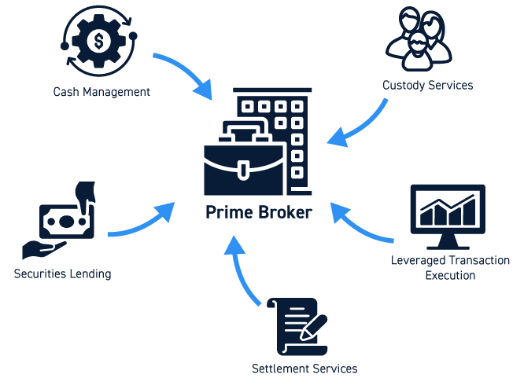

## Table of Contents

## What is an executing broker?

An executing broker is a type of broker that carries out trades on behalf of their clients. These clients can be individual investors or other financial institutions. The main job of an executing broker is to make sure that the trades happen quickly and at the best possible price. They use special trading systems and have direct access to the markets where the trades take place.

Executing brokers are important because they help make the trading process smoother and more efficient. They work behind the scenes to handle the details of buying and selling stocks, bonds, or other financial products. This allows their clients to focus on making investment decisions without worrying about the mechanics of the trade. In short, executing brokers act as the hands of their clients in the fast-paced world of trading.

## What are the primary functions of an executing broker?

The main job of an executing broker is to carry out trades for their clients. This means they buy and sell stocks, bonds, or other financial products exactly as their clients want. They use special computer systems to do this quickly and at the best possible price. Their goal is to make sure the trade happens smoothly and efficiently.

Executing brokers also need to keep track of the markets all the time. They watch for the best times to trade and make sure they follow all the rules. This helps them get the best deals for their clients. By doing all this work, executing brokers help their clients focus on making investment decisions without worrying about the details of trading.

## How does an executing broker differ from other types of brokers?

An executing broker is different from other types of brokers because their main job is to [carry](/wiki/carry-trading) out trades quickly and at the best possible price. They work directly with the markets to buy and sell stocks, bonds, or other financial products exactly as their clients want. This means they focus on the mechanics of trading, using special computer systems and always watching the markets to make sure they get the best deals.

Other types of brokers, like full-service brokers, offer more than just trading services. Full-service brokers give advice on investments, help with financial planning, and sometimes manage their clients' money. They do the trading too, but it's just one part of what they offer. On the other hand, discount brokers focus on low-cost trading without giving much advice or extra services. They let clients do more of the work themselves, which can save money but requires more knowledge from the client.

## What are the typical services provided by an executing broker?

An executing broker mainly helps their clients by buying and selling stocks, bonds, or other financial products for them. They use special computer systems to make sure these trades happen quickly and at the best possible price. Their main job is to follow their clients' instructions exactly and get the trade done smoothly. They also keep an eye on the markets all the time, looking for the best times to trade and making sure they follow all the rules.

Unlike full-service brokers who offer a lot of advice and help with financial planning, executing brokers focus only on the trading part. They don't give investment advice or manage money for their clients. This means their clients need to know what they want to buy or sell before they contact the executing broker. On the other hand, discount brokers offer low-cost trading but also don't provide much advice, leaving more work to the client. So, executing brokers are a middle ground, focusing on quick and efficient trading without the extra services.

## How does an executing broker execute trades?

An executing broker carries out trades by using special computer systems that connect directly to the financial markets. When a client wants to buy or sell stocks, bonds, or other financial products, they tell the executing broker exactly what they want. The broker then uses their computer system to find the best price and the right time to make the trade happen. This process needs to be fast because prices in the market can change quickly.

The executing broker also keeps an eye on the markets all the time. They watch for any changes that could affect the trade and make sure they follow all the rules. By doing this, they can make sure the trade is done at the best possible price for their client. The whole point is to make the trading process smooth and efficient, so the client can focus on making investment decisions without worrying about the details of buying and selling.

## What are the regulatory requirements for an executing broker?

An executing broker has to follow a lot of rules set by different groups to make sure they do their job the right way. These rules come from places like the Securities and Exchange Commission (SEC) in the United States, and other similar groups in different countries. The rules are there to make sure that the broker is honest, fair, and keeps their clients' money and information safe. They need to keep good records of all the trades they do and report them correctly. This helps to stop any bad behavior and keeps the markets working well.

Also, executing brokers need to follow rules about how they handle their clients' orders. They have to make sure they get the best price for their clients and do the trades quickly. They can't use their clients' orders to make money for themselves, which is called "front running." They also have to keep their clients' information private and not share it with others. By following all these rules, executing brokers help keep the trading world safe and fair for everyone.

## What technology platforms do executing brokers use?

Executing brokers use special computer systems called trading platforms to buy and sell stocks, bonds, and other financial products. These platforms are made to connect directly to the financial markets, so the brokers can make trades happen very quickly. Some popular trading platforms that executing brokers might use are Bloomberg Terminal, Thomson Reuters Eikon, and MetaTrader. These systems have a lot of tools that help the brokers see what's happening in the markets in real-time, find the best prices, and make trades at the right time.

These platforms also have features that help executing brokers follow all the rules and keep their clients' information safe. They can track all the trades they do and make sure everything is reported correctly. This is important because it helps keep the markets fair and honest. By using these advanced technology platforms, executing brokers can do their jobs better and make sure their clients get the best deals possible.

## How do executing brokers manage risk?

Executing brokers manage risk by keeping a close eye on the markets all the time. They use special computer systems that show them what's happening in the markets right away. This helps them see if prices are going up or down quickly, which can be risky. They also follow rules that stop them from making trades that could be too risky for their clients. By watching the markets and following the rules, executing brokers can make trades at the best times and avoid big losses.

Another way executing brokers manage risk is by making sure they have the right information before they trade. They check that the orders they get from their clients are clear and correct. They also make sure they know all the details about the stocks, bonds, or other products they are trading. This helps them understand any risks that might come with the trade. By being careful and well-informed, executing brokers can help their clients avoid surprises and make safer trades.

## What are the key performance indicators for an executing broker?

Key performance indicators (KPIs) for an executing broker help show how well they are doing their job. One important KPI is the speed of execution. This means how quickly the broker can buy or sell stocks, bonds, or other products for their clients. Another KPI is the price at which the trade happens. The broker needs to get the best possible price for their client, so this is very important. The broker's ability to follow all the rules and keep good records is also a key measure. This helps make sure they are doing things the right way.

Another KPI is the error rate, which shows how often the broker makes mistakes when doing trades. A low error rate means the broker is doing a good job. Client satisfaction is also a big KPI. If clients are happy with how the broker is doing their trades, it means the broker is meeting their needs. Finally, the broker's ability to manage risk well is a key indicator. This means they need to watch the markets carefully and make smart decisions to avoid big losses for their clients.

## How do executing brokers ensure best execution for their clients?

Executing brokers work hard to make sure they get the best deal for their clients when buying or selling stocks, bonds, or other financial products. They use special computer systems that connect directly to the markets. These systems help them see prices in real-time and find the best time to trade. They also look at different places where they can make the trade to find the best price. This means they might check several markets to see where they can get the best deal for their client.

To make sure they follow all the rules and get the best execution, executing brokers keep a close eye on the markets all the time. They watch for any big changes that could affect the price and make sure they do the trade at the right moment. They also follow strict rules about how they handle their clients' orders. This means they can't use the information they get from their clients to make money for themselves. By doing all these things, executing brokers help their clients get the best possible price and make the trading process smooth and fair.

## What are the challenges faced by executing brokers in the current market?

Executing brokers face a lot of challenges in today's market. One big challenge is the speed of the markets. Everything happens very quickly, and prices can change in just a few seconds. This means executing brokers need to use very fast computer systems to make sure they can buy or sell at the best price. If they are too slow, they might miss out on a good deal or end up with a bad one. Another challenge is the amount of information they need to handle. There are so many stocks, bonds, and other products to keep track of, and they need to know a lot about each one to make smart trades for their clients.

Another challenge is keeping up with all the rules and regulations. The rules can change, and executing brokers need to make sure they are always following them. If they make a mistake, they could get in trouble and lose their clients' trust. Also, competition is very tough. There are a lot of other brokers out there trying to do the same job, so executing brokers need to be very good at what they do to stand out. They need to keep their clients happy by getting them the best prices and making sure their trades happen quickly and smoothly.

## How can an executing broker optimize their operations for efficiency and compliance?

An executing broker can optimize their operations by using the best technology. They need fast computer systems that can connect directly to the markets. This helps them see prices in real-time and make trades quickly. They should also use tools that help them keep track of all the trades they do and make sure they follow all the rules. By using these systems, they can make their work smoother and avoid mistakes that could get them in trouble.

Another way to optimize is by staying up-to-date with the rules. The rules can change, so executing brokers need to keep learning and make sure they know what they need to do. They can do this by taking classes, reading about new rules, and talking to other people in their job. By doing this, they can make sure they are always doing things the right way. This helps them keep their clients happy and stay out of trouble.

## References & Further Reading

[1]: Bergstra, J., Bardenet, R., Bengio, Y., & Kégl, B. (2011). ["Algorithms for Hyper-Parameter Optimization."](https://proceedings.neurips.cc/paper/2011/file/86e8f7ab32cfd12577bc2619bc635690-Paper.pdf) Advances in Neural Information Processing Systems 24.

[2]: ["Advances in Financial Machine Learning"](https://www.amazon.com/Advances-Financial-Machine-Learning-Marcos/dp/1119482089) by Marcos Lopez de Prado

[3]: ["Evidence-Based Technical Analysis: Applying the Scientific Method and Statistical Inference to Trading Signals"](https://www.amazon.com/Evidence-Based-Technical-Analysis-Scientific-Statistical/dp/0470008741) by David Aronson

[4]: ["Machine Learning for Algorithmic Trading"](https://github.com/PacktPublishing/Machine-Learning-for-Algorithmic-Trading-Second-Edition) by Stefan Jansen

[5]: ["Quantitative Trading: How to Build Your Own Algorithmic Trading Business"](https://books.google.com/books/about/Quantitative_Trading.html?id=j70yEAAAQBAJ) by Ernest P. Chan