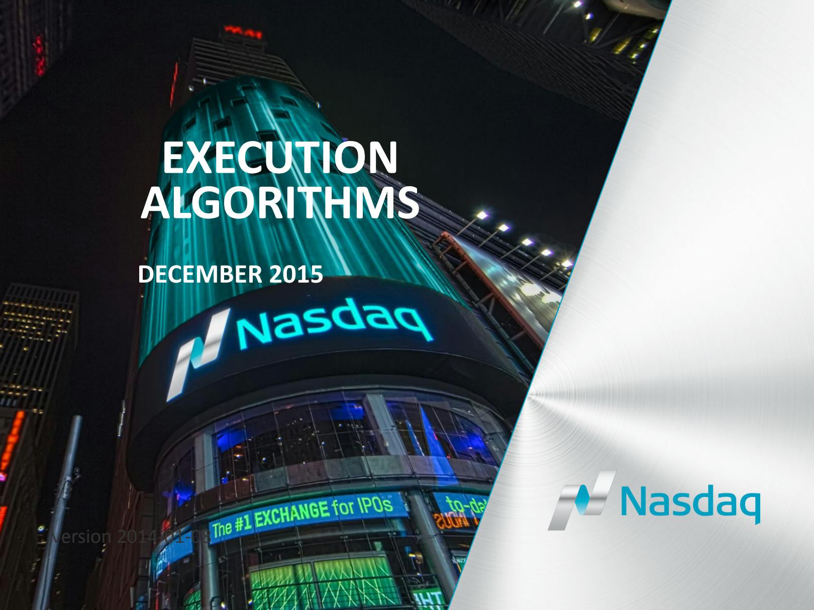

Algorithmic trading, commonly referred to as algo trading, has significantly reshaped the landscape of financial markets over the past few decades, establishing itself as a dominant trading strategy. It is estimated that more than 80% of U.S. stock trades are now algorithmic, highlighting their critical role in current trading dynamics. This upward trend is projected to continue, with the global algorithmic trading market expected to reach $18 billion by 2025.

A key element within this evolution is the use of execution algorithms, which are instrumental in streamlining the process of order execution. These sophisticated software programs are meticulously designed to manage the buying or selling of financial instruments, primarily aimed at minimizing costs and reducing market impact. By automating these processes, execution algorithms enable traders to achieve more favorable prices than manual methods might allow.

Institutional traders, hedge funds, and investment banks are among the primary users of execution algorithms. They depend on these algorithms to systematically manage large orders, which, if executed improperly, could significantly impact market prices. The algorithms bring about enhanced precision and efficiency in executing trades, making them indispensable tools for these entities.

This article will explore various types of execution algorithms and their applications, analyze key considerations in selecting the appropriate algorithms, discuss the role of technology in enhancing algorithmic efficiency, and examine future trends in this fast-evolving field. Understanding these elements is crucial for anyone involved in algorithmic trading, as it provides insights into how modern markets operate and how one can leverage technological advancements for competitive advantage.

## Table of Contents

## Types of Execution Algorithms

Execution algorithms are instrumental in modern trading, serving distinct objectives tailored to various market conditions. These algorithms encompass diverse strategies, each designed to optimize order execution while mitigating market impacts.

**VWAP (Volume-Weighted Average Price):** This algorithm aims to execute orders in alignment with the volume distribution of the market throughout a trading session. By dispersing orders across the session, it minimizes the potential market impact. VWAP is particularly useful when traders wish to achieve an average execution price aligned with the market activity. It calculates the average price at which a security has traded over the course of a day, weighted by the volume of each trade. Mathematically, it is expressed as:

$$
\text{VWAP} = \frac{\sum (P_i \times Q_i)}{\sum Q_i}
$$

where $P_i$ is the price of the trade and $Q_i$ is the quantity of the trade.

**TWAP (Time-Weighted Average Price):** The TWAP strategy executes orders uniformly over a pre-determined period. This approach is advantageous when traders aim to achieve a consistent execution price, reducing the impact of short-term volatility. It is particularly favored when there's a need for price predictability over time, as it divides the total quantity into slices based on the time duration.

**Implementation Shortfall:** Also known as the slippage or arrival price algorithm, this strategy seeks to minimize the difference between the intended decision price and the actual executed price. By balancing the potential market impact and the risk of price fluctuations, implementation shortfall algorithms cater to traders who prioritize cost efficiency.

**Percentage of Volume (POV):** The POV algorithm dynamically adjusts its execution rate as a set percentage of the market volume. It is effective in volatile markets, where participation adapts to the pace of trading activity, allowing the order to be absorbed by the market without significant impact.

**Liquidity-Seeking Algorithms:** These algorithms are crafted to find and execute orders in highly liquid environments, both in visible markets (lit pools) and non-displayed venues (dark pools). By capitalizing on market liquidity, they can execute large orders with reduced market impact, particularly during periods of high market activity.

**Adaptive Algorithms:** Leveraging machine learning and real-time data analysis, adaptive algorithms adjust their execution strategies in response to changing market conditions. These algorithms offer high levels of customization and flexibility, utilizing historical and real-time data to make informed decisions, and are increasingly relying on predictive analytics to optimize execution paths.

Execution algorithms are a crucial component of the trading ecosystem, providing systematic methods to handle large orders efficiently while managing associated risks and costs.

## Key Considerations in Execution Algorithm Selection

Selecting the appropriate execution algorithm in [algorithmic trading](/wiki/algorithmic-trading) is critical to ensuring optimal trade outcomes. Several factors must be considered when choosing the right algorithm for executing trades effectively.

1. **Order Size:** Large orders often require execution algorithms that can dissipate their market impact by segmenting them across time or volume. Algorithms such as VWAP (Volume-Weighted Average Price) and TWAP (Time-Weighted Average Price) are particularly useful in handling significant order sizes, as they distribute orders to reduce the potential for market distortion.

2. **Market Conditions:** The selection of an execution algorithm is deeply influenced by current market conditions, including volatility, liquidity, and market sentiment. Volatile markets may necessitate the use of algorithms that prioritize quick execution to avoid adverse price movements. Conversely, in stable markets, the focus might shift to algorithms that optimize trade execution prices.

3. **Execution Speed:** The urgency of trade execution varies depending on the specific requirements and goals of a trade. High-frequency trading strategies benefit from algorithms that execute trades in milliseconds, minimizing exposure to sudden market changes. On the other hand, more strategic trades might benefit from slower, measured execution to capture better prices or to align with market patterns.

4. **Technology and Infrastructure:** The sophistication of the trading environment plays a significant role in shaping the efficiency of execution algorithms. Advanced technological infrastructures that include high-performance computing and low-latency networks can markedly enhance the speed and precision of trades. Firms with robust infrastructures are better positioned to compete in the high-speed trading space, offering more effective execution services.

5. **Costs and Fees:** Financial considerations, such as commission structures and the impact of bid-ask spreads, are critical components in algorithm selection. Traders should aim to balance execution quality with cost efficiencies, as higher fees can erode the benefits gained from superior execution outcomes. This makes algorithms that are cost-sensitive particularly advantageous, as they optimize trade execution to be cost-effective.

6. **Regulatory Environment:** Compliance with trading regulations is essential to avoid legal complications. Different regions may have varying regulatory requirements that can affect algorithm usage and design. Algorithms need to be adaptable to maintain adherence to these regulations, ensuring that trades are not only executed effectively but are also compliant with all legal standards.

In conclusion, the selection of execution algorithms must be informed by a multifaceted consideration of these key factors. These considerations enable traders and institutions to choose algorithms that not only meet their specific trading objectives but also align with current market dynamics and operational frameworks.

## The Role of Technology in Execution Algorithms

Execution algorithms are fundamentally reliant on advanced technology and infrastructure to enhance the efficiency and precision of trading functions. In high-frequency trading environments, the need for rapid execution is critical, and cutting-edge technology plays a pivotal role in achieving minimal latency and maximizing effectiveness. 

**High-Performance Computing:** High-performance computing (HPC) is integral for handling complex analyses and facilitating rapid decision-making in trading environments. By leveraging parallel processing capabilities, HPC systems can analyze large data sets quickly, enabling traders to react promptly to market changes. The use of multi-core processors and specialized hardware accelerators ensures that calculations, such as pricing models and risk assessments, are executed with high efficiency.

**Data Analytics:** The incorporation of data analytics is essential for refining trading strategies and adapting to evolving market conditions. Execution algorithms utilize real-time data feeds to monitor market activity and apply historical analysis for identifying patterns and predicting future trends. Machine learning algorithms are increasingly used to enhance the predictive accuracy of these strategies. By training models on large historical data sets, machine learning can provide insights into market behavior, which can be used to optimize trading decisions.

**Networking:** A crucial component of execution algorithms is low-latency networking, which ensures swift communication between trading systems and financial exchanges. High-speed networks reduce the time it takes for trade orders to reach exchanges, minimizing information asymmetry and the risk of price changes during transmission. Optical fiber connections and co-location services, where trading systems are physically located close to exchange servers, further reduce latency, providing traders with a competitive edge in executing high-frequency trades.

**Cloud Computing:** Cloud computing offers the scalability and flexibility necessary for managing the extensive data volumes and complex algorithms characteristic of modern trading. Through cloud platforms, traders can access computing resources on-demand, facilitating the execution of sophisticated algorithms without the need for significant on-premise infrastructure. The elasticity of cloud services allows for dynamic scaling of resources, ensuring that computational power is available during peak trading times, thereby maintaining optimal algorithm performance.

Incorporating these technological components into execution algorithms is essential for maintaining competitiveness in algorithmic trading. As technology continues to evolve, the efficiency and capabilities of these algorithms are likely to increase, further transforming the landscape of financial markets.

## Challenges and Future Trends

Executing large orders efficiently in financial markets presents several key challenges, including market impact, price slippage, and latency. These factors can affect the overall cost and efficiency of trades. However, the continuous evolution of execution algorithms aided by technological advances is addressing these challenges and paving the way for future innovations.

Artificial Intelligence (AI) and Machine Learning (ML) are at the forefront of enhancing the adaptability and predictive capabilities of execution algorithms. By leveraging AI and ML, algorithms can analyze vast amounts of historical data to identify patterns and predict market movements, allowing for smarter and more adaptive order strategy implementation. This capability helps reduce market impact by optimizing order execution according to prevailing market conditions.

Quantum Computing, with its immense computational power, is another frontier offering revolutionizing potential for trading algorithms. While still in its nascent stages, quantum computing is expected to solve complex mathematical problems exponentially faster than classical computers. This promises to enhance the speed and accuracy of execution algorithms, thereby minimizing latency and optimizing trade execution even further.

Regulatory Developments play a significant role in shaping the landscape of trading algorithms. As global financial markets become more interconnected and complex, regulatory bodies continuously update frameworks to ensure market integrity and protect investors. Traders and institutions must remain vigilant and adaptable to comply with these evolving regulations, which can impact algorithm design and execution strategies.

Sustainable Trading Practices are increasingly becoming integral to trading and algorithm design owing to rising awareness about environmental, social, and governance ([ESG](/wiki/esg-investing)) factors. Traders are integrating ESG criteria into algorithmic models, driving ethical considerations and sustainability in trading activities. This shift not only aligns with broader societal values but also addresses the growing demand among investors for environmentally responsible and socially conscious investment strategies.

In conclusion, while challenges such as market impact, price slippage, and latency persist in executing large orders, the rapid advancement of AI, [machine learning](/wiki/machine-learning), and potentially quantum computing are shifting the paradigm in execution algorithms. Furthermore, as regulatory environments evolve and sustainability becomes a greater concern, execution algorithms will need to continuously adapt to maintain their effectiveness and compliance in the dynamic world of financial trading.

## Conclusion

Execution algorithms are essential to modern algorithmic trading, furnishing traders with highly accurate and efficient methods to execute large-scale orders. These algorithms minimize costs and market impact while managing the intricacies of today's fast-paced financial markets. As technology evolves, the capabilities and applications of execution algorithms are set to expand significantly, unveiling both new opportunities and challenges. Emerging technologies, such as machine learning and [artificial intelligence](/wiki/ai-artificial-intelligence), are likely to enhance the sophistication and adaptability of these algorithms, offering unprecedented levels of customization and efficiency. Furthermore, the use of quantum computing may introduce groundbreaking changes by providing unrivaled computational power and speed.

Technological advancements also bring about challenges, such as the need for robust data analytics and secure, low-latency infrastructures, essential for processing and responding to vast amounts of market data in real time. Additionally, market participants must remain vigilant and adaptive to changing regulatory standards, ensuring that compliance is maintained while maximizing trading efficiencies.

Traders and institutions must continually adjust to these technological transformations to remain competitive. Harnessing the full potential of execution algorithms requires a strategic approach, including investment in infrastructure, adoption of advanced analytics, and regular reassessment of trading strategies. In doing so, market participants can not only achieve optimal execution but also maintain an edge in the rapidly evolving landscape of financial markets.

## References & Further Reading

[1]: Johnson, B. (2010). ["Algorithmic Trading & DMA: An Introduction to Direct Access Trading Strategies"](https://archive.org/details/algorithmictradi0000john) 4Myeloma Press.

[2]: Kissell, R. (2013). ["The Science of Algorithmic Trading and Portfolio Management"](https://www.sciencedirect.com/book/9780124016897/the-science-of-algorithmic-trading-and-portfolio-management) Academic Press.

[3]: Narang, R. K. (2013). ["Inside the Black Box: A Simple Guide to Quantitative and High-Frequency Trading"](https://onlinelibrary.wiley.com/doi/book/10.1002/9781118662717) Wiley.

[4]: Aldridge, I. (2013). ["High-Frequency Trading: A Practical Guide to Algorithmic Strategies and Trading Systems"](https://www.amazon.com/High-Frequency-Trading-Practical-Algorithmic-Strategies/dp/1118343506) Wiley.

[5]: Lawson, W. (2019). ["Trading and Exchanges: Market Microstructure for Practitioners"](https://academic.oup.com/book/52292) Oxford University Press. 

[6]: Lopez de Prado, M. (2018). ["Advances in Financial Machine Learning"](https://www.amazon.com/Advances-Financial-Machine-Learning-Marcos/dp/1119482089) Wiley.

[7]: Chan, E. P. (2017). ["Machine Trading: Deploying Computer Algorithms to Conquer the Markets"](https://github.com/ftvision/quant_trading_echan_book) Wiley.

[8]: Abergel, F., Chakrabarti, A. S., Chakraborti, A., Deo, N., & Young, J. (Eds.). (2011). ["Econophysics of Order-driven Markets"](https://link.springer.com/content/pdf/10.1007/978-88-470-1766-5.pdf) Springer.