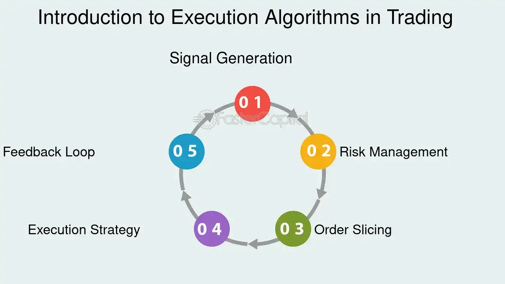

## Table of Contents

## What is an execution algorithm?

An execution algorithm is a set of steps or rules that a computer follows to perform a specific task. It's like a recipe that tells the computer exactly what to do, in what order, and how to do it. These algorithms are used in many areas, like sorting data, searching for information, or running programs. They help make sure that the computer does its job correctly and efficiently.

In trading, an execution algorithm is used to buy or sell stocks or other financial products. It helps traders to carry out their orders in the best possible way, considering factors like price and timing. For example, an algorithm might be designed to buy a stock at the lowest possible price over a certain period. This can help traders save money and make better decisions by automating the process.

## Why are execution algorithms important in trading?

Execution algorithms are important in trading because they help traders buy and sell stocks or other financial products more efficiently. They do this by following a set of rules that consider the best price and the best time to make a trade. This can save traders money because the algorithm can find the lowest price to buy or the highest price to sell, which might be hard for a person to do all the time.

Also, execution algorithms can handle a lot of trades at once, which can be too much for a person to manage. They work quickly and don't get tired or make mistakes like humans might. This means that traders can make more trades and make them faster, which can lead to more profits. So, using execution algorithms can help traders be more successful in the fast-paced world of trading.

## What are the basic types of execution algorithms?

Execution algorithms in trading can be grouped into a few basic types. One type is the 'market order algorithm.' This type tries to buy or sell a stock as quickly as possible at the current market price. It's like saying, "I want to buy this stock right now, no matter what the price is." This is useful when you want to make a trade fast, but it might not always get you the best price.

Another type is the 'limit order algorithm.' This one tries to buy or sell a stock at a specific price or better. For example, you might say, "I want to buy this stock, but only if the price is $50 or less." This can help you get a better price, but there's a chance the trade won't happen if the price never reaches your limit.

A third type is the 'time-weighted average price (TWAP) algorithm.' This one spreads out the trading over a certain time period to try to get an average price. It's like saying, "I want to buy this stock, but I want to do it slowly over the next hour to get a good average price." This can be useful if you want to avoid moving the market price too much with a big trade all at once.

## How do execution algorithms work to minimize market impact?

Execution algorithms work to minimize market impact by breaking up big orders into smaller pieces. When someone wants to buy or sell a lot of stocks, doing it all at once can make the price go up or down a lot. This is called market impact. By using an algorithm, the trade can be split into smaller parts that are spread out over time. This way, each small trade doesn't affect the price as much, and the overall impact on the market is smaller.

For example, if someone wants to buy 10,000 shares of a stock, the algorithm might decide to buy 1,000 shares every 10 minutes. This slow and steady approach helps keep the price stable. The algorithm can also look at how the market is moving and adjust the size and timing of the trades to make sure they have the least impact possible. By doing this, the algorithm helps traders get a better average price and avoid big changes in the market.

## What is the difference between a VWAP and a TWAP algorithm?

A VWAP (Volume-Weighted Average Price) algorithm and a TWAP (Time-Weighted Average Price) algorithm are both used to spread out trades over time, but they do it in different ways. A VWAP algorithm looks at how many shares of a stock are being traded and tries to buy or sell more when there is a lot of trading happening. This means it follows the [volume](/wiki/volume-trading-strategy) of the stock. The idea is to blend in with the market's activity and get a price that is close to what most people are paying or getting for the stock.

On the other hand, a TWAP algorithm spreads out trades evenly over a set period of time. It doesn't care about how much trading is happening at any moment. Instead, it just divides the total number of shares to be traded by the total time available and makes trades at regular intervals. This can be simpler but might not be as good at hiding the trades in busy market times. Both types of algorithms aim to minimize the impact on the market, but they use different strategies to do it.

## Can you explain how a market-on-close (MOC) algorithm functions?

A market-on-close (MOC) algorithm is used to buy or sell stocks right at the end of the trading day. It's like saying, "I want to make my trade at the very last moment." This can be helpful because the price at the end of the day can be important for some traders. They might want to buy or sell at this time to match up with other things they are doing, like balancing their investments or following a certain strategy.

The MOC algorithm works by waiting until the last few minutes of trading to put in the order. It then tries to get the best price possible at the closing time. This can be tricky because a lot of people might be trying to trade at the same time, which can make the price move around a lot. But the algorithm does its best to get a good price for the trader by following the rules set for the end of the day.

## What role does the iceberg order play in execution algorithms?

An iceberg order is a type of order used in trading to hide the full size of a big trade. It's called an "iceberg" because only a small part of the order, like the tip of an iceberg, is visible to other traders. The rest of the order stays hidden. This helps traders who want to buy or sell a lot of stocks without moving the market price too much. If everyone could see the whole order, it might scare other traders and make the price go up or down a lot.

Execution algorithms can use iceberg orders to spread out a big trade into smaller, hidden parts. This way, the algorithm can slowly buy or sell the stocks without causing a big change in the market. For example, if a trader wants to sell 10,000 shares, the algorithm might show only 1,000 shares at a time. As those shares are sold, more shares from the hidden part of the order are released, keeping the market calm and helping the trader get a better price.

## How do execution algorithms adapt to different market conditions?

Execution algorithms can change how they work depending on what the market is doing. If the market is very busy with a lot of trading, the algorithm might decide to make more trades during these busy times. This helps the trades blend in and not affect the price too much. On the other hand, if the market is quiet with not much trading, the algorithm might slow down and spread out the trades more to avoid making big waves in the price.

The algorithms also look at how the price is moving. If the price is going up and down a lot, the algorithm might wait for the right moment to trade, trying to get a better price. It might also change how big each trade is, making them smaller if the market is very jumpy. By doing these things, the algorithm can help traders get the best price possible no matter what the market is doing.

## What are some advanced features of execution algorithms used by institutional investors?

Institutional investors often use execution algorithms with advanced features to handle their large trading volumes efficiently. One of these features is smart order routing, which helps the algorithm find the best place to make a trade. It looks at different places where stocks are traded and picks the one with the best price or the one that will have the least impact on the market. Another feature is dynamic trading, where the algorithm changes how it trades based on what's happening in the market. If the market gets busy, the algorithm might trade more to blend in, or if it gets quiet, it might slow down to avoid moving the price too much.

Another advanced feature is the use of predictive analytics. This means the algorithm uses data and math to guess what the market might do next. It can look at past trading patterns and other information to decide when and how to trade. This can help institutional investors get better prices and make smarter trades. Also, some algorithms have risk management tools built in. These tools help the algorithm keep an eye on how much risk it's taking and make sure it's not doing anything too dangerous. By using these advanced features, institutional investors can trade big amounts of stocks without causing big changes in the market and get the best prices possible.

## How can execution algorithms be optimized for high-frequency trading?

Execution algorithms can be optimized for high-frequency trading by making them work really fast and smart. High-frequency trading is all about making a lot of trades very quickly, so the algorithms need to be able to do this without slowing down. They can be set up to look at lots of information in a very short time and make quick decisions about when to buy or sell. This means the algorithms need to be able to handle a lot of data and do a lot of math really fast. They also need to be able to send orders to the market almost instantly, so they can take advantage of small changes in price.

Another way to optimize these algorithms is by making them very good at predicting what the market will do next. They can use special math and computer models to guess where the price might go in the next few seconds or minutes. This helps them make trades that are more likely to make money. Also, the algorithms can be set up to change how they trade based on what's happening in the market right now. If the market is moving a lot, the algorithm might trade more often to take advantage of the changes. By doing these things, the algorithms can help high-frequency traders make more trades and make them faster and smarter.

## What are the potential risks and limitations of using execution algorithms?

Using execution algorithms can have some risks and problems. One big risk is that the algorithm might make mistakes. Even though they are very good at following rules, they can still get things wrong if the rules are not right or if something unexpected happens in the market. This can lead to big losses if the algorithm keeps trading the wrong way. Also, because algorithms trade so fast and can handle a lot of trades, a small mistake can turn into a big problem very quickly.

Another problem is that everyone using the same kind of algorithm can make the market act in strange ways. If a lot of traders use the same rules to buy and sell, it can create patterns in the market that are hard to predict. This can make it harder for traders to make money because the market might not act the way they expect. Also, algorithms can sometimes move the market price a lot if they are not careful, which can be bad for everyone trading.

## How do regulatory requirements affect the design and use of execution algorithms?

Regulatory requirements can change how execution algorithms are made and used. Rules from places like the SEC or other financial watchdogs can say things like how much information the algorithm has to share with other people in the market. They might also have rules about how the algorithm can trade, to make sure it's not doing anything that could be bad for the market. These rules help keep the market fair and safe for everyone, but they can also make it harder to make and use algorithms because they have to follow all these rules.

Because of these rules, people who make algorithms have to be careful. They have to make sure their algorithms follow all the laws and rules. This can mean adding special checks and balances to the algorithms to make sure they are doing things the right way. It can also mean that the algorithms might not be able to do some things that could make trading easier or faster, because those things might not be allowed by the rules. So, regulatory requirements can make algorithms safer and fairer, but they can also make them a bit more complicated and less flexible.

## What are the Types of Execution Algorithms?

Execution algorithms are instrumental in modern trading, serving distinct objectives tailored to various market conditions. These algorithms encompass diverse strategies, each designed to optimize order execution while mitigating market impacts.

**VWAP (Volume-Weighted Average Price):** This algorithm aims to execute orders in alignment with the volume distribution of the market throughout a trading session. By dispersing orders across the session, it minimizes the potential market impact. VWAP is particularly useful when traders wish to achieve an average execution price aligned with the market activity. It calculates the average price at which a security has traded over the course of a day, weighted by the volume of each trade. Mathematically, it is expressed as:

$$
\text{VWAP} = \frac{\sum (P_i \times Q_i)}{\sum Q_i}
$$

where $P_i$ is the price of the trade and $Q_i$ is the quantity of the trade.

**TWAP (Time-Weighted Average Price):** The TWAP strategy executes orders uniformly over a pre-determined period. This approach is advantageous when traders aim to achieve a consistent execution price, reducing the impact of short-term volatility. It is particularly favored when there's a need for price predictability over time, as it divides the total quantity into slices based on the time duration.

**Implementation Shortfall:** Also known as the slippage or arrival price algorithm, this strategy seeks to minimize the difference between the intended decision price and the actual executed price. By balancing the potential market impact and the risk of price fluctuations, implementation shortfall algorithms cater to traders who prioritize cost efficiency.

**Percentage of Volume (POV):** The POV algorithm dynamically adjusts its execution rate as a set percentage of the market volume. It is effective in volatile markets, where participation adapts to the pace of trading activity, allowing the order to be absorbed by the market without significant impact.

**Liquidity-Seeking Algorithms:** These algorithms are crafted to find and execute orders in highly liquid environments, both in visible markets (lit pools) and non-displayed venues (dark pools). By capitalizing on market liquidity, they can execute large orders with reduced market impact, particularly during periods of high market activity.

**Adaptive Algorithms:** Leveraging machine learning and real-time data analysis, adaptive algorithms adjust their execution strategies in response to changing market conditions. These algorithms offer high levels of customization and flexibility, utilizing historical and real-time data to make informed decisions, and are increasingly relying on predictive analytics to optimize execution paths.

Execution algorithms are a crucial component of the trading ecosystem, providing systematic methods to handle large orders efficiently while managing associated risks and costs.

## References & Further Reading

[1]: Johnson, B. (2010). ["Algorithmic Trading & DMA: An Introduction to Direct Access Trading Strategies"](https://archive.org/details/algorithmictradi0000john) 4Myeloma Press.

[2]: Kissell, R. (2013). ["The Science of Algorithmic Trading and Portfolio Management"](https://www.sciencedirect.com/book/9780124016897/the-science-of-algorithmic-trading-and-portfolio-management) Academic Press.

[3]: Narang, R. K. (2013). ["Inside the Black Box: A Simple Guide to Quantitative and High-Frequency Trading"](https://onlinelibrary.wiley.com/doi/book/10.1002/9781118662717) Wiley.

[4]: Aldridge, I. (2013). ["High-Frequency Trading: A Practical Guide to Algorithmic Strategies and Trading Systems"](https://www.amazon.com/High-Frequency-Trading-Practical-Algorithmic-Strategies/dp/1118343506) Wiley.

[5]: Lawson, W. (2019). ["Trading and Exchanges: Market Microstructure for Practitioners"](https://academic.oup.com/book/52292) Oxford University Press. 

[6]: Lopez de Prado, M. (2018). ["Advances in Financial Machine Learning"](https://www.amazon.com/Advances-Financial-Machine-Learning-Marcos/dp/1119482089) Wiley.

[7]: Chan, E. P. (2017). ["Machine Trading: Deploying Computer Algorithms to Conquer the Markets"](https://github.com/ftvision/quant_trading_echan_book) Wiley.

[8]: Abergel, F., Chakrabarti, A. S., Chakraborti, A., Deo, N., & Young, J. (Eds.). (2011). ["Econophysics of Order-driven Markets"](https://link.springer.com/content/pdf/10.1007/978-88-470-1766-5.pdf) Springer.