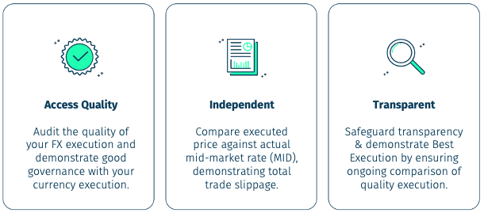

## Table of Contents

## What is execution cost analysis?

Execution cost analysis is a way to figure out how much it costs to run a computer program or a part of it. It looks at things like how much time the program takes to run and how much memory it uses. This is important for people who write software because they want their programs to work quickly and not use too much of a computer's resources.

By doing execution cost analysis, developers can find parts of their code that are slow or use a lot of memory. They can then work on making those parts better. This helps make the whole program run more smoothly and be more efficient. It's like checking a car's engine to see which parts need fixing to make it run better.

## Why is execution cost analysis important for businesses?

Execution cost analysis is important for businesses because it helps them save money and work more efficiently. When a business uses software, it wants that software to run quickly and not use too much of the computer's resources. By doing execution cost analysis, a business can find out which parts of their software are slow or use a lot of memory. This lets them fix these parts, so their software runs better. This can lead to faster work, happier customers, and lower costs for running the software.

Moreover, execution cost analysis helps businesses make smart decisions about where to spend their money. If a business knows which parts of their software are costly to run, they can decide to improve those parts or maybe even replace them with cheaper options. This can save a lot of money over time. It also helps businesses plan for the future, making sure they have enough resources to keep their software running smoothly as they grow.

## How does execution cost analysis differ from other types of cost analysis?

Execution cost analysis focuses specifically on the costs associated with running a computer program or software. This includes things like how much time the program takes to run and how much memory or other computer resources it uses. It's different from other types of cost analysis, like financial cost analysis, which looks at the money spent on things like salaries, equipment, and other expenses. While financial cost analysis is about the overall money spent by a business, execution cost analysis zeroes in on the efficiency and performance of the software itself.

Another type of cost analysis is operational cost analysis, which looks at the costs of running a business's day-to-day activities. This can include costs like utilities, rent, and maintenance. Execution cost analysis is narrower in scope, focusing only on the costs tied to software execution. It helps businesses understand how their software impacts their resources and performance, which is crucial for making their operations more efficient. By understanding these differences, businesses can better manage their resources and improve their software to save money and time.

## What are the key components of execution cost analysis?

Execution cost analysis has a few key parts that help us understand how much it costs to run a program. One important part is measuring time. This means figuring out how long it takes for different parts of the program to run. Another part is checking how much memory the program uses. Memory is like the space on a computer where the program keeps its data while it's running. By looking at these two things, we can see which parts of the program are slow or use a lot of space.

Another key part is looking at other computer resources the program uses, like the CPU, which is like the brain of the computer. Sometimes, a program might need a lot of the CPU's attention, which can slow down other things on the computer. We also need to think about how often the program runs and how many people use it at the same time. All these parts together help us see the full picture of what it costs to run the program, so we can make it better and save resources.

## Can you explain the process of conducting an execution cost analysis?

To start an execution cost analysis, you first need to pick the software or part of the software you want to look at. Then, you set up tools that can measure how long it takes for the software to run and how much memory it uses. These tools are like stopwatches and rulers for computers. You run the software many times, maybe in different ways, to see how it behaves. For example, you might run it with a lot of data or with many users at the same time. This helps you get a good idea of what's normal and what might be a problem.

Once you have all this information, you look at it closely to find patterns. You might see that one part of the software takes a long time to run, or that it uses a lot of memory. This is where you can start to fix things. You might change the code to make it faster or find ways to use less memory. After you make these changes, you run the software again to see if it's better. This back-and-forth process helps you keep making the software more efficient and cheaper to run.

## What tools and methodologies are commonly used in execution cost analysis?

In execution cost analysis, people often use tools called profilers. These are like special programs that watch how other programs run. They tell you how long each part of the program takes and how much memory it uses. Some popular profilers are Visual Studio Profiler for Windows, gprof for Linux, and Instruments for macOS. These tools help you see where the program might be slow or using too much memory. You can also use other tools like memory analyzers, which help you find out if the program is keeping too much data in memory that it doesn't need anymore.

The way people do execution cost analysis can be different, but some common methods are used a lot. One method is called benchmarking. This is when you run the program many times with different amounts of work to see how it behaves. Another method is called sampling, where the profiler takes quick looks at what the program is doing at different times. This helps you understand what the program is spending most of its time on. By using these tools and methods, you can find the parts of the program that need to be made better, so it runs faster and uses less memory.

## How can execution cost analysis help in optimizing operational efficiency?

Execution cost analysis helps in making a business run better by finding out which parts of the software are slow or use a lot of the computer's memory. When a business knows this, they can fix these parts to make the software run faster. This means that the work the business does with the software can be done more quickly. For example, if a program that handles customer orders is slow, fixing it can mean that orders are processed faster, making customers happier and saving time for the business.

By using execution cost analysis, a business can also save money. When software runs more efficiently, it uses less of the computer's resources. This can mean the business doesn't need to buy as many computers or upgrade them as often. Also, if the software runs faster, the business might not need as many people working on it, which saves money on salaries. In the end, execution cost analysis helps a business do more work with less, making it more efficient and saving money.

## What are some common challenges faced during execution cost analysis?

One big challenge in doing execution cost analysis is figuring out how to measure things right. Sometimes, the tools we use to check how long a program takes or how much memory it uses can be hard to set up. They might not work the same on different computers, or they might slow down the program while they're watching it. This can make the numbers we get not very accurate. It's like trying to measure how fast a car goes with a broken speedometer.

Another challenge is understanding all the data we collect. When we run a program a lot of times to see how it behaves, we get a lot of numbers. It can be hard to see which numbers are important and which ones are just noise. It's like trying to find a small toy in a messy room. We need to be good at looking at the data and figuring out what it means, or we might miss important problems or fix the wrong things.

## How does execution cost analysis integrate with project management?

Execution cost analysis is important for project management because it helps project managers understand how well their software is working. When they know which parts of the software are slow or use a lot of memory, they can plan better. They can decide to spend more time and money fixing these parts to make the software run faster. This helps them keep the project on time and within budget. By fixing problems early, they can avoid bigger problems later that might delay the whole project.

In project management, execution cost analysis also helps with making decisions about resources. If a project manager sees that a part of the software is very costly to run, they might decide to change the plan. They could choose to use different software or find other ways to do the same job more cheaply. This kind of analysis helps them use their money and time wisely, making sure the project runs smoothly and stays on track.

## What advanced techniques can be applied to enhance the accuracy of execution cost analysis?

One way to make execution cost analysis more accurate is by using a technique called statistical profiling. Instead of just watching the program all the time, which can slow it down, statistical profiling takes quick snapshots of what the program is doing at different times. This helps us see what parts of the program are used the most without making it run slower. Another advanced technique is called hardware performance counters. These are special parts of the computer that can count how many times certain things happen, like how often the CPU is used. By using these counters, we can get very detailed and accurate information about how the program is using the computer's resources.

Another technique that can help is called trace analysis. This means recording everything the program does from start to finish and then looking at this record to find out where it spends the most time or uses the most memory. This can give us a very clear picture of the program's behavior, but it can also make the program run slower while we're recording it. To solve this, we can use a technique called sampling, where we only look at the program's behavior at certain times instead of all the time. By using these advanced techniques, we can get a much better and more accurate understanding of the costs of running the program, which helps us make it run better and save resources.

## How does execution cost analysis impact strategic decision-making?

Execution cost analysis helps businesses make smart choices about their software. When a business knows which parts of their software are slow or use a lot of memory, they can decide to fix these parts. This can save them money and time. For example, if a part of the software that many people use is slow, the business might decide to spend more money to make it faster. This can make customers happier and help the business grow.

By doing execution cost analysis, businesses can also plan better for the future. They can see if their software will be able to handle more work as the business grows. If the software is too costly to run, the business might choose to use different software or find other ways to do the same job more cheaply. This helps them use their resources wisely and make sure they can keep up with their plans without spending too much money.

## What future trends are expected in the field of execution cost analysis?

In the future, execution cost analysis is likely to become even more important as businesses rely more on software to do their work. One big trend will be the use of artificial intelligence (AI) to help with execution cost analysis. AI can look at a lot of data quickly and find patterns that people might miss. This can help businesses find and fix problems in their software faster and more accurately. Another trend will be better tools for doing execution cost analysis. These tools will be easier to use and will work well with different kinds of computers and software, making it easier for businesses to keep their software running smoothly.

Another trend will be the focus on real-time execution cost analysis. This means businesses will be able to see how much their software costs to run while it's actually running, not just after it's done. This can help them make quick decisions to fix problems as soon as they happen. Also, as more businesses move their software to the cloud, execution cost analysis will need to look at how much it costs to run software in the cloud. This is different from running software on a regular computer, so new ways of doing execution cost analysis will be needed to keep up with these changes.

## What are the types of execution costs?

Execution costs in algorithmic trading are fundamental to understanding the net profitability of any trading strategy. These costs are primarily categorized into two types: explicit and implicit costs, each having distinct characteristics and implications for traders.

Explicit costs represent direct financial outlays incurred during the execution of trades. These include commissions, which are fees paid to brokers for facilitating transactions. Commission structures can vary significantly, ranging from flat fees per trade to percentage-based fees related to the trade volume. Another form of explicit cost is exchange fees, which are mandatory payments to the exchanges where trades are executed. These fees can vary depending on the specific exchange and the trading volume, with some exchanges offering discounts or incentives based on trading activity levels.

In contrast, implicit costs are less overt but can have a substantial impact on trading performance. A primary component of implicit costs is the bid-ask spread. This spread is the difference between the price at which a trader can buy an asset (ask price) and the price at which it can be sold (bid price). The size of the bid-ask spread is often correlated with market liquidity—the tighter the spread, the higher the liquidity. Wider spreads imply higher implicit costs.

Another significant implicit cost is market impact costs. These arise when large trade volumes distort market prices unfavorably. For instance, executing a sizable buy order might drive the asset's price up before the order is completed, thereby increasing the effective purchase price. This change can be quantified using the formula:

$$
\text{Market Impact Cost} = \frac{\text{Volume of Trade}}{\text{Average Daily Volume}} \times \text{Impact Multiplier}
$$

Slippage is another form of implicit cost. It occurs when there is a difference between the expected execution price and the actual execution price. Slippage typically results from rapid price changes in volatile markets, where the execution price can differ from the initially quoted price by the time the trade is processed.

Overall, understanding and managing both explicit and implicit costs are crucial for optimizing [algorithmic trading](/wiki/algorithmic-trading) strategies, as these costs directly affect the net profitability of trading operations.

## What are Explicit Costs?

Explicit costs in algorithmic trading refer to the direct expenses incurred when executing trades. These costs consist primarily of commissions and exchange fees, both of which can vary significantly depending on the broker and the trading platform utilized.

Commissions are fees paid to brokers for executing trades on behalf of a trader. They are typically calculated based on the [volume](/wiki/volume-trading-strategy) of trades or a fixed fee per trade. For example, a broker might charge $0.005 per share traded. Therefore, if a trader executes a trade involving 1,000 shares, the commission cost would be calculated as:

$$
\text{Commission Cost} = \text{Number of Shares} \times \text{Commission per Share}\]
$$
\text{Commission Cost} = 1,000 \times 0.005 = \$5.00
$$

Exchange fees, another component of explicit costs, are charged by the financial exchanges where the trades are processed. These fees can vary depending on the specific exchange and the volume of trades. For instance, a high-frequency trader operating on an exchange that employs a tiered fee structure may benefit from reduced fees with increased trading volume. An example of such a tiered structure might be:

- $0.002 per share for volumes up to 10,000 shares per day.
- $0.0015 per share for volumes between 10,001 and 50,000 shares per day.
- $0.001 per share for volumes over 50,000 shares per day.

Understanding and managing these explicit costs is crucial for algorithmic traders, as they can directly impact the net profitability of trading strategies. Properly negotiating commission rates and selecting exchanges with favorable fee structures can result in significant cost savings.

## References & Further Reading

[1]: Kissell, R. (2013). ["The Science of Algorithmic Trading and Portfolio Management."](https://www.sciencedirect.com/book/9780124016897/the-science-of-algorithmic-trading-and-portfolio-management) Elsevier.

[2]: Kritzman, M. (2006). ["The Portable Financial Analyst: What Practitioners Need to Know."](https://archive.org/details/portablefinancia0000krit_s2h9) John Wiley & Sons.

[3]: Kissell, R., & Glantz, M. (2003). ["Optimal Trading Strategies: Quantitative Approaches for Managing Market Impact and Trading Risk."](https://archive.org/details/optimaltradingst0000kiss) AMACOM.

[4]: Harris, L. (2003). ["Trading and Exchanges: Market Microstructure for Practitioners."](https://www.amazon.com/Trading-Exchanges-Market-Microstructure-Practitioners/dp/0195144708) Oxford University Press.

[5]: Aldridge, I. (2009). ["High-Frequency Trading: A Practical Guide to Algorithmic Strategies and Trading Systems."](https://www.amazon.com/High-Frequency-Trading-Practical-Algorithmic-Strategies/dp/1118343506) John Wiley & Sons.