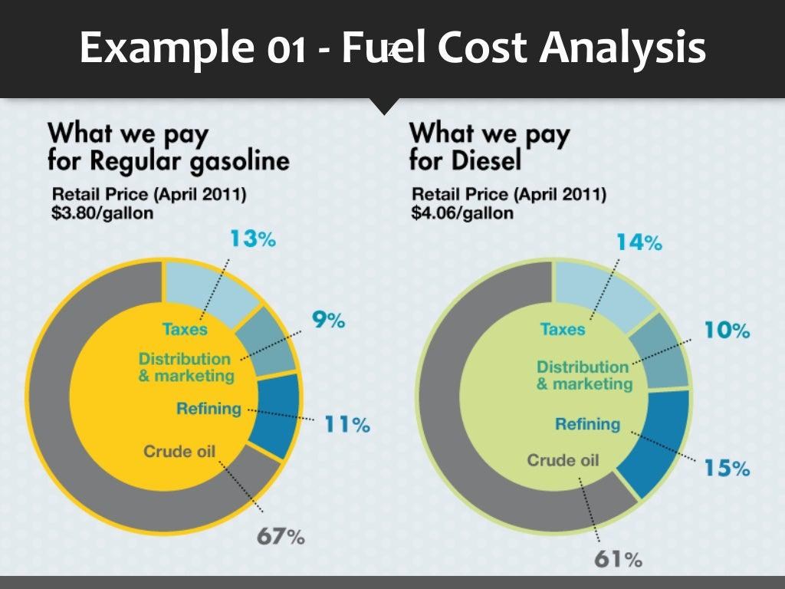

Algorithmic trading has revolutionized the financial markets by enabling trades to be executed at lightning speed, fundamentally transforming the landscape of modern trading. At its core, algorithmic trading relies on pre-set instructions derived from mathematical models and statistical analysis, allowing traders to execute large volumes of trades with minimal human intervention. This rapid pace of trade execution, coupled with the ability to process vast quantities of data, has not only enhanced efficiency but also opened new avenues for profit generation in financial markets.

A crucial facet of algorithmic trading is the understanding and management of execution costs. These costs can significantly affect the profitability of trading strategies, making it essential for traders to have a comprehensive grasp of their intricacies. Execution costs in algorithmic trading consist mainly of explicit costs, such as commissions and exchange fees, and implicit costs, like bid-ask spreads, market impact costs, and slippage. While explicit costs are straightforward and easily quantifiable, implicit costs require a deeper understanding of market dynamics and trading strategies.



This article explores the components of execution costs, addressing both explicit and implicit categories while providing strategic insights to minimize these costs. By implementing effective cost management techniques, traders can optimize their strategies, thus enhancing profitability despite the unavoidable expenses associated with trading. Through this examination, readers will gain a clearer understanding of the economic forces at play in algorithmic trading and the importance of being adept at managing execution costs to maintain a competitive edge in the financial markets.

## Table of Contents

## Types of Execution Costs

Execution costs in algorithmic trading are fundamental to understanding the net profitability of any trading strategy. These costs are primarily categorized into two types: explicit and implicit costs, each having distinct characteristics and implications for traders.

Explicit costs represent direct financial outlays incurred during the execution of trades. These include commissions, which are fees paid to brokers for facilitating transactions. Commission structures can vary significantly, ranging from flat fees per trade to percentage-based fees related to the trade volume. Another form of explicit cost is exchange fees, which are mandatory payments to the exchanges where trades are executed. These fees can vary depending on the specific exchange and the trading volume, with some exchanges offering discounts or incentives based on trading activity levels.

In contrast, implicit costs are less overt but can have a substantial impact on trading performance. A primary component of implicit costs is the bid-ask spread. This spread is the difference between the price at which a trader can buy an asset (ask price) and the price at which it can be sold (bid price). The size of the bid-ask spread is often correlated with market liquidity—the tighter the spread, the higher the liquidity. Wider spreads imply higher implicit costs.

Another significant implicit cost is market impact costs. These arise when large trade volumes distort market prices unfavorably. For instance, executing a sizable buy order might drive the asset's price up before the order is completed, thereby increasing the effective purchase price. This change can be quantified using the formula:

$$
\text{Market Impact Cost} = \frac{\text{Volume of Trade}}{\text{Average Daily Volume}} \times \text{Impact Multiplier}
$$

Slippage is another form of implicit cost. It occurs when there is a difference between the expected execution price and the actual execution price. Slippage typically results from rapid price changes in volatile markets, where the execution price can differ from the initially quoted price by the time the trade is processed.

Overall, understanding and managing both explicit and implicit costs are crucial for optimizing [algorithmic trading](/wiki/algorithmic-trading) strategies, as these costs directly affect the net profitability of trading operations.

## Explicit Costs

Explicit costs in algorithmic trading refer to the direct expenses incurred when executing trades. These costs consist primarily of commissions and exchange fees, both of which can vary significantly depending on the broker and the trading platform utilized.

Commissions are fees paid to brokers for executing trades on behalf of a trader. They are typically calculated based on the [volume](/wiki/volume-trading-strategy) of trades or a fixed fee per trade. For example, a broker might charge $0.005 per share traded. Therefore, if a trader executes a trade involving 1,000 shares, the commission cost would be calculated as:

$$
\text{Commission Cost} = \text{Number of Shares} \times \text{Commission per Share}\]
$$
\text{Commission Cost} = 1,000 \times 0.005 = \$5.00
$$

Exchange fees, another component of explicit costs, are charged by the financial exchanges where the trades are processed. These fees can vary depending on the specific exchange and the volume of trades. For instance, a high-frequency trader operating on an exchange that employs a tiered fee structure may benefit from reduced fees with increased trading volume. An example of such a tiered structure might be:

- $0.002 per share for volumes up to 10,000 shares per day.
- $0.0015 per share for volumes between 10,001 and 50,000 shares per day.
- $0.001 per share for volumes over 50,000 shares per day.

Understanding and managing these explicit costs is crucial for algorithmic traders, as they can directly impact the net profitability of trading strategies. Properly negotiating commission rates and selecting exchanges with favorable fee structures can result in significant cost savings.

## Implicit Costs

Implicit costs represent the less visible but often profound challenges in algorithmic trading, directly influencing trading performance without explicit ledger entries. Recognizing these costs is vital for optimizing trading strategies. 

Bid-ask spread, a fundamental implicit cost, is the difference between the highest price a buyer is willing to pay for an asset (bid) and the lowest price a seller is prepared to accept (ask). This spread can be substantially influenced by market [liquidity](/wiki/liquidity-risk-premium); a highly liquid market usually exhibits narrower spreads due to the abundance of buyers and sellers. Conversely, in less liquid markets, wider spreads may emerge, increasing implicit costs. Narrowing down the spread is crucial for traders aiming to enhance profit margins.

Market impact costs arise from large volume trades that may adversely shift the market price. When a significant order is placed, it can absorb the available liquidity at the best price levels, pushing the price up when buying or down when selling. This effect becomes more pronounced in less liquid markets and can be modeled to anticipate and reduce adverse outcomes. For example, breaking a large order into smaller chunks and executing them over a more extended period can mitigate market impact.

Slippage refers to the deviation between the expected execution price and the actual price at which the trade is completed. It is commonly experienced in volatile markets where rapid price changes can occur between the moment a trade order is placed and when it is executed. Slippage can be particularly detrimental during high-frequency trading scenarios, as even minimal price differences can accumulate to significant losses over numerous trades. Traders often employ real-time monitoring and fast execution technologies to minimize slippage.

Developers can use Python to model these implicit costs and incorporate them into trading algorithms. For instance, Python libraries like NumPy and Pandas could be employed to simulate trading scenarios and evaluate the potential impact of bid-ask spreads, market impact, and slippage on trade performance. Here is a basic example of how one might calculate market impact in Python:

```python
import numpy as np

# Parameters
order_size = 1000  # Size of the order
market_depth = 5000  # Total market depth
price_impact_factor = 0.1  # Factor determining price movement scale

# Function to calculate market impact cost
def calculate_market_impact(order_size, market_depth, price_impact_factor):
    return price_impact_factor * (order_size / market_depth)

market_impact_cost = calculate_market_impact(order_size, market_depth, price_impact_factor)
print(f"Market Impact Cost: {market_impact_cost}")
```

In summary, implicit costs, though less obvious, represent crucial elements that must be effectively managed within algorithmic trading strategies. A comprehensive understanding of bid-ask spreads, market impacts, and slippage enables traders to craft strategies that mitigate these costs, thereby enhancing overall trading efficiency and profitability.

## Minimizing Execution Costs

In algorithmic trading, minimizing execution costs is vital for optimizing strategy performance and ensuring profitability. By employing advanced techniques and leveraging market insights, traders can effectively reduce both explicit and implicit costs.

One effective approach to minimize execution costs is selecting the appropriate algorithmic strategies. These strategies should be tailored to optimize execution timing and reduce costs associated with trades. For example, volume-weighted average price (VWAP) and time-weighted average price (TWAP) algorithms can help distribute order execution over a specified time frame, reducing market impact and aligning with market conditions.

Explicit costs, such as brokerage commissions, can be mitigated through negotiation and utilization of tiered pricing schemes. Establishing strong relationships with brokers and regularly reviewing commission structures can lead to more favorable rates. Tiered pricing models offer reduced rates as trading volumes increase, incentivizing traders to consolidate trades and leverage higher volumes for better rates.

Timing trades to coincide with periods of high liquidity is another effective strategy for minimizing execution costs. High liquidity periods, often during market opening or closing hours, result in narrower bid-ask spreads. This reduces the execution price variance and minimizes market impact, as the increased volume allows for smoother and more efficient trade executions. Employing algorithms that monitor and analyze real-time market data can aid in identifying these optimal trading windows.

By strategically choosing algorithms, negotiating commission rates, and timing trades effectively, traders can significantly minimize execution costs. This not only enhances the overall profitability of algorithmic trading strategies but also provides a competitive advantage in dynamic market environments.

## Cost Measurement and Analysis Tools

Transaction Cost Analysis (TCA) tools are integral to understanding execution costs and assessing the quality of trade implementations in algorithmic trading. TCA tools enable traders to identify inefficiencies by providing detailed insights into the costs associated with each aspect of the trade execution process. They quantify costs such as slippage and market impact, allowing traders to refine their strategies and enhance profitability.

Real-time monitoring tools play a crucial role, particularly in high-frequency trading environments, where the ability to adjust strategies on-the-fly can significantly impact profitability. These tools facilitate immediate evaluation of execution quality and allow for rapid responses to unfavorable market conditions or unexpected execution patterns. Using real-time data, traders can optimize algorithm parameters to ensure the most efficient execution under current market conditions.

Visual dashboards are essential components in the toolkit of algorithmic traders. They aggregate data from multiple sources, providing a comprehensive view of trading costs. Dashboards enable traders to visualize key metrics, such as the ratio of slippage to total volume and market impact trends over time. This visual representation aids in spotting patterns or anomalies that might indicate suboptimal execution strategies.

By leveraging TCA along with real-time monitoring and visualization tools, traders can conduct a thorough analysis of cost structures. This quantitative approach not only aids in mitigating execution costs but also optimizes overall trade performance. As such, effective use of these tools is crucial for maintaining a competitive edge in algorithmic trading.

## Case Studies

Institutional traders often leverage sophisticated execution algorithms in conjunction with Transaction Cost Analysis (TCA) tools to mitigate market impact when executing large orders. Market impact, the adverse effect on prices resulting from substantial trade volumes, can considerably erode profit margins. By employing algorithms such as VWAP (Volume Weighted Average Price) and TWAP (Time Weighted Average Price), traders can distribute their trades more evenly over a specified period or volume, thereby minimizing their conspicuousness in the market.

TCA tools play a crucial role by providing detailed post-trade analytics and feedback on the execution quality. These tools examine how closely execution prices match favorable benchmarks, thus allowing traders to refine their strategies and achieve optimal fills. For instance, an institutional desk might execute a large block of stock by dividing it into smaller parts, assigned proportionately throughout the trading day. This strategy aids in maintaining discretion and reducing potential price distortions.

High-frequency trading ([HFT](/wiki/high-frequency-trading-strategies)) firms capitalize on low latency technology to augment execution speed and diminish slippage, which is the difference between the expected and actual transaction prices. These firms employ cutting-edge infrastructure, such as co-located servers with exchanges, to ensure that their orders have minimal propagation delay. By significantly reducing the time lag between the order decision and its execution, HFT firms enhance their ability to cope with volatile price movements, thereby reducing slippage.

Moreover, HFT strategies often rely on automated logic with circuit breakers designed to halt trading in case predefined thresholds are breached, helping to avert substantial losses in rapidly moving markets. For example, Python code can be crafted to set these thresholds and execute orders with minimal delay:

```python
import time

threshold_price = 100.00

def execute_order(current_price):
    if current_price <= threshold_price:
        # Order execution logic
        send_order_to_exchange(current_price)
    else:
        print("Holding off order execution due to unfavorable price.")

while True:
    current_market_price = get_market_price()
    execute_order(current_market_price)
    time.sleep(0.01)  # Sleep to mimic high-frequency activity
```

In summary, through the integration of advanced algorithms and high-caliber TCA tools, institutional traders and high-frequency trading firms can optimize their execution strategies. By focusing on minimizing market impact and slippage, these entities sustain competitive advantages and bolster profitability in the fast-paced landscape of algorithmic trading.

## Conclusion

Understanding and managing execution costs is vital for the success of algorithmic trading strategies. Execution costs, often categorized into explicit and implicit costs, directly impact the net profitability of trading activities. Given the narrow margins faced by traders, effectively minimizing these costs can significantly enhance financial outcomes. 

Explicit costs, such as commissions and exchange fees, are predictable and can be optimized through strategic decisions, like leveraging tiered pricing schemes or negotiating better rates with service providers. In contrast, implicit costs, including bid-ask spreads, market impact, and slippage, present more complexity due to their dependence on market conditions and trading volumes. These hidden costs necessitate advanced strategies and technologies to mitigate their effects.

By utilizing cost analysis tools and strategies, traders can enhance profitability despite the inherent costs of trading. Tools like Transaction Cost Analysis (TCA) provide quantitative insights into trading expenses and execution quality, enabling traders to make informed adjustments to their strategies. Real-time data monitoring and analysis allow for immediate strategy optimization, essential for market environments that rapidly change.

Continuous evaluation and adaptation to market conditions are crucial for maintaining a competitive edge. The dynamic nature of financial markets means that trading algorithms and cost management strategies must evolve continuously. Incorporating [machine learning](/wiki/machine-learning) models can enhance prediction accuracy for market conditions, aiding in more precise execution decisions. Python, with libraries such as `pandas`, `numpy`, and `scikit-learn`, can be an invaluable tool for implementing such models, as illustrated in the code snippet below:

```python
import pandas as pd
from sklearn.ensemble import RandomForestRegressor

# Assuming 'data' is a DataFrame with market features and 'execution_costs' being the target
X = data.drop('execution_costs', axis=1)
y = data['execution_costs']

# Initialize and train the model
model = RandomForestRegressor(n_estimators=100, random_state=42)
model.fit(X, y)

# Predicting execution costs
predicted_costs = model.predict(X)
```

By employing cutting-edge technology and maintaining an agile approach to trading strategies, traders can minimize execution costs, thereby increasing profitability. Continuous learning and adaptation are essential components of sustainable success in algorithmic trading, ensuring traders remain resilient and competitive in an ever-evolving market landscape.

## References & Further Reading

[1]: Kissell, R. (2013). ["The Science of Algorithmic Trading and Portfolio Management."](https://www.sciencedirect.com/book/9780124016897/the-science-of-algorithmic-trading-and-portfolio-management) Elsevier.

[2]: Kritzman, M. (2006). ["The Portable Financial Analyst: What Practitioners Need to Know."](https://archive.org/details/portablefinancia0000krit_s2h9) John Wiley & Sons.

[3]: Kissell, R., & Glantz, M. (2003). ["Optimal Trading Strategies: Quantitative Approaches for Managing Market Impact and Trading Risk."](https://archive.org/details/optimaltradingst0000kiss) AMACOM.

[4]: Harris, L. (2003). ["Trading and Exchanges: Market Microstructure for Practitioners."](https://www.amazon.com/Trading-Exchanges-Market-Microstructure-Practitioners/dp/0195144708) Oxford University Press.

[5]: Aldridge, I. (2009). ["High-Frequency Trading: A Practical Guide to Algorithmic Strategies and Trading Systems."](https://www.amazon.com/High-Frequency-Trading-Practical-Algorithmic-Strategies/dp/1118343506) John Wiley & Sons.