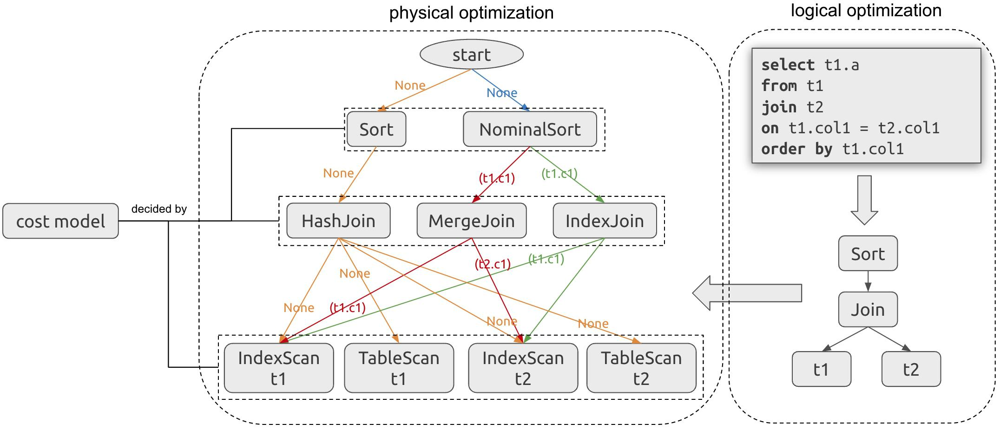

Algorithmic trading has revolutionized the financial industry by providing traders with the ability to execute trades at high speeds and frequencies. This technological advancement allows for the efficient execution of trades that would otherwise be impossible to achieve manually due to the rapid pace and volume. However, a critical challenge inherent in algorithmic trading is the management of execution costs, which can heavily impact a trader's overall profitability.

Execution costs in algorithmic trading are subdivided into explicit and implicit costs. Explicit costs include direct, tangible expenses such as brokerage fees, which are charges imposed by brokers for the facilitation of trades. On the other hand, implicit costs consist of the less tangible aspects such as slippage and market impact. Slippage occurs when there is a discrepancy between the expected trade price and the price at which the trade is actually executed, often due to fast-moving markets. Market impact refers to the adverse price movement that occurs when large orders are placed, subsequently affecting the total cost of executing a trade.

For traders, both in backtested simulations and live markets, a thorough understanding and minimization of these execution costs are vital in maintaining profitability. Execution costs can erode the potential gains from trading activities, making it crucial for traders to consider these factors when devising and implementing trading strategies. Various execution cost models exist, providing traders with the means to predict and mitigate these costs effectively. 

This article aims to explore the nuances of execution cost models within the context of algorithmic trading and discusses strategies that can be employed to minimize these costs. By comprehensively understanding execution costs and employing strategic measures, traders can enhance the efficiency and profitability of their trading operations.

## Table of Contents

## Understanding Execution Costs in Algo Trading

Execution costs are a critical element to consider when analyzing and crafting algorithmic trading strategies. These costs encompass all expenditures incurred during the buying and selling of assets in financial markets. To accurately assess the profitability of a trading strategy, it is imperative to account for both explicit and implicit costs.

Explicit costs are direct and straightforward. They typically include brokerage fees, which are charges levied by brokers for their services in executing trades on behalf of a trader. Taxes associated with trading activities also fall under this category. These costs can be anticipated and quantified ahead of time, making them easier to manage and incorporate into financial models.

Implicit costs, on the other hand, are more nuanced and occur due to the dynamics of the trading process itself. One primary component of implicit costs is market impact, which refers to the adverse price movement that can occur when executing large orders. This cost results from the buying or selling pressure exerted by the trader's actions, which can shift the market price unfavorably. Slippage is another significant implicit cost, arising when there is a disparity between the expected price of a trade and the actual executed price. Slippage is often a result of rapid market movements and can negatively impact the profitability of a trade.

High-frequency trading ([HFT](/wiki/high-frequency-trading-strategies)), characterized by executing a large number of orders at very high speeds, can amplify execution costs, particularly implicit costs. The fast-paced trading environment associated with HFT necessitates highly effective cost management strategies. Traders in HFT environments need to develop systems that can rapidly assess and respond to market conditions, minimizing slippage and market impact.

Managing execution costs in [algorithmic trading](/wiki/algorithmic-trading) requires a comprehensive understanding of both explicit and implicit components. By acknowledging and assessing these costs, traders can implement strategies to mitigate their impact, ultimately enhancing the overall profitability of their trading activities.

## Components of Execution Costs

Understanding execution costs is essential for the optimization of algorithmic trading strategies. These costs can be divided into explicit and implicit components, each significantly affecting trading outcomes.

Firstly, brokerage fees represent explicit costs that traders incur as compensation to brokers for facilitating trade executions. These fees can vary based on the brokerage service used and the type of asset being traded. As traders execute more trades or increase volumes, brokerage fees can become a substantial cost element, influencing overall profitability.

Market impact is an implicit cost, reflecting the adverse price movement that can occur when executing a large order. When a substantial [volume](/wiki/volume-trading-strategy) of an asset is bought or sold, it can shift the market price, thus increasing the cost of execution. This is particularly relevant in less liquid markets where large transactions can cause significant price shifts.

Slippage is another critical component of execution costs. It occurs when there is a discrepancy between the expected execution price of an order and the actual price at which the trade is executed. Slippage is often a result of rapid market movements and can detrimentally affect trade outcomes, especially in high-frequency trading environments where timing is crucial.

Finally, the bid-ask spread constitutes a fundamental component of transaction costs. This spread is the difference between the lowest price that a seller is willing to accept and the highest price a buyer is willing to pay. A wider bid-ask spread increases the transaction cost, especially when trading large volumes or in less liquid markets. The bid-ask spread can be represented mathematically as:

$$
\text{Bid-Ask Spread} = \text{Ask Price} - \text{Bid Price}
$$

In summary, a comprehensive understanding of these execution cost components—brokerage fees, market impact, slippage, and the bid-ask spread—is vital for traders seeking to refine their algorithmic trading strategies and manage costs effectively.

## Factors Influencing Execution Costs

Execution costs in algorithmic trading are influenced by several critical factors, each playing a significant role in determining the overall expense of executing trades. These factors include market [liquidity](/wiki/liquidity-risk-premium), order size, trading frequency, and broker selection.

Market liquidity fundamentally impacts execution costs. A highly liquid market is characterized by a high volume of trade activity, which typically results in tighter bid-ask spreads and reduced price slippage. In such environments, traders can execute large orders with minimal market impact, thus keeping costs lower. Conversely, in less liquid markets, the lack of available counterparties can widen spreads and increase slippage, thereby elevating execution costs.

Order size is another crucial determinant of execution costs. Large orders can exert significant market impact, temporarily altering the price dynamics of a security. This impact can often lead to adverse price movements as the market reacts to the perceived supply-demand imbalance. Consequently, traders must carefully consider order size and execution strategy to mitigate these effects and minimize additional costs.

The frequency of trading is particularly pertinent in high-frequency trading (HFT), where transactions occur in rapid succession, often within microseconds. The sheer volume of trades amplifies the accumulation of execution costs, including brokerage fees and slippage, across numerous transactions. Although HFT strategies aim to capitalize on tiny price discrepancies, the aggregate cost of execution can erode profitability if not effectively managed.

Broker selection and the associated fee structures are vital considerations for traders aiming to optimize execution costs. Different brokers offer varying fee models, such as fixed fees, tiered pricing, or per-transaction charges. Selecting a broker with competitive and transparent pricing can lead to significant cost savings over time. Moreover, traders may explore the possibility of negotiating bespoke fee arrangements or joining rebate programs, which can provide further financial advantages.

In summary, the interplay of market liquidity, order size, trading frequency, and broker selection constitutes the primary factors influencing execution costs. Understanding and managing these elements are essential for traders to enhance their strategy's profitability and maintain competitive advantage in today's dynamic financial markets.

## Impact of Execution Costs on Trading Strategies

Execution costs play a pivotal role in determining the overall success or failure of trading strategies. When not thoroughly accounted for, these costs can convert an ostensibly profitable trading strategy into a losing proposition. One crucial aspect of incorporating execution costs into trading strategies is during the [backtesting](/wiki/backtesting) phase. Accurately including these costs in backtesting models is essential for generating realistic performance predictions. Lack of consideration for these costs can lead to overly optimistic expectations and potential underperformance in live markets.

High-frequency trading (HFT) strategies are particularly susceptible to high execution costs due to their large number of transactions. These strategies depend on executing orders quickly and efficiently. Hence, meticulous cost management is crucial to maintain their viability. For instance, if a high-frequency strategy operates with a narrow profit margin per trade, even a slight increase in execution costs, such as slippage or market impact, can negate any anticipated profits. Traders must carefully tailor their algorithms to minimize these costs, perhaps by leveraging predictive models to anticipate market conditions and adjust their trading frequency accordingly.

On the other hand, strategies that trade at lower frequencies or focus on high-liquidity assets typically incur fewer execution costs. These strategies often benefit from reduced market impact and slippage due to the lesser urgency in executing trades. Such strategies can afford to be more patient, waiting for optimal market conditions before executing transactions. The bid-ask spread is also less of a concern for infrequent traders, as they can optimize their trade timing to exploit narrower spreads.

In summary, the proper management and integration of execution costs into trading strategies are critical. By adopting cost-minimization practices and strategic asset selection, traders can enhance their overall performance and ensure that their strategies remain robust and profitable across both simulated and real-world scenarios.

## Strategies to Minimize Execution Costs

Smart Order Routing (SOR) is a pivotal technology in minimizing execution costs in algorithmic trading. SOR systems leverage algorithms to strategically select trading venues and times for executing trades. This strategic selection is based on assessing factors such as liquidity, transaction costs, and market [volatility](/wiki/volatility-trading-strategies), allowing for efficient order execution that minimizes slippage and market impact. By intelligently routing orders to venues where liquidity is sufficient and transaction costs are optimal, traders can significantly reduce overall execution expenses.

Liquidity management is another crucial strategy. Trading in highly liquid markets helps to minimize slippage and adverse market impacts since these markets can absorb large orders without significant price changes. Traders should prioritize assets with high trading volumes and tight bid-ask spreads to ensure cost-efficient executions. Liquidity considerations are especially important in high-frequency trading, where rapid execution of numerous trades is necessary.

Negotiating brokerage fees and participating in rebate programs can also lead to considerable cost reductions. Traders can work closely with brokers to formulate a fee structure that aligns with their trading volume and frequency. Additionally, many exchanges offer rebate programs for providing liquidity, which can offset some of the transaction costs incurred.

Regular Transaction Cost Analysis (TCA) is imperative for identifying inefficiencies and unnecessary expenses in trade execution. TCA involves evaluating the total costs associated with trading activities, including both explicit and implicit costs. By performing regular TCAs, traders can pinpoint areas where they can reduce costs, optimize execution strategies, and enhance overall trading performance. Implementing a robust TCA framework enables traders to adapt their strategies dynamically in response to changing market conditions and regulatory environments.

In conclusion, minimizing execution costs requires a multifaceted approach that combines technology, strategic planning, and continual evaluation. By implementing SOR, managing liquidity, negotiating fees, and conducting thorough TCA, traders can effectively reduce their execution costs and enhance the profitability of their algorithmic trading operations.

## Conclusion

Effective management of execution costs is crucial to maintaining profitability in algorithmic trading. Execution costs, which include both explicit and implicit expenses, can significantly impact the net returns of trading strategies. Traders must develop a comprehensive understanding of these cost components to mitigate their effects. Explicit costs, such as brokerage fees and taxes, have a straightforward structure and can often be negotiated or reduced through strategic broker selection and engaging in rebate programs. Implicit costs, such as slippage and market impact, require more sophisticated management techniques, including liquidity management and timing strategies to minimize adverse price movements.

Incorporating execution costs into strategy development is essential for achieving realistic performance assessments. This involves accounting for these costs during the backtesting phase to ensure the robustness of a trading strategy. Traders can employ technology-driven solutions, such as Smart Order Routing (SOR), which utilizes algorithms to optimize trade execution by strategically selecting trading venues and times to minimize costs. This not only improves execution quality but also reduces the overall cost of trading.

Moreover, a focus on cost minimization strategies such as liquidity management can further enhance trading performance. Liquidity management emphasizes trading highly liquid assets to reduce slippage and market impact. By concentrating on assets with high trading volumes, traders can execute larger orders with minimal price disruption, which is particularly beneficial for high-frequency and large-scale trading operations.

Staying attuned to market conditions and regulatory changes is vital for adapting execution cost strategies in dynamic financial environments. Market conditions can fluctuate, influencing liquidity and volatility, which in turn affects execution costs. Additionally, regulatory shifts may alter trading rules or fees, necessitating adjustments in trading strategies to maintain cost efficiency.

In conclusion, a blend of strategic cost awareness, integration of advanced technological solutions, and continuous adaptation to market and regulatory shifts formulates the backbone of successful execution cost management in algorithmic trading. Traders who effectively implement these practices can significantly enhance their trading efficiency and maintain profitability in a constantly evolving financial landscape.

## References & Further Reading

- Harris, L. (2002). *Trading & Exchanges: Market Microstructure for Practitioners*. This comprehensive work provides an in-depth analysis of market structures, focusing on the dynamics of trading, and is essential for understanding the underlying mechanics that influence execution costs in financial markets. Harris explores factors affecting market behaviour, which directly correlate with slippage and market impact, critical components of execution costs.

- Kissell, R. (2006). *The Science of Algorithmic Trading and Portfolio Management*. Kissell's book is a pivotal resource for mastering the intricacies of algorithmic trading and portfolio management. It provides strategic insights on minimizing execution costs through sophisticated algorithms, making it invaluable for traders looking to optimize their order execution processes.

- Almgren, R., & Chriss, N. (2000). *Optimal execution of portfolio transactions*. This paper by Almgren and Chriss introduces mathematical models for optimal trade execution, detailing how to minimize market impact and execution costs. The model they propose remains influential for traders designing strategies that seek to balance efficiency with cost reduction.

- Cartea, Á., Jaimungal, S., & Penalva, J. (2015). *Algorithmic and High-Frequency Trading*. This book delves into the specific strategies and impacts of high-frequency trading, which often raises execution costs due to its rapid transaction nature. The authors discuss techniques for mitigating these costs and enhancing the profitability of high-frequency trading strategies.

- Hasbrouck, J. (2007). *Empirical Market Microstructure: The Institutions, Economics, and Econometrics of Securities Trading*. Hasbrouck offers a detailed empirical perspective on market microstructure, providing insights into the economic forces and institutional frameworks that impact execution costs. His work is critical for understanding how market conditions and participant interactions influence cost dynamics.

These references provide a solid foundation for understanding and managing execution costs in algorithmic trading, each offering unique insights into the challenges and strategies applicable to maintaining profitability.