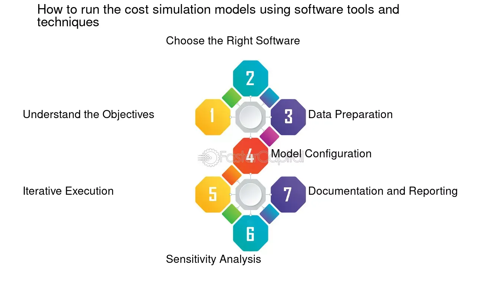

## Table of Contents

## What is an execution cost model?

An execution cost model is a way to estimate how much it costs to run a computer program or a part of it. It looks at things like how much time the program takes to run, how much memory it uses, and how much energy it consumes. This helps people who write and use programs to understand the resources needed and make better decisions about how to use them.

These models are important in many areas, like in businesses where they need to know how much it will cost to run their software, or in cloud computing where companies pay for the resources they use. By using an execution cost model, they can plan better, save money, and make sure their programs run smoothly without using too many resources.

## Why are execution cost models important in computing?

Execution cost models are important in computing because they help people understand how much it costs to run a program. This includes the time it takes, the memory it uses, and even the energy it consumes. By knowing these costs, people can make smarter choices about how to use their computer resources. For example, if a program uses too much memory, they might decide to change it to use less, saving money and making the computer run better.

These models are really useful in places like businesses and cloud computing. In a business, knowing the cost of running software helps with planning and budgeting. They can see if it's worth spending money on certain programs or if they need to find cheaper options. In cloud computing, companies pay for the resources they use, so understanding the execution costs helps them manage their expenses better. This way, they can use just the right amount of resources they need without wasting money.

## Can you explain the basic components of an execution cost model?

An execution cost model has a few main parts that help figure out how much it costs to run a program. One part is time, which looks at how long the program takes to finish its job. This can be measured in seconds, minutes, or even hours depending on the program. Another part is memory, which is about how much space the program needs while it's running. Memory is important because if a program uses too much, it might slow down the computer or even stop it from working properly.

Another important part is energy, which measures how much power the program uses. This is becoming more important as people try to save energy and reduce their impact on the environment. The last part is often called 'other resources,' which can include things like network usage or the number of processors needed. All these parts together help create a complete picture of the costs, making it easier to manage and improve how programs use resources.

By understanding these basic components, people can make better decisions about how to write and run their programs. They can see where a program might be using too much time, memory, or energy, and then make changes to use fewer resources. This not only helps save money but also makes the programs run more smoothly and efficiently.

## How do execution cost models differ between different programming languages?

Execution cost models can be different for different programming languages because each language has its own way of doing things. For example, some languages like C and C++ are very close to the computer's hardware. They let programmers control things like memory and processing in a detailed way. This can make programs written in these languages run faster and use less memory, but it can also make them harder to write and more likely to have mistakes. On the other hand, languages like Python and Java are easier to use and write because they take care of a lot of the details for you. But this can mean they run slower and use more memory because they add extra steps to make things easier.

The way a language handles memory is a big part of how its execution cost model works. In languages like C, you have to manage memory yourself, which can be tricky but can also save resources if done right. In contrast, languages like Java use something called "garbage collection" to automatically clean up memory that's not being used anymore. This makes it easier for programmers but can slow down the program a bit because the computer has to spend time cleaning up. So, when choosing a language, you have to think about what's more important: making the program run fast and use less memory, or making it easier to write and less likely to have errors.

## What are some common metrics used in execution cost models?

Common metrics used in execution cost models include time, memory, and energy. Time measures how long it takes for a program to run from start to finish. This can be important for applications where speed is key, like video games or real-time systems. Memory looks at how much space a program needs to do its job. If a program uses too much memory, it can slow down the computer or even cause it to crash. Energy measures how much power a program uses while it's running. This is becoming more important as people try to save energy and be kinder to the environment.

Another metric often used is CPU usage, which shows how much of the computer's processing power a program is using. This can help people understand if a program is making the computer work too hard. Network usage is also a common metric, especially for programs that need to send and receive data over the internet. It helps to know how much data a program is using so you can plan for things like internet costs. All these metrics together give a full picture of what it costs to run a program, helping people make smart choices about how to use their computer resources.

## How can execution cost models be used to optimize software performance?

Execution cost models help people make software run better by showing them where a program is using too much time, memory, or energy. If a program is slow, the model can point out which parts are taking the longest to run. Then, people can work on those parts to make them faster. For example, if a part of the program is doing the same thing over and over, they might find a way to do it just once and save time. If a program is using too much memory, the model can show which parts are using the most. People can then change those parts to use less memory, making the program run smoother and saving resources.

These models also help with energy use. If a program is using a lot of power, the model can show which parts are using the most energy. People can then make changes to those parts to use less power, which is good for the environment and can save money on electricity bills. By looking at all these different costs, people can make their software work better overall. They can find the right balance between making the program fast, using less memory, and saving energy, which makes the software more efficient and easier to use.

## What are the challenges in developing accurate execution cost models?

Making accurate execution cost models can be hard because there are so many things to think about. Computers can be different from each other, with different speeds and amounts of memory. This means a program might run fast on one computer but slow on another. Also, programs can change over time, and new versions might use resources in different ways. It's tough to make a model that works for all these different situations.

Another challenge is that some costs are hard to measure. For example, figuring out exactly how much energy a program uses can be tricky. It's not just about the program itself; it also depends on the computer it's running on and other things happening at the same time. Plus, some costs like network usage can change a lot depending on things like internet speed. So, making a model that can predict all these costs accurately is a big challenge.

## How do execution cost models account for hardware variations?

Execution cost models try to account for hardware variations by using average numbers and making guesses about how different computers work. They look at things like how fast the computer's processor is and how much memory it has. By using these average numbers, the models can give a good guess about how a program will run on different computers. But it's hard to be exact because every computer is a little different.

To make their guesses better, some models use special tests to see how a program runs on different kinds of hardware. They might run the program on lots of different computers and see how the time, memory, and energy change. This helps the model understand the differences better and make more accurate predictions. But even with these tests, it's still tough to make a model that works perfectly for every computer out there.

## Can you discuss a case study where an execution cost model significantly improved system performance?

In a case study at a big online store, the company used an execution cost model to make their website run faster. They noticed that their website was taking too long to load, which was making customers leave without buying anything. By using the model, they found out that some parts of the website were using too much time and memory. They made changes to those parts, like making some pictures smaller and changing how the website showed products. After these changes, the website loaded much faster, and more customers stayed and bought things. This helped the company make more money and keep their customers happy.

Another example is from a cloud computing company that wanted to save money on running their services. They used an execution cost model to see how much energy their programs were using. The model showed that some programs were using a lot of power because they were doing extra work that wasn't needed. By changing those programs to do less work, they saved a lot of energy. This not only helped the environment but also lowered their electricity bills. The company was happy because they could offer cheaper services to their customers while still making a good profit.

## What advanced techniques are used to refine execution cost models?

One advanced technique to make execution cost models better is called [machine learning](/wiki/machine-learning). This means using computers to look at a lot of data about how programs run on different machines. The computer learns from this data and can then guess how a new program will run. This helps make the model more accurate because it can think about all the little differences between computers. Another technique is called profiling, which is like taking a close look at a program while it's running. By watching how the program uses time, memory, and energy, people can find spots where it's not working as well as it could. They can then use this information to make the model more exact and help improve the program.

Another way to refine execution cost models is by using simulation. This means making a pretend computer on a real computer and running the program on it. By changing things in the pretend computer, like the speed of the processor or the amount of memory, people can see how the program would run on different real computers. This helps them make the model more accurate for all sorts of hardware. Also, some people use a technique called benchmarking, which means running the same program on many different computers and comparing the results. This helps them see how hardware differences affect the program's costs and make the model better at guessing these costs.

## How do execution cost models integrate with machine learning for predictive performance analysis?

Execution cost models can work together with machine learning to guess how well a program will run in the future. Machine learning looks at a lot of data about how programs have run before on different computers. It uses this data to find patterns and make guesses about new programs. By using these guesses, the execution cost model can be more accurate. It can think about things like how fast the computer's processor is, how much memory it has, and even how much energy it uses. This helps people plan better and make sure their programs run smoothly without using too many resources.

Using machine learning also helps the execution cost model learn from new data all the time. As programs change and new computers come out, the model can keep getting better. It can see how these changes affect time, memory, and energy use. This means the model can always give the best guesses about how a program will run. This is really helpful for businesses and cloud computing companies because they can save money and make their software work better. By working together, execution cost models and machine learning make it easier to predict and improve how programs will perform in the future.

## What future trends are expected in the development of execution cost models?

In the future, execution cost models are expected to get even better at guessing how programs will run. One big trend is using more machine learning to make these models smarter. Machine learning can look at a lot of data and find patterns, which helps the models guess more accurately. This means they can think about things like how fast a computer's processor is, how much memory it has, and how much energy it uses. As computers keep changing and getting faster, these models will need to keep learning to stay accurate.

Another trend is that execution cost models will become more important in cloud computing. Companies that use cloud services will rely more on these models to save money and make their software run better. The models will help them use just the right amount of resources without wasting any. They'll also help with planning and making sure new programs will work well before they're used. As more businesses move to the cloud, these models will be key to making sure everything runs smoothly and costs stay low.

## What are the components of execution costs?

Understanding execution costs is essential for the optimization of [algorithmic trading](/wiki/algorithmic-trading) strategies. These costs can be divided into explicit and implicit components, each significantly affecting trading outcomes.

Firstly, brokerage fees represent explicit costs that traders incur as compensation to brokers for facilitating trade executions. These fees can vary based on the brokerage service used and the type of asset being traded. As traders execute more trades or increase volumes, brokerage fees can become a substantial cost element, influencing overall profitability.

Market impact is an implicit cost, reflecting the adverse price movement that can occur when executing a large order. When a substantial [volume](/wiki/volume-trading-strategy) of an asset is bought or sold, it can shift the market price, thus increasing the cost of execution. This is particularly relevant in less liquid markets where large transactions can cause significant price shifts.

Slippage is another critical component of execution costs. It occurs when there is a discrepancy between the expected execution price of an order and the actual price at which the trade is executed. Slippage is often a result of rapid market movements and can detrimentally affect trade outcomes, especially in high-frequency trading environments where timing is crucial.

Finally, the bid-ask spread constitutes a fundamental component of transaction costs. This spread is the difference between the lowest price that a seller is willing to accept and the highest price a buyer is willing to pay. A wider bid-ask spread increases the transaction cost, especially when trading large volumes or in less liquid markets. The bid-ask spread can be represented mathematically as:

$$
\text{Bid-Ask Spread} = \text{Ask Price} - \text{Bid Price}
$$

In summary, a comprehensive understanding of these execution cost components—brokerage fees, market impact, slippage, and the bid-ask spread—is vital for traders seeking to refine their algorithmic trading strategies and manage costs effectively.

## References & Further Reading

- Harris, L. (2002). *Trading & Exchanges: Market Microstructure for Practitioners*. This comprehensive work provides an in-depth analysis of market structures, focusing on the dynamics of trading, and is essential for understanding the underlying mechanics that influence execution costs in financial markets. Harris explores factors affecting market behaviour, which directly correlate with slippage and market impact, critical components of execution costs.

- Kissell, R. (2006). *The Science of Algorithmic Trading and Portfolio Management*. Kissell's book is a pivotal resource for mastering the intricacies of algorithmic trading and portfolio management. It provides strategic insights on minimizing execution costs through sophisticated algorithms, making it invaluable for traders looking to optimize their order execution processes.

- Almgren, R., & Chriss, N. (2000). *Optimal execution of portfolio transactions*. This paper by Almgren and Chriss introduces mathematical models for optimal trade execution, detailing how to minimize market impact and execution costs. The model they propose remains influential for traders designing strategies that seek to balance efficiency with cost reduction.

- Cartea, Á., Jaimungal, S., & Penalva, J. (2015). *Algorithmic and High-Frequency Trading*. This book delves into the specific strategies and impacts of high-frequency trading, which often raises execution costs due to its rapid transaction nature. The authors discuss techniques for mitigating these costs and enhancing the profitability of high-frequency trading strategies.

- Hasbrouck, J. (2007). *Empirical Market Microstructure: The Institutions, Economics, and Econometrics of Securities Trading*. Hasbrouck offers a detailed empirical perspective on market microstructure, providing insights into the economic forces and institutional frameworks that impact execution costs. His work is critical for understanding how market conditions and participant interactions influence cost dynamics.

These references provide a solid foundation for understanding and managing execution costs in algorithmic trading, each offering unique insights into the challenges and strategies applicable to maintaining profitability.

