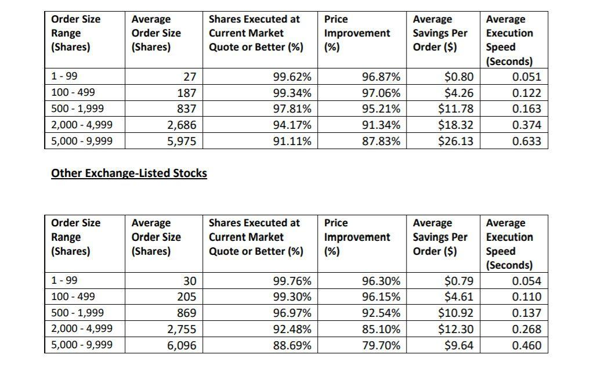

Algorithmic trading has dramatically transformed the financial industry by enabling traders to perform high-speed, high-frequency trades with the assistance of sophisticated algorithms and machine learning technologies. This innovation facilitates the analysis of vast volumes of data and the execution of trades at speeds far surpassing human capabilities, thus providing traders with opportunities to capitalize on market inefficiencies and fleeting opportunities that would otherwise go unnoticed in traditional trading setups.

Despite the clear advantages of algorithmic trading, a major challenge that traders face is the management of execution costs, which can profoundly impact profitability. Execution costs refer to the various expenses incurred during the process of buying and selling financial assets. These costs include explicit expenses such as brokerage fees, which are the commissions paid to brokers for executing trades, and taxes that may be applicable depending on the jurisdiction and type of financial instruments involved.

Furthermore, traders encounter implicit costs like slippage, which is the difference between the expected price of a trade and the actual price at which it is executed. This typically occurs in fast-moving markets where prices change rapidly. Another significant implicit cost is market impact, referring to the price movement resulting from the act of executing large trades, which could lead to less favorable prices for subsequent trades.

Addressing execution costs is crucial as they can accumulate swiftly, especially in high-frequency and algorithmic trading environments, effectively eroding potential profits. Understanding these costs and their implications on trading strategies is essential for traders to ensure that profitable strategies remain viable when transitioned from theoretical backtests to live markets. This article will explore the various factors contributing to execution costs, their effects on trading strategies, and methods to minimize these costs to achieve optimal trading outcomes.

## Table of Contents

## Understanding Execution Costs in Algo Trading

Execution costs represent the aggregate expenses incurred during the buying and selling of assets within financial markets. These costs are pivotal to evaluating the net profitability of trading activities, particularly in the context of [algorithmic trading](/wiki/algorithmic-trading) where trades are executed at high speed and frequency. 

Execution costs can be categorized into explicit and implicit costs. Explicit costs are direct and easily quantifiable. These include brokerage fees, which are the commissions paid to brokers for facilitating trades, and taxes levied on trading activities. Brokerage fees vary depending on the broker and the types of services provided, and they can be a fixed amount per trade or a percentage of the trade value. Taxes also vary based on jurisdiction and the nature of the transaction.

Implicit costs, on the other hand, are less tangible and require more sophisticated assessment. These costs include market impact and slippage. Market impact refers to the change in the price of an asset resulting from the trade itself, especially if the trade involves a significant [volume](/wiki/volume-trading-strategy) compared to the [liquidity](/wiki/liquidity-risk-premium) available in the market. For instance, if a trader aims to buy a large number of shares, the increased demand may drive the price up before the entire transaction is completed, resulting in a less favorable price for the trader.

Slippage is the difference between the expected price of a trade and the actual price at which it is executed. It often occurs in volatile markets or due to delays between the time a trade order is placed and the time it is executed. Traders might set a target price when buying or selling an asset. If the actual execution price deviates unfavorably from this target due to various market conditions, that difference is termed slippage.

In algorithmic and high-frequency trading, where the volume and velocity of trades are substantially higher, execution costs can accumulate rapidly. These increased costs may significantly erode potential profits if not carefully managed and accounted for. Each trade executed comes with inherent costs, and when algorithms are trading multiple times per second or minute, these seemingly negligible costs on a per-trade basis can culminate into significant sums. Consequently, understanding and minimizing execution costs is crucial for maintaining profitability in such trading strategies. 

By comprehensively evaluating both explicit and implicit components of execution costs, traders can develop strategies that mitigate their financial impact, thereby preserving the effectiveness of the trading algorithms used.

## Components of Execution Costs

Execution costs in algorithmic trading are vital to comprehend as they directly reduce profit margins. These costs can be categorized into distinct components that traders need to account for: brokerage fees, market impact, slippage, and the bid-ask spread.

1. **Brokerage Fees:** These are explicit costs arising from commissions charged by brokers to execute transactions. Brokerage fees can vary based on the broker’s fee structure, which might include a fixed per-trade fee or a fee proportional to the trade volume. Depending on the frequency and size of trades, these fees can accumulate significantly, especially in high-frequency trading (HFT).

2. **Market Impact:** This refers to the adverse price movement caused by the execution of large orders, which can move the market against the trader's position. When a substantial buy order is placed, it can drive up prices, whereas a large sell order might push prices down. Market impact can be quantified by the ratio of price change to order size. Minimizing market impact involves executing trades incrementally or during periods of higher market liquidity.

3. **Slippage:** Slippage occurs when there is a difference between the anticipated price of a trade and the price at which it is actually executed. Slippage is often a result of fast market movements or order delays and can be detrimental to trading strategies, particularly for short-term trades. It is calculated as:
$$
   \text{Slippage} = \left(\frac{\text{Executed Price} - \text{Expected Price}}{\text{Expected Price}}\right) \times 100\%

$$

4. **Bid-Ask Spread:** This is the difference between the highest price a buyer is willing to pay (bid) and the lowest price a seller will accept (ask). The spread compensates market makers for the risk of holding stocks. Highly liquid assets generally exhibit tighter spreads, reducing transaction costs. The bid-ask spread can be represented as:
$$
   \text{Spread} = \text{Ask Price} - \text{Bid Price}

$$

Understanding these components is crucial for traders to optimize their strategies and maintain profitability. By carefully managing and analyzing each element of execution costs, traders can enhance their trading efficiency and outcomes.

## Factors Influencing Execution Costs

Market liquidity plays a vital role in determining execution costs within algorithmic trading. In highly liquid markets, where numerous transactions occur every second, the ease of buying and selling assets increases, thereby typically reducing execution costs such as slippage and market impact. For instance, when trading within a market characterized by high liquidity, the difference between the bid and ask prices (the bid-ask spread) tends to be narrower, which minimizes the cost implications of executing trades. 

Order size is another crucial [factor](/wiki/factor-investing) influencing execution costs. Executing large orders can lead to significant market impact, which occurs when the buying or selling pressure of the order causes the asset's price to move unfavorably, thereby increasing costs. This is often modeled using market impact models, which help quantify how different factors such as order size affect the asset price. A common representation is the power law relationship:

$$
\text{Market Impact} \propto \text{Order Size}^\beta
$$

where $\beta$ is usually greater than 0 but less than 1, indicating a sublinear increase in market impact with order size.

Trading frequency is particularly relevant in high-frequency trading ([HFT](/wiki/high-frequency-trading-strategies)) strategies. The accumulation of small execution costs over numerous trades can lead to a significant drain on profits. High-frequency trading aims to exploit small price discrepancies at high speeds, but the constant churn of trades can lead to elevated total costs if not managed effectively.

Broker selection also significantly affects execution costs, as brokers have different fee structures, trading platforms, and services. Some brokers might offer lower transaction fees but lack advanced technological capabilities that could facilitate order execution, while others might provide premium services at a higher cost. Effective broker selection focuses on evaluating these trade-offs to minimize overall execution expenses.

In summary, understanding and managing factors such as market liquidity, order size, trading frequency, and broker selection is essential for reducing execution costs in algorithmic trading, thereby maximizing the strategy's profitability.

## Impact of Execution Costs on Trading Strategies

Execution costs are a critical component in determining the efficacy of trading strategies in algorithmic trading. High execution costs can erode the profitability of seemingly lucrative strategies, transforming them from winning to losing endeavors. This underscores the necessity for developing strategies that are not only effective in theory but also efficient in practice.

The inclusion of execution costs during the [backtesting](/wiki/backtesting) phase is essential. Backtesting allows traders to simulate trading strategies using historical data to assess their potential performance. However, without accounting for execution costs, the results can be misleading. For instance, a backtest might indicate profitability without considering slippage, market impact, and brokerage fees, leading to a disparity between expected and actual performance. The formula for calculating net profit by factoring in execution costs can be structured as follows:

$$
\text{Net Profit} = \text{Gross Profit} - (\text{Slippage} + \text{Brokerage Fees} + \text{Market Impact})
$$

Where:
- Gross Profit is the profit before deductions.
- Slippage is the difference between expected and actual trade price.
- Brokerage Fees are the commissions paid.
- Market Impact refers to the price change resulting from trade orders.

Execution costs also influence the choice of trading strategies. Strategies that rely on high-frequency trading generally face higher execution costs due to frequent transactions, making them less viable unless these costs are meticulously managed. Conversely, strategies that focus on lower-frequency trading, or those targeting high-liquidity assets, tend to have comparatively lower execution costs.

Furthermore, execution costs affect how often a trader might opt to enter or [exit](/wiki/exit-strategy) the market. In environments where costs are high, traders might prefer strategies that minimize trade frequency, such as trend-following or position trading, which naturally involve fewer transactions. Conversely, strategies like [scalping](/wiki/gamma-scalping), which require rapid entries and exits, must be exceptionally adept at minimizing costs or run the risk of becoming unprofitable.

In conclusion, a comprehensive understanding of execution costs and their potential impact is paramount. By integrating these considerations into strategy development and backtesting, traders can bridge the gap between theoretical and practical success, ensuring their strategies are viable in real-world financial markets.

## Strategies to Minimize Execution Costs

To effectively minimize execution costs in algorithmic trading, traders can employ several strategic approaches:

1. **Smart Order Routing (SOR):** Smart Order Routing involves leveraging algorithms to select the most efficient trading venues and times to execute trades. This strategy optimizes the execution process by directing orders to venues with the best prices and sufficient liquidity, thereby reducing costs associated with slippage and market impact. Advanced SOR systems analyze real-time market data to make dynamic routing decisions, ensuring that trades are executed under optimal conditions.

2. **Liquidity Management:** Focusing on high liquidity assets is crucial for reducing slippage and market impact. Liquidity refers to the ability to buy or sell an asset without causing significant price changes. Trading in highly liquid markets or instruments helps ensure that trades can be executed quickly and at prices close to their expected values. Effective liquidity management involves continually monitoring market conditions and adjusting trading strategies to accommodate changes in liquidity levels.

3. **Broker Negotiations:** Negotiating with brokers for lower fees and exploring rebate programs is a practical approach to minimizing execution costs. Different brokers have varying fee structures, and traders can often secure reduced transaction fees or benefit from programs that offer rebates based on trading volume or other criteria. By analyzing and comparing the offerings of different brokers, traders can select partnerships that align with their cost objectives.

4. **Transaction Cost Analysis (TCA):** Regular transaction cost analysis is essential for informed decision-making in algorithmic trading. TCA involves assessing the costs associated with executing trades, including explicit costs like fees and commissions, as well as implicit costs such as slippage and market impact. By regularly performing TCA, traders can identify areas where costs can be reduced and refine their execution strategies accordingly. This analysis helps in understanding historical trading performance, forecasting future costs, and implementing strategies that optimize trade execution.

Incorporating these strategies into trading frameworks allows traders to mitigate execution costs effectively, enhancing overall profitability. Leveraging technology and data-driven insights plays a crucial role in successfully implementing these cost-minimization techniques.

## Conclusion

Managing execution costs is a pivotal aspect of successful algorithmic trading. These costs, if not adequately controlled, can erode the profitability of trading strategies, transforming them from potentially lucrative to detrimental. Therefore, optimizing these costs is essential for traders who seek to sustain profitability in highly competitive markets.

Traders can enhance profitability by optimizing their trading strategies, which requires a robust understanding of the components of execution costs, such as brokerage fees, market impact, and slippage. By evaluating these costs, traders can incorporate strategies like smart order routing and liquidity management to minimize financial drains. Smart order routing involves using algorithms to determine the best venues and times to execute trades, thus reducing market impact and slippage. Additionally, focusing on high-liquidity assets can further alleviate the adverse effects of these invisible costs.

Leveraging advanced technology is another crucial factor in minimizing execution costs. By employing [machine learning](/wiki/machine-learning) algorithms and high-speed trading infrastructures, traders can make informed decisions at speeds faster than human capabilities. Technologies that facilitate data analysis, such as Transaction Cost Analysis (TCA), enable traders to dissect and understand hidden costs and make data-driven decisions to optimize their trade executions.

Maintaining a keen awareness of market conditions is also vital. Continuous monitoring of market trends and understanding market liquidity dynamics can aid traders in timing their trades more effectively, which is integral to reducing market impact costs. Furthermore, by remaining informed about changing regulatory environments and adapting to them, traders can avoid unexpected cost increases due to new fees or penalties.

Incorporating execution cost management into algo trading frameworks enables traders to maintain a competitive edge. By systematically addressing execution costs through strategy optimization and technological advancements, traders can achieve and sustain higher profitability. Thorough cost analysis and the resulting adjustments can turn a trading framework into a resilient, efficient system that stands robust against the intricacies of financial markets. 

In conclusion, as the landscape of financial markets continually evolves, traders must remain vigilant and proactive in managing execution costs. By prioritizing this aspect, they are better equipped to navigate the complexities of algorithmic trading successfully.

## References & Further Reading

[1]: Harris, L. (2002). ["Trading & Exchanges: Market Microstructure for Practitioners,"](https://www.amazon.com/Trading-Exchanges-Market-Microstructure-Practitioners/dp/0195144708) Oxford University Press.

[2]: Kissell, R. (2006). ["The Science of Algorithmic Trading and Portfolio Management,"](https://www.sciencedirect.com/book/9780124016897/the-science-of-algorithmic-trading-and-portfolio-management) Academic Press.

[3]: Almgren, R., & Chriss, N. (2000). ["Optimal execution of portfolio transactions."](https://smallake.kr/wp-content/uploads/2016/03/optliq.pdf) Journal of Risk, 3(2), 5-39.

[4]: Cartea, Á., Jaimungal, S., & Penalva, J. (2015). ["Algorithmic and High-Frequency Trading,"](https://assets.cambridge.org/97811070/91146/frontmatter/9781107091146_frontmatter.pdf) Cambridge University Press.

[5]: Hasbrouck, J. (2007). ["Empirical Market Microstructure: The Institutions, Economics, and Econometrics of Securities Trading,"](https://academic.oup.com/book/52241) Oxford University Press.