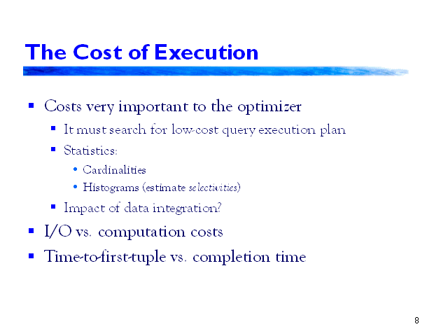

## Table of Contents

## What are execution costs in the context of programming?

Execution costs in programming refer to the resources a computer uses to run a program. These resources include time, memory, and sometimes energy. When a program runs, it needs to use the computer's processor to do calculations and the memory to store data. The more complex the program, the more resources it might need. Programmers try to write code that uses fewer resources, so the program runs faster and uses less memory.

There are two main types of execution costs: time complexity and space complexity. Time complexity is about how long it takes for a program to finish its task. If a program takes too long, it might not be useful. Space complexity is about how much memory the program uses. If a program uses too much memory, it might slow down the computer or even crash it. Good programmers always think about these costs when they write their code, trying to make their programs as efficient as possible.

## How do execution costs affect the performance of a program?

Execution costs directly impact how well a program runs. If a program has high execution costs, it means it takes a lot of time or memory to do its job. This can make the program slow or cause it to use up a lot of the computer's resources. When a program is slow, users might get frustrated because they have to wait longer for the program to finish what it's doing. If it uses too much memory, the computer might start to lag or even crash, which is not good for anyone using it.

Programmers try to keep execution costs low to make their programs run smoothly. They do this by writing code that is efficient, meaning it does the job quickly and with less memory. For example, if a program needs to sort a list of numbers, a programmer might choose a sorting method that is faster and uses less memory. By keeping execution costs low, the program can work better, and users will have a better experience because the program runs faster and doesn't slow down their computer.

## What are the main factors that contribute to high execution costs?

One big reason for high execution costs is the way a program is written. If a program has a lot of steps or repeats the same thing many times, it can take a long time to finish. This is called having high time complexity. For example, if a program needs to search through a big list of items one by one, it will take longer than if it could find the item quickly. Another part of how a program is written is how it uses memory. If a program keeps a lot of information in memory that it doesn't need, or if it keeps making new spaces in memory for small pieces of data, it can use up a lot of memory. This is called having high space complexity.

Another factor that can make execution costs high is the size of the data the program is working with. If a program needs to handle a lot of data, like a big database or a large file, it will take more time and memory to process all of that information. Even a well-written program can slow down if it has to deal with a lot of data. Also, the computer's hardware can affect execution costs. If a computer has a slow processor or not enough memory, even a simple program can run slowly or use up all the memory. So, the combination of how a program is written, the amount of data it handles, and the computer's hardware all play a role in determining the execution costs.

## Can you explain the difference between time complexity and space complexity in relation to execution costs?

Time complexity is about how long it takes for a program to do its job. It looks at the number of steps or operations a program needs to complete its task. If a program has to do a lot of steps, like searching through a big list one item at a time, it will have high time complexity. This means the program might take a long time to finish, which can make it slow and frustrating to use. Programmers try to write code that does the job quickly, so the time complexity stays low and the program runs faster.

Space complexity is about how much memory a program uses while it's running. It looks at how much space the program needs to store all its data and do its calculations. If a program keeps a lot of information in memory that it doesn't need, or if it keeps making new spaces in memory for small pieces of data, it will have high space complexity. This can make the program use up a lot of the computer's memory, which can slow down the computer or even make it crash. Programmers try to write code that uses less memory, so the space complexity stays low and the program doesn't use up too many resources.

## How can a developer measure execution costs in their code?

A developer can measure execution costs by using tools and techniques that track how long a program takes to run and how much memory it uses. For time complexity, they can use a timer to see how many seconds or milliseconds a piece of code takes to finish. There are also special tools called profilers that can show exactly which parts of the code are taking the most time. This helps developers find and fix the slow parts of their program. For space complexity, developers can use memory profilers to see how much memory their program is using at different points while it's running. These tools help them understand if their program is using too much memory and where they might be able to save some.

Once developers have this information, they can start to make their code better. If they find that a certain part of their program is slow, they might try to use a different way to do the same thing that could be faster. If their program is using too much memory, they might look for ways to store less information or use the memory more efficiently. By measuring execution costs and then working to lower them, developers can make their programs run faster and use less of the computer's resources. This makes the programs more efficient and better for users.

## What are some common strategies for reducing execution costs?

One common strategy for reducing execution costs is to optimize algorithms and data structures. This means choosing the best way to do a task in a program. For example, if a program needs to search for something in a list, using a sorted list and a binary search can be much faster than looking through the list one item at a time. Also, using the right data structure, like an array instead of a linked list when you need fast access to items, can save time and memory. By [picking](/wiki/asset-class-picking) the best algorithm and data structure for each part of the program, developers can make their code run faster and use less memory.

Another strategy is to use caching. Caching means saving the results of expensive operations so the program doesn't have to do them again. If a program often needs to do the same calculation or look up the same data, caching the result can save a lot of time. This is especially useful for things like web browsers, which can save web pages so they load faster the next time you visit them. By caching the right things, a program can run more quickly without using more memory.

Lastly, developers can use techniques like lazy evaluation and code optimization. Lazy evaluation means only doing calculations when you really need the result, not before. This can save time and memory by avoiding unnecessary work. Code optimization involves looking at the code and finding ways to make it run faster or use less memory. This might mean rewriting parts of the code to be more efficient, or using special compiler options that can speed up the program. By using these strategies, developers can make their programs run better and use fewer resources.

## How do different programming languages handle execution costs differently?

Different programming languages handle execution costs in their own ways because they are designed differently. Some languages, like C and C++, are very close to the computer's hardware. This means they can control how the computer works in a detailed way, which can make programs written in these languages run very fast and use less memory. But, they can be harder to write because you need to think a lot about how the computer works. On the other hand, languages like Python and JavaScript are easier to write because they handle a lot of the details for you. But this can make programs written in these languages run a bit slower and use more memory because they have to do extra work behind the scenes.

Another way languages differ is in how they manage memory. Some languages, like Java and C#, use something called garbage collection. This means the language automatically cleans up memory that the program isn't using anymore. This makes it easier for developers because they don't have to worry about cleaning up, but it can slow down the program a little bit while the garbage collector is working. In contrast, languages like C and C++ don't have automatic garbage collection. Developers have to clean up the memory themselves, which can be harder but can also make the program run faster and use less memory if done well. So, the choice of language can affect how fast a program runs and how much memory it uses, depending on how it handles these execution costs.

## What role do algorithms play in managing execution costs?

Algorithms are like recipes that tell a computer how to do a job. They can make a big difference in how fast a program runs and how much memory it uses. If you pick a good algorithm, it can do the job quickly and not use too much memory. For example, if you need to sort a list of numbers, using a quick sort algorithm can be much faster than using a bubble sort. By choosing the right algorithm, developers can make their programs run better and use fewer resources.

Sometimes, the same job can be done in different ways, and some ways are better than others. A good algorithm can find the best way to do something, like searching through a list or calculating a result. If a program has to do the same thing many times, using a smart algorithm can save a lot of time and memory. This is why developers spend a lot of time thinking about which algorithms to use, because it helps them keep the execution costs low and make their programs work well.

## How do execution costs impact scalability in software applications?

Execution costs can really affect how well a software application can grow, or scale. If a program takes a long time to run or uses a lot of memory, it can be hard to make it work for more people or handle more data. When a program has high execution costs, adding more users or more data can make it even slower or cause it to use up all the computer's memory. This can make the program stop working well, and people might get frustrated because it's slow or crashes.

To make a program scale better, developers need to keep the execution costs low. This means making sure the program runs quickly and doesn't use too much memory, even when it has to handle a lot of users or data. By using good algorithms and writing efficient code, developers can make their programs work well even as they grow. This helps the program stay fast and reliable, no matter how many people are using it or how much data it's handling.

## What advanced techniques can be used to optimize execution costs at a system level?

One advanced technique to optimize execution costs at a system level is load balancing. Load balancing means spreading out the work that a program needs to do across different computers or servers. This can help the program run faster because no single computer gets overwhelmed with too much work. It's like having a team of people working together on a big project instead of just one person trying to do everything. By using load balancing, a system can handle more users and data without slowing down, which helps keep execution costs low.

Another technique is using parallel processing. This means breaking a big job into smaller parts and doing them at the same time on different processors or computers. It's like if you have a lot of dishes to wash, and instead of doing them one by one, you get a few people to help and wash them all at the same time. This can make the program run much faster because it's using more of the computer's power at once. By using parallel processing, developers can make their programs finish their jobs quicker, which helps reduce time complexity and keep the system running smoothly.

A third technique is optimizing the use of system resources through techniques like memory paging and virtual memory. Memory paging means breaking up the memory into smaller parts called pages, and only loading the pages that are needed at the moment. This can help save memory because the program doesn't have to keep everything in memory all at once. Virtual memory is when the computer uses the hard drive as extra memory, which can help when the program needs more memory than the computer has. By using these techniques, developers can make sure their programs use memory more efficiently, which helps reduce space complexity and keep the system from running out of resources.

## How do cloud computing environments influence execution costs?

Cloud computing environments can help manage execution costs in a big way. When you use the cloud, you can use as much or as little of the computer's power as you need. This means you don't have to buy a lot of expensive computers to run your program. Instead, you can rent just the right amount of power from a cloud service. This can save a lot of money because you only pay for what you use. Also, if your program gets more popular and needs more power, you can easily get more from the cloud without having to buy new computers.

Cloud services also offer tools that can help keep execution costs low. For example, they have load balancers that can spread out the work across different computers, so no single computer gets too busy. They also have auto-scaling features that can add more computers when your program needs them and take them away when they're not needed. This helps make sure your program runs smoothly without using more resources than it needs. By using these tools, you can keep your program running fast and using less memory, even as it grows.

## What are the future trends in managing and optimizing execution costs in software development?

In the future, managing and optimizing execution costs in software development will likely focus more on using [artificial intelligence](/wiki/ai-artificial-intelligence) and [machine learning](/wiki/machine-learning). These technologies can help find the best ways to write code that runs quickly and uses less memory. For example, AI can look at a program and suggest changes that could make it faster or use less space. It can also predict how much power a program will need as it grows, so developers can plan ahead and keep costs low. By using AI, developers can make their programs run better without having to do all the hard work themselves.

Another trend will be the increased use of serverless computing. This means developers can write programs that run on the cloud without having to worry about the computers they're running on. The cloud service takes care of all the hard work, like making sure the program has enough power and memory. This can help keep execution costs low because developers only pay for the time their program is actually running. As more and more programs move to the cloud, serverless computing will become a big way to manage and optimize execution costs, making it easier for developers to write efficient code.

## What are the components of execution costs?

Execution costs in [algorithmic trading](/wiki/algorithmic-trading) are vital to comprehend as they directly reduce profit margins. These costs can be categorized into distinct components that traders need to account for: brokerage fees, market impact, slippage, and the bid-ask spread.

1. **Brokerage Fees:** These are explicit costs arising from commissions charged by brokers to execute transactions. Brokerage fees can vary based on the broker’s fee structure, which might include a fixed per-trade fee or a fee proportional to the trade volume. Depending on the frequency and size of trades, these fees can accumulate significantly, especially in high-frequency trading (HFT).

2. **Market Impact:** This refers to the adverse price movement caused by the execution of large orders, which can move the market against the trader's position. When a substantial buy order is placed, it can drive up prices, whereas a large sell order might push prices down. Market impact can be quantified by the ratio of price change to order size. Minimizing market impact involves executing trades incrementally or during periods of higher market liquidity.

3. **Slippage:** Slippage occurs when there is a difference between the anticipated price of a trade and the price at which it is actually executed. Slippage is often a result of fast market movements or order delays and can be detrimental to trading strategies, particularly for short-term trades. It is calculated as:
$$
   \text{Slippage} = \left(\frac{\text{Executed Price} - \text{Expected Price}}{\text{Expected Price}}\right) \times 100\%

$$

4. **Bid-Ask Spread:** This is the difference between the highest price a buyer is willing to pay (bid) and the lowest price a seller will accept (ask). The spread compensates market makers for the risk of holding stocks. Highly liquid assets generally exhibit tighter spreads, reducing transaction costs. The bid-ask spread can be represented as:
$$
   \text{Spread} = \text{Ask Price} - \text{Bid Price}

$$

Understanding these components is crucial for traders to optimize their strategies and maintain profitability. By carefully managing and analyzing each element of execution costs, traders can enhance their trading efficiency and outcomes.

## What are the factors influencing execution costs?

Market [liquidity](/wiki/liquidity-risk-premium) plays a vital role in determining execution costs within algorithmic trading. In highly liquid markets, where numerous transactions occur every second, the ease of buying and selling assets increases, thereby typically reducing execution costs such as slippage and market impact. For instance, when trading within a market characterized by high liquidity, the difference between the bid and ask prices (the bid-ask spread) tends to be narrower, which minimizes the cost implications of executing trades. 

Order size is another crucial [factor](/wiki/factor-investing) influencing execution costs. Executing large orders can lead to significant market impact, which occurs when the buying or selling pressure of the order causes the asset's price to move unfavorably, thereby increasing costs. This is often modeled using market impact models, which help quantify how different factors such as order size affect the asset price. A common representation is the power law relationship:

$$
\text{Market Impact} \propto \text{Order Size}^\beta
$$

where $\beta$ is usually greater than 0 but less than 1, indicating a sublinear increase in market impact with order size.

Trading frequency is particularly relevant in high-frequency trading ([HFT](/wiki/high-frequency-trading-strategies)) strategies. The accumulation of small execution costs over numerous trades can lead to a significant drain on profits. High-frequency trading aims to exploit small price discrepancies at high speeds, but the constant churn of trades can lead to elevated total costs if not managed effectively.

Broker selection also significantly affects execution costs, as brokers have different fee structures, trading platforms, and services. Some brokers might offer lower transaction fees but lack advanced technological capabilities that could facilitate order execution, while others might provide premium services at a higher cost. Effective broker selection focuses on evaluating these trade-offs to minimize overall execution expenses.

In summary, understanding and managing factors such as market liquidity, order size, trading frequency, and broker selection is essential for reducing execution costs in algorithmic trading, thereby maximizing the strategy's profitability.

## What is the impact of execution costs on trading strategies?

Execution costs are a critical component in determining the efficacy of trading strategies in algorithmic trading. High execution costs can erode the profitability of seemingly lucrative strategies, transforming them from winning to losing endeavors. This underscores the necessity for developing strategies that are not only effective in theory but also efficient in practice.

The inclusion of execution costs during the [backtesting](/wiki/backtesting) phase is essential. Backtesting allows traders to simulate trading strategies using historical data to assess their potential performance. However, without accounting for execution costs, the results can be misleading. For instance, a backtest might indicate profitability without considering slippage, market impact, and brokerage fees, leading to a disparity between expected and actual performance. The formula for calculating net profit by factoring in execution costs can be structured as follows:

$$
\text{Net Profit} = \text{Gross Profit} - (\text{Slippage} + \text{Brokerage Fees} + \text{Market Impact})
$$

Where:
- Gross Profit is the profit before deductions.
- Slippage is the difference between expected and actual trade price.
- Brokerage Fees are the commissions paid.
- Market Impact refers to the price change resulting from trade orders.

Execution costs also influence the choice of trading strategies. Strategies that rely on high-frequency trading generally face higher execution costs due to frequent transactions, making them less viable unless these costs are meticulously managed. Conversely, strategies that focus on lower-frequency trading, or those targeting high-liquidity assets, tend to have comparatively lower execution costs.

Furthermore, execution costs affect how often a trader might opt to enter or [exit](/wiki/exit-strategy) the market. In environments where costs are high, traders might prefer strategies that minimize trade frequency, such as trend-following or position trading, which naturally involve fewer transactions. Conversely, strategies like [scalping](/wiki/gamma-scalping), which require rapid entries and exits, must be exceptionally adept at minimizing costs or run the risk of becoming unprofitable.

In conclusion, a comprehensive understanding of execution costs and their potential impact is paramount. By integrating these considerations into strategy development and backtesting, traders can bridge the gap between theoretical and practical success, ensuring their strategies are viable in real-world financial markets.

## References & Further Reading

[1]: Harris, L. (2002). ["Trading & Exchanges: Market Microstructure for Practitioners,"](https://www.amazon.com/Trading-Exchanges-Market-Microstructure-Practitioners/dp/0195144708) Oxford University Press.

[2]: Kissell, R. (2006). ["The Science of Algorithmic Trading and Portfolio Management,"](https://www.sciencedirect.com/book/9780124016897/the-science-of-algorithmic-trading-and-portfolio-management) Academic Press.

[3]: Almgren, R., & Chriss, N. (2000). ["Optimal execution of portfolio transactions."](https://smallake.kr/wp-content/uploads/2016/03/optliq.pdf) Journal of Risk, 3(2), 5-39.

[4]: Cartea, Á., Jaimungal, S., & Penalva, J. (2015). ["Algorithmic and High-Frequency Trading,"](https://assets.cambridge.org/97811070/91146/frontmatter/9781107091146_frontmatter.pdf) Cambridge University Press.

[5]: Hasbrouck, J. (2007). ["Empirical Market Microstructure: The Institutions, Economics, and Econometrics of Securities Trading,"](https://academic.oup.com/book/52241) Oxford University Press.