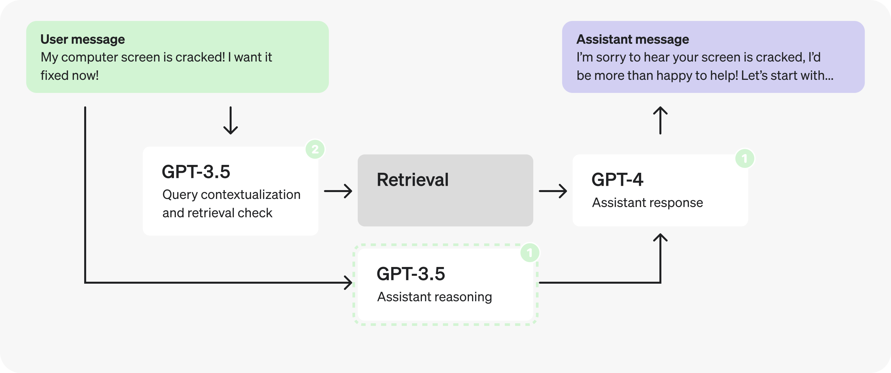

Algorithmic trading, often referred to as algo trading, leverages computer programs to execute financial transactions at speeds and frequencies impractical for human traders. This form of trading is characterized by its ability to process vast amounts of data and execute trades autonomously and efficiently. In this fast-paced domain, the optimization of execution latency is key to gaining a competitive edge.

Execution latency refers to the time delay between when a trading decision is made and when it is executed in the market. It is a critical metric in algorithmic trading as it directly impacts the ability to capitalize on transient trading opportunities. The financial markets operate at a high velocity, and even minimal delays can significantly affect the profitability of trades. Therefore, minimizing execution latency is essential for improving the chances of executing trades at the desired prices, thereby enhancing the overall performance of trading strategies.



This article explores the various facets of execution latency optimization and its critical role in algorithmic trading. It discusses the different components contributing to latency, such as network, hardware, and software delays, and examines the challenges involved in measuring latency accurately. Moreover, the article reviews the techniques available to minimize these delays and the impact such optimizations have on trading performance. Understanding and addressing execution latency can lead to more efficient trading systems capable of responding swiftly to market changes, providing a substantial advantage in highly competitive trading environments.

## Table of Contents

## Understanding Execution Latency

Execution latency is a crucial factor in algorithmic trading, significantly affecting the efficiency and success of trading strategies. This latency can be dissected into several core components: network, hardware, software, and market data latency, each contributing to the overall delay observed in trading systems.

Network latency refers to the time taken for data packets to travel between the trading system and the exchange. It is influenced by the physical distance between the server and the exchange and the speed of the data transmission medium. Optimizing this element requires the strategic placement of trading servers in close proximity to exchange data centers and utilizing high-speed network connections to minimize transmission delays.

Hardware latency is determined by the processing capacity of physical components such as Central Processing Units (CPUs), memory, and network interfaces. Faster processors and increased memory capacity enable quicker data processing and transaction handling, reducing time lags in executing trades. Employing state-of-the-art hardware is essential for minimizing this latency aspect.

Software latency is introduced by the algorithms and code structures employed in trading systems. Inefficient coding practices, such as complex algorithmic logic or suboptimal data processing techniques, can contribute to unnecessary delays. Streamlining code execution and optimizing algorithm efficiency are critical to minimizing software-related latency. For example, in Python, using efficient data structures and libraries like NumPy can considerably enhance computing speed.

Market data latency involves delays in receiving and processing market data, which can affect the timing and accuracy of trading decisions. Rapid access to real-time market data, through direct data feeds and optimally engineered data processing algorithms, is imperative to reduce this type of latency. Efficient information retrieval and processing mechanisms ensure that trading systems react swiftly to market changes.

Optimizing these components collectively results in reduced execution latency, which is paramount in high-frequency trading environments. The coordinated enhancement of network speed, hardware capability, software efficiency, and market data processing ensures a competitive edge by enabling timely and precise trade execution.

## The Importance of Low Latency in Algo Trading

Trading strategies such as high-frequency trading ([HFT](/wiki/high-frequency-trading-strategies)) rely on the rapid execution of trades to capitalize on minuscule price differences. These opportunities often last for mere milliseconds, making the time it takes to execute a trade, known as execution latency, a critical determinant of success. Reducing execution latency directly increases the likelihood of executing trades at desired prices, thereby maximizing profits in a highly competitive market environment.

In financial markets where numerous trading entities compete to exploit short-lived opportunities, speed often delineates success from failure. When execution latency is minimized, trading systems can react more swiftly to market changes. This rapid response capability reduces opportunity costs, as traders are less likely to miss favorable market conditions due to delays. Consequently, profit potential is enhanced as trades are more frequently executed at optimal price points.

Low-latency trading systems are crucial for responding timely to fluctuations in market conditions. These systems facilitate efficient trade executions by processing incoming market data and generating orders at high speed. In an environment where information and transactions flow at incredible velocities, minimizing the delay between decision making and order execution confers a significant competitive advantage.

In summary, the importance of low execution latency in [algorithmic trading](/wiki/algorithmic-trading) cannot be overstated. It is a key [factor](/wiki/factor-investing) enabling high-frequency traders to precisely execute strategies designed to exploit small price discrepancies. Traders focusing on reducing execution latency are positioned to maximize their execution efficiency, optimize trade outcomes, and capitalize on fleeting market opportunities.

## Key Strategies for Latency Optimization

Minimizing network latency is crucial for enhancing execution speed in algorithmic trading. One effective approach involves utilizing co-location facilities. These facilities are located close to exchange servers, significantly reducing the time it takes for data to travel between the trading system and the market. Furthermore, deploying high-speed networks, such as fiber-optic connections, ensures that data is transmitted with minimal delay, enhancing the overall execution speed.

Enhancing hardware is another pivotal strategy in latency reduction. High-performance CPUs capable of executing multiple instructions per clock cycle and processing large volumes of data swiftly are essential. Ample fast-access memory, such as static RAM (SRAM), can decrease latency by ensuring that data is readily available for processing. Optimized network interfaces, designed to process data packets rapidly, are equally important to ensure timely communication between hardware components and trading platforms.

Streamlining software presents opportunities for further optimization. Simplifying algorithmic logic can reduce the number of computational steps, decreasing the processing time required for each transaction. Moreover, optimizing data processing algorithms by employing efficient data structures and algorithms can expedite computations. For instance, Python code using libraries like NumPy or Pandas can be optimized to handle large datasets efficiently:

```python
import numpy as np

# Example of using NumPy for fast array computations
prices = np.array([100, 101, 102, 103, 104])
returns = np.diff(prices) / prices[:-1]
```

Efficient market data processing is vital to latency optimization. Subscribing to direct market data feeds, rather than going through intermediaries, ensures that traders receive information as quickly as it is available. Utilizing fast computation algorithms to process this data further reduces delay, enabling traders to react promptly to market changes. These methods collectively contribute to reducing execution latency, offering traders a competitive advantage in high-frequency trading environments.

## Advanced Techniques and Tools

In the competitive environment of algorithmic trading, advanced techniques and tools play a vital role in optimizing execution latency. One such technique, parallel processing, leverages multi-threading and distributed computing to enable concurrent task handling, thereby reducing latency. By distributing workloads across multiple processors or nodes, parallel processing enhances the execution speed of trading algorithms. This can be particularly beneficial when dealing with large volumes of data or complex computations that can be divided into independent tasks. Implementing parallel processing efficiently requires careful consideration of task synchronization and communication overhead among threads or distributed systems, often using frameworks like MPI (Message Passing Interface) or threading libraries in Python.

Order routing optimization focuses on directing trade orders through the most efficient paths to achieve swift execution. This involves refining algorithms that can dynamically assess various available execution venues, taking into account factors such as [liquidity](/wiki/liquidity-risk-premium), transaction costs, and latencies. The latency involved in different routing paths can be significantly reduced by bypassing less optimal venues. Advanced order routing systems may incorporate [machine learning](/wiki/machine-learning) techniques to predict market conditions and optimize decision-making processes, enhancing execution speed and accuracy.

Performance counters are critical in latency measurement and reduction. These are specialized tools integrated into systems to gather detailed performance data with minimal overhead. By providing insights into resource utilization and processing delays, performance counters aid in identifying bottlenecks and optimizing system components. For instance, in a Windows environment, the Performance Monitor tool can be used to track processor time, disk I/O, and network latency metrics. In Python, libraries like `psutil` can be used to programmatically access such information, facilitating automated monitoring and real-time adjustments.

Simulation programs serve as indispensable tools in algorithmic trading, allowing traders to model and evaluate the performance of algorithms under realistic market conditions. These simulations provide a testing ground where strategies can be refined without financial risk. By replicating order flows, price movements, and market [volatility](/wiki/volatility-trading-strategies), simulations help in understanding how different latency optimization techniques impact trading outcomes. Software platforms like MATLAB and Python's `[backtrader](/wiki/backtrader)` library offer robust environments for creating and running such simulations, allowing for comprehensive performance tuning of trading algorithms before live deployment.

Overall, the effective use of these advanced techniques and tools can lead to significant improvements in execution latency, offering traders a competitive edge in high-speed financial markets.

## Challenges and Considerations

Precise measurement of execution latency in algorithmic trading presents a notable challenge, primarily due to the need to maintain a delicate balance between achieving detailed measurement and minimizing system overhead. High-precision time-stamping and monitoring tools can introduce latency themselves, thereby complicating efforts to obtain accurate measurements without impacting system performance. Moreover, the significance of execution latency can vary considerably depending on the specific algorithmic trading strategy employed and the prevailing market conditions. High-frequency trading strategies, for instance, emphasize ultra-low latency to capitalize on fleeting [arbitrage](/wiki/arbitrage) opportunities, whereas other strategies might prioritize factors like market impact or liquidity over raw speed.

A holistic approach to latency optimization is essential for effective management. This involves not only minimizing delays through hardware, network, and software enhancements but also conducting detailed simulations and baseline evaluations. Simulations are critical for understanding how algorithms perform under various market conditions and for identifying potential latency bottlenecks. By establishing a performance baseline, traders can more easily quantify improvements and pinpoint areas requiring further optimization.

Continual adaptation and technological upgrade remain necessary to maintain a competitive advantage as markets evolve. As trading venues and technologies advance, so too must the infrastructure and strategies used by algorithmic traders. Regular updates to systems, including adopting cutting-edge network components, optimizing software, and leveraging advanced analytic tools, ensure that trading platforms remain at the forefront of efficiency. Embracing machine learning techniques to predict latency impacts or employing real-time optimization algorithms can further enhance the capability to adapt swiftly in the ever-changing landscape of financial markets.

In summary, the challenges of measuring execution latency and the considerations for its optimization necessitate a careful balance of technological innovation, strategic evaluation, and ongoing adjustment to maintain and enhance trading performance in dynamic market environments.

## Conclusion

Execution latency optimization in algorithmic trading is a critical strategy for achieving superior trading performance. By focusing on reducing latency, traders and institutions can significantly enhance their execution efficiency, allowing them to capitalize on brief market opportunities. The fast-paced nature of financial markets demands that participants embrace a nuanced blend of technology and strategy. This includes leveraging advanced hardware, optimizing software, and adopting efficient network infrastructures to minimize latency.

Traders who invest in low-latency systems are better equipped to react swiftly to market changes, enabling them to seize advantageous pricing and improve overall profitability. Despite the challenges associated with maintaining low latency, such as continuous monitoring and technological upgrades, the potential gains in execution performance make these efforts worthwhile.

As financial markets continue to evolve, the importance of innovation and investment in cutting-edge, low-latency trading systems cannot be overstated. The race to reduce execution latency will persist as a defining factor in a trader's competitive edge. Institutions that prioritize these investments will find themselves well-positioned to adapt to market advancements and secure long-term success.

## References & Further Reading

[1]: Aldridge, I. (2013). ["High-Frequency Trading: A Practical Guide to Algorithmic Strategies and Trading Systems"](https://www.wiley.com/en-us/High+Frequency+Trading%3A+A+Practical+Guide+to+Algorithmic+Strategies+and+Trading+Systems%2C+2nd+Edition-p-9781118343500). Wiley.

[2]: Kissell, R. (2014). ["The Science of Algorithmic Trading and Portfolio Management"](https://www.sciencedirect.com/book/9780124016897/the-science-of-algorithmic-trading-and-portfolio-management). Academic Press.

[3]: Johnson, B., & Van Vliet, C. M. (2020). ["Algorithmic Trading & DMA: An Introduction to Direct Access Trading Strategies"](https://www.semanticscholar.org/paper/Algorithmic-trading-%26-DMA-%3A-an-introduction-to-Johnson/aa5de1ab883d5e23b6651faa7c1807586d688e4b). 4Myeloma Press.

[4]: Rishi K. Narang (2009). ["Inside the Black Box: The Simple Truth About Quantitative Trading"](https://onlinelibrary.wiley.com/doi/book/10.1002/9781118267738). Wiley Finance.

[5]: "Miura, T. (2012). ["Ultra-Low Latency Trading"](https://github.com/moe0009/hft-trading-system). SB Creative."

[6]: Hasbrouck, J., & Saar, G. (2013). ["Low Latency Trading"](https://www.sciencedirect.com/science/article/abs/pii/S1386418113000165). Review of Financial Studies, 26(9), 2090-2134.

[7]: D. Bertsimas and A. W. Lo (1998). ["Optimal Control of Execution Costs"](http://web.mit.edu/dbertsim/www/papers/Finance/Optimal%20control%20of%20execution%20costs.pdf). Journal of Financial Markets, 1(1), 1-50.

[8]: Pullen, T. (2013). ["Trading Systems: A New Approach to System Development and Portfolio Optimisation"](https://www.amazon.com/Trading-Systems-2nd-development-optimisation/dp/085719755X). Harriman House.

[9]: "Lopez de Prado, M. (2018). ["Advances in Financial Machine Learning"](https://www.amazon.com/Advances-Financial-Machine-Learning-Marcos/dp/1119482089). Wiley."