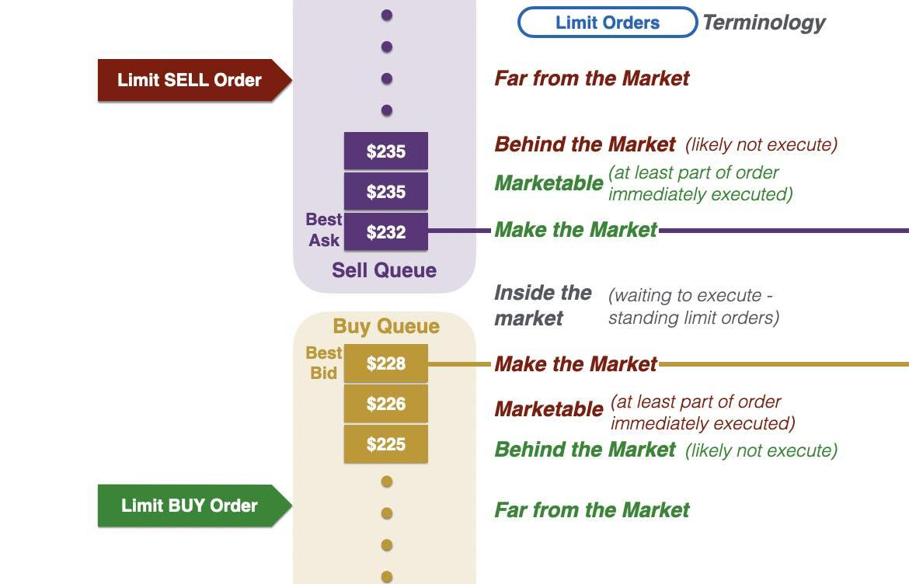

In the world of stock trading, different types of orders play a crucial role in maximizing profits and managing risks. Orders are instructions given by traders to brokers or trading platforms to buy or sell stocks with specific conditions. Among the various order types, two of the most popular are the buy limit order and the market order, each serving different purposes and strategies for traders.

A buy limit order is designed to purchase a stock at or below a specified price, providing traders with control over the price they are willing to pay. This type of order ensures that investors do not overpay for stocks, making it particularly useful in volatile markets where prices can fluctuate rapidly. On the other hand, a market order is executed immediately at the best available current price, prioritizing speed over price precision. This type of order is often used when quick execution is more important than the exact price.



The advent of algorithmic trading has transformed the way these orders are executed, enabling them to be carried out with greater precision and speed. Algorithmic trading involves using computer algorithms to execute trades based on predefined criteria, significantly reducing the need for constant human intervention. This technology provides a competitive edge in the marketplace by optimizing the timing and execution of trades.

This article explores the intricacies of stock trading order execution with an emphasis on buy limit orders and their integration into algorithmic trading strategies. Understanding these concepts is crucial for traders seeking to enhance their trading performance and achieve their investment goals.

## Table of Contents

## Understanding Stock Trading Order Execution

Stock trading order execution is a fundamental component of the financial markets, where the actualization of buying or selling securities occurs once predetermined criteria are satisfied. This process is crucial for ensuring that trades are carried out according to the investor's strategy and preferences. There are several types of order executions, including market orders, limit orders, and stop orders, each affecting the trade results distinctly.

Market orders are executed immediately at the best available price in the market. While this type of order prioritizes speed and ensures the order is filled promptly, it does not guarantee the execution price, which can result in slippage—a situation where there is a difference between the expected price of the trade and the price at which it is executed. 

Limit orders, in contrast, impose a price constraint on the execution. A buy limit order will only execute at the specified limit price or lower, while a sell limit order will execute at the limit price or higher. This control over the execution price helps investors prevent overpaying or underselling, particularly in volatile markets. However, the limitation of price increases the risk of the order remaining unfilled if the market price does not reach the specified level.

Stop orders are triggered only when a certain price condition is met. A buy stop order becomes a market order when the market price reaches the stop price, generally used to protect profits or limit losses in a declining market. Similarly, a sell stop order is used to trigger a sale when the market price falls to the stop price.

Effective order execution is vital for realizing strategic objectives in trading and minimizing slippage. Traders employ various strategies, and the choice of order type significantly influences outcomes. Implementing strategies successfully requires understanding how different order types interact with market conditions to maximize returns and minimize risks. This understanding allows traders to adjust their orders dynamically, thereby enhancing the efficiency of trade execution.

## What is a Buy Limit Order?

A buy limit order is a directive to purchase a security at or below a predefined price. This order type enables investors to specify the maximum amount they are willing to pay, thereby providing control over the transaction price and preventing overpricing during purchase. For example, if an investor sets a buy limit order for a stock at $50, the order will only be executed if the stock price falls to $50 or below. This mechanism can be particularly beneficial in volatile markets, where rapid price fluctuations are common, as it allows investors to manage risk effectively by ensuring purchases do not exceed a certain price threshold.

In comparison to market orders, which prioritize immediate execution at the prevailing market price, buy limit orders are contingent on price conditions being met. As a result, they offer a strategic tool for traders who aim to purchase shares at a lower price than the current market rate. However, traders should be aware of the potential downside that if the market price does not reach the specified limit, the buy limit order will remain unfulfilled. This characteristic underscores the importance of setting appropriate limit prices that balance desired pricing with the likelihood of execution in a dynamic market environment.

## Advantages and Disadvantages of Buy Limit Orders

Buy limit orders offer significant control over the execution price, allowing investors to set a maximum price they are willing to pay for a security. This precision in price control enables investors to manage their expectations and mitigate risks associated with overpaying, particularly in volatile markets. By setting a maximum purchase price, investors can ensure they do not exceed their budget or desired valuation for a security, which is crucial during periods of high market fluctuation when prices can swing dramatically.

Despite these advantages, buy limit orders come with certain drawbacks. The foremost risk is non-execution. A buy limit order will only be executed if the market price reaches or falls below the investor's specified limit price. If the market price remains above this threshold, the order will remain unfulfilled, potentially causing an investor to miss out on a profitable trade.

Moreover, buy limit orders can result in partial fills. This occurs when there is insufficient trading [volume](/wiki/volume-trading-strategy) at the specified limit price to fill the entire order. For example, if an investor places a buy limit order for 1,000 shares at a limit price of $10, but only 500 shares are available at that price, then only half of the order will be executed immediately. This can lead to inefficiencies, as the remaining shares may not be purchased, or they might need to be bought at a higher price if the market price increases.

Overall, while buy limit orders provide substantial control over trade execution prices, they also introduce the risk of non-execution and partial fills, necessitating careful consideration and strategic implementation by traders.

## How Buy Limit Orders Integrate with Algorithmic Trading

Algorithmic trading leverages computer algorithms to automate and optimize trading strategies, with buy limit orders being integral to this process. A buy limit order is programmed into the algorithm to trigger purchases at or below a specified price, allowing the algorithm to execute trades without direct human involvement. This automation enhances trading efficiency and precision, enabling traders to maintain a continuous market presence.

In strategies such as [market making](/wiki/market-making) and [arbitrage](/wiki/arbitrage), buy limit orders are essential. Market making involves placing buy limit orders to purchase securities at a lower price and selling them at a higher price, thereby profiting from the bid-ask spread. Here, buy limit orders ensure that purchases occur only when conditions are favorable, preserving the spread. Arbitrage strategies use buy limit orders to exploit price differences between markets or instruments, capitalizing on discrepancies swiftly.

A significant advantage of [algorithmic trading](/wiki/algorithmic-trading) is its capacity to dynamically adjust limit order prices. By continuously analyzing market data, algorithms can adapt the limit price in real-time to increase the likelihood of order execution. This adaptive capability is crucial in markets where conditions can rapidly change. For instance, using historical market data and [machine learning](/wiki/machine-learning) techniques, an algorithm can predict price trends and modify limit orders accordingly, optimizing trade execution.

The precision and adaptability offered by algorithmic trading make buy limit orders a powerful tool for traders looking to manage risk and enhance their trading strategies. By employing advanced algorithms, traders can efficiently navigate complex and volatile markets, maximizing their potential for profit while minimizing risks associated with market inefficiencies.

## Comparing Buy Limit Orders with Market Orders

Buy limit orders and market orders serve distinct functions in stock trading, offering traders options based on their strategic objectives and risk tolerance. A buy limit order is designed to secure a favorable price by executing only when the market price reaches or falls below a predetermined level. This precision allows traders to avoid overpaying, especially in volatile markets. However, the trade-off lies in the potential non-execution risk; if the market does not reach the specified limit price, the order remains unfilled. Consequently, traders must assess their willingness to risk missed opportunities in exchange for price certainty.

Conversely, market orders are centered around execution speed and are executed immediately at the best available current price. This approach ensures the completion of the trade but can lead to slippage, where the execution price deviates from the expected price. Slippage occurs frequently in fast-moving markets, where the time delay between order placement and execution can result in less favorable prices.

The choice between buy limit orders and market orders ultimately hinges on the trader’s strategy and current market conditions. For those prioritizing the certainty of execution, market orders may be more suitable, particularly when entering or exiting positions swiftly is crucial. Traders aiming to control costs and avoid negative price impacts may prefer buy limit orders, accepting the risk of non-execution for the benefit of precise pricing.

Both order types are essential tools in a trader’s arsenal, providing mechanisms to navigate the complexities of markets effectively. Evaluating factors like market [volatility](/wiki/volatility-trading-strategies), price trends, and individual trading objectives can aid in making informed decisions about which order type to employ.

## Practical Applications of Buy Limit Orders in Algorithmic Trading

In algorithmic trading, buy limit orders are employed to enhance various trading strategies by optimizing the price levels at which trades are executed. These orders facilitate strategies like market-making, [statistical arbitrage](/wiki/statistical-arbitrage), and [liquidity](/wiki/liquidity-risk-premium) provision, effectively leveraging market conditions to their advantage.

Market-making strategies utilize buy limit orders to generate profits from the bid-ask spread. By placing buy limit orders below the current market price and sell limit orders above it, algorithms can effectively buy low and sell high. This continuous adjustment allows market makers to provide liquidity to the market while capturing small price differentials. The high-frequency nature of market-making requires algorithms that can rapidly process trades and reassess their positioning in response to shifting market dynamics.

In statistical arbitrage, algorithms deploy buy limit orders to exploit price discrepancies between correlated securities or between different markets. By analyzing historical price data and calculating statistical measures such as mean reversion or co-integration, algorithms identify arbitrage opportunities. Buy limit orders are then strategically positioned to buy undervalued assets while simultaneously selling overvalued ones. The efficiency of this strategy relies on algorithms that can swiftly analyze large datasets and execute trades before the market corrects these discrepancies.

Liquidity provision strategies also benefit from using buy limit orders to manage inventory and reduce risk. Algorithms place buy limit orders to accumulate positions when prices dip, aiming to purchase assets at favorable prices without impacting market price. This approach helps maintain an optimal asset allocation and liquidity profile, allowing traders to respond effectively to future market movements. Balancing execution speed and price control is key to optimizing liquidity provision efforts.

To achieve efficient execution of buy limit orders, it's essential to employ advanced algorithms capable of analyzing vast amounts of market data in real time. Such algorithms must adapt to current market conditions, adjusting order parameters dynamically to maintain optimal positioning. Python, with its rich ecosystem of financial libraries, serves as a valuable tool for implementing these complex strategies. For example, using libraries such as NumPy and pandas for data manipulation, and packages like PyAlgoTrade or Zipline for [backtesting](/wiki/backtesting), traders can develop robust algorithmic frameworks that effectively integrate buy limit orders. 

Here's a simple example of implementing a buy limit order strategy using Python:

```python
import pandas as pd

# Load historical market data
data = pd.read_csv('market_data.csv')  # Assuming the data includes 'close' prices

# Calculate a simple moving average as a trigger for buy limit orders
data['SMA'] = data['close'].rolling(window=20).mean()

# Define buy limit order logic
def place_buy_limit_order(current_price, sma, limit_price):
    if current_price < sma and current_price >= limit_price:
        print(f"Placing buy limit order at {current_price}")
        return True
    return False

# Simulate trading strategy
limit_price = 100  # Set a hypothetical limit price
for index, row in data.iterrows():
    current_price = row['close']
    sma = row['SMA']
    place_buy_limit_order(current_price, sma, limit_price)
```

This example highlights how buy limit orders can be systematically implemented using algorithmic trading principles, helping traders maximize profitability through strategic market participation.

## Best Practices for Using Buy Limit Orders

When placing buy limit orders, it is crucial to understand the current market conditions to set realistic prices. Ideally, the limit price should be aligned with the anticipated market trends, taking into account technical analysis indicators and historical price patterns. Paying attention to indicators such as the Relative Strength Index (RSI) or Moving Average Convergence Divergence (MACD) can help traders decide on an appropriate limit price.

Regular backtesting and simulation form a foundational practice in validating limit order strategies under varying market conditions. By simulating trades over historical data, traders can assess how their buy limit orders would have performed, identifying both strengths and weaknesses in their strategies. For instance, using Python and libraries such as Backtrader or Zipline, traders can code and test strategies efficiently. Here is a basic example of how one might set up a backtesting environment in Python:

```python
import backtrader as bt

class BuyLimitStrategy(bt.Strategy):
    def __init__(self):
        self.sma = bt.indicators.SimpleMovingAverage(self.data.close, period=15)

    def next(self):
        if self.data.close < self.sma and not self.position:
            self.buy(price=self.data.close - 0.10, exectype=bt.Order.Limit)

cerebro = bt.Cerebro()
data = bt.feeds.YahooFinanceData(dataname='AAPL', fromdate=datetime(2020, 1, 1), todate=datetime(2021, 1, 1))
cerebro.adddata(data)
cerebro.addstrategy(BuyLimitStrategy)
cerebro.run()
```

Real-time monitoring is another crucial practice, allowing traders to adjust their buy limit orders promptly based on market movements. Given the volatile nature of the markets, the ability to respond to sudden changes in price or volume is essential for execution success. Traders may use advanced monitoring tools that provide alerts when market conditions reach certain thresholds, ensuring their strategies remain relevant and effective.

Incorporating robust risk management protocols safeguards against the risks of partial fills and missed opportunities. Traders should set stop-loss orders to limit potential losses if the market moves unfavorably. Additionally, considering factors such as liquidity and order volume can help mitigate the risk of partial fills. Ensuring that limit prices are realistic within the context of current market conditions will enhance the likelihood of complete order execution.

These best practices form the backbone of an effective strategy for using buy limit orders, offering traders a structured approach to maximize their advantages while mitigating risks.

## Conclusion

Buy limit orders are a powerful instrument for traders who prioritize price control and effective risk management. By specifying the maximum price they're willing to pay for a security, traders can avoid overpaying, particularly in volatile markets. When integrated with algorithmic trading systems, buy limit orders offer enhanced efficiency and precision. Algorithms can dynamically adjust order parameters and react to market conditions in real-time, reducing the need for human intervention and potentially improving execution probabilities.

Optimally setting and managing buy limit orders requires a thorough understanding of market dynamics and algorithm design. Traders must consider factors such as current liquidity, historical price levels, and expected volatility when determining their limit prices. Regular backtesting and simulation of limit order strategies under different scenarios can reveal insights into market behavior and help refine trading algorithms for better performance.

To remain competitive, traders need to continuously adapt their strategies. Markets are ever-evolving, with new data, trends, and technology shaping trading landscapes. As such, ongoing analysis and adjustment of buy limit order strategies are critical for maintaining their effectiveness. By doing so, traders can ensure they are capitalizing on opportunities while managing risks efficiently, ultimately leading to more favorable trading outcomes.

## References & Further Reading

[1]: Bergstra, J., Bardenet, R., Bengio, Y., & Kégl, B. (2011). ["Algorithms for Hyper-Parameter Optimization."](https://dl.acm.org/doi/10.5555/2986459.2986743) Advances in Neural Information Processing Systems 24.

[2]: ["Advances in Financial Machine Learning"](https://www.amazon.com/Advances-Financial-Machine-Learning-Marcos/dp/1119482089) by Marcos Lopez de Prado

[3]: ["Evidence-Based Technical Analysis: Applying the Scientific Method and Statistical Inference to Trading Signals"](https://www.amazon.com/Evidence-Based-Technical-Analysis-Scientific-Statistical/dp/0470008741) by David Aronson

[4]: ["Machine Learning for Algorithmic Trading"](https://github.com/stefan-jansen/machine-learning-for-trading) by Stefan Jansen

[5]: ["Quantitative Trading: How to Build Your Own Algorithmic Trading Business"](https://github.com/LucindaYa/quant-resources/blob/master/Quantitative%20Trading%20How%20to%20Build%20Your%20Own%20Algorithmic%20Trading%20Business.pdf) by Ernest P. Chan