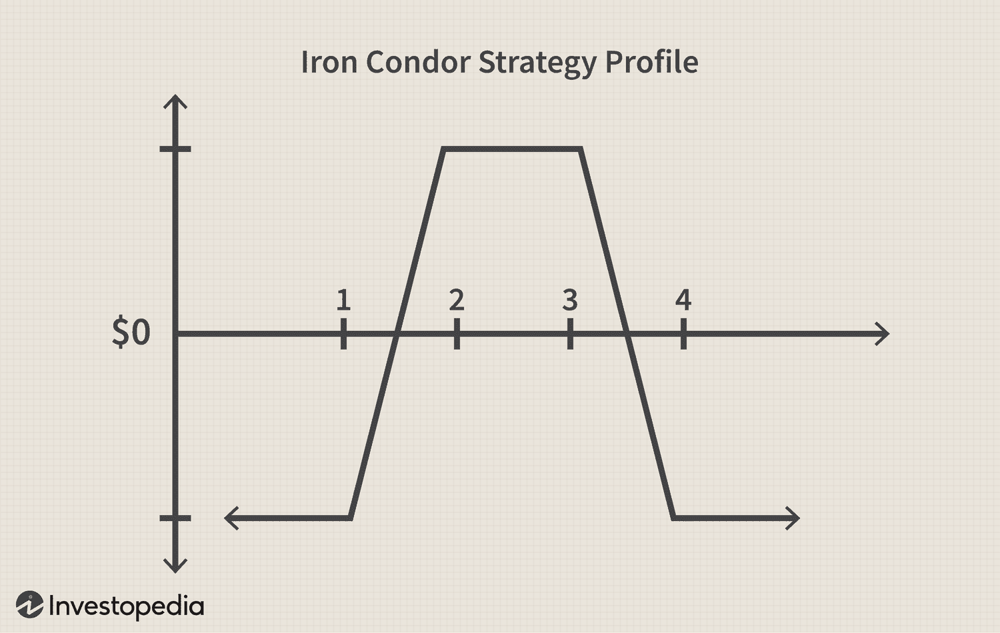

Options trading encompasses a myriad of strategies, among which the Iron Condor stands out for its unique approach to generating returns. This options strategy is traditionally employed by traders seeking to benefit from low market volatility. The Iron Condor involves a combination of selling and buying multiple options to establish a defined profit range, making it an appealing choice for traders with a neutral market outlook. By selling an out-of-the-money call spread and an out-of-the-money put spread, traders create a zone where they can achieve profitability as long as the market remains within the expected boundaries.

The Iron Condor's attractiveness lies in its ability to offer limited risk exposure. The potential losses are capped by the predefined distance between the strike prices, minus the net premium collected. This characteristic renders it a safer strategy compared to many other options trading approaches that can entail significant risk. Furthermore, it demands a strategic balance between risk and reward, allowing traders to tailor their positions to fit specific market movements and volatility levels.



In recent years, the integration of algorithmic trading has introduced new dimensions to options strategies like the Iron Condor. Algorithmic systems enhance the decision-making process by automating trades, optimizing entry and exit points to better capitalize on market conditions. Such systems not only accelerate the pace of trade execution but also improve precision, potentially increasing profitability while maintaining risk management standards.

This guide aims to explore the Iron Condor strategy in detail, its traditional applications, innovative enhancements through algorithmic trading, and strategies for effective risk management. By the end, readers will have a comprehensive understanding of the Iron Condor strategy and how to apply it effectively, blending traditional approaches with emerging technological advancements to optimize trading outcomes.

## Table of Contents

## What is an Iron Condor?

The Iron Condor is an options trading strategy designed to capitalize on low volatility in the financial markets. It is composed of four options contracts: two call options and two put options. These contracts have differing strike prices but share the same expiration date. This symmetrical setup creates a "condor"-like shape when graphed, hence the name.

To construct an Iron Condor, a trader simultaneously sets up a bull put spread and a bear call spread. Specifically, this involves selling a lower strike put and buying a further lower strike put while simultaneously selling a higher strike call and buying a further higher strike call. The net effect is a credit received from the premiums of the sold options, as the purchased options serve as insurance against unlimited losses. Here’s a typical setup:

1. **Sell a lower strike put (P1)**
2. **Buy a further lower strike put (P2)**
3. **Sell a higher strike call (C1)**
4. **Buy a further higher strike call (C2)**

This type of spread provides a defined range of profitability, known as the profit zone. The trader profits if the underlying asset's price remains between the middle strike prices (P1 and C1) at expiration. The strategy benefits from options contracts' time decay, as the goal is for the value of those sold options to diminish over time as they approach expiration, thus capturing the net premium.

One of the significant advantages of the Iron Condor strategy is its limited risk exposure. The maximum potential loss is restricted to the difference between the strike prices of either the puts or calls (whichever is narrower) minus the net premium collected. Mathematically, the maximum loss can be expressed as:

$$
\text{Max Loss} = (K_2 - K_1) - \text{Net Premium Collected}
$$

where $K_1$ and $K_2$ are the strike prices of the corresponding spread.

For traders, the limited risk and defined profit range make the Iron Condor an appealing strategy during periods of expected low [volatility](/wiki/volatility-trading-strategies). It requires minimal market movement for maximum profitability, and the symmetry of the setup offers balanced risk and reward dynamics, making it a staple strategy for income generation in a sideways market.

## Traditional Iron Condor Approach

The Iron Condor is a strategic options trading method that involves using a bear call spread and a bull put spread, established concurrently. This strategy is favored for its ability to capitalize on periods of low volatility by creating a range where profits can be realized if the underlying asset's price remains within specified boundaries.

In a typical Iron Condor setup, two call options and two put options are used. Specifically, a bear call spread is formed by selling a call option at a lower strike price and buying another call option at a higher strike price. Concurrently, a bull put spread is formed by selling a put option at a higher strike price and buying another put option at a lower strike price. All options share the same expiration date. This configuration results in four critical strike prices: two from the call spread and two from the put spread.

A key aspect of this approach is its simplicity, as both spreads are set simultaneously. This straightforward setup often makes it appealing to traders, especially those who may be newer to options trading strategies. However, the simplicity of the traditional Iron Condor approach can sometimes be a double-edged sword. By setting both spreads at the same time, traders might not collect an optimal credit. This is because the credit received is highly dependent on market conditions, such as volatility and price [momentum](/wiki/momentum), both of which can fluctuate unpredictably.

Volatility impacts the premiums collected from the option contracts: higher volatility generally increases option premiums, potentially allowing for a higher collected credit. However, if a trader does not adequately anticipate volatility shifts, the Iron Condor might be initiated under suboptimal conditions, limiting its profit potential. Similarly, market timing plays a crucial role. Ideally, traders seek to time their trades such that they enter the position when market conditions are most favorable for the strategy, such as during expected periods of stable price movements.

To enhance the traditional Iron Condor strategy, traders need to engage in detailed market analysis. This involves assessing historical price charts, volatility indexes, and other financial indicators to better forecast potential price movements and volatility shifts. By doing so, traders can make informed decisions about when to establish their spreads or adjust their strike prices to improve the credit received. Additionally, some traders opt to stagger the opening of the call and put spreads based on their market analysis rather than implementing both simultaneously.

Overall, while the traditional Iron Condor approach provides a structured method to capitalize on low volatility, its success largely hinges on the trader’s ability to predict and respond to market conditions effectively.

## Enhancements through Algorithmic Trading

Algorithmic trading significantly enhances the Iron Condor strategy by automating the decision-making process, ensuring swift reaction to market dynamics and optimizing trade execution. This automation plays a critical role in maximizing profits and minimizing losses by identifying optimal entry and [exit](/wiki/exit-strategy) points with greater precision. Algorithms can monitor a vast array of market parameters simultaneously and execute trades based on pre-determined criteria without the delays inherent in manual trading. This capability enhances the strategic aspect of the Iron Condor, where timely responses to market shifts can be crucial.

The integration of [backtesting](/wiki/backtesting) functions in algorithmic systems empowers traders to refine their Iron Condor strategies through rigorous historical data analysis. Backtesting involves simulating how a trading strategy would have performed in the past, which allows traders to adjust their approach to account for various market conditions. Python, widely used for implementing [algorithmic trading](/wiki/algorithmic-trading) strategies, offers libraries like Backtrader and Zipline that facilitate backtesting processes.

Consider a simple Python script leveraging Backtrader for backtesting an Iron Condor strategy:

```python
import backtrader as bt

class IronCondorStrategy(bt.Strategy):
    def __init__(self):
        # Define the parameters for the Iron Condor
        self.put_strike_lower = 95
        self.put_strike_upper = 100
        self.call_strike_lower = 105
        self.call_strike_upper = 110

    def next(self):
        # Implement the logic for entering and exiting Iron Condor positions
        if not self.position:
            if self.dataclose[0] < self.call_strike_lower:
                self.sell()  # Enter bear call spread
            elif self.dataclose[0] > self.put_strike_upper:
                self.buy()  # Enter bull put spread

# Create a cerebro entity
cerebro = bt.Cerebro()
cerebro.addstrategy(IronCondorStrategy)

# Add data and run backtest
data = bt.feeds.YahooFinanceData(dataname='SPY', fromdate=datetime(2020, 1, 1), todate=datetime(2023, 1, 1))
cerebro.adddata(data)
cerebro.run()
```

This code snippet offers a foundation for simulating an Iron Condor strategy. The algorithm is structured to dynamically enter appropriate positions based on current closing prices, illustrating how automation can manage a complex options strategy like the Iron Condor.

Moreover, algorithmic trading platforms can incorporate advanced techniques such as [machine learning](/wiki/machine-learning) to predict future price movements. By analyzing price patterns and other relevant market indicators, algorithms can adaptively tweak the Iron Condor strategy in real-time to accommodate shifting market conditions.

In summary, algorithmic trading elevates the capability of executing Iron Condor strategies by providing robust tools for efficient market analysis and trade management. This automation not only facilitates better decision-making but also significantly enhances the potential for greater profitability through precise and timely execution.

## Risk Management in Iron Condor

Effective risk management is crucial in options trading, particularly when deploying strategies like the Iron Condor. This strategy, while offering the advantage of limited risk due to its structure, still requires meticulous risk management practices to optimize results and safeguard against significant losses.

One fundamental aspect of risk management in Iron Condor trading is the use of stop-loss orders. These orders are essential in preventing excessive losses by automatically closing a position when the market moves unfavorably beyond a predetermined point. By setting appropriate stop-loss levels, traders can control their downside risk efficiently. For example, if the underlying asset's price approaches a strike price of one of the sold options, a stop-loss can limit losses by closing that position.

Scaling in and out of positions is another technique employed to manage risk in Iron Condor strategies. This approach involves gradually increasing (scaling in) or decreasing (scaling out) position size based on market conditions and risk exposure. By doing so, traders can maintain a balanced portfolio and adapt to market volatility, ensuring that position sizes align with current risk levels and trading goals.

Using index options rather than individual equity options can also result in more predictable outcomes due to the typically lower volatility and diversification inherent in index movements. Index options can mitigate the risk associated with single stock events, such as earnings announcements, which can cause abrupt price changes.

More sophisticated techniques for risk management include delta hedging and rolling spreads. Delta hedging involves adjusting the positions in options to neutralize delta, thereby reducing sensitivity to price changes in the underlying asset. This can be mathematically expressed as:

$$
\Delta = \frac{\partial V}{\partial S}
$$

where $V$ is the option's value and $S$ is the price of the underlying asset. By maintaining a net delta close to zero, traders hedge against unfavorable price movements, stabilizing the portfolio's value.

Rolling spreads is another advanced technique, involving the adjustment of options positions by closing existing positions and opening new ones with different strike prices or expiration dates. This is typically employed as a defensive strategy to extend the timeframe for a trade or adjust the position based on updated market assessments.

Incorporating these techniques into the Iron Condor strategy not only enhances risk management but also increases the robustness of the overall trading approach. By carefully planning and executing these measures, traders can better navigate market fluctuations and maintain stable returns.

## Automated Iron Condor Strategies: A Case Study

Automated Iron Condor strategies leverage the systematic nature of algorithmic trading to efficiently manage weekly options, exploiting their intrinsic properties for consistent returns. These strategies are designed to capitalize on the relatively short duration of weekly options, which allows them to align closely with predefined market conditions and forecast movements with more accuracy.

### Initiation of Trades

In creating an automated Iron Condor strategy, the first step involves setting precise triggers for trade execution. An algorithmic system analyzes historical volatility and implied volatility to establish the parameters within which it operates. Once these conditions are met, the system automatically initiates trades, comprising four options contracts: selling a bear call spread and a bull put spread.

#### Python Code Example

Below is a simplistic example that outlines the conceptual logic for initiating an Iron Condor strategy using Python:

```python
import numpy as np

def initiate_iron_condor(market_data, vol_threshold, expiry_date):
    # Calculate historical volatility
    historical_vol = np.std(market_data['returns']) * np.sqrt(252)

    # Check if market volatility is below a threshold
    if historical_vol < vol_threshold:
        # Determine strike prices based on volatility
        lower_strike_put = market_data['current_price'] * (1 - 0.05)
        upper_strike_call = market_data['current_price'] * (1 + 0.05)

        # Define the options to sell and buy
        iron_condor = {
            'sell_put': lower_strike_put,
            'buy_put': lower_strike_put - market_data['step'],
            'sell_call': upper_strike_call,
            'buy_call': upper_strike_call + market_data['step'],
            'expiry': expiry_date
        }

        return iron_condor
    else:
        return None
```

This code sets the foundation for a more sophisticated system, where market_volatility conditions are assessed against a `vol_threshold`, and trades are executed if conditions favor profitability.

### Operational Insights

The strength of such strategies lies in their capacity to handle numerous trades simultaneously, accommodate rapid market shifts, and adjust positions dynamically without human intervention. By constantly analyzing real-time data, the algorithm seeks opportunities where the price of the underlying asset is likely to remain within a certain bandwidth, thus optimizing the chance for a successful Iron Condor.

### Results and Outcomes

Performance analysis of the automated Iron Condor provides valuable insights into its efficacy. Historical backtesting reveals that the success rate of these strategies often depends on precise volatility forecasting and market neutrality over the trade's lifespan. For instance, by using backtested data, an algorithm might demonstrate a 70% probability of achieving profitable outcomes when historical volatility calculations and option pricing models are accurate.

### Real-World Application

For a real-world application, consider a trading system implemented within a brokerage that executes thousands of Iron Condor trades annually using weekly options. By optimizing the trade parameters based on algorithmically derived signals, the system can determine favorable conditions with accuracy.

Overall, utilizing automated Iron Condor strategies not only simplifies the trading process but also maximizes the predictability of profits, provided the underlying assumptions hold true throughout the trade lifecycle. This approach underscores the potential of combining traditional trading methods with advanced algorithmic systems for enhanced trading efficiency.

## Conclusion

The Iron Condor strategy presents considerable opportunities for traders who dedicate time to mastering its mechanics. As a defined-risk options trading strategy, it comprises both a credit spread and a debit spread, which work together to capture gains within a certain price range of the underlying asset. This strategy becomes particularly advantageous when the asset is expected to experience low volatility during the life of the options contracts.

The incorporation of algorithmic trading techniques further enhances the Iron Condor's profitability and efficiency. Algorithms can optimize entry and exit points by rapidly processing market data and responding to fluctuations faster than manual trading methods. This capability is especially beneficial in steadily volatile markets, where automated systems can adjust positions to maintain optimal profitability zones based on programmed conditions.

The integration of algorithmic systems allows for backtesting strategies using historical data, which refines the decision-making process. For example, by utilizing Python and libraries such as `pandas` or `numpy`, traders can simulate past market scenarios to identify potential improvements and reduce risk exposure. Below is a basic Python snippet demonstrating how backtesting might be set up:

```python
import pandas as pd

# Assume 'market_data' is a DataFrame containing historical price data
def backtest_iron_condor(market_data, strike_prices, premiums):
    profits = []
    for index, row in market_data.iterrows():
        # Determine the profit or loss for the given price data
        if strike_prices['lower_call'] <= row['price'] <= strike_prices['higher_call']:
            profit = premiums['credit_collected']
        elif strike_prices['lower_put'] <= row['price'] <= strike_prices['higher_put']:
            profit = premiums['credit_collected'] - (row['price'] - strike_prices['lower_put'])
        else:
            profit = premiums['credit_collected'] - (strike_prices['higher_put'] - row['price'])

        profits.append(profit)

    return pd.Series(profits).sum()

# Example usage:
# market_data = pd.read_csv('historical_prices.csv')
# strike_prices = {'lower_call': 95, 'higher_call': 105, 'lower_put': 85, 'higher_put': 95}
# premiums = {'credit_collected': 10}
# total_profit = backtest_iron_condor(market_data, strike_prices, premiums)
```

Traders are encouraged to merge traditional Iron Condor strategies with algorithmic advancements, thus optimizing trading outcomes and maximizing potential profits. By leveraging technological tools and developing a comprehensive understanding of risk management, traders can effectively employ the Iron Condor strategy to suit different market conditions, achieving more reliable and profitable results over time.

## References & Further Reading

[1]: Bergstra, J., Bardenet, R., Bengio, Y., & Kégl, B. (2011). ["Algorithms for Hyper-Parameter Optimization."](https://dl.acm.org/doi/10.5555/2986459.2986743) Advances in Neural Information Processing Systems 24.

[2]: ["Advances in Financial Machine Learning"](https://www.amazon.com/Advances-Financial-Machine-Learning-Marcos/dp/1119482089) by Marcos Lopez de Prado

[3]: ["Evidence-Based Technical Analysis: Applying the Scientific Method and Statistical Inference to Trading Signals"](https://www.amazon.com/Evidence-Based-Technical-Analysis-Scientific-Statistical/dp/0470008741) by David Aronson

[4]: ["Machine Learning for Algorithmic Trading"](https://github.com/stefan-jansen/machine-learning-for-trading) by Stefan Jansen

[5]: ["Quantitative Trading: How to Build Your Own Algorithmic Trading Business"](https://www.amazon.com/Quantitative-Trading-Build-Algorithmic-Business/dp/1119800064) by Ernest P. Chan