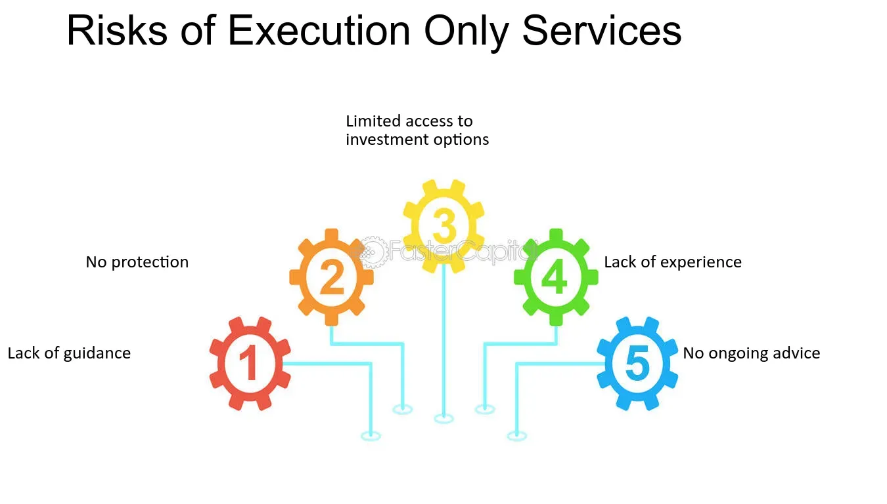

## Table of Contents

## What are execution-only services?

Execution-only services are a type of financial service where a company helps you buy or sell investments, like stocks or funds, but they don't give you any advice. You make all the decisions yourself about what to buy or sell and when to do it. The company just carries out your instructions quickly and at a low cost.

These services are good for people who know a lot about investing and want to manage their own money. They can save money because they don't pay for advice. But, they need to be careful because they don't get help from experts. If they make a mistake, it could cost them money.

## How do execution-only services differ from full-service brokers?

Execution-only services and full-service brokers are two different ways to help people with their investments. Execution-only services let you do everything yourself. You decide what to buy or sell, and the service just does what you tell them to do. They don't give you any advice or help you make decisions. This can be cheaper because you're not paying for someone's time and expertise.

On the other hand, full-service brokers do a lot more for you. They give you advice and help you make decisions about your investments. They might suggest what to buy or sell based on your goals and how much risk you're willing to take. This can be more expensive because you're paying for their knowledge and time, but it can be helpful if you're not sure what to do or if you want someone to manage your investments for you.

## What types of financial products can be traded using execution-only services?

Execution-only services let you trade many different types of financial products. You can buy and sell stocks, which are shares in a company. You can also trade bonds, which are like loans you give to a company or government that they pay back with interest. Another option is mutual funds, where your money is pooled with other people's money to invest in a mix of stocks, bonds, or other assets.

You can also use execution-only services to trade exchange-traded funds (ETFs), which are similar to mutual funds but trade like stocks on an exchange. If you're interested in commodities, you can trade things like gold, oil, or agricultural products. Lastly, you can deal in foreign exchange, buying and selling different currencies. These services give you the freedom to choose from a wide range of products, but you need to know what you're doing because you won't get any advice.

## What are the typical fees associated with execution-only services?

Execution-only services usually charge lower fees than full-service brokers because you're not paying for advice. The main fee you'll see is a trading commission, which is a small amount of money you pay each time you buy or sell something. This fee can be a flat rate, like a few dollars per trade, or it might be a percentage of the total amount you're trading. Some services might also charge a fee for keeping your money in the account, but this is less common.

Another type of fee you might come across is a platform fee, which is what you pay to use the service's website or app. This fee could be a monthly or yearly charge, but many execution-only services don't have this and let you use their platform for free. It's important to check all the fees before you start using an execution-only service, so you know exactly what you'll be paying.

## How can someone start using execution-only services?

To start using execution-only services, you first need to choose a provider. Look for companies that offer these services, like online brokers or trading platforms. You can compare them by checking their fees, the types of financial products they let you trade, and what their website or app is like. Once you pick a provider, you'll need to sign up for an account. This usually involves filling out an application form online, giving them some personal information, and maybe sending them copies of things like your ID or a utility bill to prove who you are.

After your account is set up and approved, you can start trading. You'll need to put some money into your account, which is called funding your account. You can usually do this by transferring money from your bank. Once the money is in your account, you can start buying and selling stocks, bonds, funds, or whatever else the service offers. Remember, you're on your own with execution-only services, so make sure you know what you're doing before you start trading.

## What are the risks involved in using execution-only services?

Using execution-only services means you're making all the investment choices yourself without any advice. This can be risky because if you don't know enough about investing, you might make bad choices. You could buy things at the wrong time or pick investments that don't match your goals or how much risk you can handle. If the market goes down, you could lose money, and there's no one to help you avoid these mistakes.

Another risk is that you might miss out on opportunities because you don't have expert advice. Professionals can spot trends or good investments that you might not see. Plus, if you don't keep up with the market all the time, you might not know when to buy or sell. Execution-only services can be cheaper, but the risks can be higher because you're on your own.

## What level of expertise is required to effectively use execution-only services?

To effectively use execution-only services, you need to have a good understanding of investing. This means knowing how to pick stocks, bonds, or other investments that fit your goals and how much risk you're okay with. You should also know how to read financial news and understand what's happening in the markets. If you don't have this knowledge, you might make choices that lose you money.

It's also important to be able to keep an eye on your investments and know when to buy or sell. Execution-only services don't give you any advice, so you need to be able to do all the research and decision-making yourself. If you're new to investing, it might be a good idea to learn more before you start using these services. Otherwise, you could miss out on good opportunities or make mistakes that cost you money.

## How do execution-only platforms ensure the security of transactions?

Execution-only platforms take several steps to keep your transactions safe. They use strong encryption to protect your information when you're buying or selling investments. This means that your personal details and money are kept private and safe from hackers. They also have strict rules about who can access your account, often using things like two-[factor](/wiki/factor-investing) authentication. This means you need more than just a password to get into your account, making it harder for someone else to get in.

Another way these platforms ensure security is by watching for anything strange in your account. If they see something that doesn't look right, like someone trying to log in from a new place or making big trades all of a sudden, they'll check it out. They might ask you to confirm it's really you or even stop the transaction until they're sure it's safe. This helps keep your money and investments safe from fraud.

## What are the technological requirements for using execution-only services?

To use execution-only services, you need a device that can connect to the internet, like a computer, tablet, or smartphone. The platform's website or app should work well on your device, so you might need to check if it supports your operating system, like Windows, macOS, iOS, or Android. A good internet connection is important too, because you need to be able to buy and sell quickly without delays.

You also need to make sure your device has enough space and memory to run the platform smoothly. Sometimes, you might need to download special software or an app to use the service, so your device should be able to handle that. Keeping your device and the platform's software up to date is a good idea, because updates can fix security problems and make things work better.

## How do regulatory bodies oversee execution-only services?

Regulatory bodies make sure execution-only services follow the rules. They check that these services are honest with customers and don't do anything wrong. They also make sure the services have good ways to keep customers' money and information safe. If a service does something it shouldn't, the regulatory body can give it a warning, make it pay a fine, or even stop it from working.

These bodies also keep an eye on the ads and information that execution-only services give out. They want to make sure the services don't trick people into thinking they're getting advice when they're not. By watching over these services, regulatory bodies help keep the market fair and safe for everyone who uses execution-only services.

## What advanced features do some execution-only platforms offer to experienced traders?

Some execution-only platforms offer advanced features that can help experienced traders make better decisions and trade more efficiently. One of these features is real-time market data, which lets traders see what's happening in the market right now. This can help them buy or sell at the best times. Another useful tool is advanced charting, where traders can look at detailed graphs of how prices have moved over time. This can help them spot trends and patterns that might not be easy to see otherwise.

These platforms might also offer things like customizable alerts, where traders can set up notifications for when certain prices or events happen. This way, they don't have to watch the market all the time but can still act quickly when something important happens. Some platforms also let traders use automated trading strategies, where they can set up rules for the computer to follow and trade for them. This can save time and help traders stick to their plans without letting emotions get in the way.

## How can performance of execution-only services be evaluated and compared?

To evaluate and compare the performance of execution-only services, you need to look at a few key things. First, check the fees. Some services charge a lot for each trade, while others might have lower fees but charge for other things like keeping your money in the account. You want to find a service that doesn't take too much of your money in fees. Next, see how easy it is to use the platform. A good service will have a website or app that's simple to navigate, so you can buy and sell quickly without getting confused.

Another important thing to consider is the range of financial products you can trade. Some platforms let you buy and sell lots of different things like stocks, bonds, and funds, while others might only offer a few options. If you want to trade many different types of investments, you'll need a service that supports that. Finally, look at the customer support. Even though execution-only services don't give advice, it's still good to have help if you run into problems. A service with good, quick customer support can make a big difference if something goes wrong.

## References & Further Reading

[1]: Bergstra, J., Bardenet, R., Bengio, Y., & Kégl, B. (2011). ["Algorithms for Hyper-Parameter Optimization."](https://papers.nips.cc/paper/4443-algorithms-for-hyper-parameter-optimization) Advances in Neural Information Processing Systems 24.

[2]: ["Advances in Financial Machine Learning"](https://www.amazon.com/Advances-Financial-Machine-Learning-Marcos/dp/1119482089) by Marcos Lopez de Prado

[3]: ["Evidence-Based Technical Analysis: Applying the Scientific Method and Statistical Inference to Trading Signals"](https://www.amazon.com/Evidence-Based-Technical-Analysis-Scientific-Statistical/dp/0470008741) by David Aronson

[4]: ["Machine Learning for Algorithmic Trading"](https://github.com/stefan-jansen/machine-learning-for-trading) by Stefan Jansen

[5]: ["Quantitative Trading: How to Build Your Own Algorithmic Trading Business"](https://www.amazon.com/Quantitative-Trading-Build-Algorithmic-Business/dp/1119800064) by Ernest P. Chan