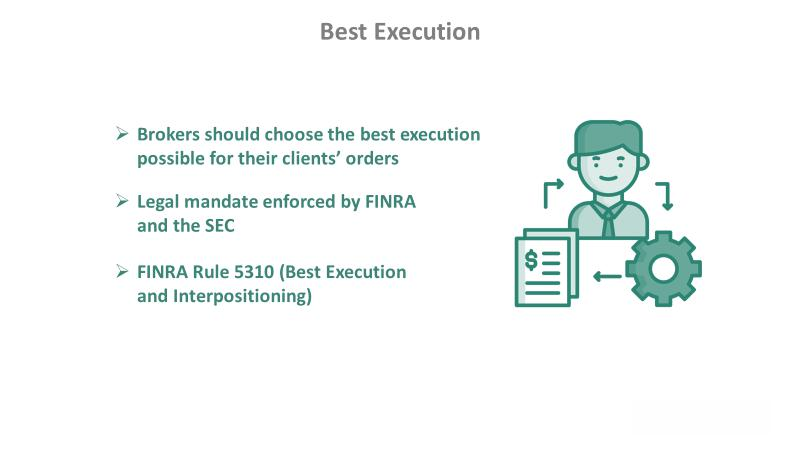

In the fast-paced world of financial markets, algorithmic trading has emerged as a groundbreaking advancement that fundamentally transforms how trading is conducted. Algorithmic trading, often referred to as algo-trading, leverages sophisticated computer algorithms to execute trades with precision and speed well beyond human capabilities. This article aims to provide a comprehensive overview of this dynamic field, focusing on its definition, execution, and strategies employed within it.

Algorithmic trading enhances market efficiency and reduces the emotional biases that often hinder human traders by automating decision-making processes. Utilizing algorithms can optimize trading strategies, ensuring they operate based on data-driven insights and predefined criteria. As a result, trades are executed at optimal prices, significantly diminishing the risks associated with human error and emotional decision-making.



The concept of high-frequency trading (HFT) has become particularly significant, making it possible to execute a large number of trades in mere fractions of a second. High-frequency trading has implications for market dynamics, providing liquidity but also contributing to volatility in certain scenarios. Understanding these implications is critical for anyone interested in the nuanced world of algorithmic trading.

Through a detailed exploration of these topics, we aim to elucidate the intricacies and benefits of algorithmic trading, offering insights into how it is reshaping the landscape of financial markets. As we examine the various facets of algorithmic trading, we will uncover how this technology-driven approach revolutionizes trading activities, offering traders a strategic edge in increasingly complex and competitive markets.

## Table of Contents

## What is Algorithmic Trading?

Algorithmic trading, commonly referred to as automated trading or algo-trading, involves the use of computer programs to execute trades based on predetermined criteria. These sophisticated algorithms are capable of executing trades at speeds and frequencies that surpass human capabilities, leveraging state-of-the-art technology to make rapid trading decisions. By operating autonomously, these systems aim to eliminate emotional biases that often affect human traders.

The algorithms used in algorithmic trading can process a multitude of variables to inform trading decisions. Such variables often include timing, price, historical trading data, and other relevant market indicators. For example, an algorithm may be instructed to buy a stock if its price exceeds its 50-day moving average while simultaneously considering its historical volatility and the current market conditions.

Algorithmic trading is predominantly utilized by institutional investors, hedge funds, and investment banks. These entities employ algorithmic strategies to enhance profitability and minimize transaction costs. By automating the trading process, they can capitalize on opportunities that emerge for only fleeting moments, thus gaining a competitive advantage in the financial markets.

The core mathematical concepts that form the basis of [algorithmic trading](/wiki/algorithmic-trading) include statistical models and optimization techniques. For instance, one common approach is mean-reversion, a strategy based on the assumption that the price of an asset will revert to its mean over time. This concept is expressed using the formula:

$$
P_t = \mu + \theta(P_{t-1} - \mu) + \varepsilon_t
$$

where $P_t$ represents the asset price at time $t$, $\mu$ is the long-term mean level, $\theta$ is a parameter dictating the speed of reversion, and $\varepsilon_t$ is a random error term.

Algorithmic trading has transformed the landscape of contemporary finance, providing a level of efficiency and precision unattainable by manual trading practices. By automating complex decision-making processes, algorithmic trading engineers a systematic approach that has become indispensable for major financial institutions engaged in dynamic market environments.

## How Algorithmic Trading Works

To implement algorithmic trading effectively, an individual must possess a robust understanding of both financial markets and programming skills. This dual expertise is essential as algorithmic trading involves creating computer programs that can execute trades autonomously based on predefined criteria. These algorithms analyze market conditions continuously, responding to changes with speed and precision that far surpass human capabilities.

A typical trading algorithm operates by continuously monitoring various market indicators and executing trades when specific conditions are satisfied. For example, a commonly used strategy might involve purchasing a stock when its moving average, a statistical measure used to smooth out price data, crosses above a certain threshold. This kind of decision can be represented mathematically:

$$
\text{Buy if } MA_{short-term} > MA_{long-term}
$$

Where $MA_{short-term}$ and $MA_{long-term}$ represent short-term and long-term moving averages, respectively. This type of computation is a small part of what an algorithmic trading system processes in real time.

The rapid execution of trades is a hallmark of algorithmic systems, significantly reducing the potential for human error or emotional bias that can occur in manual trading. This speed and diligence help in capturing favorable market conditions with precision, avoiding the hesitation or delays common in human decision-making processes.

Backtesting is another critical element of algorithmic trading. Before applying a strategy in live markets, traders can simulate its performance using historical data to assess its validity and refine it for optimal performance. This involves retroactively testing the trading algorithm against historical market data to evaluate how it would have performed under past conditions. This process enhances the reliability and effectiveness of the trading strategy before its implementation in real-world situations.

In Python, [backtesting](/wiki/backtesting) might involve libraries like Backtrader or Zipline, which can be utilized to simulate trading strategies. Here is a simple Python snippet demonstrating how such a backtesting setup might look:

```python
import backtrader as bt

class MovingAverageStrategy(bt.SignalStrategy):
    def __init__(self):
        self.short_ma = bt.indicators.SimpleMovingAverage(self.data.close, period=10)
        self.long_ma = bt.indicators.SimpleMovingAverage(self.data.close, period=30)
        self.signal_add(bt.SIGNAL_LONG, self.short_ma > self.long_ma)

# Create a `cerebro` instance to run backtesting
cerebro = bt.Cerebro()
cerebro.addstrategy(MovingAverageStrategy)

# Fetch historical data
data = bt.feeds.YahooFinanceData(dataname='AAPL', fromdate=datetime(2020, 1, 1),
                                 todate=datetime(2021, 1, 1))
cerebro.adddata(data)

# Run the strategy
cerebro.run()
```

This code sets up a simple moving average crossover strategy using the `Backtrader` framework. The strategy generates a buy signal when the short-term moving average crosses above the long-term moving average. By leveraging historical data, traders can observe the potential performance and make informed decisions about deploying the algorithm in live markets.

By minimizing human intervention and utilizing historical analysis, algorithmic trading systems offer a precise and systematic approach to participating in financial markets, accommodating large volumes and complex strategies with unparalleled efficiency.

## Execution in Algorithmic Trading

Execution is a critical component in algorithmic trading as it determines how orders are fulfilled in the financial market. It involves the application of various algorithms to handle different types of orders, including limit and market orders. The key to efficient execution lies in optimizing the selection of both price and timing for an order, thereby minimizing costs and maximizing trader gains.

Limit orders specify a maximum price to pay or a minimum price to receive, while market orders are executed immediately at the current market price. Algorithmic trading systems can employ strategies involving these order types by utilizing smart order routing, which analyzes market data to decide the best venue for execution, taking into account factors such as transaction costs, market impacts, and available [liquidity](/wiki/liquidity-risk-premium).

Efficient execution can be quantified by measures such as slippage, the difference between the expected price of a trade and the actual price, and market impact, which refers to the change in stock price caused by the order itself. To minimize slippage and market impact, algorithms might fragment large orders into smaller ones or use techniques such as VWAP (Volume-Weighted Average Price) execution, which aims to trade in line with market [volume](/wiki/volume-trading-strategy) to achieve an average price.

Brokers play a pivotal role in facilitating the execution process. They ensure orders are executed swiftly by either sending requests to exchanges or fulfilling them via their own inventory. This facilitation can involve crossing networks and dark pools to obtain the best price without unveiling large transactions to the public [order book](/wiki/order-book-trading-strategies), thereby preventing adverse market movements.

The successful execution of algorithmic trading strategies requires a thorough understanding of market microstructure and the deployment of sophisticated execution algorithms. These systems often incorporate real-time data feeds and complex statistical models to derive the optimal execution pathways, which might involve multiple venues and dynamic repositioning of orders. As a result, execution quality becomes a competitive differentiator among trading firms, with those employing advanced execution techniques often achieving significant cost savings and improved trade outcomes.

## Advantages of Algorithmic Trading

Algorithmic trading offers several significant advantages within financial markets, primarily encompassing speed, emotionless decision-making, strategy validation, and enhanced market liquidity.

A foremost advantage of algorithmic trading is its capacity for rapid execution. By deploying pre-programmed algorithms, trades can be placed at optimal prices, which significantly reduces slippage, a common risk in manual trading due to lag time between decision-making and execution. These algorithms analyze market conditions instantaneously and execute trades faster than a human trader could, enabling the exploitation of even minor market inefficiencies.

Furthermore, algorithmic trading minimizes the influence of human emotions, such as fear or greed, which can often lead to irrational trading decisions. By adhering strictly to predefined rules and criteria, algorithmic systems ensure that trades are conducted in a systematic manner. This objectivity helps in maintaining discipline in trading strategies, particularly during high [volatility](/wiki/volatility-trading-strategies) periods.

Backtesting is another advantage of algorithmic trading, allowing traders to test their algorithms against historical market data before live deployment. This process involves simulating the algorithm on past data to assess its performance, profitability, and risk exposure. By identifying potential pitfalls and optimizing strategies in a controlled environment, traders can enhance their algorithm's effectiveness and reliability.

Moreover, algorithmic trading contributes to market liquidity. By executing large-volume trades efficiently, these systems facilitate the smooth operation of financial markets. Without algorithmic trading, executing high-volume trades would require substantial time, potentially affecting market prices. Algorithms thus ensure that large orders are broken into smaller parts and executed incrementally, minimizing market impact and maintaining price stability. 

Collectively, these advantages demonstrate the transformative role of algorithmic trading in modern financial markets, underscoring its significance in achieving efficient and systematic trading operations.

## Disadvantages of Algorithmic Trading

Algorithmic trading, while advantageous in many respects, is not without its downsides. One significant drawback is its reliance on technology, which can lead to disruptions in trading activities due to technical glitches. These can arise from hardware malfunctions, software errors, or network connectivity problems, potentially leading to unexpected losses or missed trading opportunities.

High-frequency trading ([HFT](/wiki/high-frequency-trading-strategies)), a subset of algorithmic trading, is particularly prone to increasing market volatility. The rapid execution speed of these trades can contribute to sudden, large market movements known as flash crashes. Such events have been documented in several instances, notably the May 6, 2010, Flash Crash when major U.S. stock indices plummeted and rebounded within minutes. Flash crashes can undermine investor confidence and highlight the risks inherent in ultra-fast trading environments.

Another concern is latency, the delay between the initiation of a trade and its execution. Even minimal lag can affect trading outcomes, especially in high-frequency environments where small price changes can have significant impacts. Traders and firms must therefore invest in low-latency infrastructure, including direct market access and advanced networking solutions, to stay competitive—a costly investment that might not be feasible for all participants.

Moreover, the development and maintenance of algorithmic trading systems require considerable capital investment. Building sophisticated algorithms necessitates a blend of expertise in financial markets and advanced programming. Maintaining these systems involves continuous monitoring and upgrades to adapt to changing market conditions, which can be resource-intensive and costly. The combination of financial and technological resources required can be a substantial barrier to entry for smaller firms and individual traders. 

In conclusion, algorithmic trading, while offering distinct efficiencies, presents noteworthy disadvantages that require careful management to mitigate associated risks.

## Common Strategies in Algorithmic Trading

Algorithmic trading encompasses a variety of strategies that leverage computational tools to optimize trading outcomes. One prevalent approach is trend-following, which utilizes technical indicators such as moving averages and channel breakouts to guide trading decisions. This strategy is based on the assumption that asset prices tend to move in persistent directions and that these trends can be exploited for profit. For instance, a simple moving average crossover strategy involves buying an asset when a shorter-term moving average crosses above a longer-term moving average, signaling a potential upward trend.

Arbitrage strategies involve taking advantage of price differentials across different markets or instruments. In essence, when the same asset trades at different prices simultaneously, an arbitrageur can buy the asset at the lower price and sell it at the higher price, capturing the spread as profit. With the speed at which algorithmic trading operates, these discrepancies can be exploited efficiently before the market corrects itself.

The Volume-Weighted Average Price (VWAP) strategy is frequently employed by traders to ensure that transactions occur at prices close to the average price weighted by volume over a specific period. This method is particularly useful for executing large orders without significantly impacting the market price. It can be expressed by the formula:

$$
\text{VWAP} = \frac{\sum (P_i \times V_i)}{\sum V_i}
$$

where $P_i$ represents the price of the trade and $V_i$ the volume of trade $i$.

Index fund rebalancing is another strategy used to exploit temporary price movements caused by periodic adjustments to index portfolios. As index funds must rebalance their holdings to reflect the changes made in the underlying index, these transactions can create temporary supply and demand imbalances in the market. Algorithmic traders identify these events and take positions accordingly to benefit from the resultant short-term price changes.

These strategies, among others, illustrate the diverse methods used by algorithmic traders to maximize efficiency and exploit market opportunities. Each strategy involves rigorous quantitative analysis and the use of advanced technology to facilitate swift and systematic trading activities.

## Technological Requirements

A robust technical setup is pivotal for the efficient operation of algorithmic trading systems, ensuring that trades are executed swiftly and accurately. One of the primary components of this setup is a stable and high-speed network connection. This ensures that data is transmitted quickly between the trader's systems and market exchanges, minimizing latency—a critical [factor](/wiki/factor-investing) in executing trades at intended prices.

Access to real-time market data is essential, as algorithmic strategies rely on up-to-the-second information to make informed decisions. This data includes price quotes, trade volumes, and other vital market metrics. Providers such as Bloomberg, Reuters, and other financial data services can supply such data feeds, usually through subscription-based models. Traders might also need to parse and manage potentially large volumes of data efficiently, for which technologies like Apache Kafka or RabbitMQ could be employed to handle data streaming.

Reliable computing power is another crucial requirement. Advanced algorithms need significant processing capabilities to perform real-time analysis and execute trades without delay. This often necessitates the use of high-performance servers or cloud computing solutions capable of scaling resources according to demand. Cloud services such as Amazon AWS, Google Cloud Platform, and Microsoft Azure offer scalable computing power alongside data storage and analytics capabilities.

Programming skills play an indispensable role in developing and maintaining these trading systems. Languages like Python, C++, or Java are frequently used due to their robustness and performance in handling financial computations. Python, in particular, is favored for its extensive libraries and frameworks that support data analysis and [machine learning](/wiki/machine-learning), such as NumPy, pandas, and TensorFlow. A basic algorithmic strategy in Python might look like this:

```python
def moving_average_strategy(prices, short_window=40, long_window=100):
    signals = pd.DataFrame(index=prices.index)
    signals['signal'] = 0.0
    # Create short simple moving average
    signals['short_mavg'] = prices.rolling(window=short_window, min_periods=1, center=False).mean()
    # Create long simple moving average
    signals['long_mavg'] = prices.rolling(window=long_window, min_periods=1, center=False).mean()
    # Generate buy/sell signals
    signals['signal'][short_window:] = np.where(signals['short_mavg'][short_window:] > signals['long_mavg'][short_window:], 1.0, 0.0)
    signals['positions'] = signals['signal'].diff()
    return signals
```

In addition to programming, a thorough understanding of database management systems is crucial for maintaining historical data, which is necessary for backtesting algorithms. Backtesting involves simulating how a strategy would perform using historical data to refine and validate its effectiveness before live implementation. This can be achieved using platforms like QuantConnect or MetaTrader, which provide comprehensive environments for testing and deploying algorithmic strategies.

Understanding market behavior patterns and having access to historical data are indispensable for traders to anticipate market movements. This data is pivotal in constructing models that can predict trends and inform trading strategies. By leveraging tools such as SQL databases or big data solutions like Hadoop, traders can store and process vast repositories of historical market data effectively.

Efficiently combining these technological components and skills enables algorithmic traders to craft sophisticated strategies capable of navigating the complexities of financial markets.

## Conclusion

Algorithmic trading continues to evolve, maintaining its pivotal role in the landscape of modern financial markets. The implementation of sophisticated algorithms enables traders to execute orders with remarkable efficiency and precision, providing a substantial competitive advantage over traditional, manual trading methods. By eliminating human biases and emotions, algorithmic trading offers a systematic approach that reflects the objective analysis of market dynamics.

However, this technological advancement is not without its challenges. The dependence on technology introduces risks such as technical failures and system inefficiencies that can disrupt trading operations. Additionally, the fast-paced nature of algorithmic trading has been scrutinized for its potential to contribute to increased market volatility, as demonstrated in events like flash crashes.

Nonetheless, the advantages of leveraging technology in trading are significant. Algorithms are capable of processing a vast array of data and executing trades at speeds that are unachievable for human traders. This ability to rapidly analyze and react to market conditions enhances market liquidity and facilitates efficient price discovery, ultimately benefiting the broader financial system.

As market conditions and technologies continue to evolve, it is imperative for algorithmic trading strategies to adapt accordingly. The integration of emerging technologies such as [artificial intelligence](/wiki/ai-artificial-intelligence) and machine learning offers new avenues for innovation in developing even more adaptive and intelligent trading systems. Staying abreast of these developments, while continuously refining and backtesting strategies, will be crucial for market participants seeking to harness the full potential of algorithmic trading.

## References & Further Reading

[1]: Aldridge, I. (2013). ["High-Frequency Trading: A Practical Guide to Algorithmic Strategies and Trading Systems."](https://www.amazon.com/High-Frequency-Trading-Practical-Algorithmic-Strategies/dp/1118343506) Wiley.

[2]: Cartea, Á., Jaimungal, S., & Penalva, J. (2015). ["Algorithmic and High-Frequency Trading."](https://assets.cambridge.org/97811070/91146/frontmatter/9781107091146_frontmatter.pdf) Cambridge University Press.

[3]: Chan, E. (2009). ["Quantitative Trading: How to Build Your Own Algorithmic Trading Business."](https://github.com/ftvision/quant_trading_echan_book) Wiley.

[4]: Lopez de Prado, M. (2018). ["Advances in Financial Machine Learning."](https://www.amazon.com/Advances-Financial-Machine-Learning-Marcos/dp/1119482089) Wiley.

[5]: Narang, R. K. (2013). ["Inside the Black Box: A Simple Guide to Quantitative and High-Frequency Trading."](https://www.amazon.com/Inside-Black-Box-Quantitative-Frequency/dp/1118362411) Wiley.