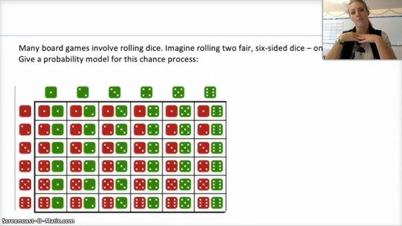

## Table of Contents

## What is an Execution Probability Model?

An Execution Probability Model is a tool used to predict how likely it is that a certain action or task will be completed successfully. It's like a guess, but based on data and past experiences. For example, if you want to know if a project will be finished on time, this model can help you figure out the chances of that happening.

These models are used in many fields, like business, healthcare, and technology. They use information from past events to make predictions about the future. By looking at things like how well people did on similar tasks before, or what problems came up, the model can give a good idea of what might happen next time. This helps people plan better and make smarter decisions.

## Why are Execution Probability Models important in trading and finance?

Execution Probability Models are very important in trading and finance because they help traders and investors make better decisions. In trading, these models can predict how likely it is that a trade will go through at a certain price. This is crucial because even small differences in price can lead to big wins or losses. By using these models, traders can plan their moves better and avoid making costly mistakes.

In finance, these models are used to predict how likely it is that a company will meet its financial goals or pay back its debts. This helps investors decide where to put their money. If a model shows a high chance of success, investors might feel more confident about investing in that company. On the other hand, if the model shows a low chance, they might look for safer options. Overall, these models help reduce uncertainty and improve decision-making in the fast-paced world of trading and finance.

## How do Execution Probability Models differ from other predictive models?

Execution Probability Models focus on predicting how likely it is that a specific action or task will be done successfully. They are different from other predictive models because they are all about the chance of something happening, not just what might happen. For example, other models might predict what the weather will be like tomorrow, but an Execution Probability Model would tell you how likely it is that you will actually go outside if it's sunny.

Other predictive models often look at bigger pictures or general trends. They might predict things like stock market trends or customer behavior over time. Execution Probability Models, on the other hand, zoom in on the success of a single action or event. They use past data to figure out the odds of success for that specific thing, helping people make decisions about whether to go ahead with a plan or not.

## What are the basic components of an Execution Probability Model?

An Execution Probability Model has a few key parts that make it work. First, it uses data from the past. This can be things like how well similar tasks were done before or what problems came up. The model looks at this history to guess what might happen next. It's like using old test scores to predict how you might do on a new test.

The second part is the math and formulas that the model uses. These help turn the past data into a prediction about the future. The model might use numbers to say how likely something is to happen, kind of like giving a percentage. This math part is what makes the model smart and able to give useful information.

## Can you explain the concept of market impact in the context of Execution Probability Models?

Market impact is how much a big trade can change the price of something you're buying or selling. In the world of Execution Probability Models, this is super important because these models try to guess how likely it is that you can buy or sell at the price you want. If your trade is big enough to move the market, it can make it harder to get the price you hoped for. So, the model needs to think about this when it's making its guesses.

For example, if you want to sell a lot of shares quickly, the price might go down because there are suddenly more shares for sale. An Execution Probability Model would look at how big your trade is and how it might affect the price. It uses this information to tell you how likely it is that you'll get the price you want. By thinking about market impact, the model helps traders plan their moves better and avoid surprises.

## What data sources are typically used to build Execution Probability Models?

To build Execution Probability Models, people often use data from past trades and market activities. This includes things like the prices at which trades happened, the size of those trades, and how quickly they were made. By looking at this information, the model can learn how the market has reacted to similar trades in the past. This helps it predict how likely it is that a new trade will go through at a certain price.

Another important source of data is information about the market's overall behavior. This can include things like how much the market moves around, how many people are buying and selling, and what big news or events are happening that might affect prices. By understanding these bigger patterns, the model can better guess how the market might react to a new trade. This makes its predictions more accurate and useful for traders trying to make smart decisions.

## How do you validate and test the accuracy of an Execution Probability Model?

To make sure an Execution Probability Model works well, you test it with data it hasn't seen before. This is called out-of-sample testing. You take some old data and pretend it's new, then see if the model can predict what happened correctly. If the model's guesses match up well with what actually happened, you know it's doing a good job. You might also compare its predictions to what other models or experts say to see if it's better or worse.

Another way to check the model is by using something called [backtesting](/wiki/backtesting). This is when you use the model on old data to see how it would have done if you had used it back then. You look at how well it would have predicted trades and market moves in the past. If the model would have made good guesses a lot of the time, you can feel more confident that it will work well in the future. Both out-of-sample testing and backtesting help you trust that your Execution Probability Model is accurate and useful.

## What are some common algorithms used in Execution Probability Models?

Execution Probability Models often use a few common algorithms to make their predictions. One popular algorithm is logistic regression. This is like a simple math formula that looks at past data and figures out the chances of something happening, like whether a trade will go through at a certain price. It's easy to understand and use, making it a good choice for many traders. Another common algorithm is decision trees. These are like flowcharts that help the model decide what might happen based on different conditions. They break down the problem into smaller pieces, making it easier to predict the outcome.

Another algorithm used in these models is random forests. This is a bit like having a team of decision trees working together. Each tree gives its own guess, and then they all vote to come up with the final prediction. This makes the model more accurate because it considers many different ways of looking at the data. Lastly, neural networks are also used sometimes. These are more complex and can learn from a lot of data to make very detailed predictions. They're like a super-smart brain that gets better at guessing over time.

## How do Execution Probability Models handle high-frequency trading scenarios?

In high-frequency trading, things happen super fast, and traders need quick and accurate predictions. Execution Probability Models help by figuring out how likely it is that a trade will go through at a certain price in just a few seconds. They use past data to make these guesses, looking at how the market moved before and how big trades affected prices. This is really important because in high-frequency trading, even tiny delays or wrong guesses can cost a lot of money. The models use special algorithms that can handle a lot of data quickly, like logistic regression or neural networks, to keep up with the fast pace.

These models also need to think about market impact, which is how a big trade can change prices. In high-frequency trading, this is a big deal because trades happen so often and so quickly. The models look at how past big trades moved the market and use that info to predict what might happen next. By doing this, they help traders decide the best times and prices to make their trades. This way, traders can make smart choices fast and avoid losing money because of sudden price changes.

## What are the challenges in implementing Execution Probability Models in real-time trading systems?

Implementing Execution Probability Models in real-time trading systems can be tricky because everything needs to happen super fast. In high-frequency trading, trades happen in milliseconds, so the model has to make predictions quickly. If it takes too long, the trade might already be done, and the prediction won't be useful anymore. The model also needs a lot of computing power to handle all the data coming in at once. This means the trading system needs strong computers and good internet to keep up with the speed of the market.

Another challenge is making sure the model stays accurate as the market changes. The market can be unpredictable, and what worked yesterday might not work today. So, the model needs to keep learning and updating itself with new data all the time. This is called real-time learning, and it's hard to do without slowing down the system. Plus, the model has to think about market impact, which is how a big trade can change prices. In fast trading, this can happen a lot, so the model needs to guess how its predictions might affect the market and adjust quickly.

## How can machine learning enhance the performance of Execution Probability Models?

Machine learning can make Execution Probability Models better by letting them learn from new data all the time. This means the models can get smarter and more accurate as they see more trades and market changes. For example, if a model sees that a certain type of trade often goes through at a specific price, it can use that info to make better guesses in the future. Machine learning also helps the models find patterns in the data that might be hard for people to see. This can make the predictions more reliable and useful for traders trying to make quick decisions.

Another way [machine learning](/wiki/machine-learning) helps is by making the models more flexible. They can change and adapt to new situations without needing a lot of work from people. This is really important in trading because the market can change fast. With machine learning, the models can keep up with these changes and still give good predictions. This makes them more useful in real-time trading systems where every second counts. By using machine learning, Execution Probability Models can become powerful tools that help traders make smarter choices and avoid big losses.

## What advanced techniques are used to optimize Execution Probability Models for specific market conditions?

To make Execution Probability Models work better in different market situations, people use special techniques like adaptive learning. This means the model keeps learning from new data as the market changes. For example, if the market gets more unpredictable, the model can adjust its predictions to be more cautious. Another technique is using ensemble methods, where several models work together to make better guesses. By combining the predictions of different models, the overall prediction can be more accurate and reliable. This is really helpful in markets where things can change quickly and unexpectedly.

Another advanced technique is using [reinforcement learning](/wiki/reinforcement-learning). This is like training the model to make better decisions over time by giving it feedback on its past guesses. If the model's prediction leads to a good trade, it learns to do more of that. If it leads to a bad trade, it learns to change its approach. This helps the model get better at predicting what will happen in specific market conditions. Also, techniques like feature engineering can be used to find the most important pieces of data that affect the market. By focusing on these key pieces, the model can make more accurate predictions for different market situations.

## References & Further Reading

[1]: Almgren, R., & Chriss, N. (2000). ["Optimal execution of portfolio transactions."](https://smallake.kr/wp-content/uploads/2016/03/optliq.pdf) Journal of Risk, 3(2), 5-39.

[2]: Bouchaud, J. P., Farmer, J. D., & Lillo, F. (2009). ["How markets slowly digest changes in supply and demand."](https://arxiv.org/abs/0809.0822) Handbook of financial markets: Dynamics and evolution.

[3]: Zhang, M. Y., & Moore, A. W. (2006). ["Order book modeling and reconstruction using machine learning."](https://www.semanticscholar.org/paper/The-paradigm-of-%22more-than-Moore%22-Zhang-Roosmalen/9b6865038e6fe6c967a8d813dc7bd011ce71ae85) In Proceedings of the 23rd International Conference on Machine Learning, 390-397.

[4]: Cartea, Á., Jaimungal, S., & Penalva, J. (2015). ["Algorithmic and High-Frequency Trading."](https://assets.cambridge.org/97811070/91146/frontmatter/9781107091146_frontmatter.pdf) Cambridge University Press.

[5]: Gould, M. D., Porter, M. A., Williams, S., McDonald, M., Fenn, D. J., & Howison, S. D. (2013). ["Limit order books."](https://arxiv.org/abs/1012.0349) Quantitative Finance, 13(11), 1709-1742.