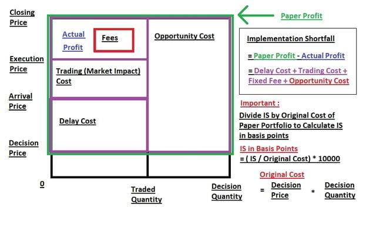

Execution shortfall in algorithmic trading is a crucial element that significantly impacts both the cost and efficiency of trading strategies. It represents the difference between the price at which a trading order is executed and the price at the time the trading decision was made. A lower execution shortfall indicates greater efficiency, which is a desirable goal for traders. This article intends to provide an in-depth understanding of execution shortfall, elucidating its importance in the context of algorithmic trading and offering insights into effective management techniques.

Understanding execution shortfall is vital for traders aiming to optimize their strategies and enhance performance. Several factors contribute to execution shortfall, including market volatility, order size, and latency in transmitting and processing orders. High market volatility can lead to larger discrepancies between bid and ask prices, widening the spread and increasing execution costs. Large order sizes might cause market impact, where executing a large volume influences the asset price, and latency issues can further exacerbate costs.

The discussion will encompass various techniques to minimize execution shortfall, such as employing advanced order types like limit orders, which help control execution prices. Breaking down large orders into smaller ones, aligning trade execution with favorable market conditions, and employing algorithmic trading systems designed for performance optimization are also effective strategies.

The significance of reducing execution shortfall lies in maximizing the profitability of algorithmic trading strategies. Ignoring this aspect can result in hidden trading costs that erode potential profits. In today's competitive trading environment, efficiently managing execution shortfall offers a notable advantage. Accurate shortfall measurement and continuous strategy refinement, supported by technology and data analytics, are essential for maintaining a competitive edge.

For both novice and experienced traders, mastering the intricacies of execution shortfall can lead to more robust and sustainable trading strategies. By emphasizing the effective management of execution shortfall, traders can enhance their overall trading performance and achieve long-term success.

## Table of Contents

## What is Execution Shortfall?

Execution shortfall is defined as the discrepancy between the price at which a trade order is actually executed and the price when the trading decision was made. This difference encompasses the cost incurred during trade execution and reflects the efficiency of the trading process. A smaller execution shortfall signifies a more efficient order execution, thereby reducing the hidden costs associated with trading. 

Measuring execution shortfall is instrumental in assessing the efficacy of trading strategies and systems. This metric provides clarity on the direct costs linked to trade execution, considering the influence of various market dynamics. Among the factors, [volatility](/wiki/volatility-trading-strategies) is a significant contributor; when markets are highly volatile, fluctuations in prices are more pronounced, potentially increasing the deviation between the expected and actual execution prices.

Order size is another critical [factor](/wiki/factor-investing) impacting execution shortfall. Large orders tend to [carry](/wiki/carry-trading) a higher risk of market impact, which can lead to slippage—where trades are executed at less favorable prices than anticipated. Slippage becomes more pronounced with larger orders due to their substantial influence on the market price.

Furthermore, prevailing market conditions play a crucial role in determining execution shortfall. Factors such as [liquidity](/wiki/liquidity-risk-premium), bid-ask spread, and [order book](/wiki/order-book-trading-strategies) depth can affect trading efficiency. Thinly traded securities or those with wide bid-ask spreads are more likely to experience greater execution shortfall, as trades executed under these conditions often diverge significantly from the decision price.

To effectively manage execution shortfall, it is vital for traders to measure and analyze its components accurately. This entails tracking the initial decision price, the execution price, and the associated market conditions at the time of trade. By incorporating this analysis into trading strategies, traders can enhance their decision-making processes and optimize performance.

## Factors Contributing to Execution Shortfall

Several factors contribute to execution shortfall in trading, each playing a significant role in affecting overall execution efficiency.

Market volatility is a primary factor influencing execution shortfall. Elevated volatility translates into more substantial differences between the bid and ask prices, leading to wider spreads. Wider spreads often result in increased costs when executing trades, as traders may either have to accept less favorable prices or wait longer for the desired price, risking the possibility of even less favorable market conditions. 

Order size also heavily impacts execution shortfall. Larger orders require more liquidity to fill, which can lead to noticeable market impact and slippage. Market impact refers to the change in price caused by placing a large trade, while slippage is the difference between the expected price of a trade and the actual price at which it is executed. When institutional investors trade large volumes, the market may respond with adverse price movements, thus increasing the execution shortfall.

Latency in order transmission and processing further contributes to execution shortfall, particularly in high-frequency trading environments. Latency refers to the delay between a trader's action, such as submitting an order, and the order's execution in the market. Such delays can prevent traders from capitalizing on transient market conditions, often leading to higher execution costs. In [algorithmic trading](/wiki/algorithmic-trading), minimizing latency is crucial to optimize execution efficiency. Techniques like colocating servers near exchange infrastructure can mitigate latency issues, but they require significant technological investments.

Effective management of these factors is essential to reduce execution shortfall. Traders can employ various strategies such as utilizing limit orders to control execution prices, breaking large orders into smaller ones to minimize market impact, and optimizing algorithms to function under favorable conditions. Continual analysis and adaptation of these strategies, alongside advancements in technology, provide traders with better control over execution costs and enhance overall trading performance.

## Techniques for Minimizing Execution Shortfall

Traders can employ a variety of techniques to minimize execution shortfall in algorithmic trading. One effective approach is to utilize advanced order types. For instance, limit orders allow traders to set a specific price at which they are willing to buy or sell an asset, thereby controlling execution prices and reducing the risk of trades being executed at less favorable prices. This contrasts with market orders, which are executed immediately at the current market price but can lead to higher execution costs, especially in volatile markets.

Another strategy is to break down large orders into smaller blocks, a method known as order slicing. This technique helps mitigate market impact, as executing large orders in a single transaction can move the market price against the trader. By executing smaller orders over time, traders can achieve more favorable average prices and minimize slippage.

Algorithmic trading systems can be optimized to execute trades at optimal times, based on real-time market data and conditions. These systems can be programmed to analyze market liquidity, volatility, and other factors to identify times when executing trades would incur the least cost. Leveraging historical data and predictive analytics, algorithms can adapt to changing market dynamics to further refine execution strategies.

Regular monitoring and adjustment of trading algorithms based on performance analytics is crucial in minimizing execution shortfall. By analyzing past performance data, traders can identify patterns or areas where execution costs were higher and make necessary adjustments to their algorithms. This process involves continuous learning and adaptation, ensuring that trading strategies are responsive to evolving market conditions and maintain efficiency.

In summary, by employing techniques such as advanced order types, order slicing, strategic timing, and ongoing performance assessment, traders can effectively minimize execution shortfall. These methods not only help control trading costs but also contribute to the overall success and profitability of algorithmic trading strategies.

## The Importance of Execution Shortfall in Algo Trading

Understanding and managing execution shortfall is crucial for maximizing the profitability of algorithmic trading strategies. Execution shortfall represents the cost incurred between the intended price at the time of a trading decision and the actual execution price. This metric is vital because any divergence from the decision price translates directly into reduced profits or increased costs.

Neglecting execution shortfall can lead to substantial hidden trading costs, undermining potential trade gains. Algorithmic trading strategies, if not finely tuned to account for execution shortfall, may experience slippages that gradually erode profit margins. This slippage often remains unnoticed until a comprehensive audit of trading costs is conducted, where execution shortfall is highlighted as a critical factor in diminished returns.

In a highly competitive trading environment, reducing execution shortfall can provide a significant edge. Traders who effectively manage this metric are likely to outperform competitors, primarily because every basis point saved on execution shortfall adds up across numerous transactions, leading to considerable improvement in overall performance.

Accurate measurement of execution shortfall can provide valuable feedback for refining trading strategies. By continually assessing the gap between expected and actual execution prices, traders can identify patterns or anomalies that suggest inefficiencies in their trading systems. This ongoing analysis allows for precise adjustments that enhance execution quality.

Leveraging technology and data analytics is essential in staying ahead in minimizing execution shortfall. Modern trading platforms equipped with sophisticated algorithms can analyze market data in real-time, making informed decisions to reduce execution-related costs. Technologies such as [machine learning](/wiki/machine-learning) can further refine these algorithms by predicting market movements and optimizing timing and pricing for order execution. 

In summary, to maintain a competitive advantage and ensure optimal trade profitability, traders must prioritize the management of execution shortfall within their algorithmic trading strategies.

## Conclusion

Effective management of execution shortfall is essential for successful algorithmic trading. Execution shortfall, which encompasses the disparity between the decision price and the execution price, can significantly impact the overall profitability of trading strategies. By fully understanding the various components that contribute to execution shortfall, traders can formulate better strategies to optimize trade execution. Key contributors such as market volatility, order size, and latency must be carefully considered to mitigate their effects.

Traders have access to several techniques to reduce execution costs and improve trading performance. From using advanced order types and strategically breaking down large orders to precise timing conditioned executions, these methodologies can effectively curtail execution shortfall. Furthermore, algorithmic trading systems equipped with capabilities for performance monitoring and adjustment based on analytics provide traders with tools to adapt their strategies to changing market conditions.

Continuous analysis and adaptation of trading strategies are necessary to ensure they remain effective under diverse market scenarios. Algorithmic traders should prioritize execution shortfall management as a critical factor for achieving sustainable long-term success. Leveraging data analytics and sophisticated trading algorithms allows traders to maintain a competitive edge, minimizing hidden costs and maximizing gains in a highly dynamic trading environment.

## References & Further Reading

[1]: Kissell, R. (2013). ["The Science of Algorithmic Trading and Portfolio Management."](https://www.sciencedirect.com/book/9780124016897/the-science-of-algorithmic-trading-and-portfolio-management) Academic Press.

[2]: Harris, L. (2003). ["Trading and Exchanges: Market Microstructure for Practitioners."](https://www.amazon.com/Trading-Exchanges-Market-Microstructure-Practitioners/dp/0195144708) Oxford University Press.

[3]: Hasbrouck, J. (2007). ["Empirical Market Microstructure: The Institutions, Economics, and Econometrics of Securities Trading."](https://academic.oup.com/book/52241) Oxford University Press.

[4]: Almgren, R., & Chriss, N. (2000). ["Optimal execution of portfolio transactions."](https://smallake.kr/wp-content/uploads/2016/03/optliq.pdf) Journal of Risk.

[5]: Bouchaud, J. P., Gefen, Y., Potters, M., & Wyart, M. (2004). ["Fluctuations and response in financial markets: the subtle nature of ‘random’ price changes."](https://arxiv.org/abs/cond-mat/0307332) Physica A: Statistical Mechanics and its Applications.

[6]: Low, R. K. Y., & McMillan, D. G. (2017). ["Volatility in financial markets: A review."](https://www.sciencedirect.com/science/article/pii/B9780128212851000245) Finance Research Letters. 

[7]: Taleb, N. N. (2007). ["The Black Swan: The Impact of the Highly Improbable."](https://en.wikipedia.org/wiki/The_Black_Swan:_The_Impact_of_the_Highly_Improbable) Random House.

[8]: Hendershott, T., Jones, C. M., & Menkveld, A. J. (2011). ["Does Algorithmic Trading Improve Liquidity?"](https://onlinelibrary.wiley.com/doi/full/10.1111/j.1540-6261.2010.01624.x) The Review of Financial Studies.

[9]: Cont, R., & Kukanov, A. (2017). ["Optimal order placement in limit order markets."](https://arxiv.org/pdf/1210.1625) Journal of Financial Markets.