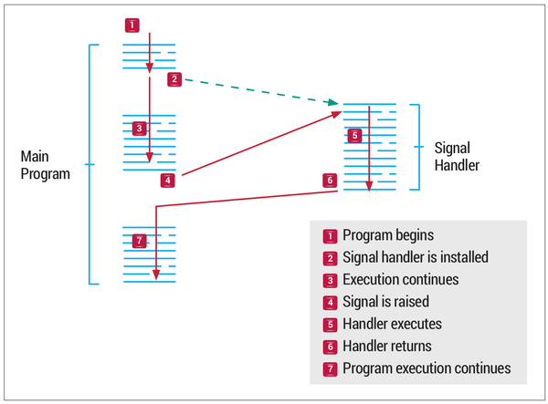

Algorithmic trading has transformed financial markets by automating the execution of trades using pre-defined algorithms. Central to this transformation is the execution signal, which dictates the timing and manner of trade execution. Execution in algorithmic trading refers to the completion of buy or sell orders efficiently, aiming to maximize the benefits of trading strategies while minimizing costs and risks.

Advancements in technology have significantly impacted algorithmic trading, influencing market dynamics and necessitating a deeper understanding of execution signals for traders aiming to refine their strategies. Efficient execution is a cornerstone of algorithmic trading, ensuring that trades are carried out at optimal prices with reduced latency and transaction costs. This article intends to explore critical aspects of execution signals in algorithmic trading, including various order types and execution algorithms, and how they contribute to strategic trade management.



A comprehensive understanding of execution methods is critical for assessing their impact on trading outcomes. This article will provide insights into different types of trading orders, such as market, limit, and stop orders, and execution algorithms like VWAP and TWAP, which play a crucial role in trade optimization. Additionally, the article will cover factors that influence trade execution, such as market liquidity, volatility, and order size. Regulatory considerations are also integral to ensuring fair market practices, and this article will address the importance of compliance in executing algorithmic trades. Understanding these elements is essential for traders seeking to enhance their trading performance in increasingly complex financial markets.

## Table of Contents

## Understanding Execution in Algorithmic Trading

Execution in algorithmic trading is the process of finalizing trade orders based on pre-established strategies. This encompasses the placement, cancellation, and adjustment of orders to optimize trade outcomes. The primary objective is to execute trades at the most advantageous prices while minimizing delays and transaction costs.

In algorithmic trading, effective execution is a key determinant of a trading strategy's success. It requires intricate mechanisms to ensure orders are processed efficiently and economically. Different types of orders, such as market, limit, and stop orders, are fundamental to execution. Each order type presents distinct levels of risk, speed, and price certainty, affecting overall trade execution.

The intricacies of execution are influenced by various factors including the trading algorithms deployed and prevailing market conditions. Trading algorithms are designed to optimize the execution process by analyzing market data and adjusting strategies in real-time. For instance, an algorithm might execute a large order by breaking it into smaller parts to minimize market impact and price slippage—a strategy known as slicing.

Market conditions significantly affect execution. High [volatility](/wiki/volatility-trading-strategies) may cause price fluctuations, leading to slippage, where the executed price deviates from the expected price. Conversely, high [liquidity](/wiki/liquidity-risk-premium) can facilitate better execution by allowing easier entry and [exit](/wiki/exit-strategy) from market positions.

Execution mechanisms integrate these components to enhance the efficiency and profitability of trading strategies. They ensure that trades align with strategic goals, such as achieving the best possible price or reducing transaction costs. By utilizing sophisticated algorithms and adapting to dynamic market environments, traders aim to refine execution techniques continually, maintaining their competitive advantage in rapidly evolving financial markets.

## Types of Orders in Execution Signals

Understanding the types of orders is essential in executing trades efficiently, as each type offers distinct advantages and trade-offs in terms of risk, execution speed, and price certainty.

- **Market Orders**: These orders are designed for immediate execution at the current market prices, emphasizing speed over price certainty. When a trader places a market order, they accept the risk of price slippage, which can result in a different execution price than expected, especially in volatile markets. The upside is that the order is filled quickly, ensuring entry or exit from a position without delay.

- **Limit Orders**: Limit orders enable traders to specify a price threshold at which an order should be executed, affording them greater control over trade prices. Such orders guarantee the execution price will not surpass the set limit, providing price protection. However, they do not guarantee the completion of the trade if the market does not reach the specified price. This order type is beneficial when traders can afford to wait for the optimal price.

- **Stop Orders**: These orders transform into market orders when a predetermined price is hit, commonly utilized to curtail losses or secure profits. A stop order remains dormant until the market reaches the stop price, at which point it is activated and executed at the market price. This mechanism is particularly effective for managing risk, as it automates the decision to sell or buy based on price movements.

- **Stop-Limit Orders**: Serving as a hybrid of stop and limit orders, stop-limit orders initiate a limit order once the stop price is reached. This combination permits traders to convert the stop order into an order that will only execute at the predetermined limit price or better, thus combining the benefits of both order types. The trade-off with stop-limit orders is that while they offer price control after being triggered, there is no guarantee of execution if the price moves away from the limit threshold.

Incorporating these different order types into a trading strategy can address specific market conditions and trader objectives. The choice between these orders depends on the trader’s priorities, whether it be speed, certainty of execution, or price control. Each order type provides a toolset for customizing trade execution to align with strategic goals in varying market environments.

## Execution Algorithms and Their Role

Execution algorithms are essential components in the landscape of [algorithmic trading](/wiki/algorithmic-trading), serving to enhance the efficiency and effectiveness of trade executions. These algorithms are designed to optimize trade outcomes by focusing on key aspects such as price, execution speed, and minimizing market impact. They achieve this by employing sophisticated strategies tailored to navigate complex market environments.

Volume-Weighted Average Price (VWAP) is one such algorithmic strategy, designed to execute trades in a way that aligns with the trading [volume](/wiki/volume-trading-strategy) observed in the market. The primary goal of VWAP is to minimize the price impact of large trades by spreading the execution over the [course](/wiki/best-algorithmic-trading-courses) of a trading day. By calculating the ratio of the total value traded to the total volume traded, the VWAP algorithm attempts to match or improve upon this average price, making it a popular choice for institutional traders looking to execute large block trades without significantly affecting market prices.

Time-Weighted Average Price (TWAP) is another strategy that breaks down large orders into smaller, evenly distributed trades over a specified period. This method reduces the trader's exposure to short-term market fluctuations and is particularly effective in less liquid markets. By distributing trades in this manner, TWAP minimizes the risk of sudden price movements and provides a more consistent execution price in volatile conditions.

Implementation Shortfall (IS) is an execution strategy focused on reducing the cost difference between the decision price, which is the anticipated buy or sell price at the time of order placement, and the actual execution price. This method aims to minimize execution costs by balancing the trade-off between market impact and opportunity cost. Implementation shortfall is particularly useful for active trading strategies where timing and cost efficiency are critical to maximizing returns.

Sniper Algorithms are utilized in high-frequency trading environments to conceal trading intentions and execute trades with minimal detection by other market participants. These algorithms are designed to be stealthy and nimble, allowing traders to capitalize on momentary pricing inefficiencies without alerting the market to their presence. This is achieved by executing trades quickly and discreetly, often employing techniques like hidden orders and fragmentation across multiple trading venues.

The strategic application of these execution algorithms enables traders to achieve their trading objectives effectively while mitigating undesirable effects such as price impact and latency. As markets continue to evolve, the development and refinement of execution algorithms remain essential in maintaining competitive advantages in the fast-paced world of algorithmic trading.

## Factors Influencing Execution

In algorithmic trading, several factors substantially influence the efficiency and effectiveness of trade execution. These elements are pivotal in determining how well orders are fulfilled, impacting both the cost and speed of transactions.

Market Liquidity is one of the primary factors affecting trade execution. High liquidity in a market typically ensures better execution since it allows traders to enter and exit positions more efficiently. Liquid markets offer a plethora of buy and sell orders at various prices, reducing the likelihood of significant price changes when large trades are conducted. The bid-ask spread, a critical indicator of market liquidity, tends to be narrower in highly liquid markets, facilitating more cost-effective and timely executions.

Market Volatility is another crucial [factor](/wiki/factor-investing), as it can lead to price slippage. Volatile markets tend to experience rapid and unpredictable price changes, which can cause the execution price to differ from the expected price at the time of order placement. This phenomenon of slippage can adversely affect the quality of execution, as it increases the cost of trades. Algorithmic strategies often include mechanisms to adjust for or mitigate the risks associated with volatility.

Order Size also profoundly affects execution outcomes. Larger orders, by their nature, can move the market, impacting the price level due to their significant demand or supply. This is particularly problematic in less liquid markets, where the introduction of a large order can lead to price disruptions. To manage this risk, traders may employ advanced execution strategies, such as slicing large orders into smaller increments to be executed over time or across different venues.

Trading Venues play a significant role in execution efficiency. Different venues offer varying levels of liquidity, transaction costs, and execution speeds. The fragmentation of markets across multiple venues can be both an advantage and a challenge. Smart Order Routing (SOR) techniques are often utilized to identify the best venues for executing trades, optimizing cost and speed. Traders consider factors such as venue-specific fees, historical execution quality, and latency in their venue selection processes.

Together, these factors necessitate a sophisticated approach to algorithmic trading to ensure optimal execution. By continuously analyzing liquidity conditions, adjusting for volatility, managing order sizes, and intelligently choosing trading venues, algorithmic traders can improve their execution strategies and ultimately enhance their trading performance.

## Execution Metrics to Evaluate Performance

Assessing the quality of trade execution is crucial in determining the effectiveness and efficiency of algorithmic trading strategies. Several key metrics are used to evaluate execution performance:

1. **Fill Rate**: This metric indicates the percentage of an order that is successfully executed. A high fill rate reflects greater execution efficiency, as it means that the majority of the intended trade volume has been completed. For traders, a high fill rate is often desirable as it reduces the risk of partial completions, which can delay strategy implementation and potentially introduce additional costs.

2. **Slippage**: Slippage measures the difference between the expected price at which a trade was intended to be executed and the actual price at which it was completed. Minimizing slippage is essential for maintaining strategy integrity and profitability. Slippage can occur due to rapid market movements or insufficient liquidity. It's often calculated as:
$$
   \text{Slippage} = \left( \frac{\text{Executed Price} - \text{Expected Price}}{\text{Expected Price}} \right) \times 100\%

$$

3. **Latency**: Latency refers to the time delay between the moment an order is placed and when it is executed. In high-frequency trading environments, low latency is critical, as even microsecond delays can affect the execution price and the profitability of trades. Reducing latency can involve optimizing algorithm processes and leveraging proximity hosting in server environments close to trading venues.

4. **Market Impact**: This metric evaluates how a trade influences the market price of a security. Large orders can move prices unfavorably, leading to what is known as adverse market impact. Traders aim to minimize their market impact to avoid additional costs and to execute trades at desired prices. Market impact can be challenging to quantify strictly, but mathematical models and simulations are often used to estimate its scope.

By employing a combination of these metrics, traders can gain insights into the effectiveness of their execution strategies and make informed decisions to optimize their trading approaches. Enhanced performance measurement tools and data analysis techniques, such as [machine learning](/wiki/machine-learning), are increasingly being utilized to refine these assessments and adapt to changing market conditions dynamically.

## Advanced Execution Techniques

Modern algorithmic trading employs a variety of advanced execution techniques designed to optimize trade outcomes in terms of efficiency, cost, and market impact. Here, we explore three significant methods: Smart Order Routing, Dark Pools, and the use of Machine Learning and AI.

Smart Order Routing (SOR) plays a critical role in ensuring that trades are directed to venues offering the best possible conditions, such as optimal price, sufficient liquidity, or minimal fees. SOR systems utilize algorithmic rules and real-time data from multiple trading venues to determine the best paths for order fulfillment. By assessing factors like price movements, transaction costs, and execution probability, SOR enhances the likelihood of achieving favorable trade conditions. These systems may use algorithms to break down a large order into smaller parts split across multiple venues, thereby reducing market impact and minimizing transaction costs.

Dark Pools are alternative trading systems where large blocks of shares can be traded anonymously. These venues provide institutional traders and high-net-worth individuals with opportunities to execute substantial orders without revealing their positions to the market. By maintaining anonymity, dark pools help in minimizing the market impact of significant trades, which is crucial for preserving execution prices. They achieve this by executing the trade away from the public eye, thus preventing market participants from adjusting prices based on their knowledge of impending large trades.

The incorporation of Machine Learning and AI into algorithmic trading introduces powerful capabilities for analyzing vast datasets to refine execution strategies. These technologies are utilized to model and predict market behavior, identify patterns, and execute trades based on a sophisticated understanding of market dynamics. Through continual learning and adaptation, machine learning algorithms improve decision-making processes by optimizing key parameters, such as timing, pricing, and order execution methods. This adaptive capacity is particularly valuable in fast-moving, volatile markets where traditional models may fall short.

In Python, one could leverage machine learning libraries such as scikit-learn or TensorFlow to analyze market data and develop predictive models. For instance, a simple approach might involve using historical price data to train a machine learning model that predicts short-term price movements, which can then inform execution strategies. Consider the use of a decision tree regressor to model price direction:

```python
from sklearn.tree import DecisionTreeRegressor
import numpy as np

# Example dataset: features are historical price changes, target is future price change
X_train = np.array([[0.01, -0.02, 0.005], [0.02, 0.01, -0.015], [-0.005, 0.02, 0.01]])
y_train = np.array([0.015, -0.01, 0.02])

# Train the model
model = DecisionTreeRegressor()
model.fit(X_train, y_train)

# Predict future price change
X_test = np.array([[0.01, 0.005, -0.01]])
predicted_price_change = model.predict(X_test)
```

Overall, these advanced execution techniques are invaluable in enhancing the reliability and efficiency of trade executions, particularly in the complex and rapidly changing landscape of modern financial markets. As technology continues to evolve, these methods are expected to become increasingly sophisticated and integral to successful trading strategies.

## Regulatory Considerations and Compliance

Execution in algorithmic trading adheres to comprehensive regulatory frameworks designed to uphold market integrity and fairness. These frameworks ensure that trading activities are performed in a manner that is equitable, transparent, and efficient, benefiting all market participants.

### Best Execution Requirements

The principle of best execution is a cornerstone of regulatory compliance in algorithmic trading. It mandates that financial institutions strive to achieve the most favorable terms for their clients when executing orders. This involves a careful consideration of multiple factors, including price, costs, speed, likelihood of execution and settlement, size, and nature of the order, or any other relevant aspects. Institutions often employ sophisticated algorithms and advanced analytics to assess these factors, ensuring that client interests are prioritized. To maintain compliance, firms must document their execution policies and regularly review their performance against these benchmarks.

### Market Access Rules

Market access rules are essential to ensure all market participants have equitable access to trading venues. These regulations prevent discriminatory practices and enhance transparency across markets. They require brokers and trading firms to provide fair access to exchange networks and information. Furthermore, market access rules demand the establishment of risk management controls to prevent disruptions, such as excessive trading or the submission of erroneous orders, which can impact market stability.

### Surveillance and Compliance

Robust surveillance and compliance systems are integral to monitoring algorithmic trading activities. These systems are designed to detect and prevent fraudulent or manipulative practices, such as spoofing and layering. Advanced monitoring tools utilize machine learning and pattern recognition to identify irregular transaction patterns that may indicate market abuse. Compliance teams must also ensure that algorithmic trading strategies adhere to pre-established risk limits and regulatory mandates. Regular audits and stress tests are conducted to evaluate the resilience and compliance of these systems in various market conditions.

In summary, regulatory considerations in algorithmic trading are vital for maintaining a level playing field, ensuring that market activities are conducted with integrity and transparency. By adhering to best execution requirements, enforcing equitable market access, and implementing rigorous surveillance mechanisms, trading institutions can foster a trustworthy trading environment that aligns with regulatory expectations.

## Conclusion

Execution signals in algorithmic trading are fundamental to realizing superior trading outcomes by efficiently managing trades. As algorithmic trading mechanisms continue to benefit from technological advancements, the importance of understanding and optimizing execution processes is heightened. Traders must theoretically and practically enhance their approach, using sophisticated algorithms to strike the balance between rapid execution and market impact.

Advanced algorithms offer traders the ability to seamlessly adapt to ever-changing market conditions, hence extending their strategic bandwidth. These algorithms, when implemented correctly, allow traders to achieve the desired level of execution performance by controlling variables such as order size, market liquidity, and volatility, thereby optimizing order fulfillment.

Regulatory compliance plays a significant role in shaping execution strategies. Adhering to mandates ensures that execution practices align with market integrity and fairness, which are crucial for maintaining trust and operational viability. The integration of regulatory requirements into algorithmic strategies is essential for mitigating risks and ensuring that traders remain within legal boundaries while pursuing profit.

As financial markets evolve in their complexity, the reliance on sophisticated execution strategies will increase. Traders who effectively leverage these techniques will likely maintain a competitive edge, as the ability to execute trades with precision and minimal market disruption becomes a defining factor of success in the market. The continued evolution of execution signals will be pivotal, underscoring the intersection of technology and finance.

## References & Further Reading

[1]: Bertsimas, D., & Lo, A. W. (1998). ["Optimal control of execution costs."](http://web.mit.edu/dbertsim/www/papers/Finance/Optimal%20control%20of%20execution%20costs.pdf) Journal of Financial Markets, 1(1), 1-50.

[2]: Almgren, R., & Chriss, N. (2000). ["Optimal execution of portfolio transactions."](https://smallake.kr/wp-content/uploads/2016/03/optliq.pdf) Journal of Risk, 3(2), 5-39.

[3]: Kissell, R. (2013). ["The Science of Algorithmic Trading and Portfolio Management."](https://www.sciencedirect.com/book/9780124016897/the-science-of-algorithmic-trading-and-portfolio-management) Academic Press.

[4]: De Prado, M. L. (2018). ["Advances in Financial Machine Learning."](https://www.amazon.com/Advances-Financial-Machine-Learning-Marcos/dp/1119482089) Wiley.

[5]: Gould, M. D., Porter, M. A., Williams, S., McDonald, M., Fenn, D. J., & Howison, S. D. (2013). ["Limit order books."](https://arxiv.org/abs/1012.0349) Quantitative Finance, 13(11), 1709-1742.

[6]: Aldridge, I. (2013). ["High-Frequency Trading: A Practical Guide to Algorithmic Strategies and Trading Systems."](https://books.google.com/books/about/High_Frequency_Trading.html?id=6l0DDQAAQBAJ) Wiley.

[7]: Ye, M., Yao, C., & Gai, J. (2013). ["The externalities of high frequency trading."](https://papers.ssrn.com/sol3/papers.cfm?abstract_id=2066839) Journal of Financial Markets, 17, 1-15.