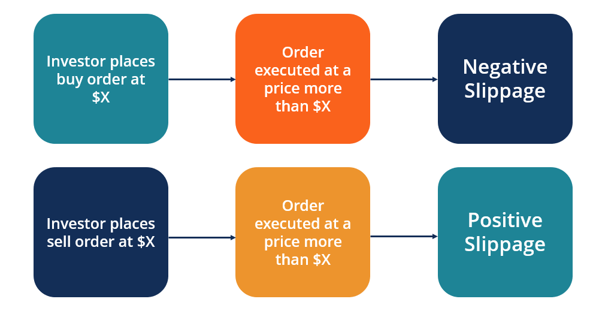

Algorithmic trading, often referred to as algo trading, harnesses the power of pre-programmed strategies to execute trades automatically, streamlining the trading process and reducing the potential for human error. A pivotal challenge encountered in this domain is execution slippage, which arises when the execution price of a trade deviates from the expected price. Slippage, therefore, represents a crucial factor that can significantly undermine the profitability of trading strategies, impacting both high and low-frequency trading environments.

This article aims to shed light on the multifaceted nature of slippage within the context of algorithmic trading. It delves into various dimensions, such as the types of slippage that traders may experience, their causes, and practical strategies for mitigating these effects. Understanding and effectively managing slippage are essential for traders looking to optimize their algorithmic trading strategies and improve overall performance. Such insights are invaluable in a competitive trading landscape, where even minimal discrepancies can accumulate, eroding expected profits. By exploring these elements, the article hopes to equip traders with the knowledge to navigate the challenges posed by slippage and enhance the effectiveness of their trading strategies.

## Table of Contents

## Understanding Slippage in Algorithmic Trading

Slippage occurs when the execution price of a trade differs from the price initially expected by the trader. This phenomenon can have both negative and positive implications. Negative slippage happens when trades are executed at a less favorable price than anticipated, potentially leading to reduced profits or increased losses. Conversely, positive slippage occurs when trades are executed at a more favorable price, enhancing the outcome for the trader.

Several key factors contribute to slippage in algorithmic trading. Market volatility is a primary factor; during periods of high volatility, prices can change rapidly, increasing the likelihood that trades will not be executed at their intended price. The size of the order also plays a significant role; larger orders are more likely to experience slippage, especially in markets with limited liquidity. Liquidity itself is a crucial element; markets with low liquidity can exhibit significant price movements from even modest order executions, resulting in unexpected slippage.

Understanding slippage is essential for traders who aim to optimize their algorithmic trading strategies. By accurately assessing slippage risks, traders can develop algorithms that better accommodate market conditions, thus improving the efficiency and profitability of their trading activities.

## Types of Slippage

Market Impact Slippage occurs when large orders influence the market price, effectively pushing it against the trader's intended direction. This type of slippage typically arises when a trader places a substantial buy or sell order, causing the price to move unfavorably due to increased demand or supply. The challenge with Market Impact Slippage is that, as the order size amplifies, its impact on market prices becomes more pronounced, especially in less liquid markets. Traders often encounter this type of slippage during high-[volume](/wiki/volume-trading-strategy) trades that exceed typical market order sizes.

Order Book Slippage is primarily a result of insufficient [liquidity](/wiki/liquidity-risk-premium) within the market. This slippage type occurs when there are not enough buyers or sellers at the desired execution price, compelling part of the order to fill at different, often unfavorable, prices. The [order book](/wiki/order-book-trading-strategies)'s depth, which comprises limit orders awaiting fulfillment, plays a crucial role here. For instance, if a trader places a buy order exceeding the available limit sell orders at a particular price, the remaining portion of the trade will execute at the next available, higher price level, leading to slippage.

Latency-Based Slippage arises from delays in order execution, which are often caused by network or system inefficiencies. This type of slippage is significant in [algorithmic trading](/wiki/algorithmic-trading) where milliseconds can determine execution prices. Network latency may result from slow internet connections, suboptimal routing paths, or congested trading algorithms. These delays can lead to orders being executed at stale prices, differing from the intended execution point. To mitigate this, traders often rely on high-speed internet connections, optimized trading algorithms, and low-latency data feeds to ensure rapid order execution.

Understanding these types of slippage allows traders to develop strategies that reduce unintended trade costs and improve overall trading efficiency. By recognizing the subtle nuances and underlying causes of each slippage type, traders can adopt more informed and effective risk management practices within their algorithmic trading frameworks.

## Causes of Slippage

High market [volatility](/wiki/volatility-trading-strategies) is a primary cause of slippage in algorithmic trading. When the market experiences rapid price fluctuations, the price at which a trade is intended to be executed can quickly become outdated. As a result, the execution occurs at a different price than initially targeted, leading to slippage. In mathematical terms, if $P_i$ is the intended price and $P_e$ is the execution price, slippage $S$ can be defined as:

$$
S = P_e - P_i
$$

In volatile markets, large discrepancies between $P_i$ and $P_e$ are common, increasing the slippage magnitude.

Low liquidity also contributes significantly to slippage. In a market with insufficient activity, there may not be enough buyers or sellers available to fulfill an order at the desired price. This scarcity can lead to trades being executed at less favorable prices, resulting in unintended slippage. For instance, if a trader places a large order in a thinly traded market, the available supply or demand may not match the order size, necessitating execution across multiple price levels.

Delayed order execution, often caused by technological issues or network latency, can further exacerbate slippage. Algorithmic trading relies on speed and precision, thus any delay can alter the market conditions anticipated when the order was placed. Such delays might be caused by server downtime, inadequate infrastructure, or connectivity issues. By the time the order is executed, the market might have moved, leading to discrepancies between the intended and actual execution prices. To mitigate this, traders can invest in high-performance trading platforms with minimal execution latency.

Addressing these causes requires a comprehensive understanding of market mechanics and the deployment of advanced technological solutions to minimize slippage and optimize trading strategies.

## Impact of Slippage on Trading Strategies

Slippage represents a significant challenge for traders as it can substantially erode profits and negatively impact the overall performance of trading strategies. This erosion occurs because the execution price of a trade deviates from its expected price, leading to increased transaction costs and reduced profitability. 

Even small amounts of slippage can accumulate over time, particularly in high-frequency trading environments where a large number of trades are executed. For instance, if each trade incurs a slippage of just 0.1%, the cumulative effect across thousands of transactions can markedly reduce the expected returns. This cumulative effect demonstrates the importance of managing slippage effectively, as it can mean the difference between a profitable and a losing strategy.

Effective slippage management is, therefore, crucial for the success of algorithmic trading. It involves implementing strategies that minimize the difference between the expected and actual execution prices. Traders can employ techniques such as using limit orders instead of market orders, which allows setting a maximum purchase price or minimum sale price, thus offering more control over trade execution. Additionally, advanced slippage management tools, such as stop-loss orders and trailing stops, provide mechanisms to mitigate risk and limit the adverse effects of slippage.

Moreover, traders should aim to execute trades during periods of low market volatility when prices are more stable and predictable. This approach helps reduce the likelihood of large price deviations that can lead to significant slippage. Maintaining a robust and efficient trading platform is also essential, as it minimizes latency and ensures quick order execution, reducing delay-induced slippage.

In summary, understanding and managing slippage are key components of successful algorithmic trading. By adopting strategic measures to mitigate slippage, traders can protect their profits and improve the performance of their trading strategies. Regular evaluation and adaptation of these strategies are necessary to address changing market conditions and continuously reduce the impact of slippage on trading outcomes.

## Reducing Slippage in Algorithmic Trading

Reducing slippage in algorithmic trading is crucial for optimizing trading performance and maintaining profitability. One effective approach is the use of limit orders, which allow traders to set specific maximum or minimum prices at which they are willing to buy or sell an asset. This strategy helps prevent trades from being executed at unfavorable prices, which can occur with market orders.

Timing trade executions during periods of low market volatility is another important strategy. These periods are characterized by minimal price fluctuations, reducing the likelihood of price deviations that contribute to slippage. Traders can analyze historical volatility data to identify these periods and optimize their trading schedules accordingly.

Advanced slippage management tools further aid in reducing risk. Stop-loss orders, for instance, automatically trigger a sell action when the asset price reaches a predefined level, thus capping potential losses. Trailing stops provide more flexibility by adjusting the stop price dynamically at a fixed percentage below the current market price, allowing traders to lock in profits as prices move favorably while protecting against sudden downturns.

Maintaining a robust trading platform is essential to minimize latency, which can be a significant source of slippage. Efficient order execution systems, low-latency network infrastructure, and optimized algorithm code can all contribute to reducing the time gap between order placement and execution. Ensuring the trading platform is equipped with redundancy and failover mechanisms can further help maintain consistent performance during peak trading periods. 

By integrating these strategies, algorithmic traders can effectively manage slippage, thereby enhancing their trading operations and achieving consistent financial outcomes.

## Conclusion

Slippage represents a significant consideration in algorithmic trading, necessitating thorough examination and adept handling. The discrepancies between expected and executed trade prices can substantially affect a trader's bottom line, highlighting the importance of strategic interventions to mitigate these risks. Traders can effectively reduce the likelihood of slippage by adopting methods such as utilizing limit orders, executing trades during periods of low volatility, and maintaining a robust trading infrastructure to minimize latency. These measures enhance trading performance by ensuring price accuracy and execution efficiency.

Continual reassessment and refinement of trading strategies are crucial to staying ahead of potential slippage impacts. This involves regular analysis of market conditions and the adequacy of current strategies in addressing slippage. Familiarity with advanced tools and approaches allow traders to dynamically adjust their strategies in response to evolving market landscapes.

With a thoughtful approach to slippage management, algorithmic trading becomes a potent mechanism for achieving financial objectives. Employing a disciplined strategy bolstered by effective risk management tools ensures that algorithmic trading remains a reliable avenue for capitalizing on financial markets, enhancing its efficacy and profitability.

## References & Further Reading

[1]: Kissell, R. (2013). ["The Science of Algorithmic Trading and Portfolio Management"](https://www.sciencedirect.com/book/9780124016897/the-science-of-algorithmic-trading-and-portfolio-management). Academic Press.

[2]: López de Prado, M. (2018). ["Advances in Financial Machine Learning"](https://www.amazon.com/Advances-Financial-Machine-Learning-Marcos/dp/1119482089). Wiley.

[3]: Chan, E. (2013). ["Algorithmic Trading: Winning Strategies and Their Rationale"](https://github.com/ftvision/quant_trading_echan_book). Wiley.

[4]: Aldridge, I. (2013). ["High-Frequency Trading: A Practical Guide to Algorithmic Strategies and Trading Systems"](https://www.ahmetbeyefendi.com/wp-content/uploads/2020/07/High-Frequency-Trading-Irene-Aldridge.pdf). Wiley.

[5]: Kissell, R. (2003). ["Optimal Trading Strategies: Quantitative Approaches for Managing Market Impact and Trading Risk"](https://archive.org/details/optimaltradingst0000kiss). AMACOM.

[6]: Hauptmann, A., Sornette, D., & Hommes, C. (2015). ["Large Orders in Continuous Double Auctions: Equilibrium Impact, Optimization and Prospect Theory Biases"](https://de.wikipedia.org/wiki/Liste_von_Pers%C3%B6nlichkeiten_der_Stadt_Paris). arXiv.