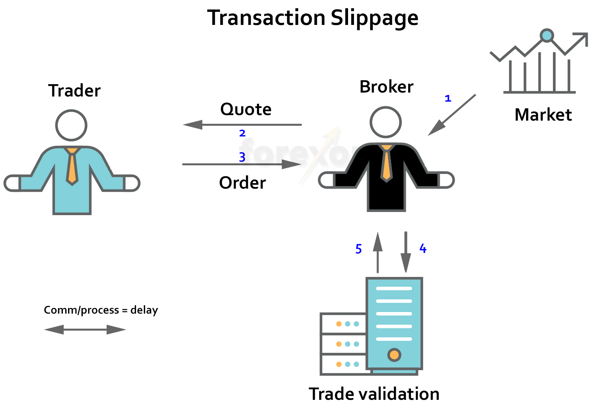

## Table of Contents

## What is execution slippage?

Execution slippage is when the price of a stock or other investment changes between the time you decide to buy or sell it and when your order actually goes through. This can happen because markets move quickly, and the price you see when you place your order might not be the same price you get when the trade is completed.

For example, if you want to buy a stock at $10, but by the time your order is executed, the price has gone up to $10.05, you experience slippage. Slippage can happen in any market, but it's more common in fast-moving or volatile markets. It's important to be aware of slippage because it can affect how much you pay or receive for your trades.

## How does execution slippage occur in trading?

Execution slippage happens in trading when the price of a stock or other investment changes between the time you place your order and when it actually gets filled. This can occur because markets are always moving, and the price you see when you decide to buy or sell might not be the same when your order goes through. For example, you might want to buy a stock at $50, but by the time your order is executed, the price has gone up to $50.10. This difference is what we call slippage.

Slippage is more common in fast-moving or volatile markets where prices can change quickly. It can also happen when there's a big gap between the price someone is willing to sell at and the price someone is willing to buy at. If there aren't enough buyers or sellers at the price you want, your order might get filled at a different price. Understanding slippage is important because it can affect how much you end up paying or receiving for your trades.

## What are the common causes of execution slippage?

Execution slippage happens because markets are always moving. When you decide to buy or sell a stock, the price you see might not be the same when your order gets filled. This is because other traders are also buying and selling at the same time, and their actions can change the price. If the market is moving fast or if it's a busy trading day, the price can change a lot in a short time, causing slippage.

Another reason for slippage is when there's a big difference between what people want to buy at and what people want to sell at. This can happen when there aren't enough buyers or sellers at the price you want. For example, if you want to buy a stock but there are no sellers at your price, your order might get filled at a higher price. Slippage can also happen if there's a big event or news that makes the market move a lot, like a company reporting good or bad earnings.

Understanding these reasons can help you be ready for slippage. It's a normal part of trading, especially in markets that move quickly or when there's a lot of trading happening. Knowing about slippage can help you make better choices about when and how to trade.

## Can you explain the difference between positive and negative slippage?

Positive slippage happens when you get a better price than you expected. For example, if you want to buy a stock at $10 but the price goes down to $9.90 by the time your order is filled, that's positive slippage. You end up paying less than you planned. It's like getting a good deal you didn't expect. Positive slippage can happen when the market moves in your favor between the time you place your order and when it's executed.

Negative slippage is the opposite. It's when you end up with a worse price than you expected. For instance, if you want to buy a stock at $10 but the price goes up to $10.10 by the time your order is filled, that's negative slippage. You end up paying more than you planned. Negative slippage can happen when the market moves against you between the time you place your order and when it's executed. Both types of slippage are normal in trading, but understanding them can help you manage your expectations and make better trading decisions.

## How can execution slippage impact a trader's strategy?

Execution slippage can really change how a trader makes plans. If a trader knows that slippage might happen, they might decide to use different ways to place their orders. For example, they might use limit orders instead of market orders. A limit order lets the trader set a specific price they're willing to buy or sell at, which can help avoid negative slippage. But, it also means the order might not get filled if the price doesn't reach the limit. So, traders have to think about the chance of missing out on a trade versus getting a worse price.

Slippage can also make traders think more about when to trade. They might choose to trade during times when the market is less busy and prices move slower, to lower the chance of slippage. Or, they might look at how much slippage usually happens in the markets they trade in and plan their strategies around that. Knowing about slippage helps traders make better choices about how to manage their risks and set their goals. It's all about finding the right balance between getting the best price and making sure the trade happens.

## What are some examples of execution slippage in different markets?

In the stock market, execution slippage can happen a lot, especially during busy times like when a company reports earnings. Imagine you want to buy a stock at $50, but by the time your order goes through, the price has jumped to $50.20. That's negative slippage because you end up paying more than you planned. On the other hand, if the price drops to $49.80 before your order is filled, that's positive slippage because you pay less than you expected. Slippage in the stock market can be bigger when there's a lot of news or events that make the market move fast.

In the [forex](/wiki/forex-system) market, where currencies are traded, slippage can be common too. The forex market is open 24 hours a day, and prices can change very quickly. Let's say you want to trade the EUR/USD pair at 1.1000, but by the time your trade is executed, the price has moved to 1.1005. That's negative slippage. If the price goes down to 1.0995 instead, that's positive slippage. Because the forex market is so big and always moving, traders need to be ready for slippage and might use different types of orders to try and control it.

In the [cryptocurrency](/wiki/cryptocurrency) market, slippage can be even more noticeable because these markets can be very volatile. If you want to buy Bitcoin at $30,000, but the price shoots up to $30,100 by the time your order is filled, that's negative slippage. If the price drops to $29,900, that's positive slippage. Crypto markets can change a lot in a short time, so traders often need to think about slippage when they're making their plans. They might use special tools or types of orders to help deal with the fast-moving prices.

## How can traders measure the extent of execution slippage?

Traders can measure the extent of execution slippage by comparing the price they wanted to buy or sell at with the actual price their order was filled at. For example, if a trader wanted to buy a stock at $10 but ended up buying it at $10.05, the slippage would be $0.05. They can do this for each trade and then average it over a period of time to get an idea of how much slippage they usually experience. This helps them see if slippage is a big problem in their trading and if they need to change their strategy.

Another way to measure slippage is by looking at the market data and seeing how often prices change between the time an order is placed and when it's filled. Traders can use special software or tools that track this data and show them how much slippage happens on average in the markets they trade in. By understanding how much slippage is normal, traders can make better decisions about when to trade and what types of orders to use to try and reduce slippage.

## What strategies can be employed to minimize execution slippage?

One way to minimize execution slippage is by using limit orders instead of market orders. A limit order lets you set a specific price you're willing to buy or sell at. This can help you avoid negative slippage because your order will only go through at your price or better. But, there's a chance your order won't get filled if the market doesn't reach your limit price. So, you have to think about whether it's more important to get the best price or to make sure the trade happens.

Another strategy is to trade during times when the market is less busy. When the market is quiet, prices tend to move slower, which can lower the chance of slippage. You can also use special tools or software that help you see how much slippage usually happens in the markets you trade in. This way, you can plan your trades around times when slippage is less likely to happen. Knowing when and how slippage happens can help you make better choices about when to trade and how to manage your risks.

## How do high-frequency trading and algorithmic trading affect execution slippage?

High-frequency trading and [algorithmic trading](/wiki/algorithmic-trading) can make execution slippage more likely because they can make the market move really fast. These types of trading use computers to buy and sell things very quickly, sometimes in just a few seconds. When a lot of high-frequency traders are doing this at the same time, the prices can change a lot in a short time. If you're trying to trade during these times, the price you see when you place your order might be different when it goes through, causing slippage. It's like trying to catch a fast-moving ball; the more it moves, the harder it is to grab it at the right spot.

On the other hand, high-frequency and algorithmic trading can also help reduce slippage in some ways. These systems can be set up to watch the market very closely and make trades at the best possible times. If you use these tools, they can help you get a better price by quickly finding the right moment to buy or sell. But, it's important to know that these systems can also make the market more unpredictable, so you have to be ready for both good and bad slippage. It's all about using the right tools and knowing how the market works to make the best choices.

## What role does market liquidity play in execution slippage?

Market [liquidity](/wiki/liquidity-risk-premium) is really important when it comes to execution slippage. Liquidity means how easy it is to buy or sell something without the price changing a lot. If a market is very liquid, there are lots of buyers and sellers, and you can usually trade at the price you want. But if a market is not very liquid, there might not be enough people to trade with, and the price can change a lot when you try to buy or sell. This can cause more slippage because your order might get filled at a different price than you expected.

When there's low liquidity, slippage can be a bigger problem. Imagine you want to buy a stock, but there aren't many people selling it at the price you want. Your order might push the price up because you're competing with other buyers for the few shares available. This means you could end up paying more than you planned, which is negative slippage. On the other hand, in a very liquid market, there are usually enough buyers and sellers to keep the price stable, so your order is more likely to go through at the price you wanted, reducing the chance of slippage.

## How can execution slippage be predicted or anticipated?

You can predict or anticipate execution slippage by looking at how the market usually behaves. If you know that a market often moves a lot during certain times or after certain events, like when a company reports its earnings, you can expect more slippage. Also, by checking how much slippage happens on average in the markets you trade in, you can get a good idea of what to expect. Special tools and software can help you see this data and plan your trades better.

Another way to anticipate slippage is by watching the market's liquidity. If there are lots of buyers and sellers, the market is more liquid, and there's less chance of big price changes causing slippage. But if there aren't many people trading, the market is less liquid, and you might see more slippage. By keeping an eye on these things, you can make better guesses about when slippage might happen and plan your trades to try and avoid it.

## What advanced tools or technologies are available to manage execution slippage effectively?

There are some really cool tools and technologies that can help traders manage execution slippage. One of these is algo trading software, which uses computers to make trades based on special rules set by the trader. These rules can help the computer find the best times to buy or sell, which can lower the chance of slippage. Another helpful tool is a smart order router, which looks at different places where you can trade and picks the one that's most likely to give you the best price. This can help you avoid big price changes and manage slippage better.

Also, there are special platforms that show real-time data about the market, like how fast prices are moving and how many people are trading. This can help traders see when slippage might happen and plan their trades around those times. Some platforms even have tools that let you set up different types of orders, like limit orders or stop orders, which can help control slippage. By using these advanced tools, traders can make smarter choices and manage slippage more effectively.

## What is the Measurement of Slippage?

Slippage is quantified by evaluating the discrepancy between the expected and actual execution prices of a trade. This measurement is fundamental for traders looking to optimize their strategies and manage risk effectively. Several methods are utilized to calculate and understand slippage, key among them being the use of initial mid prices and the assessment of liquidity costs.

To begin with, the initial mid price method involves calculating the expected price at which a trade should execute. The mid price is derived from the average of the bid and ask prices at the time of order placement. The formula for the mid price $P_{mid}$ is expressed as:

$$
P_{mid} = \frac{P_{bid} + P_{ask}}{2}
$$

Slippage is then calculated as the difference between the actual execution price and this mid price. Positive slippage occurs when the execution price is more favorable than the expected price, while negative slippage indicates a less favorable price.

Another critical aspect is assessing liquidity costs. Slippage often increases with higher order sizes due to the market's limited capacity to absorb large trades without significant price changes. Liquidity costs can be analyzed by considering the depth of the [order book](/wiki/order-book-trading-strategies) and the [volume](/wiki/volume-trading-strategy) available at different price levels. High market impact costs typically correlate with significant slippage.

Python can be used to assess slippage by simulating trade executions and analyzing historical order book data. Here's a simple Python function to calculate slippage:

```python
def calculate_slippage(execution_price, expected_price):
    slippage = execution_price - expected_price
    return slippage

# Example usage
execution_price = 101.50
expected_mid_price = 101.00

slippage = calculate_slippage(execution_price, expected_mid_price)
print(f'Slippage: {slippage}')
```

Understanding these measurements is essential for refining trading algorithms. Through thorough analysis of slippage, traders can adjust their strategies, such as altering order sizes or execution timings, to minimize the market impact and improve overall trading performance. Additionally, consistent monitoring of slippage trends can help traders adapt to changing market conditions, ensuring better alignment with their trading objectives.

## What is an example of slippage?

In algorithmic trading, slippage can be exemplified by considering a hypothetical large order of SPDR S&P 500 [ETF](/wiki/etf-trading-strategies) (SPY) shares. When a trader places a sizable order, the order may not execute at the desired price due to market conditions and the order's impact on liquidity. The following example illustrates how order book dynamics can cause slippage and result in higher average purchase prices.

Suppose a trader intends to buy 10,000 shares of SPY at a market price of $400 per share. The order book displays the following available offers:

- 500 shares at $400.00
- 1,500 shares at $400.10
- 1,500 shares at $400.20
- 2,000 shares at $400.30
- 4,500 shares at $400.40

Since the order size is substantial, it cannot be fully executed at the best available price of $400.00, which only offers 500 shares. The order will eat through the order book, executing portions at progressively higher prices until the required share quantity is filled. This results in an average purchase price higher than the initial market price.

To calculate the average purchase price, the execution across different price levels can be expressed as follows:

1. 500 shares at $400.00
2. 1,500 shares at $400.10
3. 1,500 shares at $400.20
4. 2,000 shares at $400.30
5. 4,500 shares at $400.40

The average purchase price (APP) can be computed using the formula:

$$

\text{APP} = \frac{\sum (\text{Shares bought at each price} \times \text{Price})}{\text{Total number of shares}}
$$

Substituting the given values:

$$

\text{APP} = \frac{(500 \times 400.00) + (1500 \times 400.10) + (1500 \times 400.20) + (2000 \times 400.30) + (4500 \times 400.40)}{10000}
$$

Calculating this gives:

$$

\text{APP} = \frac{200000 + 600150 + 600300 + 800600 + 1801800}{10000} = \frac{4008850}{10000} = 400.885
$$

Thus, the average purchase price is $400.885, demonstrating a slippage of $0.885 above the intended price of $400.00.

To automate this process using Python, consider the following code snippet:

```python
# Define order book data
order_book = [
    (500, 400.00),
    (1500, 400.10),
    (1500, 400.20),
    (2000, 400.30),
    (4500, 400.40)
]

# Initialize variables
shares_to_buy = 10000
total_cost = 0
shares_bought = 0

# Iterate over order book to calculate total cost
for shares, price in order_book:
    if shares_bought + shares <= shares_to_buy:
        total_cost += shares * price
        shares_bought += shares
    else:
        remaining_shares = shares_to_buy - shares_bought
        total_cost += remaining_shares * price
        break

# Calculate average purchase price
average_purchase_price = total_cost / shares_to_buy

print(f"Average Purchase Price: ${average_purchase_price:.3f}")
```

The above code calculates the average purchase price by simulating the execution of a large order across varying price levels within the order book. This practical example highlights how algorithmic traders must account for potential slippage when executing large trades.

## What is Understanding Reverse Slippage?

Reverse slippage refers to a situation where purchasing a security inadvertently drives up its price, yielding a favorable outcome for the buyer. This phenomenon poses distinct challenges, particularly during the execution of strategies aimed at exiting positions. When an individual or institutional trader attempts to buy a significant volume of a security, the increase in demand can lead to a higher market price, potentially benefiting the initial purchase but complicating subsequent sales. This is because the beneficial price movement, while initially advantageous, can distort intended [exit](/wiki/exit-strategy) price targets, impacting overall strategy outcomes.

Market makers and sophisticated algorithms are instrumental in navigating the complexities of reverse slippage. Market makers, by providing liquidity and maintaining market balance, can help absorb the shock of large transactions, thus stabilizing prices. They execute trades based on the current supply and demand dynamics while managing their own risk exposure. Advanced algorithms, on the other hand, are employed by traders to predict and react to the impacts of large trades on market prices. These algorithms can use historical data and real-time analysis to anticipate how their trades might influence the market. Implementing techniques such as breaking large orders into smaller, more manageable ones, or timing trades to coincide with periods of higher market liquidity, can mitigate the adverse effects of reverse slippage.

Mathematically, reverse slippage can be quantified by monitoring the price change percentage relative to the volume transacted. For instance, if the price of a security shifts more than anticipated following a purchase, the effective benefit can be calculated using the formula:

$$
\text{Reverse Slippage Effect} = \frac{(\text{Final Price} - \text{Initial Price})}{\text{Initial Price}} \times 100
$$

Understanding the mechanisms of market impact and employing strategic execution techniques are essential for traders to manage reverse slippage. By leveraging market maker activities and fine-tuning algorithmic parameters, traders can optimize their strategies and minimize potential disruptions caused by their trading actions.

## References & Further Reading

1. Taleb, Nassim Nicholas. *Fooled by Randomness: The Hidden Role of Chance in Life and in the Markets*. Random House, 2001. This book explores randomness and its influence on financial markets, providing insights relevant to understanding market dynamics, including slippage.

2. Knight, John L., and Satchell, Stephen E., editors. *Linear Factor Models in Finance*. Elsevier Science, 2005. This academic work covers various financial models, offering a background for understanding elements like slippage in a broader market context.

3. Kissell, Robert L. *The Science of Algorithmic Trading and Portfolio Management*. Academic Press, 2013. This resource discusses trading mechanisms, slippage, and the use of algorithms, giving readers strategies to manage slippage effectively.

4. Hendershott, Terrence, and Riordan, Ryan. “Algorithmic Trading and the Market for Liquidity.” *Journal of Financial and Quantitative Analysis*, vol. 58, no. 1, 2009, pp. 1-28. Academic paper analyzing how algorithms impact market liquidity and slippage.

5. Harris, Larry. *Trading and Exchanges: Market Microstructure for Practitioners*. Oxford University Press, 2003. This book provides a detailed look at market structures, essential for traders seeking to minimize slippage through improved market understanding.

6. Aldridge, Irene. *High-Frequency Trading: A Practical Guide to Algorithmic Strategies and Trading Systems*. Wiley, 2013. This practical guide gives insights into algorithmic strategies that can be employed to reduce execution slippage.

7. Carol, Osler, and Paul, Sophie. “Why Do Orders Get Executed at Inferior Prices? Information, Limits, and the NBBO.” *Journal of Financial and Quantitative Analysis*, vol. 42, no. 2, 2011, pp. 475-496. This paper investigates the reasons behind execution at unfavorable prices, offering context to slippage challenges.

8. Engle, Robert F., and Lange, Joe. “Measuring, Forecasting, and Explaining Time Varying Liquidity in the Stock Market.” *Journal of Financial Economics*, vol. 65, no. 1, 2002, pp. 3-40. This article provides forecasting techniques that can help traders anticipate liquidity changes, addressing one component of slippage.

