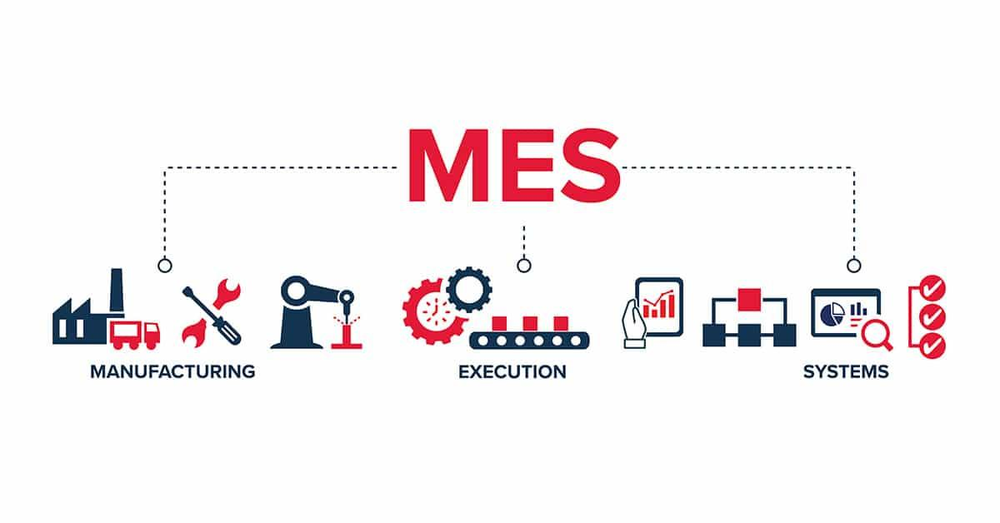

## Table of Contents

## What is an execution system?

An execution system is a set of rules and processes that a computer uses to run programs. It manages how the computer's hardware and software work together to carry out tasks. When you start a program, the execution system decides how to use the computer's resources, like memory and processing power, to make the program work smoothly.

Think of the execution system as a manager in a busy kitchen. Just as a kitchen manager decides who does what and when, the execution system directs the computer's parts to do their jobs at the right time. This helps the computer run programs efficiently and handle multiple tasks without getting overwhelmed.

## What are the basic components of an execution system?

The first main part of an execution system is the processor, also known as the CPU. The processor is like the brain of the computer. It reads the program's instructions and carries them out. It does this very quickly, often handling many instructions at once. The processor works closely with memory, which stores the data and instructions the processor needs. Memory is like a notepad where the processor can quickly jot down and read information.

Another important part is the operating system. This is the software that controls the computer's hardware and manages how programs run. It decides which program gets to use the processor and for how long. The operating system also handles input and output, like when you click the mouse or save a file. It makes sure everything works together smoothly, kind of like a traffic cop directing cars at an intersection.

The third key component is the program itself. Programs are sets of instructions written by people to make the computer do specific tasks. When you run a program, it tells the execution system what to do step by step. The program uses the processor and memory to perform its tasks, and it relies on the operating system to manage everything. Together, these components make up the execution system, working together to run your computer's programs efficiently.

## How does an execution system differ from a management system?

An execution system is all about running programs on a computer. It uses the processor, memory, and the operating system to make sure programs work smoothly. It's like a chef in a kitchen, following a recipe to cook a meal. The execution system takes the program's instructions and carries them out, making sure the computer's parts do their jobs at the right time.

A management system, on the other hand, is more about organizing and controlling things. It could be used in a business to keep track of projects, employees, or resources. It's like a manager who plans, organizes, and oversees everything to make sure things run well. While an execution system focuses on running programs, a management system focuses on planning and organizing tasks and resources.

So, the main difference is that an execution system is about doing the actual work of running programs, while a management system is about planning and organizing how that work gets done. Both are important, but they serve different purposes in making sure things run smoothly.

## What are the common types of execution systems used in businesses?

In businesses, one common type of execution system is the Enterprise Resource Planning (ERP) system. An ERP system helps manage different parts of a business, like finance, human resources, and supply chain, all in one place. It makes it easier for different departments to work together and share information. For example, when someone in sales makes a sale, the ERP system can automatically update the inventory and let the finance team know to send an invoice.

Another type is the Customer Relationship Management (CRM) system. A CRM system focuses on managing a business's interactions with its customers. It helps keep track of customer information, sales, and customer service issues. This way, everyone in the business can see a customer's history and provide better service. For instance, if a customer calls with a problem, the CRM system can quickly show the customer's past purchases and any previous issues, helping the service team solve the problem faster.

There are also specialized execution systems like Project Management Systems (PMS). These systems help businesses plan, organize, and manage projects from start to finish. They keep track of tasks, deadlines, and team members' responsibilities. For example, a construction company might use a PMS to manage building a new house, making sure everyone knows what they need to do and when they need to do it.

## What are the key features to look for in an execution system?

When choosing an execution system, it's important to look for features that make it easy to use and effective. One key feature is user-friendliness. The system should be easy to navigate, with a clear interface that doesn't need a lot of training to understand. It should also be customizable, so you can set it up to fit your business's specific needs. Another important feature is integration. The system should work well with other tools and software your business uses, like accounting software or email. This helps everything run smoothly and saves time.

Reliability and performance are also crucial. The system should be dependable, with minimal downtime and fast response times. It should be able to handle a lot of data and users without slowing down. Security is another must-have feature. The system should protect your data with strong security measures, like encryption and user authentication, to keep your information safe. Lastly, good customer support is essential. You should be able to get help quickly if you run into any problems, with support available through phone, email, or live chat.

## How do execution systems integrate with other business software?

Execution systems often connect with other business software to make work easier and faster. For example, an ERP system might link up with accounting software to automatically update financial records when a sale is made. This way, the finance team doesn't have to enter the same information twice, saving time and reducing mistakes. Similarly, a CRM system might integrate with email software, so customer service reps can see a customer's email history right in the CRM, helping them provide better service.

The key to good integration is using standard ways for different software to talk to each other, like APIs (Application Programming Interfaces). These are like special bridges that let different programs share information. When an execution system uses APIs, it can pull data from other systems or send data to them smoothly. This makes everything work together like a well-oiled machine, helping the business run more efficiently.

## What are the benefits of implementing an execution system in an organization?

Implementing an execution system in an organization can make things a lot easier and more efficient. It helps everyone work together better by keeping all the important information in one place. For example, if a business uses an ERP system, it can manage things like sales, inventory, and finances all at once. This means that when someone in sales makes a sale, the system automatically updates the inventory and tells the finance team to send an invoice. This saves time and reduces mistakes because people don't have to enter the same information over and over again.

Another big benefit is that execution systems can help make decisions faster and better. They give managers and leaders easy access to data and reports, so they can see what's going on in the business at any time. This helps them make smart choices about where to focus their efforts and how to improve. Plus, these systems often come with tools that help plan and track projects, making sure everyone knows what they need to do and when they need to do it. This keeps the organization running smoothly and helps it grow.

## What are the challenges faced when deploying an execution system?

When a business wants to use an execution system, it can face some challenges. One big challenge is making sure the system works well with the other software the business already uses. If the new system doesn't connect easily with things like accounting or email software, it can cause problems and slow things down. Another challenge is training everyone to use the new system. It can take time for people to learn how to use it, and if they don't understand it well, they might make mistakes or not use it the right way.

Another issue is the cost. Setting up an execution system can be expensive, not just for the software itself but also for the time and effort needed to get it running smoothly. Businesses have to think about whether the benefits of the system are worth the money they will spend. Lastly, there's the challenge of keeping the system secure. With a lot of important data in one place, businesses need to make sure the system is protected from hackers and other risks. This can be hard to do and requires ongoing attention and updates.

## How can an execution system be customized to meet specific industry needs?

An execution system can be customized to meet specific industry needs by adjusting its features and functions to fit the unique requirements of different businesses. For example, in the manufacturing industry, an execution system might need to track inventory and production schedules very closely. So, the system can be set up to give real-time updates on stock levels and show detailed production timelines. This helps manufacturers keep everything running smoothly and avoid delays. In the healthcare industry, the system might need to manage patient records and appointments. So, it can be customized to securely store patient data and send reminders for appointments, making sure everything stays organized and patients get the care they need.

Customization also involves adding specific tools or modules that are important for a particular industry. For instance, a retail business might need a point-of-sale (POS) module in their execution system to handle sales transactions efficiently. This module can be added and tailored to fit the store's layout and sales processes. Similarly, a construction company might need a project management module that can track the progress of building projects and manage budgets. By adding and adjusting these modules, the execution system can be made to work better for the specific tasks and challenges of different industries.

## What are the latest trends in execution system technology?

One big trend in execution system technology is the use of cloud computing. More and more businesses are moving their execution systems to the cloud because it makes things easier and more flexible. With a cloud-based system, you can access your data from anywhere and it's easier to update and maintain. It also means you don't need to buy and set up a lot of expensive hardware. This makes it a good choice for businesses of all sizes, especially smaller ones that might not have a lot of money to spend on IT.

Another trend is the use of artificial intelligence (AI) and machine learning in execution systems. These technologies can help the system learn from the data it collects and make smarter decisions. For example, an AI-powered execution system might be able to predict when you'll run out of stock and automatically reorder supplies. It can also help with things like customer service by answering common questions or helping with scheduling. As AI and machine learning get better, they will become even more important in making execution systems more efficient and helpful.

## How do you measure the effectiveness of an execution system?

To measure the effectiveness of an execution system, you can look at how well it helps the business run smoothly. One way to do this is by checking if it saves time. For example, if the system makes it easier for people to do their jobs and they finish tasks faster, that's a good sign. You can also see if the system reduces mistakes. If there are fewer errors in things like orders or invoices, it means the system is working well. Another thing to look at is how happy the people using the system are. If they find it easy to use and it helps them do their work better, that's a big plus.

Another way to measure the effectiveness is by looking at how the system helps the business grow. For instance, if the system helps the business make more money or find new customers, it's doing a good job. You can also check if it helps with planning and decision-making. If managers can use the system to get important information quickly and make better choices, that shows the system is effective. Overall, the best way to tell if an execution system is working well is by seeing if it makes the business run better and helps it reach its goals.

## What advanced strategies can be used to optimize an execution system's performance?

One advanced strategy to optimize an execution system's performance is to use real-time data analysis. This means the system can look at what's happening right now and make quick decisions based on that information. For example, if the system sees that a certain product is selling fast, it can automatically order more of that product to keep up with demand. This helps the business stay ahead and avoid running out of stock. Another part of this strategy is to use machine learning. The system can learn from past data to predict what might happen next, like when customers are likely to buy more or when there might be a busy time. This helps the business plan better and use its resources more efficiently.

Another strategy is to make the system work faster by using better technology. This can mean moving the system to the cloud, which lets it use powerful computers and storage without the business having to buy them. The cloud can also help the system handle more data and users at the same time without slowing down. Additionally, using special software that helps the system run smoothly, like load balancers, can make a big difference. Load balancers spread out the work so no part of the system gets too busy. This keeps everything running smoothly even when the business is very busy.

## What are the types of execution algorithms?

Execution algorithms are essential components of algorithmic trading systems. They are designed to execute large orders by splitting them into smaller, strategically managed trades that minimize market impact and optimize trading efficiency. Among the most commonly used execution algorithms are the Volume-Weighted Average Price (VWAP), Time-Weighted Average Price (TWAP), and Arrival Price algorithms.

1. **VWAP (Volume-Weighted Average Price)**:
   The VWAP algorithm aims to execute orders at a price close to the average price weighted by volume over a specified time period. It is calculated by the formula:
$$
   \text{VWAP} = \frac{\sum (P_i \times Q_i)}{\sum Q_i}

$$

   where $P_i$ is the price of the trade and $Q_i$ is the quantity of the trade at that price. The objective of the VWAP algorithm is to ensure that the executed order price is as close as possible to this average, which helps in reducing the market impact by aligning the trades to the existing market activity.

2. **TWAP (Time-Weighted Average Price)**:
   The TWAP algorithm breaks a large order into smaller units to be executed evenly over a specified time frame. This evenly spaced execution helps achieve an average price over time, mitigating the risk of sudden price moves and market impacts. It is particularly useful in less liquid markets where large orders could disrupt prices significantly.

3. **Arrival Price Algorithms**:
   Arrival Price algorithms focus on executing trades based on the decision price or current market price at the time of the order's entry. The goal is to minimize slippage or the difference between the expected execution price and the actual price. These algorithms weigh the urgency of executing the trade against the potential market impact, optimizing for cost efficiency while attempting to maintain the intended timing of the trade decision.

Each of these execution algorithms addresses specific trading objectives and conditions, making them versatile tools for traders aiming to optimize execution performance in line with their strategic goals.

## References & Further Reading

[1]: Aldridge, I. (2013). ["High-frequency trading: A practical guide to algorithmic strategies and trading systems."](https://www.wiley.com/en-us/High+Frequency+Trading%3A+A+Practical+Guide+to+Algorithmic+Strategies+and+Trading+Systems-p-9780470579770) Wiley.

[2]: Kissell, R. (2013). ["The Science of Algorithmic Trading and Portfolio Management."](https://www.sciencedirect.com/book/9780124016897/the-science-of-algorithmic-trading-and-portfolio-management) Academic Press.

[3]: Vágner, L., Tahir, M., & Seregélyes, T. (2012). ["Impact-driven trading algorithms – How market impact harms or enhances algorithmic trading strategies."](https://link.springer.com/article/10.1140/epjb/e2012-30280-2) The European Physical Journal B.

[4]: Hasbrouck, J. (2007). ["Empirical Market Microstructure: The Institutions, Economics, and Econometrics of Securities Trading."](https://academic.oup.com/book/52241) Oxford University Press.

[5]: Cartea, Á., Jaimungal, S., & Penalva, J. (2015). ["Algorithmic and High-Frequency Trading."](https://assets.cambridge.org/97811070/91146/frontmatter/9781107091146_frontmatter.pdf) Cambridge University Press.