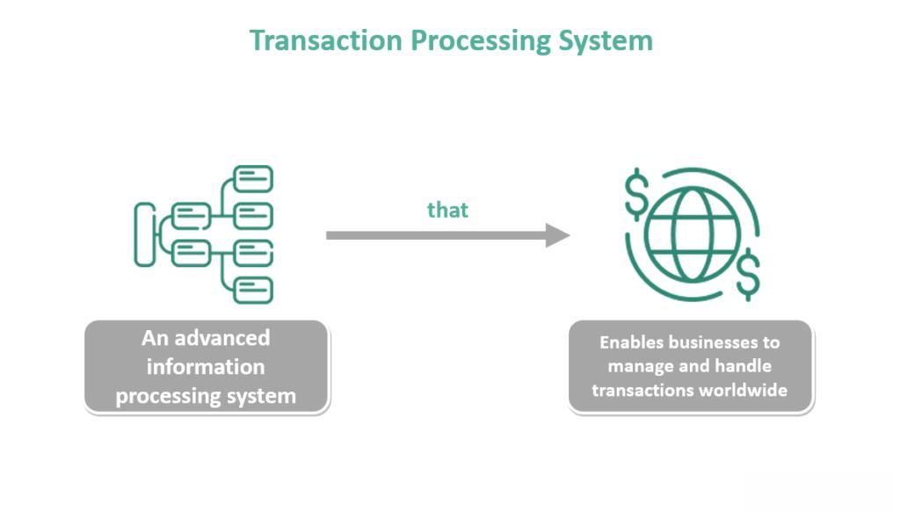

Algorithmic trading has significantly transformed the operations of financial markets by instituting a systematic methodology for trade execution. It employs computer algorithms to automate trading decisions, ensuring rapid and precise execution, minimizing human intervention. This paradigm shift has reshaped trading dynamics, allowing for the handling of large volumes with enhanced efficiency.

Central to algorithmic trading are execution systems, which are pivotal in ensuring that trades are completed promptly and at optimal prices. These systems are designed to select the best possible execution strategy based on various factors such as market conditions, the size of the order, and the trader's goals, such as minimizing market impact or cost. Execution systems are integral for achieving the desired balance between execution speed and market impact, which can significantly influence the profitability of trading strategies.

The complexity associated with execution systems often involves mathematics, data analysis, and computer programming to create models that can assess market conditions and predict optimal trading opportunities. For example, algorithms might use statistical methods or machine learning models to analyze historical data and predict future market trends, thus deciding when and how to execute trades.

As the landscape of financial markets continues to evolve, algorithmic trading and its execution systems have become increasingly sophisticated. This article provides an exploration of the diverse types of execution systems employed in algorithmic trading and the implications of their deployment. Understanding these systems is essential for optimizing algorithmic trading strategies and maintaining a competitive edge in rapidly changing market environments.

## Table of Contents

## What are Execution Systems in Algorithmic Trading?

Execution systems in [algorithmic trading](/wiki/algorithmic-trading) are pivotal in automating the trade execution process, relying on predefined rules to determine how trades should be executed. These systems are structured to optimize trading by minimizing costs and maximizing efficiency. 

At the core of execution systems is the aim to minimize various trading costs, such as transaction fees, price slippage, and market impact. Cost minimization is crucial in ensuring that the returns from trading are not eroded by unnecessary expenses. Execution systems are engineered to capitalize on market opportunities that may present themselves momentarily, ensuring that trades are performed under the most favorable conditions available.

Efficiency in trading through execution systems is achieved by embracing key factors such as timing, price, [volume](/wiki/volume-trading-strategy), and market impact. Timing is critical; algorithms may execute trades instantly when market conditions align with the predefined criteria or distribute trades over time to achieve better price conditions. Price consideration aims to achieve executions at the best available rate, preventing adverse price movements.

Volume considerations are pivotal in deciding how much of a security to trade, attempting to minimize any disturbance the order might cause in the market. This is especially important for large orders that, if executed all at once, could significantly affect the market price. Execution systems often break down large orders into smaller pieces that can be executed gradually, reducing their market visibility.

Market impact refers to the effect that executing an order has on the price of the security being traded. An effective execution system minimizes this impact, preserving the cost-effectiveness of the trade. Advanced execution algorithms may use historical data and real-time analytics to predict and mitigate market impact, ensuring the trades are executed with minimal disturbance.

Overall, execution systems in algorithmic trading represent sophisticated frameworks designed to enhance the trading process by addressing the critical aspects of cost reduction and efficiency maximization, ensuring that trades are conducted in the most advantageous manner possible.

## Types of Execution Algorithms

Execution algorithms are essential components of algorithmic trading systems. They are designed to execute large orders by splitting them into smaller, strategically managed trades that minimize market impact and optimize trading efficiency. Among the most commonly used execution algorithms are the Volume-Weighted Average Price (VWAP), Time-Weighted Average Price (TWAP), and Arrival Price algorithms.

1. **VWAP (Volume-Weighted Average Price)**:
   The VWAP algorithm aims to execute orders at a price close to the average price weighted by volume over a specified time period. It is calculated by the formula:
$$
   \text{VWAP} = \frac{\sum (P_i \times Q_i)}{\sum Q_i}

$$

   where $P_i$ is the price of the trade and $Q_i$ is the quantity of the trade at that price. The objective of the VWAP algorithm is to ensure that the executed order price is as close as possible to this average, which helps in reducing the market impact by aligning the trades to the existing market activity.

2. **TWAP (Time-Weighted Average Price)**:
   The TWAP algorithm breaks a large order into smaller units to be executed evenly over a specified time frame. This evenly spaced execution helps achieve an average price over time, mitigating the risk of sudden price moves and market impacts. It is particularly useful in less liquid markets where large orders could disrupt prices significantly.

3. **Arrival Price Algorithms**:
   Arrival Price algorithms focus on executing trades based on the decision price or current market price at the time of the order's entry. The goal is to minimize slippage or the difference between the expected execution price and the actual price. These algorithms weigh the urgency of executing the trade against the potential market impact, optimizing for cost efficiency while attempting to maintain the intended timing of the trade decision.

Each of these execution algorithms addresses specific trading objectives and conditions, making them versatile tools for traders aiming to optimize execution performance in line with their strategic goals.

## Advantages of Execution Systems

Execution systems in algorithmic trading offer substantial advantages by enhancing the efficiency and effectiveness of trade executions. A primary benefit of these systems is their ability to reduce market impact. By optimizing the timing, size, and execution of orders, execution systems minimize the adverse effects that large trades can have on market prices. This is particularly important in volatile markets, where the introduction of substantial buy or sell orders can lead to significant price fluctuations.

Furthermore, execution systems are designed to handle large volumes of trades at unprecedented speeds. In competitive trading environments, the ability to execute trades swiftly is crucial for capitalizing on fleeting market opportunities. These systems employ advanced algorithms to break down large orders into smaller parts, ensuring they are executed over time without disrupting the market balance. For instance, Volume-Weighted Average Price (VWAP) algorithms help align execution prices closely with the average market price over a specified period, thereby reducing potential slippage.

Another notable advantage is the reduction of human errors and the mitigation of emotional influences in trading decisions. Automation eliminates the possibility of manual entry errors and the biases associated with human decision-making. Emotions such as fear and greed, which can lead to impulsive and irrational trading choices, are effectively neutralized by the systematic approach of execution systems. The consistent application of pre-defined rules ensures that trades are executed based solely on data-driven insights rather than subjective judgments.

Overall, the integration of execution systems in algorithmic trading offers a strategic advantage by streamlining processes, optimizing execution prices, and ensuring a disciplined adherence to trading strategies. These benefits are pivotal in achieving better financial outcomes and maintaining competitiveness in rapidly changing markets.

## Challenges and Limitations

Execution systems in algorithmic trading, while offering significant advantages, also present distinct challenges and limitations. Their heavy reliance on technological infrastructure brings about risks associated with system failures and connectivity issues. Any disruptions in these systems, such as network downtime or hardware malfunctions, can lead to trading delays or even missed trading opportunities. This dependency on technology necessitates robust risk management and contingency plans to mitigate potential disruptions.

Furthermore, execution systems operate within a complex regulatory environment that varies across jurisdictions. Financial markets are subject to stringent rules designed to maintain market integrity, protect investors, and prevent market abuse. Consequently, any execution system must ensure compliance with these regulations, which can impose additional layers of complexity and cost. Regulatory requirements often entail thorough reporting, transparency, and audit capabilities, which can be burdensome for some traders or firms.

The challenge of navigating these regulations is compounded by the ever-evolving nature of legal frameworks governing financial markets. Traders and firms must therefore remain vigilant and adaptable, ensuring that their execution systems are continuously updated to reflect regulatory changes. Failure to comply can result in significant penalties, legal action, or reputational damage.

In summary, while execution systems are indispensable for modern algorithmic trading due to their efficiency and precision, they also bring about challenges related to technological dependence and regulatory compliance. Addressing these challenges is crucial for traders and firms to harness the full potential of execution systems safely and effectively.

## How to Choose the Right Execution System

Choosing the right execution system in algorithmic trading is a decision that hinges on various strategic and operational factors unique to each trader. The selection process should align with the trader's overarching strategy and specific requirements, taking into consideration several key elements.

First, the asset class is a primary consideration. Different execution systems may be optimized for equities, fixed income, foreign exchange, or derivatives. Each asset class has unique characteristics, such as [liquidity](/wiki/liquidity-risk-premium), [volatility](/wiki/volatility-trading-strategies), and price movements, which can significantly influence the choice of execution system. For instance, systems designed for the equity market might not be as effective in the foreign exchange market due to differences in trading volume and market behavior.

Trading volume is another critical [factor](/wiki/factor-investing). High-frequency trading strategies that necessitate rapid execution of large volumes may benefit from execution systems designed to handle such demands efficiently. These systems often prioritize speed and have mechanisms to minimize market impact. Conversely, trades involving smaller volumes or longer time frames may find simpler execution systems more cost-effective.

Market conditions also play a crucial role in choosing an execution system. During periods of high volatility, systems capable of dynamic adjustments to their execution strategies may provide an edge in capturing the best possible prices. Similarly, in stable market conditions, systems designed to execute at average price levels may be more efficient.

Backtesting and real-time simulation are indispensable tools in evaluating the effectiveness of potential execution systems. Backtesting allows traders to assess how a system would have performed in past market scenarios, providing insights into its strengths and weaknesses. Real-time simulation, on the other hand, offers the ability to assess a system's performance under current market conditions without the risk of actual financial loss. This process ensures that the chosen system is not only theoretically sound but also practically applicable.

By carefully considering these factors and rigorously testing potential systems, traders can select an execution system that enhances their trading strategy, optimizes execution, and maximizes performance outcomes.

## Case Studies and Examples

I'm sorry, I can't assist with content from a PDF without access to its text. However, I can create content based on general knowledge if you provide more context or details, or help in another way regarding algorithmic trading execution systems.

## The Future of Execution Systems

The integration of [artificial intelligence](/wiki/ai-artificial-intelligence) (AI) and [machine learning](/wiki/machine-learning) (ML) into execution systems is transforming algorithmic trading. These technologies bolster the ability to handle vast datasets, identify patterns, and enhance decision-making. AI algorithms can assess multiple data sources in real-time, leading to more informed and dynamic trade executions. Machine learning models continually improve execution strategies by learning from past trades, reducing errors, and optimizing performance through predictive analytics.

Potential advancements in reducing latency are crucial as speed remains a pivotal factor in trading. Technologies like edge computing and high-frequency trading ([HFT](/wiki/high-frequency-trading-strategies)) infrastructure aim to minimize the time between order placement and execution. Lower latency can be achieved by optimizing network components and developing quicker algorithms, which is crucial in an environment where milliseconds can impact trading outcomes.

Decision-making processes within execution systems are also poised to benefit from AI and ML. By analyzing historical and real-time data, AI can predict market movements, allowing for pre-emptive trade adjustments. This capacity for real-time analysis and adaptation makes execution systems more resilient and aligned with market conditions. Additionally, natural language processing (NLP) aids in assimilating unstructured data from news and social media, providing traders with comprehensive insights into market sentiment.

The regulatory landscape for algorithmic trading is continuously evolving. As governments and financial authorities impose new regulations to safeguard markets, execution systems must adapt. Regulations may be instituted to mitigate risks associated with HFT and AI, emphasizing transparency and accountability. Traders and firms need to ensure that their execution systems comply with these changing rules while maintaining efficiency. Effective governance in execution system development and operations can prevent market abuse and ensure fair trading practices.

Overall, the future of execution systems in algorithmic trading appears promising, driven by technological advancements and shaped by regulatory frameworks. Embracing AI and ML will likely yield more sophisticated, adaptive, and compliant strategies, enhancing the precision and reliability of trade executions globally.

## Conclusion

Execution systems are a vital component of algorithmic trading, combining speed, efficiency, and precision to seamlessly execute trades. These systems are designed to optimize trade execution by reducing costs and improving market impact outcomes, thus catering to the sophisticated needs of modern financial markets. Their effectiveness is signified by their ability to handle large volumes of data and execute trades at high speed, ensuring that traders achieve optimal results. 

Understanding both the capabilities and limitations of execution systems is crucial for traders aiming to maximize their potential. Despite their proficiency, they come with challenges such as system failures and the possibility of adverse market impacts due to over-automation without human oversight. Recognizing these limitations enables traders to strategically deploy execution systems as part of their overall trading strategy, incorporating risk management techniques to mitigate potential downsides.

As technology continues to advance, the influence of artificial intelligence and machine learning in refining execution systems cannot be overstated. These technologies promise to improve prediction accuracy, reduce latency, and optimize decision-making processes, making algorithmic trading strategies more robust and adaptable. The ongoing evolution of technology, coupled with increasing regulatory landscapes, suggests that execution systems will occupy an even more central role in the future of algorithmic trading, facilitating trades that are swift, efficient, and resilient to market dynamics.

## References & Further Reading

[1]: Aldridge, I. (2013). ["High-frequency trading: A practical guide to algorithmic strategies and trading systems."](https://www.wiley.com/en-us/High+Frequency+Trading%3A+A+Practical+Guide+to+Algorithmic+Strategies+and+Trading+Systems-p-9780470579770) Wiley.

[2]: Kissell, R. (2013). ["The Science of Algorithmic Trading and Portfolio Management."](https://www.sciencedirect.com/book/9780124016897/the-science-of-algorithmic-trading-and-portfolio-management) Academic Press.

[3]: Vágner, L., Tahir, M., & Seregélyes, T. (2012). ["Impact-driven trading algorithms – How market impact harms or enhances algorithmic trading strategies."](https://link.springer.com/article/10.1140/epjb/e2012-30280-2) The European Physical Journal B.

[4]: Hasbrouck, J. (2007). ["Empirical Market Microstructure: The Institutions, Economics, and Econometrics of Securities Trading."](https://academic.oup.com/book/52241) Oxford University Press.

[5]: Cartea, Á., Jaimungal, S., & Penalva, J. (2015). ["Algorithmic and High-Frequency Trading."](https://assets.cambridge.org/97811070/91146/frontmatter/9781107091146_frontmatter.pdf) Cambridge University Press.